# 正则

## 目录

<!-- vim-markdown-toc GFM -->

* [特殊符号含义](#特殊符号含义)
* [基础正则bre](#基础正则bre)
* [延伸正则ere](#延伸正则ere)
* [PCRE表达式全集](#pcre表达式全集)
* [常见正则表达式](#常见正则表达式)
    * [邮箱](#邮箱)
    * [电话](#电话)
    * [域名](#域名)
    * [IP](#ip)
    * [帐号校验](#帐号校验)
    * [字符校验](#字符校验)
        * [汉字](#汉字)
        * [英文和数字](#英文和数字)
        * [长度为3-20的所有字符](#长度为3-20的所有字符)
        * [英文字符](#英文字符)
            * [由26个英文字母组成的字符串](#由26个英文字母组成的字符串)
            * [由26个大写英文字母组成的字符串](#由26个大写英文字母组成的字符串)
            * [由26个小写英文字母组成的字符串](#由26个小写英文字母组成的字符串)
            * [由数字和26个英文字母组成的字符串](#由数字和26个英文字母组成的字符串)
            * [由数字、26个英文字母或者下划线组成的字符串](#由数字26个英文字母或者下划线组成的字符串)
        * [中文、英文、数字包括下划线](#中文英文数字包括下划线)
        * [中文、英文、数字但不包括下划线等符号](#中文英文数字但不包括下划线等符号)
        * [禁止输入含有%&',;=?$\"等字符](#禁止输入含有等字符)
        * [禁止输入含有~的字符](#禁止输入含有的字符)
    * [数字正则](#数字正则)
        * [整数](#整数)
            * [正整数](#正整数)
            * [负整数](#负整数)
            * [非负整数](#非负整数)
            * [非正整数](#非正整数)
        * [浮点数](#浮点数)
            * [正浮点数](#正浮点数)
            * [负浮点数](#负浮点数)
            * [非负浮点数](#非负浮点数)
            * [非正浮点数](#非正浮点数)
            * [匹配时间](#匹配时间)
            * [匹配空行](#匹配空行)

<!-- vim-markdown-toc -->

## 特殊符号含义
为了避免语言环境不同导致bug，使用特殊符号匹配
```
[:alnum:]	代表英文大小写字元及数字，亦即0-9, AZ, az
[:alpha:]	代表任何英文大小写字元，亦即AZ, az
[:blank:]	代表空白键与[Tab] 按键两者
[:cntrl:]	代表键盘上面的控制按键，亦即包括CR, LF, Tab, Del.. 等等
[:digit:]	代表数字而已，亦即0-9
[:graph:]	除了空白字元(空白键与[Tab] 按键) 外的其他所有按键
[:lower:]	代表小写字元，亦即az
[:print:]	代表任何可以被列印出来的字元
[:punct:]	代表标点符号(punctuation symbol)，亦即：" ' ? ! ; : # $...
[:upper:]	代表大写字元，亦即AZ
[:space:]	任何会产生空白的字元，包括空白键, [Tab], CR 等等
[:xdigit:]	代表16 进位的数字类型，因此包括： 0-9, AF, af 的数字与字元
```

## 基础正则bre
正规表示法的字串表示方式依照不同的严谨度而分为： 基础正规表示法与延伸正规表示法。延伸型正规表示法除了简单的一组字串处理之外，还可以作群组的字串处理
```
^word
意义：待搜寻的字串(word)在行首！
范例：搜寻行首为# 开始的那一行，并列出行号
grep -n '^#' regular_express.txt

word$
意义：待搜寻的字串(word)在行尾！
范例：将行尾为! 的那一行列印出来，并列出行号
grep -n '!$' regular_express.txt

.
意义：代表『一定有一个任意字元』的字符！
范例：搜寻的字串可以是(eve) (eae) (eee) (ee)， 但不能仅有(ee) ！亦即e 与e 中间『一定』仅有一个字元，而空白字元也是字元！
grep -n 'e.e' regular_express.txt

\
意义：透过shell 的跳脱字符，将特殊符号的特殊意义去除！
范例：搜寻含有单引号' 的那一行！
grep -n \' regular_express.txt

*
意义：重复零个到无穷多个的前一个RE 字符
范例：找出含有(es) (ess) (esss) 等等的字串，注意，因为* 可以是0 个，所以es 也是符合带搜寻字串。另外，因为* 为重复『前一个RE 字符』的符号， 因此，在* 之前必须要紧接着一个RE 字符喔！例如任意字元则为『.*』 ！
grep -n 'ess*' regular_express.txt

[list]
意义：字元集合的RE 字符，里面列出想要撷取的字元！
范例：搜寻含有(gl) 或(gd) 的那一行，需要特别留意的是，在[] 当中『谨代表一个待搜寻的字元』， 例如『 a[afl]y 』代表搜寻的字串可以是aay, afy, aly 即[afl] 代表a 或f 或l 的意思！
grep -n 'g[ld]' regular_express.txt

[n1-n2]
意义：字元集合的RE 字符，里面列出想要撷取的字元范围！
范例：搜寻含有任意数字的那一行！需特别留意，在字元集合[] 中的减号- 是有特殊意义的，他代表两个字元之间的所有连续字元！但这个连续与否与ASCII 编码有关，因此，你的编码需要设定正确(在 bash 当中，需要确定LANG 与LANGUAGE 的变数是否正确！) 例如所有大写字元则为[AZ]
grep -n '[AZ]' regular_express.txt

[^list]
意义：字元集合的RE 字符，里面列出不要的字串或范围！
范例：搜寻的字串可以是(oog) (ood) 但不能是(oot) ，那个^ 在[] 内时，代表的意义是『反向选择』的意思。例如，我不要大写字元，则为[^AZ]。但是，需要特别注意的是，如果以grep -n [^AZ] regular_express.txt 来搜寻，却发现该档案内的所有行都被列出，为什么？因为这个[^AZ] 是『非大写字元』的意思， 因为每一行均有非大写字元，例如第一行的"Open Source" 就有p,e,n,o.... 等等的小写字
grep -n 'oo[^t]' regular_express.txt

\{n,m\}
意义：连续n 到m 个的『前一个RE 字符』
意义：若为\{n\} 则是连续n 个的前一个RE 字符，
意义：若是\{n,\} 则是连续n 个以上的前一个RE 字符！ 
范例：在g 与g 之间有2 个到3 个的o 存在的字串，亦即(goog)(gooog)
grep -n 'go\{2,3\}g' regular_express.txt

在POSIX标准中，基本正则语法 ( BRE ) 要求将元字符 ( )和{ }指定为\(\)和\{\}，而扩展正则语法 ( ERE ) 则不需要
```

## 延伸正则ere
```
+
意义：重复『一个或一个以上』的前一个RE 字符
范例：搜寻(god) (good) (goood)... 等等的字串。那个o+ 代表『一个以上的o 』所以，底下的执行成果会将第1, 9, 13 行列出来。
egrep -n 'go+d' regular_express.txt

?
意义：『零个或一个』的前一个RE 字符
范例：搜寻(gd) (god) 这两个字串。那个o? 代表『空的或2 个o 』所以，上面的执行成果会将第13, 14 行列出来。有没有发现到，这两个案例( 'go+d' 与'go?d' )的结果集合与'go*d' 相同？想想看，这是为什么喔！
egrep -n 'go?d' regular_express.txt

|
意义：用或( or )的方式找出数个字串
范例：搜寻gd 或good 这两个字串，注意，是『或』！所以，第1,9,14 这三行都可以被列印出来喔！那如果还想要找出dog 呢？
egrep -n 'gd|good' regular_express.txt
egrep -n 'gd|good|dog' regular_express.txt

()
意义：找出『群组』字串
范例：搜寻(glad) 或(good) 这两个字串，因为g 与d 是重复的，所以， 我就可以将la 与oo 列于( ) 当中，并以| 来分隔开来，就可以啦！
egrep -n 'g(la|oo)d' regular_express.txt

()+
意义：多个重复群组的判别
范例：将『AxyzxyzxyzxyzC』用echo 叫出，然后再使用如下的方法搜寻一下！
echo 'AxyzxyzxyzxyzC' | egrep 'A(xyz)+C'
上面的例子意思是说，我要找开头是A 结尾是C ，中间有一个以上的"xyz" 字串的意思～
```

## PCRE表达式全集
正则表达式有多种不同的风格。下表是在PCRE(Perl Compatible Regular Expressions)中元字符及其在正则表达式上下文中的行为的一个完整列表，适用于Perl或者Python编程语言（grep或者egrep的正则表达式文法是PCRE的子集）：
```
\   将下一个字符标记为一个特殊字符（File Format Escape，清单见本表）、或一个原义字符（Identity Escape，有“^$()*+?.[\{|”共计12个）、或一个向后引用（backreferences）、或一个八进制转义符。例如，“n”匹配字符“n”。“\n”匹配一个换行符。序列“\\”匹配“\”而“\(”则匹配“(”。
^   匹配输入字符串的开始位置。如果设置了RegExp对象的Multiline属性，^也匹配“\n”或“\r”之后的位置。
$   匹配输入字符串的结束位置。如果设置了RegExp对象的Multiline属性，$也匹配“\n”或“\r”之前的位置。
*   匹配前面的子表达式零次或多次。例如，zo*能匹配“z”、“zo”以及“zoo”。*等价于{0,}。
+   匹配前面的子表达式一次或多次。例如，“zo+”能匹配“zo”以及“zoo”，但不能匹配“z”。+等价于{1,}。
?   匹配前面的子表达式零次或一次。例如，“do(es)?”可以匹配“does”中的“do”和“does”。?等价于{0,1}。
{n} n是一个非负整数。匹配确定的n次。例如，“o{2}”不能匹配“Bob”中的“o”，但是能匹配“food”中的两个o。
{n,}    n是一个非负整数。至少匹配n次。例如，“o{2,}”不能匹配“Bob”中的“o”，但能匹配“foooood”中的所有o。“o{1,}”等价于“o+”。“o{0,}”则等价于“o*”。
{n,m}   m和n均为非负整数，其中n<=m。最少匹配n次且最多匹配m次。例如，“o{1,3}”将匹配“fooooood”中的前三个o。“o{0,1}”等价于“o?”。请注意在逗号和两个数之间不能有空格。
?   非贪心量化（Non-greedy quantifiers）：当该字符紧跟在任何一个其他重复修饰符（*,+,?，{n}，{n,}，{n,m}）后面时，匹配模式是非贪婪的。非贪婪模式尽可能少的匹配所搜索的字符串，而默认的贪婪模式则尽可能多的匹配所搜索的字符串。例如，对于字符串“oooo”，“o+?”将匹配单个“o”，而“o+”将匹配所有“o”。
.   匹配除“\r”“\n”之外的任何单个字符。要匹配包括“\r”“\n”在内的任何字符，请使用像“(.|\r|\n)”的模式。
(pattern)   匹配pattern并获取这一匹配的子字符串。该子字符串用于向后引用。所获取的匹配可以从产生的Matches集合得到，在VBScript中使用SubMatches集合，在JScript中则使用$0…$9属性。要匹配圆括号字符，请使用“\(”或“\)”。可带数量后缀。
(?:pattern) 匹配pattern但不获取匹配的子字符串（shy groups），也就是说这是一个非获取匹配，不存储匹配的子字符串用于向后引用。这在使用或字符“(|)”来组合一个模式的各个部分是很有用。例如“industr(?:y|ies)”就是一个比“industry|industries”更简略的表达式。
(?=pattern) 正向肯定预查（look ahead positive assert），在任何匹配pattern的字符串开始处匹配查找字符串。这是一个非获取匹配，也就是说，该匹配不需要获取供以后使用。例如，“Windows(?=95|98|NT|2000)”能匹配“Windows2000”中的“Windows”，但不能匹配“Windows3.1”中的“Windows”。预查不消耗字符，也就是说，在一个匹配发生后，在最后一次匹配之后立即开始下一次匹配的搜索，而不是从包含预查的字符之后开始。
(?!pattern) 正向否定预查（negative assert），在任何不匹配pattern的字符串开始处匹配查找字符串。这是一个非获取匹配，也就是说，该匹配不需要获取供以后使用。例如“Windows(?!95|98|NT|2000)”能匹配“Windows3.1”中的“Windows”，但不能匹配“Windows2000”中的“Windows”。预查不消耗字符，也就是说，在一个匹配发生后，在最后一次匹配之后立即开始下一次匹配的搜索，而不是从包含预查的字符之后开始
(?<=pattern)    反向（look behind）肯定预查，与正向肯定预查类似，只是方向相反。例如，“(?<=95|98|NT|2000)Windows”能匹配“2000Windows”中的“Windows”，但不能匹配“3.1Windows”中的“Windows”。
(?<!pattern)    反向否定预查，与正向否定预查类似，只是方向相反。例如“(?<!95|98|NT|2000)Windows”能匹配“3.1Windows”中的“Windows”，但不能匹配“2000Windows”中的“Windows”。
x|y 没有包围在()里，其范围是整个正则表达式。例如，“z|food”能匹配“z”或“food”。“(?:z|f)ood”则匹配“zood”或“food”。
[xyz]   字符集合（character class）。匹配所包含的任意一个字符。例如，“[abc]”可以匹配“plain”中的“a”。特殊字符仅有反斜线\保持特殊含义，用于转义字符。其它特殊字符如星号、加号、各种括号等均作为普通字符。脱字符^如果出现在首位则表示负值字符集合；如果出现在字符串中间就仅作为普通字符。连字符 - 如果出现在字符串中间表示字符范围描述；如果如果出现在首位（或末尾）则仅作为普通字符。右方括号应转义出现，也可以作为首位字符出现。
[^xyz]  排除型字符集合（negated character classes）。匹配未列出的任意字符。例如，“[^abc]”可以匹配“plain”中的“plin”。
[a-z]   字符范围。匹配在Unicode编码表指定范围内的任意字符。例如，“[a-z]”可以匹配“a”到“z”范围内的任意小写字母字符。
[^a-z]  排除型的字符范围。匹配任何不在Unicode编码表指定范围内的任意字符。例如，“[^a-z]”可以匹配任何不在“a”到“z”范围内的任意字符。
[:name:]    增加命名字符类（named character class）[注 1]中的字符到表达式。只能用于方括号表达式。
[=elt=] 增加当前locale下排序（collate）等价于字符“elt”的元素。例如，[=a=]可能会增加ä、á、à、ă、ắ、ằ、ẵ、ẳ、â、ấ、ầ、ẫ、ẩ、ǎ、å、ǻ、ä、ǟ、ã、ȧ、ǡ、ą、ā、ả、ȁ、ȃ、ạ、ặ、ậ、ḁ、ⱥ、ᶏ、ɐ、ɑ 。只能用于方括号表达式。
[.elt.] 增加排序元素（collation element）elt到表达式中。这是因为某些排序元素由多个字符组成。例如，29个字母表的西班牙语， "CH"作为单个字母排在字母C之后，因此会产生如此排序“cinco, credo, chispa”。只能用于方括号表达式。
\b  匹配一个单词边界，也就是指单词和空格间的位置。例如，“er\b”可以匹配“never”中的“er”，但不能匹配“verb”中的“er”。
\B  匹配非单词边界。“er\B”能匹配“verb”中的“er”，但不能匹配“never”中的“er”。
\cx 匹配由x指明的控制字符。x的值必须为A-Z或a-z之一。否则，将c视为一个原义的“c”字符。控制字符的值等于x的值最低5比特（即对3210进制的余数）。例如，\cM匹配一个Control-M或回车符。\ca等效于\u0001, \cb等效于\u0002, 等等…
\d  匹配一个数字字符。等价于[0-9]。注意Unicode正则表达式会匹配全角数字字符。
\D  匹配一个非数字字符。等价于[^0-9]。
\f  匹配一个换页符。等价于\x0c和\cL。
\n  匹配一个换行符。等价于\x0a和\cJ。
\r  匹配一个回车符。等价于\x0d和\cM。
\s  匹配任何空白字符，包括空格、制表符、换页符等等。等价于[ \f\n\r\t\v]。注意Unicode正则表达式会匹配全角空格符。
\S  匹配任何非空白字符。等价于[^ \f\n\r\t\v]。
\t  匹配一个制表符。等价于\x09和\cI。
\v  匹配一个垂直制表符。等价于\x0b和\cK。
\w  匹配包括下划线的任何单词字符。等价于“[A-Za-z0-9_]”。注意Unicode正则表达式会匹配中文字符。
\W  匹配任何非单词字符。等价于“[^A-Za-z0-9_]”。
\xnn    十六进制转义字符序列。匹配两个十六进制数字nn表示的字符。例如，“\x41”匹配“A”。“\x041”则等价于“\x04&1”。正则表达式中可以使用ASCII编码。.
\num    向后引用（back-reference）一个子字符串（substring），该子字符串与正则表达式的第num个用括号围起来的捕捉群（capture group）子表达式（subexpression）匹配。其中num是从1开始的十进制正整数，其上限可能是9[注 2]、31[注 3]、99甚至无限[注 4]。例如：“(.)\1”匹配两个连续的相同字符。
\n  标识一个八进制转义值或一个向后引用。如果\n之前至少n个获取的子表达式，则n为向后引用。否则，如果n为八进制数字（0-7），则n为一个八进制转义值。
\nm 3位八进制数字，标识一个八进制转义值或一个向后引用。如果\nm之前至少有nm个获得子表达式，则nm为向后引用。如果\nm之前至少有n个获取，则n为一个后跟文字m的向后引用。如果前面的条件都不满足，若n和m均为八进制数字（0-7），则\nm将匹配八进制转义值nm。
\nml    如果n为八进制数字（0-3），且m和l均为八进制数字（0-7），则匹配八进制转义值nml。
\un Unicode转义字符序列。其中n是一个用四个十六进制数字表示的Unicode字符。例如，\u00A9匹配著作权符号（©）。
```

## 常见正则表达式

### 邮箱

`gaozihang-001@gmail.com` 只允许英文字母、数字、下划线、英文句号、以及中划线组成

```regex
^[a-zA-Z0-9_-]+@[a-zA-Z0-9_-]+(\.[a-zA-Z0-9_-]+)+$
\b[a-zA-Z0-9_-]+@[a-zA-Z0-9_-]+\.[a-zA-Z0-9_-]+\b
```

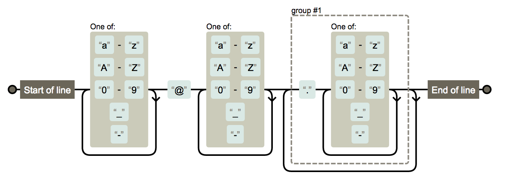

`高子航001Abc@bowbee.com.cn` 名称允许汉字、字母、数字，域名只允许英文域名

```regex
^[A-Za-z0-9\u4e00-\u9fa5]+@[a-zA-Z0-9_-]+(\.[a-zA-Z0-9_-]+)+$
```


### 电话

`13012345678` 手机号

```regex
^1(3|4|5|6|7|8|9)\d{9}$
\b1[3-9][0-9]{9}\b
```


`XXX-XXXXXXX` `XXXX-XXXXXXXX` 固定电话

```regex
(\(\d{3,4}\)|\d{3,4}-|\s)?\d{8}
```


### 域名

`https://google.com/`

```regex
^((http:\/\/)|(https:\/\/))?([a-zA-Z0-9]([a-zA-Z0-9\-]{0,61}[a-zA-Z0-9])?\.)+[a-zA-Z]{2,6}(\/)
\b(https?|ftp)://[-\w.]+(:\d+)?(/[\w/.]*)?\b
```

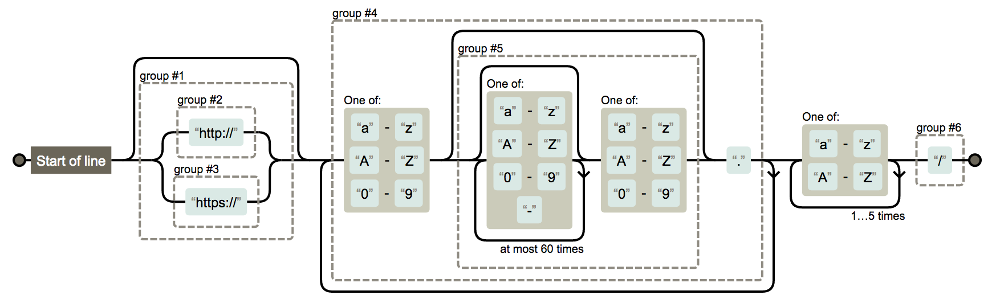

### IP

`127.0.0.1`

```regex
((?:(?:25[0-5]|2[0-4]\d|[01]?\d?\d)\.){3}(?:25[0-5]|2[0-4]\d|[01]?\d?\d))
\b([0-9]{1,3}\.){3}[0-9]{1,3}\b
```


### 帐号校验

`gaozihang_001` 字母开头，允许5-16字节，允许字母数字下划线

```regex
^[a-zA-Z][a-zA-Z0-9_]{4,15}$
```

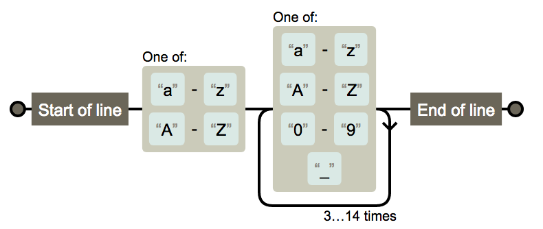

### 字符校验

#### 汉字

`高子航`

```regex
^[\u4e00-\u9fa5]{0,}$
```


#### 英文和数字

```regex
^[A-Za-z0-9]+$
```

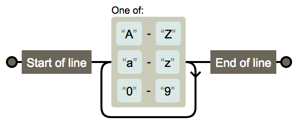

#### 长度为3-20的所有字符

```regex
^.{3,20}$
```


#### 英文字符

##### 由26个英文字母组成的字符串

```regex
^[A-Za-z]+$
```


##### 由26个大写英文字母组成的字符串

```regex
^[A-Z]+$
```

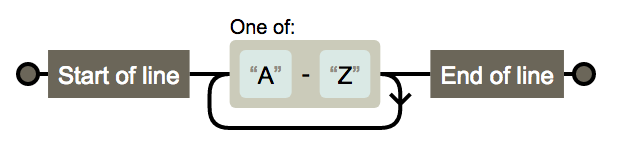

##### 由26个小写英文字母组成的字符串

```regex
^[a-z]+$
```

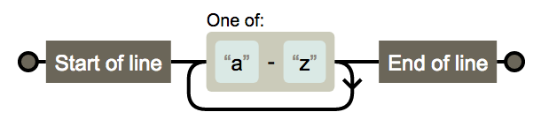

##### 由数字和26个英文字母组成的字符串

```regex
^[A-Za-z0-9]+$
```


##### 由数字、26个英文字母或者下划线组成的字符串 

```regex
^\w+$
```


#### 中文、英文、数字包括下划线

```regex
^[\u4E00-\u9FA5A-Za-z0-9_]+$
```

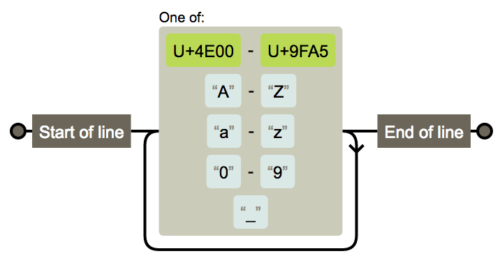

#### 中文、英文、数字但不包括下划线等符号

```regex
^[\u4E00-\u9FA5A-Za-z0-9]+$
```


#### 禁止输入含有%&',;=?$\"等字符

```regex
[^%&',;=?$\x22]+
```


#### 禁止输入含有~的字符

```regex
[^~\x22]+
```

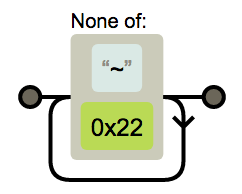

### 数字正则

#### 整数

```regex
^-?[1-9]\d*$
```

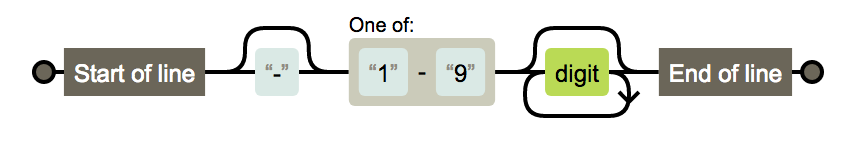

##### 正整数

```regex
^[1-9]\d*$
```


##### 负整数

```regex
^-[1-9]\d*$
```


##### 非负整数

```regex
^[1-9]\d*|0$
```


##### 非正整数

```regex
^-[1-9]\d*|0$
```

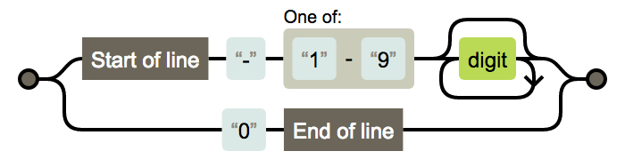

#### 浮点数

```regex
^-?([1-9]\d*\.\d*|0\.\d*[1-9]\d*|0?\.0+|0)$
```

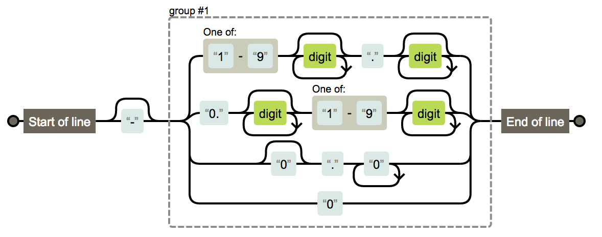

##### 正浮点数

```regex
^[1-9]\d*\.\d*|0\.\d*[1-9]\d*$
```


##### 负浮点数

```regex
^-([1-9]\d*\.\d*|0\.\d*[1-9]\d*)$
```


##### 非负浮点数

```regex
^[1-9]\d*\.\d*|0\.\d*[1-9]\d*|0?\.0+|0$
```


##### 非正浮点数

```regex
^(-([1-9]\d*\.\d*|0\.\d*[1-9]\d*))|0?\.0+|0$
```


##### 匹配时间
一分钟：
```regex
([0-5][0-9])
```

##### 匹配空行
```regex
^$
```
