# awk

## 目录

<!-- vim-markdown-toc GFM -->

* [基本语法](#基本语法)
    * [完整语法](#完整语法)
    * [模式](#模式)
        * [模式中表达式的运算符](#模式中表达式的运算符)
            * [比较运算符](#比较运算符)
            * [逻辑运算符](#逻辑运算符)
        * [模式总结](#模式总结)
    * [动作](#动作)
        * [动作类型总结](#动作类型总结)
        * [数据类型](#数据类型)
            * [常量](#常量)
            * [变量](#变量)
                * [内建变量](#内建变量)
                * [字段变量](#字段变量)
        * [表达式运算符](#表达式运算符)
        * [内建算数函数](#内建算数函数)
        * [内建字符串函数](#内建字符串函数)
    * [流程控制](#流程控制)
        * [关键字](#关键字)
        * [空语句](#空语句)
    * [数组](#数组)
        * [关联数组](#关联数组)
        * [delete语句](#delete语句)
        * [split函数](#split函数)
        * [多维数组](#多维数组)
    * [自定义函数](#自定义函数)
    * [输出](#输出)
        * [print语句](#print语句)
        * [输出分割符](#输出分割符)
        * [printf语句](#printf语句)
        * [输出到文件](#输出到文件)
        * [输出到管道](#输出到管道)
        * [关闭文件与管道](#关闭文件与管道)
    * [输入](#输入)
        * [输入分隔符](#输入分隔符)
        * [多行记录](#多行记录)
        * [getline函数（todo）](#getline函数todo)
        * [命令行参数](#命令行参数)
    * [与其它程序交互](#与其它程序交互)
        * [system函数](#system函数)
        * [用awk制作shell命令](#用awk制作shell命令)
* [数据处理](#数据处理)
    * [数据转换与归约](#数据转换与归约)
        * [列求和](#列求和)
        * [计算百分比与分位数todo](#计算百分比与分位数todo)
        * [带逗号的数](#带逗号的数)
        * [字段固定的输入](#字段固定的输入)
* [性能](#性能)
* [awk语言的限制](#awk语言的限制)
* [初始化，比较和强制类型转换](#初始化比较和强制类型转换)
* [案例](#案例)
    * [计算总额](#计算总额)
    * [统计url响应成功率](#统计url响应成功率)
    * [todo](#todo)
    * [依据日志文件计算流量](#依据日志文件计算流量)
    * [nginx access.log日志分析](#nginx-accesslog日志分析)

<!-- vim-markdown-toc -->

## 基本语法

### 完整语法
```bash
awk 'BEGIN { print "start" } pattern1 { commands1 } pattern2 { commands2 } ...  END { print "end" }' input_file
```

1. awk是一行一行的来处理数据，每一行的字段默认以空白键或者tab键分隔。awk脚本是由一个或多个模式和动作组成的。

2. 动作内的语句通常用换行符分隔，多个语句也可以出现在同一行，只要他们用分号分开即可

3. 空行会被忽略，空行可以插在语句之前或者之后，用于提高程序可读性，空格和制表符可以出现在运算符和操作数的周围，同样也是为了提高可读性

4. 动作中的注释可以出现在任意一行的末尾，注释以#开始，以换行符结束

5. 一条长语句可以分散成多行，只要在断行处插入一个续行符（反斜杠 \ ）即可；逗号之后可以断行
```awk
{ print \ 
    $1,
    $2,
    $3 }
```

### 模式
模式控制着动作的执行，当模式匹配时，相应的动作便会执行  

模式语法类型汇总：
1. BEGIN { statements }
在输入被读取之前，statements执行一次

2. END { statements }
当所有输入被读取完毕之后，statements执行一次

3. expression { statements }
每碰到一个expression为真的输入行，statements就执行。expression为真指的是值非零或非空

4. /regular expression/ { statements }
当碰到这样一个输入行时，statements就执行：输入行含有一段字符串，而该字符串可以被regular expression匹配

5. compound pattern { statements }
一个复合模式将表达式用，&&，||，!，以及括号组合起来；当compund pattern为真，statements执行

6. pattern1，pattern2 { statements }
一个范围模式匹配多个输入行，这些输入行从匹配pattern1的行开始，到匹配pattern2的行结束（包括这两行），对这其中的每一行执行statements。pattern1与pattern2可以匹配同一行

注意：BEGIN与END不与其它模式组合，一个范围模式不能是其它模式的一部分。BEGIN与END是唯一两个不能省略动作的模式

#### 模式中表达式的运算符

##### 比较运算符
```
<   小于
<=  小于或等于
==  等于
!=  不等于
>=  大于或等于
>   大于
~   匹配
!~  不匹配
```

##### 逻辑运算符
```
&&  与
||  或
!   非
```

#### 模式总结
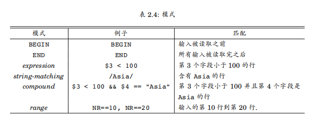

### 动作
动作由一个或多个命令、函数、表达式组成，之间由换行符或分号隔开，并位于大括号内

#### 动作类型总结
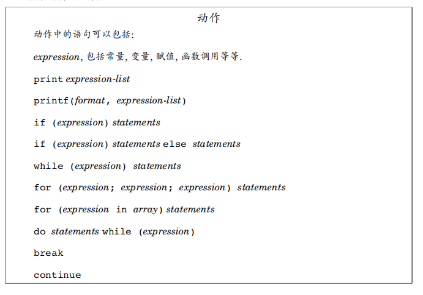

#### 数据类型

##### 常量
awk中只有两种类型常量，字符串和数值，将一个字符串用一对双引号包围起来就创建了一个字符串常量，如"Asia"；字符串常量可以包含转义序列，如"\n"换行

##### 变量
变量可以包含多种类型：用户定义的、内建的或字段。用户定义的变量名字由数字、字母、下划线组成但不能以数字开头；所有内建变量的名字都只由大写字母组成。

awk中变量不需要事先声明，awk会根据上下文环境推断出变量的类型。未初始化的变量值默认为""或者0

###### 内建变量
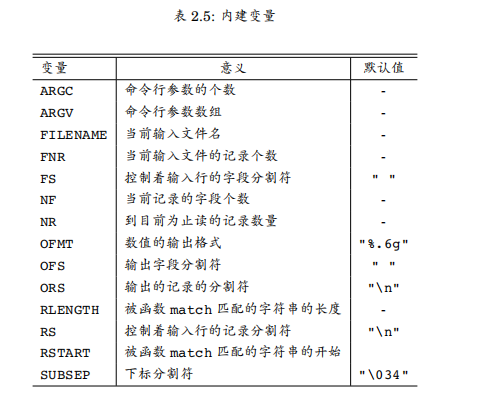

###### 字段变量
当前输入行的字段从$1一直到$NF，$0表示整行。字段变量和其它变量相比没有什么不同，也可以参与算数和字符串运算

#### 表达式运算符
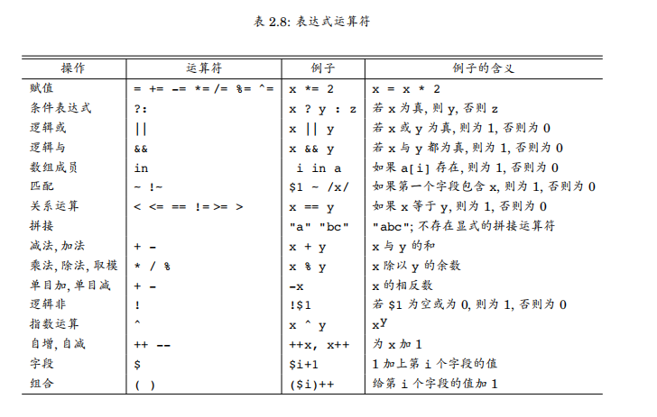

#### 内建算数函数
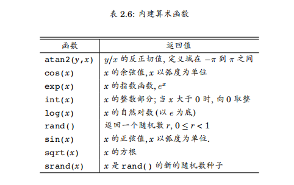

#### 内建字符串函数
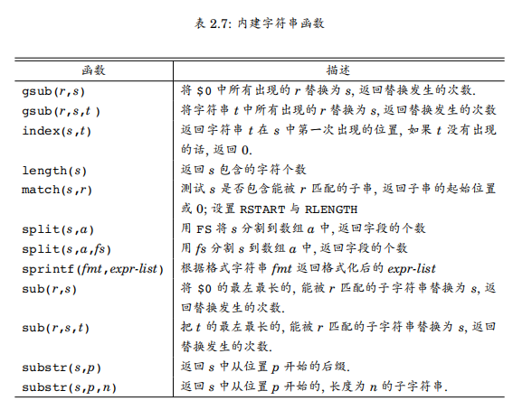

### 流程控制
流程控制语句if-else以及循环语句只能用在动作里，这些流程控制都来之c语言

if-else
```awk
# if后面的条件为真则第一个print语句执行，否则第二个print语句执行，逗号后面断行可以将语句延续到下一行
$2 > 6 { n = n + 1; pay = pay + $2 * $3 }
END { if (n > 0)
        print n, "employees, total pay is", pay,
                "average pay is", pay/n
      else
        print "no employees are paid more than $6/hour"
    }
```

if-else if
```awk
BEGIN {
    if (ARGC == 2)
        for (i = 1; i <= ARGV[1]; i++)
            print i
    else if (ARGC == 3)
        for (i = ARGV[1]; i <= ARGV[2]; i++)
            print i
    else if (ARGC == 4)
        for (i = ARGV[1]; i <= ARGV[2]; i += ARGV[3])
            print i
}
```

while
```awk
{   i = 1
    while (i <= $3) {
        printf("\t%.2f\n", $1 * (1 + $2) ^ i)
        i = i + 1
    }

}
```

do statements while (expression)

for
```awk
{   for (i = 1; i <= $3; i = i + 1)
        printf("\t%.2f\n", $1 * (1 + $2) ^ i)
}

for (uariable in array) statements    轮流将uariable设置为array的每一个下标，并执行statements
```

#### 关键字
break   马上离开最内层，包围break的while，for或do

continue    开始最内层的，包围continue的while，for或do的下一次循环

next    开始主循环的下一次迭代

exit

exit expression 马上执行END动作，如果已经在END动作内，就退出程序，将expression作为程序退出状态返回

#### 空语句
单独一个分号表示一个空语句
```awk
BEGIN { FS = "\t" }
    { for (i = 1; i <= NF && $i != ""; i++) 
          ;
      if (i <= NF)
          print       
    }
```
这个程序打印所有的，包含空字段的行

### 数组
awk提供了一维数组，用于存放字符串和数值，数组与数组元素都不需要事先声明，也不需要数组中有多少个元素，就像变量一样，当被提及是，数组元素就会被创建，数组元素默认初始值为0或者空字符串""

示例：
```awk
# 行倒序输出
    { x[NR] = $0 }
END {   for (i = NR; i > 0; i--)
            print x[i]
    }

# while实现
{ line[NR] = $0 }
END {   i = NR
        while (i > 0) {
            print line[i]
            i = i - 1   
        } 
    }
```

#### 关联数组
awk的数组与大多数其它语言最大的不同点是，数组元素的下标是字符串，这个特性能让awk数组作为关联数组使用（字典）

下面这个程序将Asia与Europe的人口数量累加到数组pop中，END动作打印这个两个州的总人口
```awk
/Asia/   { pop["Asia"] += $3 }
/Europe/ { pop["Eurepo"] += $3 }
END      { print "Asian population is",
               pop["Asia"], "million."
           print "European population is",
               pop["Europe"], "million."
         }
```


#### delete语句
一个数组元素可以通过 delete array[subscript] 删除。例如，下面这个循环删除数组pop中的所有元素：
```awk
for (i in pop)
    delete pop[i]
```

#### split函数
函数split(str, arr, fs)将字符串str切割成一个个字段，并存储到数组arr中，字段的个数作为函数的返回值返回，第三个参数fs的字符串值作为字段的分割符，如果第三个参数被忽略，就使用FS
```awk
# 将7存储在arr["1"]
split("7/4/76", arr, "/")
```

#### 多维数组
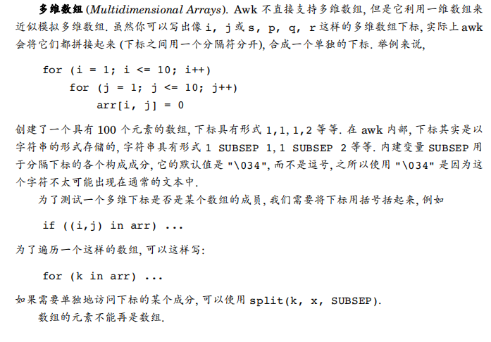

### 自定义函数
函数定义可以出现在任何 模式-动作 语句可以出现的地方   
函数体内，参数是局部变量，其它所有变量都是全局的

语法：
```
function name(parameter-list) {
    statements
}

# 计算参数的最大值，如果没有为return提供表达式，或者最后一句执行的语句不是return，那么返回值就是未定义的
function max(m, n) {
    return m > n ? m : n
}
```

### 输出
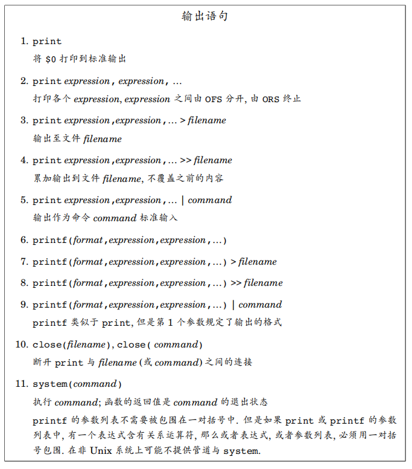

#### print语句
语法：
```awk
print expression1, expression2, ..., expressionN
# 或
print(expression1, expression2, ..., expressionN)
```
各个表达式的字符串值之间用输出字段分割符分开，最后跟着输出记录分割符。

示例：
```awk
# 打印每一行
print 或 print $0

# 打印空白行（只有换行符的行）
print ""

# 括号形式打印（当参数含有关系运算符时，就必须使用括号）
print($1 ":", $2)
```

#### 输出分割符
OFS和ORS，初始值分别为一个空格符和一个换行符
```awk
# 更改输出分割符为:，并在每一行的第二个字段之后输出两个换行符
BEGIN   { OFS = ":"; ORS = "\n\n" }
        { print $1, $2 }
```

#### printf语句
语法：    
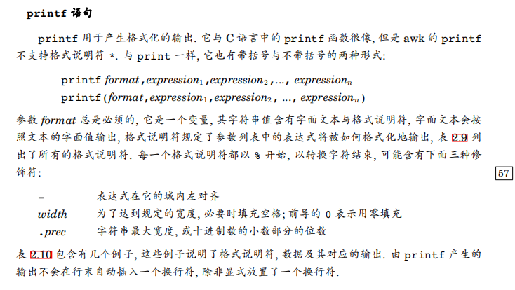

格式控制字符：  
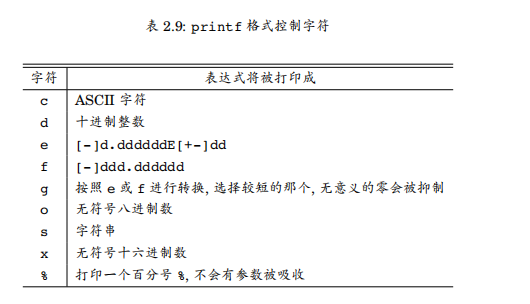

示例：  
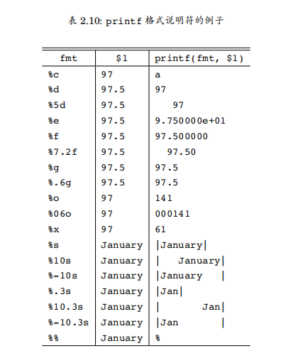

#### 输出到文件
```awk
# 如果第三个字段大于100，则输出到bigpop；否则输出到smallpop
$3 > 100    { print $1, $3 > "bigpop" }
$3 <= 100   { print $1, $3 > "smallpop" }
```

#### 输出到管道
```awk
BEGIN { FS = "\t" }
      { pop[$4] += $3 }
END   { for (c in pop)
            printf("%15s\t%6d\n", c, pop[c]) | "sort -t'\t' -k1rn")
      }
```

#### 关闭文件与管道
语句close(expression)关闭一个文件或管道，文件或管道是由expression指定；expression的字符串值必须与最初用于创建文件或管道的字符串相同，于是
```awk
close("sort -t'\t' -k1rn")
```
关闭上面打开的排序管道。在同一个程序中，如果你写了一个文件，而待会想要读取他，那么就需要调用close，某一时刻，同时处于打开状态的文件或管道数量最大值由实现定义


### 输入
awk输入数据有若干种方式，最常见是把输入数据放在一个文件中；如果没有指定输入文件，awk就从它的标准输入读取数据

#### 输入分隔符
内建变量FS的默认值是一个空格" "，把一个字符串赋值给内建变量FS就可以改变字段分隔符，如果字符串的长度多于一个字符，那么它会被当成一个正则表达式。
```awk
# 该正则表达式匹配的最左，最长，非空且不重叠的子字符串变成分隔符
# 如果某个子串由一个后面跟着空格或者制表符的逗号组成，或者没有逗号，只有空格和制表符，就会被当作分隔符
BEGIN { FS = ",[\t]*|[ \t]+" }
```

#### 多行记录
默认情况下，输入内容以换行符分隔，及行和记录是等价的，但可以通过内建变量RS赋新值改变
```awk
# 把记录分隔符设置成一个或多个空白行，把字段分隔符设置成单个换行符；
# 每一行都是一个单独的字段，记录的长度是有限制的，通常是3000个字符
BEGIN { RS = ""; FS = "\n" }
```
当设置了这个 AWK 脚本后，它将整个文件视为一个记录，每个字段包含文件中的一行文本。你可以在脚本的其他部分使用 $1、$2 等来访问每一行的内容，而不用担心记录分隔符的影响。

#### getline函数（todo）
函数getline可以从当前输入行，或文件，或管道，读取输入

#### 命令行参数
命令行参数可以通过awk的内建数组ARGV来访问，内建变量ARGC的值是参数的个数再加1
```bash
awk -f progfile a v=1 b
```
ARGC的值是4，ARGB[0]含有awk，ARGV[1]含有a，ARGV[2]含有v=1，ARGV[3]含有b

生成1到10这十个整数：
```awk
BEGIN {
    if (ARGC == 2)
        for (i = 1; i <= ARGV[1]; i++)
            print i
    else if (ARGC == 3)
        for (i = ARGV[1]; i <= ARGV[2]; i++)
            print i
    else if (ARGC == 4)
        for (i = ARGV[1]; i <= ARGV[2]; i += ARGV[3])
            print i
}

# 命令：
# awk -f seq 10
# awk -f seq 1 10
# awk -f seq 1 10 1
```

### 与其它程序交互

#### system函数
内建函数system(expression)用于执行命令，命令由expression给出，system的返回值就是命令的退出状态

示例：
```awk
# 如果第一个字段是#include，那么双引号就会被移除，然后unix命令cat打印以第二个字段命名的文件，其他输入行被原样复制
$1 == "#include" { gsub(/"/, "", $2); system("cat " $2); next }
                 { print }
```

#### 用awk制作shell命令
示例：
```bash
#!/usr/bin/env bash
# filed - print named fileds of each input line
#   usage: filed n n n ... file file file

awk '
BEGIN {
    for (i = 1; ARGV[i] ~ /^[0-9]+$/; i++) {
        fld[++nf] = ARGV[i]
        ARGV[i] = ""
    }

    if (i >= ARGC)
        ARGV[ARGC++] = "-"
}

{   for (i = 1; i <= nf; i++)
        printf("%s%s", $fld[i], i < nf ? " " : "\n")
}
' $*
```

## 数据处理

### 数据转换与归约

#### 列求和
每一个输入行都含有若干个字段，每一个字段都包含数字，求每一列的和，而不管该行有多少列
```
{   for (i = 1; i <= NF; i++)   
        sum[i] += $i
    if (NF > maxfld)
        maxfld = NF
}

END {   for (i = 1; i <= maxfld; i++) {
            printf("%g", sum[i])
            if (i < maxfld)
                printf("\t")
            else
                printf("\n"
        }
}
```

#### 计算百分比与分位数todo

#### 带逗号的数
设想一张数据表，表中每个数据都有逗号和小数点，就像12,345.67，因为第一个逗号会终止awk对数的解析，所以不能直接相加，需要把逗号移除
```awk
    { gsub(/,/, ""); sum += $0 }
END { print sum }
```

#### 字段固定的输入
每行的前六个字符包含一个日期，日期形式是mmddyy，如果我们想让它们按照日期排序，最简单的办法是先把日期转换为yymmdd的形式
```awk
{ $1 = substrin($1, 5, 2) substr($1, 1, 2) substr($1, 3, 2); print }
```

## 性能
当处理的数据规模越来越大时，awk程序就会越来越慢，解决建议：
1. 用更好的算法
2. 配合其它更快速的程序使用
3. 换配置更好的机器

## awk语言的限制
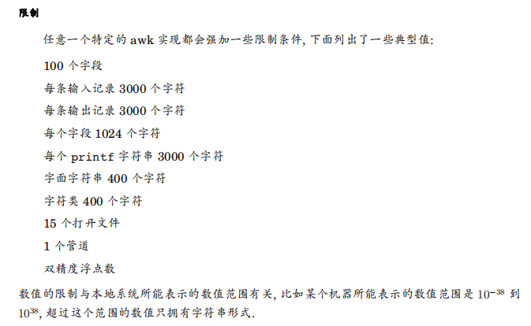

## 初始化，比较和强制类型转换
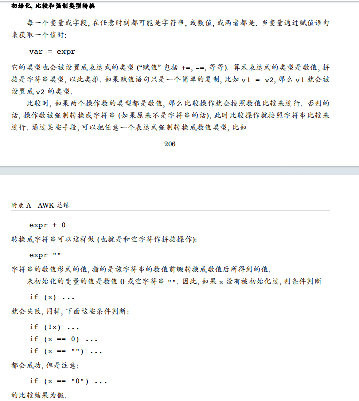

## 案例

### 计算总额
```bash
# pay.txt
# Name 1st 2nd 3th
# VBird 23000 24000 25000
# DMTsai 21000 20000 23000
# Bird2 43000 42000 41000

# 语法一：
awk 'NR==1{printf "%10s %10s %10s %10s %10s\n", $1,$2,$3,$4,"Total"} NR>=2{total = $2 + $3 + $4;  printf "%10s %10d %10d %10d %10.2f\n", $1, $2, $3, $4, total}' pay.txt

# 语法二：类c
awk '{if(NR==1) printf "%10s %10s %10s %10s %10s\n",$1,$2,$3,$4,"Total "} {if(NR>=2) {total = $2 + $3 +$4; printf "%10s %10d %10d %10d %10.2f\n",$1, $2, $3, $4, total}}' pay.txt
```

### 统计url响应成功率
```bash
# result.txt
# 时间         路由         状态码  
# 23:23:11     /aa              200  
# 12:23:12     /aa              200  
# 10:32:90     /bb              300
#
# 输出格式
# 路由     成功率  
# /aa     100%
# /bb     0%
awk 'NR>1{routes[$2]++; if($3==200) success[$2]++} END{printf "路由\t成功率\n"; for(route in routes) {rate=success[route]/routes[route]*100; printf "%s\t%.of%%\n", route,rate}}'
```

### todo 
```bash
awk -F ".”'{
    if(NF!=4)
        print "error";
    else {
        msg = “yes" ;
        for(i=1 ; i<=NF;i++){
            if($i<0[|$i>255){
                msg ="no";
                break;
            }
        }
        print msg;
    }
}' nowcoder .txt
```

### 依据日志文件计算流量

算出2022年7月份的每一分钟的流量.-----使用循环多级嵌套，正则结合for循环，流量需要求和
```
2022-7-1 00:01:01 78
2022-7-1 00:01:04 89
2022-7-1 00:02:04 89
2022-7-1 00:03:01 178
....
2022-7-3 00:04:34 839
2022-7-4 00:01:04 189
2022-7-4 00:01:54 89
.... 
2022-7-30 00:03:01 178
2022-7-31 00:07:05 8900
```
脚本：
```bash
awk '{
    timestamp = $1; # 提取时间戳
    traffic = $2; # 提取流量值
    split(timestamp, arr, "[:-]"); # 使用分隔符（-或:）将时间戳拆分成数组
    month = arr[2]; # 提取月份
    day = arr[3]; # 提取日期
    hour = arr[4]; # 提取小时
    minute = arr[5]; # 提取分钟
    # 将时间戳格式化为YYYY-MM-DD HH:MM的形式
    timestamp_formatted = arr[1] "-" month "-" day " " hour ":" minute;
    # 将流量值添加到对应的时间戳下
    traffic_sum[timestamp_formatted] += traffic;
} 
END {
    # 遍历所有时间戳，并打印时间戳和对应的流量值
    for (timestamp_formatted in traffic_sum) {
        print timestamp_formatted, traffic_sum[timestamp_formatted];
    }
}' data.txt
```

### nginx access.log日志分析
对nginx的日志文件access.log进行分析，分析出单个ip地址累计下载获取的文件大小的总数（对每次访问数据的大小进行求和)，显示下载总数最大的前100个ip地址和下载文件大小，按照下载文件大小的降序排列
```
以下是nginx日志的字段含义
$time_iso8601|$host $http_cf_connecting_ip |$request |$status|$body_bytes_sent|$http_referer |$http_user_agent

2019-04-25T09:51:58+08:00 | a.google.com|47.52.197.27|GET /2/depth?symbol=aaaHTTP/1.1 | 200| 24|-| apple
2019-04-25TO9:52:58+08:00 | b.google.com |47.75.159.123|GET /2/depth?symbol=bbbHTTP/1.1 [ 200| 407|-l python-requests/2.20.0
2019-04-25T09:53:58+08:00 | c.google.com | 13.125.219.4|GET /2/ticker?timestamp=1556157118&symbol=ccc HTTP/1.1|200|162/|-|chrome
2019-04-25TO9:54:58+08:00 | d.shuzibi.co|-/|HEAD /justfor.txt HTTP/1.0|200|0/-1-
2019-04-25T09:55:58+08:00| e.google.com |13.251.98.2|GET /2/order_detail?apiKey=dddHTTP/1.1 [200| 231/-l python-requests/2.18.4
2019-04-25T09:56:58+08:00|f.google.com|210.3.168.106|GET /v2/trade_detail?apiKey=eeeHTTP/1.1 | 200|24|-l-
```
脚本：
```
awk '{access[$1]+=$10}END{for (i in access) print i,access[i]}'access.log |sort -k 2 -n -r / head -100 result.txt
```

计算每分钟带宽（body_bytes_sent）
```bash
awk -F"/" '{f1ow[substr($1,1,16)]+=$(NF-2)}END{for (i in flow) printi,f1ow[i]3' nginx.log
```

统计每个URL（即不带问号的前面的内容）的每分钟的频率
```bash
awk -F"[l ?]+" '{flow[substr($1,1,16)$5]+=1}END{for (i in flow)print i,fTow[i]}' nginx.1og
```

编写时间段的正则，使用sed/grep/awk过滤出下面时间段的日志，输出到屏幕  
06/Jul/2022:1:24    06/Jul/2022:23:24
```bash
awk '$4~/01\/Jul\/2022:([1-9]|1[0-9]|2[0-3])/{print $0}' access.log |wc -l
```

对nginx的日志文件access.log进行分析，分析出单个ip地址累计下载获取的文件大小的总数（对每次访问数据的大小进行求和），显示下载总数最大的前100个ip地址和下载文件大小，按照下载文件大小的降序排列
```bash
awk '{ip[$1]+=$10}END{for(i in ip) print i,ip[i]}' access.log |sort -r -n -k 2 |head -100
```
