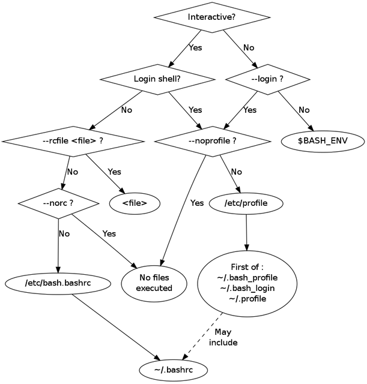
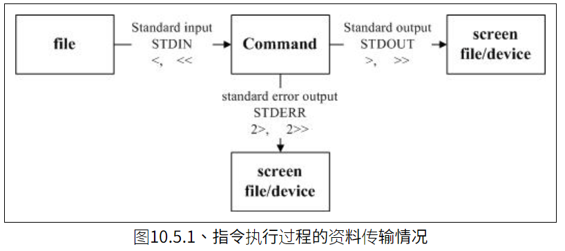

# bash_syntax

## 目录
<!-- vim-markdown-toc GFM -->

* [介绍](#介绍)
    * [shell的含义](#shell的含义)
    * [shell的种类](#shell的种类)
    * [bash和shell的历史](#bash和shell的历史)
* [模式扩展](#模式扩展)
* [字符串操作](#字符串操作)
    * [获取字符串长度](#获取字符串长度)
    * [获取子字符串](#获取子字符串)
    * [改变大小写](#改变大小写)
    * [搜索和替换（pass）](#搜索和替换pass)
* [算数运算](#算数运算)
    * [算数表达式](#算数表达式)
    * [浮点数运算](#浮点数运算)
    * [精确除法](#精确除法)
    * [浮点数比较](#浮点数比较)
    * [数值的进制](#数值的进制)
    * [位运算（pass）](#位运算pass)
    * [逻辑运算（pass）](#逻辑运算pass)
    * [赋值运算（pass）](#赋值运算pass)
    * [求值运算（pass）](#求值运算pass)
* [脚本入门](#脚本入门)
    * [shebang行](#shebang行)
    * [注释](#注释)
    * [脚本参数](#脚本参数)
    * [shift命令](#shift命令)
    * [getopts命令](#getopts命令)
    * [配置项参数终止符--](#配置项参数终止符--)
    * [exit命令](#exit命令)
    * [read命令（pass）](#read命令pass)
* [条件判断](#条件判断)
    * [if-else](#if-else)
    * [test命令](#test命令)
    * [正则判断](#正则判断)
    * [判断的逻辑运算](#判断的逻辑运算)
    * [算数判断 ((...))](#算数判断-)
    * [case结构](#case结构)
* [循环](#循环)
    * [while循环](#while循环)
    * [示例](#示例)
    * [until循环](#until循环)
    * [for...in循环](#forin循环)
    * [for循环（C语言）](#for循环c语言)
    * [break, continue](#break-continue)
    * [select结构](#select结构)
* [函数](#函数)
    * [return命令](#return命令)
    * [全局变量和局部变量，local命令](#全局变量和局部变量local命令)
* [数组](#数组)
    * [创建数组](#创建数组)
    * [读取数组](#读取数组)
    * [数组的长度](#数组的长度)
    * [提取数组序号](#提取数组序号)
    * [提取数组成员](#提取数组成员)
    * [追加数组成员](#追加数组成员)
    * [删除数组](#删除数组)
    * [关联数组](#关联数组)
* [set命令、shopt命令](#set命令shopt命令)
    * [set](#set)
    * [shopt](#shopt)
* [脚本环境变量](#脚本环境变量)
    * [LINENO](#lineno)
    * [FUNCNAME](#funcname)
    * [BASH_SOURCE](#bash_source)
    * [BASH_LINENO](#bash_lineno)
* [trap命令](#trap命令)
* [bash启动环境](#bash启动环境)
    * [启动环境](#启动环境)
    * [键盘绑定](#键盘绑定)
* [命令提示符](#命令提示符)
    * [环境变量PS1](#环境变量ps1)
    * [颜色](#颜色)
    * [环境变量PS2，PS3，PS4](#环境变量ps2ps3ps4)
* [重定向](#重定向)
* [建议](#建议)
* [命名规范](#命名规范)
* [检查返回值](#检查返回值)
* [字符处理命令](#字符处理命令)
    * [cut](#cut)
    * [tr](#tr)
    * [col](#col)
    * [join](#join)
    * [paste](#paste)
    * [expand](#expand)
    * [减号-用途](#减号-用途)
    * [printf](#printf)
    * [pr](#pr)

<!-- vim-markdown-toc -->

## 介绍
bash是unix/Linux系统中的一种shell，也是目前绝大多数Linux发行版的默认shell

### shell的含义
```
首先，Shell 是一个程序，提供一个与用户对话的环境。这个环境只有一个命令提示符，让用户从键盘输入命令，所以又称为命令行环境（command line interface，简写为 CLI）。Shell 接收到用户输入的命令，将命令送入操作系统执行，并将结果返回给用户。本书中，除非特别指明，Shell 指的就是命令行环境。

其次，Shell 是一个命令解释器，解释用户输入的命令。它支持变量、条件判断、循环操作等语法，所以用户可以用 Shell 命令写出各种小程序，又称为脚本（script）。这些脚本都通过 Shell 的解释执行，而不通过编译
```

### shell的种类
echo $SHELL 查看当前shell是什么  
cat /etc/shells  查看当前Linux安装的所有shell
```
Bourne Shell（sh）
Bourne Again shell（bash）
C Shell（csh）
TENEX C Shell（tcsh）
Korn shell（ksh）
Z Shell（zsh）
Friendly Interactive Shell（fish）
```

### bash和shell的历史
```
Shell 伴随着 Unix 系统的诞生而诞生。

1969年，Ken Thompson 和 Dennis Ritchie 开发了第一版的 Unix。

1971年，Ken Thompson 编写了最初的 Shell，称为 Thompson shell，程序名是sh，方便用户使用 Unix。

1973年至1975年间，John R. Mashey 扩展了最初的 Thompson shell，添加了编程功能，使得 Shell 成为一种编程语言。这个版本的 Shell 称为 Mashey shell。

1976年，Stephen Bourne 结合 Mashey shell 的功能，重写一个新的 Shell，称为 Bourne shell。

1978年，加州大学伯克利分校的 Bill Joy 开发了 C shell，为 Shell 提供 C 语言的语法，程序名是csh。它是第一个真正替代sh的 UNIX shell，被合并到 Berkeley UNIX 的 2BSD 版本中。

1979年，UNIX 第七版发布，内置了 Bourne Shell，导致它成为 Unix 的默认 Shell。注意，Thompson shell、Mashey shell 和 Bourne shell 都是贝尔实验室的产品，程序名都是sh。对于用户来说，它们是同一个东西，只是底层代码不同而已。

1983年，David Korn 开发了Korn shell，程序名是ksh。

1985年，Richard Stallman 成立了自由软件基金会（FSF），由于 Shell 的版权属于贝尔公司，所以他决定写一个自由版权的、使用 GNU 许可证的 Shell 程序，避免 Unix 的版权争议。

1988年，自由软件基金会的第一个付薪程序员 Brian Fox 写了一个 Shell，功能基本上是 Bourne shell 的克隆，叫做 Bourne-Again SHell，简称 Bash，程序名为bash，任何人都可以免费使用。后来，它逐渐成为 Linux 系统的标准 Shell。

1989年，Bash 发布1.0版。

1996年，Bash 发布2.0版。

2004年，Bash 发布3.0版。

2009年，Bash 发布4.0版。

2019年，Bash 发布5.0版。

用户可以通过bash命令的--version参数或者环境变量$BASH_VERSION，查看本机的 Bash 版本。
```

## 模式扩展
bash提供八种模式扩展（globbing）
1. 波浪线扩展  
~表示当前用户主目录
2. ? 字符扩展  
匹配单个字符
3. \* 字符扩展  
匹配任意字符，包括零个
```bash
# globstar，当该参数打开时，允许**匹配零个或多个子目录，bash 4.0引入
$ shopt -s globstar
$ ls **/*.txt
a.txt  sub1/b.txt  sub1/sub2/c.txt
```
4. 方括号扩展 [...]
```
[aeiou]  可以匹配五个元音字母中的任意
[a-z]  所有小写字母。
[a-zA-Z]  所有小写字母与大写字母。
[a-zA-Z0-9]  所有小写字母、大写字母与数字。
[abc]*  所有以a、b、c字符之一开头的文件名。
program.[co]  文件program.c与文件program.o。
BACKUP.[0-9][0-9][0-9]  所有以BACKUP.开头，后面是三个数字的文件名。
这种简写形式有一个否定形式[!start-end]，表示匹配不属于这个范围的字符。比如，[!a-zA-Z]表示匹配非英文字母的字符。
若中括号内的第一个字元为指数符号(^) ，那表示『反向选择』，例如[^abc] 代表一定有一个字元，只要是非a, b, c 的其他字元就接受的意思。
```
5. 大括号扩展  
大括号扩展{..}表示分别扩展成大括号里面的所有值，各个值之间使用逗号分隔，比如，{1,2,3}扩展成1 2 3
```bash
# 命令会新建36个子目录，每个子目录的名字都是”年份-月份
mkdir {2007..2009}-{01..12}

# 用于for循环
for i in {1..4}
do
  echo $i
done
```
6. 变量扩展  
`${!S*}扩展成所有以S开头的变量名`
7. 子命令扩展  
`$(...)可以扩展成另一个命令的运行结果，该命令的所有输出都会作为返回值`
8. 算术扩展  
`$((...))可以扩展成整数运算的结果`

## 字符串操作

### 获取字符串长度
```bash
# 语法 ${#varname}

myPath=/home/cam/book/long.file.name
echo ${#myPath}
# 29
```

### 获取子字符串
```bash
# 语法 ${varname:offset:length}，offset从0开始计算
count=frogfootman
echo ${count:4:4}
# foot
```

### 改变大小写
```bash
# 转为大写
${varname^^}

# 转为小写
${varname,,}
```

### 搜索和替换（pass）

## 算数运算

### 算数表达式
((...)) 语法可以进行整数的运算，这种语法不返回值算数值，如果算术结果为0，命令会算作执行失败
```bash
(( foo = 5 + 5 ))
```

如果要读取算数运算的结果，需要在使用$(( ... ))
```bash
echo $(( 2 + 2 ))
```

支持的算数运算符：
```
+：加法
-：减法
*：乘法
/：除法（整除）
%：余数
**：指数
++：自增运算（前缀或后缀）
--：自减运算（前缀或后缀）
```

### 浮点数运算
```bash
echo "5.01-4*2.0"|bc
```

### 精确除法
```bash
num=`echo "scale=2; 2/3" | bc`
# 输出.66
echo $num
```

### 浮点数比较
```bash
# 方法1：bc
a=1.2
b=3.4
if [[ $(echo "$a < $b" | bc) -eq 1 ]]
then
    echo "$a is less than $b"
else
    echo "$a is greater than or equal to $b"
fi

# 方法2： awk
a=1.2
b=3.4
if [ $(awk -v x=$a -v y=$b 'BEGIN {print(x<y)}') -eq 1 ]
then
    echo "$a is less than $b"
else
    echo "$a is greater than or equal to $b"
fi
```

### 数值的进制
Bash 的数值默认都是十进制，但是在算术表达式中，也可以使用其他进制
```
number：没有任何特殊表示法的数字是十进制数（以10为底）。
0number：八进制数。
0xnumber：十六进制数。
base#number：base进制的数。

0xff是十六进制数，2#11111111是二进制数

示例：
$ echo $((0xff))
255
$ echo $((2#11111111))
255
```


### 位运算（pass）

### 逻辑运算（pass）

### 赋值运算（pass）

### 求值运算（pass）

## 脚本入门

### shebang行
脚本的第一行通常是指定解释器，即这个脚本必须通过什么解释器执行。
```bash
#!/usr/bin/env bash

# env命令总是指向/usr/bin/env文件，这个语法的意思是，让 Shell 查找$PATH环境变量里面第一个匹配的NAME。如果你不知道某个命令的具体路径，或者希望兼容其他用户的机器，这样的写法就很有用。提前是bash路径在$PATH里
```

### 注释
1. 文件
放在一个文件的开头，包括概括本文件的内容，版权，作者等
```bash
#!/usr/bin/env bash
#
# Perform hot backups of Oracle databases.
```

2. 函数
包括功能描述，使用的全局变量，使用的参数，标准输出内容，返回值
```bash
#######################################
# Cleanup files from the backup directory.
# Globals:
#   BACKUP_DIR
#   ORACLE_SID
# Arguments:
#   None
#######################################
function cleanup() {
  …
}
```

3. TODO
```bash
# TODO(mrmonkey): Handle the unlikely edge cases (bug ####)
```

### 脚本参数
调用脚本的时候，脚本文件名后面可以带有参数
```bash
script.sh word1 word2 word3

# $0：脚本文件名，即script.sh。
# $1~$9：对应脚本的第一个参数到第九个参数。
# $#：参数的总数。
# $@：全部的参数，参数之间使用空格分隔，每个参数会单独处理
# $*：全部的参数，参数之间使用变量$IFS值的第一个字符分隔，默认为空格，但是可以自定义，所有参数会合并成一个字符串
# $$：脚本运行的当前进程id号
# $!: 后台运行的最后一个进程号
# 如果脚本的参数多于9个，那么第10个参数可以用${10}的形式引用，以此类推。
```

### shift命令
```bash 
#!/bin/bash

echo "一共输入了 $# 个参数"

while [ "$1" != "" ]; do
  echo "剩下 $# 个参数"
  echo "参数：$1"
  shift
done
```
上面例子中，shift命令每次移除当前第一个参数，从而通过while循环遍历所有参数。

shift命令可以接受一个整数作为参数，指定所要移除的参数个数，默认为1

### getopts命令
```bash
# 语法：getopts optstring name

while getopts 'lha:' OPTION; do
  case "$OPTION" in
    l)
      echo "linuxconfig"
      ;;

    h)
      echo "h stands for h"
      ;;

    a)
      avalue="$OPTARG"
      echo "The value provided is $OPTARG"
      ;;
    ?)
      echo "script usage: $(basename $0) [-l] [-h] [-a somevalue]" >&2
      exit 1
      ;;
  esac
done
shift "$(($OPTIND - 1))"

# 变量OPTION保存当前处理的连词线参数，如果用户输入了没有指定的参数，OPTION等于?
# 变量OPTIND在getopts开始执行前是1，然后每次执行就会加1
```

### 配置项参数终止符--
-和--开头的参数，会被 Bash 当作配置项解释。但是，有时它们不是配置项，而是实体参数的一部分，比如文件名叫做-f或--file。这时就可以使用配置项参数终止符--，它的作用是告诉 Bash，在它后面的参数开头的-和--不是配置项，只能当作实体参数解释 cat -- -f

### exit命令
```bash
# 中止当前脚本的执行，将最后一条命令的退出状态作为整个脚本的退出状态
exit

# exit后面可以跟参数，该参数就是退出状态，exit 0表示成功
```

### read命令（pass）

## 条件判断

### if-else
语法：
```
if commands; then
  commands
[elif commands; then
  commands...]
[else
  commands]
fi
```

示例：
```bash
#!/bin/bash

echo -n "输入一个1到3之间的数字（包含两端）> "
read character
if [[ "$character" = "1" ]]; then
    echo 1
elif [[ "$character" = "2" ]]; then
    echo 2
elif [[ "$character" = "3" ]]; then
    echo 3
else
    echo 输入不符合要求
fi

# 写成一行
if false; true; then echo 'hello world'; fi
```

### test命令
语法：
```
# 写法一
test expression

# 写法二
[ expression ]

# 写法三
[[ expression ]]
```

示例：
```bash
# 写法一
if test -e /tmp/foo.txt ; then
  echo "Found foo.txt"
fi

# 写法二
if [ -e /tmp/foo.txt ] ; then
  echo "Found foo.txt"
fi

# 写法三
if [[ -e /tmp/foo.txt ]] ; then
  echo "Found foo.txt"
fi
```

### 正则判断
语法：
```
[[ string1 =~ regex ]]
```

示例：
```bash
#!/bin/bash

INT=-5

if [[ "$INT" =~ ^-?[0-9]+$ ]]; then
  echo "INT is an integer."
  exit 0
else
  echo "INT is not an integer." >&2
  exit 1
fi
```

### 判断的逻辑运算
```
AND运算：符号&&，也可使用参数-a。
OR运算：符号||，也可使用参数-o。
NOT运算：符号!。
```

示例：
```bash
#!/bin/bash

MIN_VAL=1
MAX_VAL=100

INT=50

if [[ "$INT" =~ ^-?[0-9]+$ ]]; then
  if [[ $INT -ge $MIN_VAL && $INT -le $MAX_VAL ]]; then
    echo "$INT is within $MIN_VAL to $MAX_VAL."
  else
    echo "$INT is out of range."
  fi
else
  echo "INT is not an integer." >&2
  exit 1
fi
```

### 算数判断 ((...))
示例
```bash
#!/bin/bash

INT=-5

if [[ "$INT" =~ ^-?[0-9]+$ ]]; then
  if ((INT == 0)); then
    echo "INT is zero."
  else
    if ((INT < 0)); then
      echo "INT is negative."
    else
      echo "INT is positive."
    fi
    if (( ((INT % 2)) == 0)); then
      echo "INT is even."
    else
      echo "INT is odd."
    fi
  fi
else
  echo "INT is not an integer." >&2
  exit 1
fi
```

### case结构
语法：
```
case expression in
  pattern )
    commands ;;
  pattern )
    commands ;;
  ...
esac
```

示例：
```bash
case "${expression}" in
  a)
    variable="…"
    some_command "${variable}" "${other_expr}" …
    ;;
  absolute)
    actions="relative"
    another_command "${actions}" "${other_expr}" …
    ;;
  *)
    error "Unexpected expression '${expression}'"
    ;;
esac

# 或

verbose='false'
aflag=''
bflag=''
files=''
while getopts 'abf:v' flag; do
  case "${flag}" in
    a) aflag='true' ;;
    b) bflag='true' ;;
    f) files="${OPTARG}" ;;
    v) verbose='true' ;;
    *) error "Unexpected option ${flag}" ;;
  esac
done
```

## 循环

### while循环
语法：
```
# 循环条件condition可以使用test命令，跟if结构的判断条件写法一致。
while condition; do
  commands
done
```

### 示例
```bash
#!/bin/bash

number=0
while [ "$number" -lt 10 ]; do
  echo "Number = $number"
  number=$((number + 1))
done

# 写成一行
while true; do echo 'Hi, while looping ...'; done
```

### until循环
until循环与while循环恰好相反，只要不符合判断条件（判断条件失败），就不断循环执行指定的语句。一旦符合判断条件，就退出循环。  
语法：
```
until condition; do
  commands
done
```

示例：
```bash
#!/bin/bash

number=0
until [ "$number" -ge 10 ]; do
  echo "Number = $number"
  number=$((number + 1))
done
```

### for...in循环
语法：
```
for variable in list; do
  commands
done
```

示例：
```bash
for i in word1 word2 word3; do
  echo $i
done
```

### for循环（C语言）
语法：
```
for (( expression1; expression2; expression3 )); do
  commands
done
```

示例：
```bash
for (( i=0; i<5; i=i+1 )); do
  echo $i
done
```

### break, continue
示例：
```bash
#!/bin/bash

for number in 1 2 3 4 5 6
do
  echo "number is $number"
  if [ "$number" = "3" ]; then
    break
  fi
done


#!/bin/bash

while read -p "What file do you want to test?" filename
do
  if [ ! -e "$filename" ]; then
    echo "The file does not exist."
    continue
  fi

  echo "You entered a valid file.."
done
```

### select结构
语法：
```
select name [in list]
do
  commands
done

Bash 会对select依次进行下面的处理。

select生成一个菜单，内容是列表list的每一项，并且每一项前面还有一个数字编号。
Bash 提示用户选择一项，输入它的编号。
用户输入以后，Bash 会将该项的内容存在变量name，该项的编号存入环境变量REPLY。如果用户没有输入，就按回车键，Bash 会重新输出菜单，让用户选择。
执行命令体commands。
执行结束后，回到第一步，重复这个过程。
```

示例：
```bash
#!/bin/bash

echo "Which Operating System do you like?"

select os in Ubuntu LinuxMint Windows8 Windows10 WindowsXP
do
  case $os in
    "Ubuntu"|"LinuxMint")
      echo "I also use $os."
    ;;
    "Windows8" | "Windows10" | "WindowsXP")
      echo "Why don't you try Linux?"
    ;;
    *)
      echo "Invalid entry."
      break
    ;;
  esac
done
```

## 函数
语法：
```
# 第一种
fn() {
  # codes
}

# 第二种
function fn() {
  # codes
}
```

示例：
```bash
today() {
  echo -n "Today's date is: "
  date +"%A, %B %-d, %Y"
}

# unset -f functionName 删除一个函数
# declare -f  查看当前shell已经定义的所有函数
# declare -f functionName  查看单个函数定义
# declare -F 输出已经定义的函数名，不包含函数体
```

### return命令
函数将返回值返回给调用者。如果命令行直接执行函数，下一个命令可以用$?拿到返回值  
示例：
```
function func_return_value {
  return 10
}

$ func_return_value
$ echo "Value returned by function is: $?"
Value returned by function is: 10
```

### 全局变量和局部变量，local命令
Bash 函数体内直接声明的变量，属于全局变量，整个脚本都可以读取。这一点需要特别小心。  
函数体内不仅可以声明全局变量，还可以修改全局变量。  
函数里面可以用local命令声明局部变量。
```bash
# 脚本 test.sh
fn () {
  foo=1
  echo "fn: foo = $foo"
}

fn
echo "global: foo = $foo"

# $ bash test.sh
# fn: foo = 1
# global: foo = 1
```

## 数组
数组（array）是一个包含多个值的变量。成员的编号从0开始，数量没有上限，也没有要求成员被连续索引。

### 创建数组
1. 逐个赋值
ARRAY[INDEX]=value  
ARRAY是数组的名字，可以是任意合法的变量名。INDEX是一个大于或等于零的整数，也可以是算术表达式。注意数组第一个元素的下标是0， 而不是1。

2. 一次性赋值
```bash
ARRAY=(value1 value2 ... valueN)

# 等同于

ARRAY=(
  value1
  value2
  value3
)

# 指定每个值的位置
$ array=(a b c)
$ array=([2]=c [0]=a [1]=b)

$ days=(Sun Mon Tue Wed Thu Fri Sat)
$ days=([0]=Sun [1]=Mon [2]=Tue [3]=Wed [4]=Thu [5]=Fri [6]=Sat)
```

3. declare -a ARRAYNAME 声明一个数组

### 读取数组
1. 读取单个元素
```bash
echo ${array[i]}     # i 是索引
```

2. 读取所有成员
```
@和*是数组的特殊索引，表示返回数组的所有成员。

for i in "${names[@]}"; do
  echo $i
done

@和*放不放在双引号之中，是有差别的。
一般把${activities[@]}放在双引号之中。
```

3. 默认下标
如果读取数组成员时，没有读取指定哪一个位置的成员，默认使用0号位置
```
$ declare -a foo
$ foo=A
$ echo ${foo[0]}
A
```

### 数组的长度
```bash
# 获取数组成员总数
${#array[*]}
${#array[@]}

# 获取数组成员的字符串长度
a[100]=foo
echo ${#a[100]}
```

### 提取数组序号
```
${!array[@]}或${!array[*]}，可以返回数组的成员序号，即哪些位置是有值的。

示例：
$ arr=([5]=a [9]=b [23]=c)
$ echo ${!arr[@]}
5 9 23
$ echo ${!arr[*]}
5 9 23

用在for中：
arr=(a b c d)

for i in ${!arr[@]};do
  echo ${arr[i]}
done
```

### 提取数组成员
```
${array[@]:position:length}的语法可以提取数组成员。

$ food=( apples bananas cucumbers dates eggs fajitas grapes )
$ echo ${food[@]:1:1}
bananas
$ echo ${food[@]:1:3}
bananas cucumbers dates

如果省略长度参数length，则返回从指定位置开始的所有成员。

$ echo ${food[@]:4}
eggs fajitas grapes
```

### 追加数组成员
数组末尾追加成员，可以使用+=赋值运算符。它能够自动地把值追加到数组末尾。否则，就需要知道数组的最大序号，比较麻烦。

```
$ foo=(a b c)
$ echo ${foo[@]}
a b c

$ foo+=(d e f)
$ echo ${foo[@]}
a b c d e f
```

### 删除数组
```
删除一个数组成员，使用unset命令

$ foo=(a b c d e f)
$ echo ${foo[@]}
a b c d e f

$ unset foo[2]
$ echo ${foo[@]}
a b d e f

unset ArrayName可以清空整个数组。

nset ARRAY
$ echo ${ARRAY[*]}
<--no output-->

将数组某个成员赋值为空字符串，会隐藏而不是删除
$ foo=(a b c d e f)
$ foo[1]=''
$ echo ${#foo[@]}
6
$ echo ${!foo[@]}
0 1 2 3 4 5
```

###  关联数组
Bash 的新版本支持关联数组。关联数组使用字符串而不是整数作为数组索引。

declare -A可以声明关联数组

关联数组必须用带有-A选项的declare命令声明创建。相比之下，整数索引的数组，可以直接使用变量名创建数组，关联数组就不行。
```bash
declare -A colors
colors["red"]="#ff0000"
colors["green"]="#00ff00"
colors["blue"]="#0000ff"

# 访问关联数组成员的方式，几乎与整数索引数组相同。
echo ${colors["blue"]}
```

## set命令、shopt命令

### set
```bash
# 使用不存在的变量会报错
set -u 
set -o nounset

# 打开debug模式
set -x
set -o xtrace

# 一条语句的执行返回值非零就中止执行并退出脚本
# 不适合管道命令 | 
# zj && echo hellowolrd 算作一条语句
set -e
set -o errexit

# 只要子命令失败，整个管道命令就失败
set -o pipefail

# 避免-e导致函数内的错误不会被trap命令捕获
set -o errtrace

#!/bin/bash
set -Eeuo pipefail

trap "echo ERR trap fired!" ERR

myfunc()
{
  # 'foo' 是一个不存在的命令
  foo
}

myfunc
```

### shopt
```bash
# 查看某个参数是否打开
shopt globstar
shopt -q globstar  # 返回值为0则打开

# 打开某个参数
shopt -s optionNameHere

# 关闭某个参数
shopt -u optionNameHere
```

## 脚本环境变量

### LINENO
变量LINENO返回它在脚本里面的行号。
```bash
#!/bin/bash

echo "This is line $LINENO"

# 执行这个脚本会返回3
```

### FUNCNAME
变量FUNCNAME返回一个数组，内容是当前的函数调用堆栈。该数组的0号成员是当前调用的函数，1号成员是调用当前函数的函数，以此类推
```bash
#!/bin/bash

function func1()
{
  echo "func1: FUNCNAME0 is ${FUNCNAME[0]}"
  echo "func1: FUNCNAME1 is ${FUNCNAME[1]}"
  echo "func1: FUNCNAME2 is ${FUNCNAME[2]}"
  func2
}

function func2()
{
  echo "func2: FUNCNAME0 is ${FUNCNAME[0]}"
  echo "func2: FUNCNAME1 is ${FUNCNAME[1]}"
  echo "func2: FUNCNAME2 is ${FUNCNAME[2]}"
}

func1
```
执行这个脚本输出
```
$ ./test.sh
func1: FUNCNAME0 is func1
func1: FUNCNAME1 is main
func1: FUNCNAME2 is
func2: FUNCNAME0 is func2
func2: FUNCNAME1 is func1
func2: FUNCNAME2 is main
```

### BASH_SOURCE
变量BASH_SOURCE返回一个数组，内容是当前的脚本调用堆栈。该数组的0号成员是当前执行的脚本，1号成员是调用当前脚本的脚本，以此类推，跟变量FUNCNAME是一一对应关系


### BASH_LINENO
变量BASH_LINENO返回一个数组，内容是每一轮调用对应的行号。${BASH_LINENO[$i]}跟${FUNCNAME[$i]}是一一对应关系，表示${FUNCNAME[$i]}在调用它的脚本文件${BASH_SOURCE[$i+1]}里面的行号。


## trap命令
trap命令用来在 Bash 脚本中响应系统信号。
语法：
```
trap [动作] [信号1] [信号2] ...

常用信号：
HUP：编号1，脚本与所在的终端脱离联系。
INT：编号2，用户按下 Ctrl + C，意图让脚本终止运行。
QUIT：编号3，用户按下 Ctrl + 斜杠，意图退出脚本。
KILL：编号9，该信号用于杀死进程。
TERM：编号15，这是kill命令发出的默认信号。
EXIT：编号0，这不是系统信号，而是 Bash 脚本特有的信号，不管什么情况，只要退出脚本就会产生。
```

示例：
```bash
# Bash 脚本中指定退出时执行的清理命令

#!/bin/bash

trap 'rm -f "$TMPFILE"' EXIT

TMPFILE=$(mktemp) || exit 1
ls /etc > $TMPFILE
if grep -qi "kernel" $TMPFILE; then
  echo 'find'
fi

# 不管是脚本正常执行结束，还是用户按 Ctrl + C 终止，都会产生EXIT信号，从而触发删除临时文件。

# 触发多条命令，可以封装一个bash函数
function egress {
  command1
  command2
  command3
}

trap egress EXIT
```

## bash启动环境

### 启动环境
1. interactive + login

`/etc/profile`  --> 顺序加载　`~/.bash_profile ~/.bash_login ~/.profile`　三个文件的其中之一

2. non-interactive + login

比如：`bash -l script.sh`，与第一种加载环境一样

3. interactive + non-login

比如：`bash`  
对于ubuntu会去加载`/etc/bash.bashrc`和`~/.bashrc`文件  
对于centos会去加载`~/.bashrc`文件

4. non-interactive + non-login

比如：`bash script.sh`和密钥方式登录的`ssh user@remote command`  
由环境变量`BASH_ENV`变量指定的路径决定

图例：  


注意：ssh非交互非登录方式执行命令，其PATH变量会因登录用户而不同  
如果是root，默认为PATH=/usr/local/sbin:/usr/local/bin:/usr/sbin:/usr/bin   
如果是普通用户，默认为PATH=/usr/local/bin:/usr/bin  
有些命令通过ssh的方式执行而报找不到的错误，很可能就是PATH变量的问题，例如sysctl就不在普通用户PATH变量下

### 键盘绑定
```
Bash 允许用户定义自己的快捷键。全局的键盘绑定文件默认为/etc/inputrc，你可以在主目录创建自己的键盘绑定文件.inputrc文件。如果定义了这个文件，需要在其中加入下面这行，保证全局绑定不会被遗漏。

$include /etc/inputrc

.inputrc文件里面的快捷键，可以像这样定义，"\C-t":"pwd\n"表示将Ctrl + t绑定为运行pwd命令。
```

## 命令提示符

### 环境变量PS1
```
：以星期、月、日格式表示当前日期，例如“Mon May 26”。
\h：本机的主机名。
\H：完整的主机名。
\j：运行在当前 Shell 会话的工作数。
\l：当前终端设备名。
\n：一个换行符。
\r：一个回车符。
\s：Shell 的名称。
\t：24小时制的hours:minutes:seconds格式表示当前时间。
\T：12小时制的当前时间。
\@：12小时制的AM/PM格式表示当前时间。
\A：24小时制的hours:minutes表示当前时间。
\u：当前用户名。
\v：Shell 的版本号。
\V：Shell 的版本号和发布号。
\w：当前的工作路径。
\W：当前目录名。
\!：当前命令在命令历史中的编号。
\#：当前 shell 会话中的命令数。
\$：普通用户显示为$字符，根用户显示为#字符。
\[：非打印字符序列的开始标志。
\]：非打印字符序列的结束标志。
```

### 颜色
```
# 前景色
\033[0;30m：黑色
\033[1;30m：深灰色
\033[0;31m：红色
\033[1;31m：浅红色
\033[0;32m：绿色
\033[1;32m：浅绿色
\033[0;33m：棕色
\033[1;33m：黄色
\033[0;34m：蓝色
\033[1;34m：浅蓝色
\033[0;35m：粉红
\033[1;35m：浅粉色
\033[0;36m：青色
\033[1;36m：浅青色
\033[0;37m：浅灰色
\033[1;37m：白色

# 背景色
\033[0;40m：蓝色
\033[1;44m：黑色
\033[0;41m：红色
\033[1;45m：粉红
\033[0;42m：绿色
\033[1;46m：青色
\033[0;43m：棕色
\033[1;47m：浅灰色
```

示例：
```bash
# 将提示符设为红色
PS1='\[\033[0;31m\]<\u@\h \W>\$'

# 上面这样设置以后，用户在提示符后面输入的文本也是红色的。为了解决这个问题， 可以在结尾添加另一个特殊代码\[\033[00m\]，表示将其后的文本恢复到默认颜色。
PS1='\[\033[0;31m\]<\u@\h \W>\$\[\033[00m\]'

# 红色背景的提示符
PS1='\[\033[0;41m\]<\u@\h \W>\$\[\033[0m\] '
```

### 环境变量PS2，PS3，PS4
```
环境变量PS2是命令行折行输入时系统的提示符，默认为>。

环境变量PS3是使用select命令时，系统输入菜单的提示符。

环境变量PS4默认为+。它是使用 Bash 的-x参数执行脚本时，每一行命令在执行前都会先打印出来，并且在行首出现的那个提示符。
```

## 重定向
标准输入(stdin) ：代码为0 ，使用< 或<< ；  键盘鼠标  
标准输出(stdout)：代码为1 ，使用> 或>> ；  屏幕或文件  
标准错误输出(stderr)：代码为2 ，使用2> 或2>> ； 屏幕或文件  


1. 将stdout与stderr分别存到不通的档案去
```bash
find /home -name .bashrc > list_right 2> list_error
```

2. 将错误的资料丢弃，萤幕上显示正确的资料
```bash
find /home -name .bashrc 2> /dev/null
```

3. 将指令的资料全部写入名为list 的档案中
```bash
find /home - name .bashrc > list 2>&1
# or
find /home -name .bashrc &> list 
```

4. stdin <与<<
```bash
# 用cat来建立一个文件
cat > catfile
testing
cat file test
# 这里按ctrl+d离开完成创建

# 用stdin取代键盘输入新建文件
cat > catfile < ~/.bashrc

# eof覆盖方式（cat >>表示追加方式）
cat > catfile << "eof" 
> This is a test. 
> OK now stop 
> eof 

#如果结束分解符EOF前有制表符或者空格，则EOF不会被当做结束分界符，只会继续被当做stdin来输入。
而<<-就是为了解决这一问题：

cat <<-EOF
Hello,world!
      EOF
```

5. 屏蔽 stdout 和 stderr 

```bash
command > /dev/null 2>&1
```

6. 覆盖方式自动写入多行文本

```bash
make(){
    cat > ~/.gradle/gradle.properties <<-EOF
nexus_user=${username}
nexus_password=${password}
EOF
}
```

7. 标准错误输出重定向示例

```bash
err() {
  echo "[$(date +'%Y-%m-%dT%H:%M:%S%z')]: $*" >&2
}

if ! do_something; then
  err "Unable to do_something"
  exit 1
fi
```

## 建议
1. 引用，推荐使用双引号加大括号`"${goodVariable}"`

2. 数组，数组使用()赋值，并且可以使用+=追加，declare -A可声明关联数组（字典）

3. 使用`$(command)`而不是反引号

4. 使用`[[ ... ]]`而不是`[ ... ]`, `test`和`/usr/bin/[`，前者还支持正则

5. 使用`-z`和`-n`来判断字符串是否为空

6. 使用`(())`, `-lt`, `-gt`来判断数字大小，在`[[ ]]`中使用`>`, `<`会引起字典序比较

7. 避免使用eval

8. 函数定义全部放在文件最上方，只有`include`, `set`和常量声明可以放在函数之前，`main`应该作为调用语句放在文件最后一行

9. 尽可能使用内置命令而不是外部命令

## 命名规范
1. 函数

函数名使用小写字母加下划线分隔，包使用`::`，圆括号是必须的，`function`关键字是可选的

```bash
# Single function
my_func() {
  …
}

# Part of a package
mypackage::my_func() {
  …
}
```

2. 变量名

同函数名类似

3. 常量和环境变量

全部大写加下划线分隔，在文件开头声明
```bash
# Constant
readonly PATH_TO_FILES='/some/path'

# Both constant and environment
declare -xr ORACLE_SID='PROD'
```

4. 文件名

类似函数名，建议可以`maketemplate`或`make_template`但不要`make-template`

## 检查返回值

```bash
if ! mv "${file_list[@]}" "${dest_dir}/"; then
  echo "Unable to move ${file_list[*]} to ${dest_dir}" >&2
  exit 1
fi

# Or
mv "${file_list[@]}" "${dest_dir}/"
if (( $? != 0 )); then
  echo "Unable to move ${file_list[*]} to ${dest_dir}" >&2
  exit 1
fi

# PIPESTATUS
tar -cf - ./* | ( cd "${DIR}" && tar -xf - )
return_codes=( "${PIPESTATUS[@]}" )
if (( return_codes[0] != 0 )); then
  do_something
fi
if (( return_codes[1] != 0 )); then
  do_something_else
fi
```

## 字符处理命令

### cut
截取每行中想要的信息到std
```bash
# 将PATH 变数取出，我要找出第五个路径
echo ${PATH} | cut -d ':' -f 5
```

### tr
可以用来删除一段讯息当中的文字，或者是进行文字讯息的替换

### col
他可以用来简单的处理将[tab] 按键取代成为空白键

### join
主要是在处理『两个档案当中，有"相同资料"的那一行，才 将他加在一起』的意思

### paste
paste 就直接『将两行贴在一起，且中间以[tab] 键隔开』

### expand
这玩意儿就是在将[tab] 按键转成空白键

### 减号-用途
充当stdin或者stdout

### printf
格式化输出
```
[dmtsai@study ~]$ printf '列印格式' 实际内容
选项与参数：
关于格式方面的几个特殊样式：
       \a 警告声音输出
       \b 倒退键(backspace)
       \f 清除萤幕(form feed)
       \n 输出新的一行
       \r 亦即Enter 按键
       \t 水平的[tab] 按键
       \v 垂直的[tab] 按键
       \xNN NN 为两位数的数字，可以转换数字成为字元。
关于C 程式语言内，常见的变数格式
       %ns 那个n 是数字， s 代表string ，亦即多少个字元；
       %ni 那个n 是数字， i 代表integer ，亦即多少整数位数；
       %N.nf 那个n 与N 都是数字， f 代表floating (浮点)，如果有小数位数，
             假设我共要十个位数，但小数点有两位，即为%10.2f 啰！
```

### pr
自动加入页码
