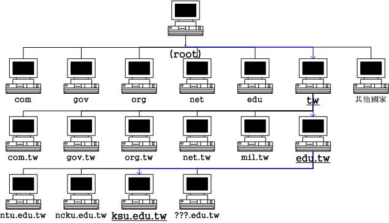
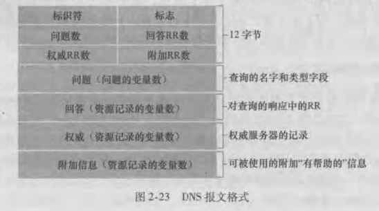
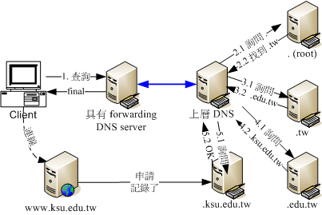
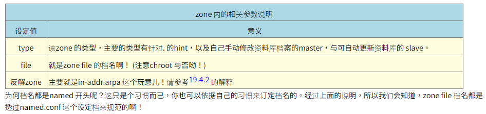

# dns

## 目录

<!-- vim-markdown-toc GFM -->

* [介绍](#介绍)
* [完整主机名称，Fully Qualified Domain Name（FQDN）](#完整主机名称fully-qualified-domain-namefqdn)
* [DNS架构](#dns架构)
    * [授权与分层负责](#授权与分层负责)
    * [通过DNS查询主机名称ip的流程](#通过dns查询主机名称ip的流程)
    * [分层的好处：](#分层的好处)
    * [dig +trance跟踪](#dig-trance跟踪)
    * [DNS使用的port number](#dns使用的port-number)
* [合法的DNS](#合法的dns)
    * [合法域名需要向上层领域注册取得合法的领域查询授权。注册需要花钱](#合法域名需要向上层领域注册取得合法的领域查询授权注册需要花钱)
    * [拥有领域查询权后，所有的主机名资讯都以自己为准，与上层无关](#拥有领域查询权后所有的主机名资讯都以自己为准与上层无关)
* [DNS服务器资料库的记录：正解，反解，zone的意义](#dns服务器资料库的记录正解反解zone的意义)
    * [正解](#正解)
    * [反解](#反解)
    * [每个DNS都需要的正解zone：hint](#每个dns都需要的正解zonehint)
* [DNS的master和slave架构](#dns的master和slave架构)
* [client端的设置](#client端的设置)
* [相关命令](#相关命令)
* [DNS报文](#dns报文)
    * [报文格式](#报文格式)
* [资源记录（resource record，RR）](#资源记录resource-recordrr)
* [在dns数据库中插入记录](#在dns数据库中插入记录)
* [关于dns安全](#关于dns安全)
* [dns故障排查](#dns故障排查)
    * [通过域名无法访问网站](#通过域名无法访问网站)
* [DNS服务器设置](#dns服务器设置)
    * [架设dns服务器所需的软件](#架设dns服务器所需的软件)
    * [bind配置文件设置与chroot](#bind配置文件设置与chroot)
    * [cache-only与forwarding dns服务器](#cache-only与forwarding-dns服务器)
        * [架设cache-only dns的场景](#架设cache-only-dns的场景)
        * [实际设置cache-only dns server](#实际设置cache-only-dns-server)
        * [特别说明：forwarders的好处与问题分析](#特别说明forwarders的好处与问题分析)
    * [DNS服务器的详细设置](#dns服务器的详细设置)
        * [正解记录的资料](#正解记录的资料)
            * [正解格式](#正解格式)
            * [SOA(Start Of Authority) ：查询管理领域名称的伺服器管理资讯](#soastart-of-authority-查询管理领域名称的伺服器管理资讯)
            * [CNAME ：设定某主机名称的别名(alias)](#cname-设定某主机名称的别名alias)
            * [MX ：查询某领域名称的邮件伺服器主机名称](#mx-查询某领域名称的邮件伺服器主机名称)
        * [反解记录](#反解记录)
        * [步骤一：DNS 的环境规划：正解、反解 zone 的预先定义案例说明](#步骤一dns-的环境规划正解反解-zone-的预先定义案例说明)
        * [步骤二：主设定档 /etc/named.conf 的设置](#步骤二主设定档-etcnamedconf-的设置)
        * [步骤三：最上层. (root) 资料库档案的设定](#步骤三最上层-root-资料库档案的设定)
        * [步骤四：正解资料库档案的设定 (todo)](#步骤四正解资料库档案的设定-todo)

<!-- vim-markdown-toc -->

## 介绍
由于IP地址不方便人类记忆，所以发明了DNS（Domain Name System）帮我们将主机名称解析为IP好让大家只要知道主机名称就能使用访问服务器。

早期网络未流行且电脑数量不多的时候，/etc/hosts还是够用，自从90年代网络热门化之后，就不够用了。伯克利大学发明了一套阶层式管理主机名对应IP的系统，叫做Berkeley Internet Name Domain, BIND，这是目前世界上使用最广泛的DNS系统。

DNS利用类似树状目录架构，将主机名称的管理分配在不同层级的DNS服务器中，经过这种分层管理，每一个DNS服务器的记忆的数据就不会横夺，而且如果IP异动时也相当容易修改，只需要在自己的DNS服务器中就能修改全世界都可以查到的主机名称，而不用透过上层ISP的维护。

## 完整主机名称，Fully Qualified Domain Name（FQDN）
第一个与DNS有关的主机名称概念，这就是主机名称和领域名称（hostname and domain name）的观念，以及由这两者组成的完整主机名称FQDN的意义。即使你的主机名称相同，但只要不是在同一个领域内，那么就可以被分辨出不同的位置。

## DNS架构
  
在整个DNS系统的最上方一定是.这个DNS服务器（称为root域名服务器），最早以前它底下管理的只有com、edu、gov、mail、org、net这种特殊领域以及以国家分类的第二层的主机名称，这两者称为Top Level Domains（TLDs）顶级域名服务器

### 授权与分层负责
每个上一层的DNS服务器所记录的数据，其实只有其下一层的主机名称而已，至于再下一层，则直接授权给下层的某部主机来管理。这样的好处就是：每部机器管理的只有下一层的hostname对应的ip，所以减少了管理上困扰，而且下层client端如果有问题，只需要询问上一层DNS server即可，不需要跨域上层，排错上也会比较简单。

### 通过DNS查询主机名称ip的流程
  
首先，当你在浏览器的网址输入`http://www.ksu.edu.tw`时，你的电脑就会依据相关设定（linux底下是利用/etc/resolv.conf这个文件）所提供的DNS的ip去进行连线查询了。以Hinet 168.95.1.1这个DNS为例：
```
1. 收到用户的查询要求，先查看本身有没有记录，如果没有则向.查询：
由于DNS 是阶层式的架构，每部主机都会管理自己辖下的主机名称解译而已。因为hinet 并没有管理台湾学术网路的权力， 因此就无法直接回报给用户端。此时168.95.1.1 就会向最顶层，也就是. (root) 的伺服器查询相关IP 资讯。

2. 向最顶层的.root查询：
168.95.1.1 会主动的向. 询问www.ksu.edu.tw 在哪里呢？但是由于. 只记录了.tw 的资讯(因为台湾只有.tw 向. 注册而已)，此时. 会告知『我是不知道这部主机的IP 啦，不过，你应该向.tw 去询问才对，我这里不管！我跟你说.tw 在哪里吧！ （如果本地dns服务器缓存了TLD服务器记录，就会跳过这一步直接向对应的TLD服务器进行请求）（返回NS记录和A记录，记录着.tw域名服务器的域名以及对应的ip地址）

3. 向第二层的.tw服务器查询：
168.95.1.1 接着又到.tw 去查询，而该部机器管理的又仅有.edu.tw, .com.tw, gov.tw... 那几部主机，经过比对后发现我们要的是.edu.tw 的网域，所以这个时候.tw 又告诉168.95.1.1 说：『你要去管理.edu.tw 这个网域的主机那里查询，我有他的IP ！ 』

4. 向第三层的.edu.tw服务器查询：
同理可证， .edu.tw 只会告诉168.95.1.1 ，应该要去.ksu.edu.tw 进行查询，这里只能告知.ksu.edu. tw 的IP 而已。

5. 向第四层的.ksu.edu.tw服务器查询：
等到168.95.1.1 找到.ksu.edu.tw 之后， Bingo ！ .ksu.edu.tw 说：『没错！这部主机名称是我管理的～ 我跟你说他的IP 是...所以此时168.95.1.1 就能够查到www.ksu.edu.tw 的IP 啰！

6. 记录到cache内存中并返回给用户浏览器：
查到了正确的IP 后，168.95.1.1 的DNS 机器总不会在下次有人查询www.ksu.edu.tw 的时候再跑一次这样的流程吧！粉远粉累的呐！而且也很耗系统的资源与网路的频宽，所以呢，168.95.1.1 这个DNS 会很聪明的先记录一份查询的结果在自己的暂存记忆体当中，以方便回应下一次的相同要求啊！最后则将结果回报给client 端！当然啦，那个记忆在cache 当中的资料，其实是有时间性的，当过了 DNS 设定记忆的时间(通常可能是24 小时)，那么该记录就会被释放喔！
```

### 分层的好处：
```
1. 主机名称修改的仅需自己的DNS 更动即可，不需通知其他人：

2. DNS 伺服器对主机名称解析结果的快取时间：
由于每次查询到的结果都会储存在DNS 伺服器的快取记忆体中，以方便若下次有相同需求的解析时，能够快速的回应。不过，查询结果已经被快取了，但是原始DNS 的主机名称与IP 对应却修改了，此时若有人再次查询， 系统可能会回报旧的IP 喔！所以，在快取内的答案是有时间性的！通常是数十分钟到三天之内。这也是为什么我们常说当你修改了一个domain name 之后，可能要2 ~ 3 天后才能全面的启用的缘故啦！

3. 可持续向下授权(子领域名称授权)：
每一部可以记录主机名称与IP 对应的DNS 伺服器都可以随意更动他自己的资料库对应， 因此主机名称与网域名称在各个主机底下都不相同。举例来说， idv.tw 是仅有台湾才有这个idv 的网域～ 因为这个idv 是由.tw 所管理的，所以只要台湾.tw 维护小组同意，就能够建立该网域喔！
```

### dig +trance跟踪
```
[root@www ~]# dig +trace www.ksu.edu.tw
; <<>> DiG 9.3.6-P1-RedHat-9.3.6-16.P1.el5 <<>>+trace www.ksu.edu.tw
;; global options: printcmd
. 486278 IN NS a.root-servers.net.
. 486278 IN NS b.root-servers.net.
....(底下省略)....
# 上面的部分在追踪. 的伺服器，可从a ~ m.root-servers.net.
;; Received 500 bytes from 168.95.1.1#53(168.95.1.1) in 22 ms

tw. 172800 IN NS ns.twnic.net.
tw. 172800 IN NS a.dns.tw.
tw. 172800 IN NS b.dns.tw.
....(底下省略)....
# 上面的部分在追踪.tw. 的伺服器，可从a ~ h.dns.tw. 包括ns.twnic.net.
;; Received 474 bytes from 192.33.4.12#53(c.root-servers.net) in 168 ms

edu.tw. 86400 IN NS a.twnic.net.tw.
edu.tw. 86400 IN NS b.twnic.net.tw.
# 追踪.edu.tw. 的则有7 部伺服器
;; Received 395 bytes from 192.83.166.11#53(ns.twnic.net) in 22 ms

ksu.edu.tw. 86400 IN NS dns2.ksu.edu.tw.
ksu.edu.tw. 86400 IN NS dns3.twaren.net.
ksu.edu.tw. 86400 IN NS dns1.ksu.edu.tw.
;; Received 131 bytes from 192.83.166.9#53(a.twnic.net.tw) in 22 ms

www.ksu.edu.tw. 3600 IN A 120.114.100.101
ksu.edu.tw. 3600 IN NS dns2.ksu.edu.tw.
ksu.edu.tw. 3600 IN NS dns1.ksu.edu.tw.
ksu.edu.tw. 3600 IN NS dns3.twaren.net.
;; Received 147 bytes from 120.114.150.1#53(dns2.ksu.edu.tw) in 14 ms
```

### DNS使用的port number
dns监听53端口，通常DNS 查询的时候，是以udp 这个较快速的资料传输协定来查询的， 但是万一没有办法查询到完整的资讯时，就会再次的以tcp 这个协定来重新查询的！所以启动DNS 的daemon (就是named 啦) 时，会同时启动tcp 及udp 的port 53 喔！所以，记得防火墙也要同时放行tcp, udp port 53呢！

## 合法的DNS

### 合法域名需要向上层领域注册取得合法的领域查询授权。注册需要花钱

领域查询权：我们的.ksu.edu.tw必须要向.edu.tw那部主机注册申请领域授权，因此，未来有任何.ksu.edu.tw的要求时，.edu.tw都会说我不知道，详情去找.ksu.edu.tw吧，此时我们要假设DNS服务器来设定.ksu.edu.tw相关的主机名称对应才行。

让我们归纳一下，要让你的主机名称对应IP 且让其他电脑都可以查询的到，你有两种方式：

上层DNS 授权领域查询权，让你自己设定DNS 伺服器，或者是；

直接请上层DNS 伺服器来帮你设定主机名称对应！

### 拥有领域查询权后，所有的主机名资讯都以自己为准，与上层无关
DNS系统记录的数据非常多，不过重点其实有两个，一个是记录服务器所在NS（nameserver）标志，另一个记录主机名对应的A（Address）标志，我们在网络上面查询到的最终结果，都是查询IP的，因此最终的标志要找的是A这个记录才对。

## DNS服务器资料库的记录：正解，反解，zone的意义
从前面的查询流程中可以看出，最重要的就是.ksu.edu.tw那部DNS服务器内的记录资料。这些记录我们可以统称为资料库，而在资料库里面针对每个要解析的领域（domain），就称为一个区域（zone）
```
从主机名称查询到IP 的流程称为：正解
从IP 反解析到主机名称的流程称为：反解
不管是正解还是反解，每个领域的记录就是一个区域(zone)
```

### 正解
正解zone通常由底下几种标志：
```
SOA：就是开始验证(Start of Authority) 的缩写，相关资料本章后续小节说明；
NS：就是名称伺服器(NameServer) 的缩写，后面记录的资料是DNS 伺服器的意思；
A：就是位址(Address) 的缩写，后面记录的是IP 的对应(最重要)；
```

### 反解
```
除了伺服器必备的NS 以及SOA 之外，最重要的就是：

PTR：就是指向(PoinTeR) 的缩写，后面记录的资料就是反解到主机名称啰！
```

### 每个DNS都需要的正解zone：hint
从DNS查询流程可以知道，当DNS服务器在自己的资料库里找不到所需的记录时，一定会去root去找，所以每个DNS服务器都会有root的zone，被称为hint类型。
```
hint (root)：记录. 的zone；
vbird.org：记录.vbird.org 这个正解的zone。
```

## DNS的master和slave架构
目的是实现DNS服务高可用，所以也要求master和slave的内容都是同步的，完全一致

master/slave的查询优先权问题？ 域名查询是哪台DNS服务器先返回结果就用哪台的结果

master/slave资料同步的过程：
```
slave是需要更新来自master的资料，所以在slave设定之初就需要存在master。基本上，不论是master还是slave的资料库，都会有一个代表该资料库新旧的序号，这个序号值的大小，是会影响是否需要更新的动作。更新的方式主要有两种：

master主动告知：例如在Master 在修改了资料库内容，并且加大资料库序号后， 重新启动DNS 服务，那master 会主动告知slave 来更新资料库，此时就能够达成资料同步；

由slave主动提出要求：基本上， Slave 会定时的向Master 察看资料库的序号， 当发现Master 资料库的序号比Slave 自己的序号还要大(代表比较新)，那么Slave 就会开始更新。如果序号不变， 那么就判断资料库没有更动，因此不会进行同步更新。

记录更新的频率与SOA的标志有关。
```

## client端的设置
查询DNS方式的优先级：
```
/etc/hosts ：这个是最早的hostname 对应IP 的档案；
/etc/resolv.conf ：这个重要！就是ISP 的DNS 伺服器IP 记录处；
/etc/nsswitch.conf：这个档案则是在『决定』先要使用/etc/hosts 还是/etc/resolv.conf 的设定！
```
一般而言Linux都以/etc/hosts为优先，/etc/nsswitch.conf文件记录了`hosts: files dns`，files就表示/etc/hosts，而dns则使用/etc/resolv.conf的DNS服务器来进行查找。

注意：
```
尽量不要设定超过3 部以上的DNS IP 在/etc/resolv.conf 中，因为如果是你的区网出问题，导致无法连线到DNS 伺服器，那么你的主机还是会向每部DNS 伺服器发出连线要求，每次连线都有timeout 时间的等待，会导致浪费非常多的时间喔！
```

## 相关命令
host  可以查到某个领域服务器所管理的所有主机名称对应的资料
```
host [-a] FQDN [server] 
host -l domain [server]
```

nslookup  提供交互式的dns查询
```
nslookup [FQDN] [server]
```

dig  详细专业的dns追踪信息（主流）
```
dig [options] FQDN [@server]
```

whois  查询某个DNS领域是谁负责管理的
```
whois [domainname]

[root@www ~]# whois centos.org
[Querying whois.publicinterestregistry.net]
[whois.publicinterestregistry.net]
# 这中间是一堆whois 伺服器提供的讯息告知！底下是实际注册的资料
Domain ID:D103409469-LROR
Domain Name:CENTOS.ORG
Created On:04-Dec-2003 12:28:30 UTC
Last Updated On:05-Dec-2010 01:23:25 UTC
Expiration Date:04-Dec-2011 12:28:30 UTC   <==记载了建立与与失效的日期
Sponsoring Registrar:Key-Systems GmbH (R51-LROR)
Status:CLIENT TRANSFER PROHIBITED
Registrant ID:P-8686062
Registrant Name:CentOS Domain Administrator
Registrant Organization:The CentOS Project
Registrant Street1:Mechelsesteenweg 170
# 底下则是一堆联络方式，鸟哥将它取消了，免得多占篇幅～
```

## DNS报文
dns只有查询和回答报文，查询和回答报文有着相同的格式

### 报文格式
  
1. 前12个字节是首部区域，其中有几个字段。第一个字符（标识符）是一个16比特的数，用于标识该查询。这个标识符会被复制到对查询的回答报文中，以便让客户用它来匹配发送的请求和接收到的回答。标志字段中含有若干标志，1比特的“查询/回答”标志位指出报文时查询报文（0）还是回答报文（1）。当某dns服务器时所请求名字的权威dns服务器时，1比特的“权威的”标志位被置在回答报文中。如果客户（主机或dns服务器）在该dns服务器没有某记录时希望它执行递归查询，将设置1比特的“希望递归”标志位。如果该dns服务器支持递归查询，在它的回答报文中会对1比特的“递归可用”标志位置位。在该首部中，还有四个有关数量的字段，这些字段指出了在首部后的4类数据区域出现的数量。

2. 问题区域包含着正在进行的查询信息。该区域包括：1.名字字段，指出正在被查询的主机名字；2.类型字段，它指出有关该名字的正被查询的问题类型，例如主机地址是与一个名字相关联（类型A）还是与某个名字的邮件服务器向关联（类型MX）

3. 在来自dns服务器的回答中，回答区域包含了对最初请求的名字的资源记录。前面讲过每个资源记录中有type（如A、NS、CNAME和MX）字段、value字段和TTL字段。在回答报文的回答区域中可以包含多条RR，因此一个主机名能够有多个ip地址

4. 权威区域包含了其它权威服务器的记录。

5. 附加区域包含了其它有帮助的记录。例如，对于一个MX请求的回答报文的回答区域包含了一条资源记录，该记录提供了邮件服务器的规范主机名。该附加区域包含一个类型A记录，该记录提供了用于该邮件服务器的规范主机名的IP地址。

## 资源记录（resource record，RR）
RR是一个包括了下列字段的4元组：（name，value，type，ttl）

ttl是该记录的生存时间，它决定了资源记录应当从缓存中删除的时间

如果一台dns服务器是用于某特定主机名的权威dns服务器，那么该dns服务器会有一条包含该主机名的类型A记录，如果服务器不是用于某主机名的权威服务器，那么该服务器将包含一条类型NS记录，该记录对应于包含主机名的域；它还将包括一条类型A记录，该记录提供了在NS记录的value字段中的dns服务器的ip地址。 

举例来说：假设一台edu TLD服务器不是主机gaia.cs.umass.edu的权威dns服务器，则该服务器将包含一条包括主机cs.umass.edu的域记录，如（umass.edu, dns.umass.edu, NS）；该edu TLD服务器还将包含一条类型A记录，如（dns.umass.edu, 128.119.40.111, A），该记录将名字dns.umass.edu映射为一个ip地址。

## 在dns数据库中插入记录
假定你刚刚创建了一个称为网络乌托邦（network utopia）的公司，首先在注册登记机构注册域名networkutopia.com。注册登记机构（registrar）是一个商业实体，它验证该域名的唯一性，将该域名输入dns数据库，对提供的服务器收取少量费用。1999年前，唯一的注册登记机构是network solution，它独家经营对于com、net、org域名的注册。但是现在有许多注册登记机构竞争客户，因特网名字和地址分配机构（internet corporation for assiged names and numbers，ICANN）向各种注册登记机构授权。在www.internic.net上可以找到授权的注册登记机构的列表。

当你向某些注册登记机构注册域名networkutopia.com时，需要向该机构提供你的基本和辅助权威dns服务器的名字和ip地址。假定该名字和ip地址是dns1.networkutopia.com和dns2.networkutopia.com及212.212.212.1和212.212.212.2，对这两个权威dns服务器的每一个，该注册登记机构确保将一个类型NS和一个类型A的记录输入TLD com服务器。（networkutopia.com,  dns1.networkutopia.com, NS） (dns1,networkutopia.com, 212.212.212.1, A)

你还必须确保用于web服务器www.networkutopia.com的类型A资源记录和用于邮件服务器mail.networkutopia.com的类型MX资源记录被输入你的权威dns服务器中。

一旦完成所有这些步骤，人们将能够访问你的web站点，并向你公司的雇员发送电子邮件。

## 关于dns安全
我们已经看到DNS是因特网基础设施的一个至关重要的组件，对于包括Web，电子邮件等的许多重要的服务，没有它都不能正常工作。因此，我们自然要问，DNS能够被怎样攻击呢?DNS是一个易受攻击的目标吗?它是将会被淘汰的服务吗?大多数因特网应用会随同它一起无法工作吗?

1. 对根服务器ddos攻击：想到的第一种针对DNS服务的攻击是分布式拒绝服务（DDoS）带宽洪泛攻击（参见1.6节)。例如，某攻击者能够试图向每个DNS根服务器发送大量的分组，使得大多数合法DNS请求得不到回答。这种对DNS根服务器的DDoS大规模攻击实际发生在2002年10月21日。在这次攻击中，该攻击者利用了一个僵尸网络向13个 DNS根服务器中的每个都发送了大批的ICMP ping报文。(第4章中讨论了ICMP报文。此时，知道ICMP分组是特殊类型的P数据报就可以了。)幸运的是，这种大规模攻击所带来的损害很小，对用户的因特网体验几乎没有或根本没有影响。攻击者的确成功地将大量的分组指向了根服务器，但许多DNS根服务器受到了分组过滤器的保护，配置的分组过滤器阻挡了所有指向根服务器的ICMP ping,报文。这些被保护的服务器因此未受伤害并且与平常一样发挥着作用。此外，大多数本地DNS服务器缓存了顶级域名服务器的IP地址,使得这些请求过程通常绕过了DNS根服务器。

2. 对顶级域服务器ddos攻击：对 DNS的潜在更为有效的DDoS攻击将是向顶级域名服务器（例如向所有处理.com域的顶级域名服务器）发送大量的 DNS请求。过滤指向 DNS服务器的 DNS请求将更为困难，并且顶级域名服务器不像根服务器那样容易绕过。但是这种攻击的严重性通过本地DNS服务器中的缓存技术可将部分地被缓解。

3. DNS劫持：DNS能够潜在地以其他方式被攻击。在中间人攻击中，攻击者截获来自主机的请求并返回伪造的回答。在DNS毒害攻击中，攻击者向一台DNS服务器发送伪造的回答,诱使服务器在它的缓存中接收伪造的记录。这些攻击中的任一种，都能够将满怀信任的Web用户重定向到攻击者的Web站点。然而，这些攻击难以实现，因为它们要求截获分组或扼制住服务器[Skoudis 2006]。

4. 对权威服务器ddos攻击：另一种重要的DNS攻击本质上并不是一种对 DNS服务的攻击，而是充分利用DNS基础设施来对目标主机发起DDoS攻击(例如，你所在大学的邮件服务器)。在这种攻击中，攻击者向许多权威 DNS服务器发送 DNS请求，每个请求具有目标主机的假冒源地址。这些DNS 服务器则直接向目标主机发送它们的回答。如果这些请求能够精心制作成下述方式的话，即响应比请求（字节数)大得多(所谓放大)，则攻击者不必自行产生大量的流量就有可能淹没目标主机。这种利用DNS的反射攻击至今为止只取得了有限的成功[Mirkovic 2005]。

总而言之，DNS自身已经显示了对抗攻击的令人惊讶的健壮性。至今为止，还没有一个攻击已经成功地妨碍了DNS服务。已经有了成功的反射攻击;然而，通过适当地配置 DNS服务器,能够处理(和正在处理)这些攻击。

## dns故障排查

### 通过域名无法访问网站
可能原因：
```
原因1：域名已过期

域名已经过期，域名的解析记录被暂停，导致无法正常访问网站。
原因2：域名被锁定

域名未完成实名认证被注册局或注册商锁定。
原因3：域名未备案

域名未备案成功。
原因4：备案未接入腾讯云

域名已经在其他服务商备案成功，现在使用腾讯云服务来托管网站，但未将备案接入腾讯云。
原因5：备案信息专项核查不合格

网站内容与备案信息不符、备案信息不准确、网站存在不适宜传播的内容等。
原因6：域名解析不生效

域名未添加解析记录或在新旧 DNS 服务商添加的解析记录不一致等。
原因7：管局备案信息还未同步到腾讯云

在腾讯云提交备案申请且备案申请刚通过管局审核，管局信息还未同步到腾讯云。
原因8：域名存在违法违规信息

域名存在违法违规信息被暂停了网站访问。
原因9：网站 Web 服务配置错误

网站 Web 服务配置错误或网站未正确启动。
```

解决思路：
```
1. 域名已经过期，域名的解析记录被暂停，导致无法正常访问网站

可在 域名信息查询（WHOIS） 中查询域名的到期日期，如域名仍在续费期或赎回期，请您及时对域名进行续费，具体操作请参见 域名续费。
域名续费成功后24 - 48小时内将会恢复域名解析。

2. 域名未完成实名认证被注册局或注册商锁定

可在 域名信息查询（WHOIS） 中查询域名状态，如域名显示 Serverhold 或 Clienthold 等状态，您需完成解锁后域名才能恢复访问。

3. 域名未备案成功

根据工信部要求，域名解析至中国内地（大陆）服务器必须先完成网站备案，才能正常开通网站访问。

4. 域名已经在其他服务商备案成功，现在使用腾讯云服务来托管网站，但未将备案接入腾讯云

您需将备案信息接入腾讯云，具体操作请参见 接入备案。

5. 网站内容与备案信息不符、备案信息不准确、网站存在不适宜传播的内容等

根据相关法律法规要求，腾讯云会对已经备案成功的信息进行全面核查，核查出有问题需在规定的时间内完成整改，具体请参见 备案专项核查。

6. 域名未添加解析记录或在新旧 DNS 服务商添加的解析记录不一致等

检查域名解析是否生效，具体请参见 解析生效相关。

7. 在腾讯云提交备案申请且备案申请刚通过管局审核，管局信息还未同步到腾讯云。

管局信息同步到腾讯云需要一定时间，待信息同步完成后即可正常访问网站。具体的信息同步时间无法确定，建议您在收到管局审核通过的通知后，等待一段时间再尝试访问网站。

8. 域名存在违法违规信息被暂停了网站访问

您需删除所有违法链接内的不合规信息，并通过腾讯云 在线客服 申请解除。

9. 网站 Web 服务配置错误或网站未正确启动

请检查您的网站配置或联系您的网站管理员进行处理。
```

## DNS服务器设置

### 架设dns服务器所需的软件
由伯克利大学发展出来的BIND（berkeley internet name domain），所需依赖有：
```
[root@www ~]# rpm -qa | grep '^bind' 
bind-libs-9.7.0-5.P2.el6_0.1.x86_64    <==给bind 与相关指令使用的函式库
bind-utils- 9.7.0-5.P2.el6_0.1.x86_64   <==这个是用户端搜寻主机名称的相关指令
bind-9.7.0-5.P2.el6_0.1.x86_64         <==就是bind 主程式所需软体
bind-chroot-9.7.0-5.P2.el6_0.1.x86_64 <==将bind 主程式关在家里面！，用于设置bind的根目录
```

### bind配置文件设置与chroot
主要需要设置的资料为：
```
BIND 本身的设定档：主要规范主机的设定、zone file 的所在、权限的设定等；
正反解资料库档案(zone file)：记录主机名称与IP 对应的等。

/etc/named.conf ：这就是我们的主设定档啦！
/etc/sysconfig/named ：是否启动chroot 及额外的参数，就由这个档案控制；
/var/named/ ：资料库档案预设放置在这个目录
/var/run/named ：named 这支程式执行时预设放置pid-file 在此目录内。
```

### cache-only与forwarding dns服务器
cache-only服务器只需要根的zone file，仅提供cache查询服务，它本身没有主机名与ip的正反解设定档，完全是由对外的查询来提供它的资料来源。

如果想连根的zone file都不设置，那么就得指定一个上层dns服务器，作为你的forwarding目标，将原本自己要往根查询的任务，丢给上层dns服务器去即可

在cache-only的dns服务器中，不论谁来查询资料，这部dns一律开始从自己的cache以及根zone file找起，整个流程与基本的dns解析流程相同。如果具有forwarding功能，那即使你的dns具有根这个zone file，这部dns还是会将查询权委托上层的dns查询，此时这部cache-only dns服务器就变成了用户端。查询流程如下：  
  

#### 架设cache-only dns的场景
在某些公司行号里头，为了预防员工利用公司的网路资源作自己的事情，所以都会针对Internet 的连线作比较严格的限制。当然啦，连port 53 这个DNS 会用到的port 也可能会被挡在防火墙之外的～这个时候， 你可以在『防火墙的那部机器上面，加装一个cache-only 的DNS 服务！』

这是什么意思呢？很简单啊！就是你自己利用自己的防火墙主机上的DNS 服务去帮你的Client 端解译 hostname <--> IP 啰！因为防火墙主机可以设定放行自己的DNS 功能，而Client 端就设定该防火墙IP 为 DNS 伺服器的IP 即可！哈哈！这样就可以取得主机名称与IP 的转译啦！所以，通常架设cache only DNS 伺服器大都是为了系统安全啰。

#### 实际设置cache-only dns server
因为不需要设置正反解zone，只需要根zone，所以只需要设置一个named.conf主配置文件即可，另外cache-only只需要加上个forwarders的设置就可以指定forwarding的资料

1. 编辑主要设置档：/etc/named.conf

在这个档案中，主要是定义跟伺服器环境有关的设定，以及各个zone 的领域及资料库所在档名。  
注解资料是放置在两条斜线『 // 』后面接的资料  
每个段落之后都需要以分号『 ; 』来做为结尾！  
```
[root@www ~]# cp /etc/named.conf /etc/named.conf.raw 
[root@www ~]# vim /etc/named.conf 
// 在预设的情况下，这个档案会去读取/etc/named.rfc1912.zones 这个领域定义档
// 所以请记得要修改成底下的样式啊！
options { 
        listen-on port 53 { any; };      //可不设定，代表全部接受
        directory "/var/named";  //资料库预设放置的目录所在
        dump-file "/var/named/data/cache_dump .db"; //一些统计资讯
        statistics-file "/var/named/data/named_stats.txt";
        memstatistics-file "/var/named/data/named_mem_stats.txt";
        allow-query { any; };      //可不设定，代表全部接受
        recursion yes;                    //将自己视为用户端的一种查询模式
        forward only;                     //可暂时不设定
        forwarders {                      //是重点！ 
                168.95.1.1;               //先用中华电信的DNS 当上层
                139.175.10.20;            //再用seednet 当上层
        }; 
};   //最终记得要结尾符号！
```
在named.conf 的结构中，与伺服器环境有关的是由 options这个项目内容设定的，因为options 里面还有很多子参数， 所以就以大括号{ } 包起来啰。至于options 内的子参数在上面提到的较重要的项目简单叙述如下：
```
listen-on port 53 { any; };
监听在这部主机系统上面的哪个网路介面。预设是监听在localhost，亦即只有本机可以对DNS 服务进行查询，那当然是很不合理啊！所以这里要将大括号内的资料改写成any。记得，因为可以监听多个介面，因此any 后面得要加上分号才算结束喔！另外，这个项目如果忘记写也没有关系，因为预设是对整个主机系统的所有介面进行监听的。

directory "/var/named";
意思是说，如果此档案底下有规范到正、反解的zone file 档名时，该档名预设应该放置在哪个目录底下的意思。预设放置到 /var/named/ 底下。由于chroot 的关系，最终这些资料库档案会被主动连结到 /var/named/chroot/var/named/这个目录。

dump-file, statistics-file, memstatistics-file
与named 这个服务有关的许多统计资讯，如果想要输出成为档案的话，预设的档名就如上所述。鸟哥自己很少看这些统计资料， 所以，这三个设定值写不写应该都是没有关系的。

allow-query { any; };
这个是针对用户端的设定，到底谁可以对我的DNS 服务提出查询请求的意思。原本的档案内容预设是针对localhost 开放而已， 我们这里改成对所有的用户开放(当然啦，防火墙也得放行才行)。不过，预设DNS 就是对所有用户放行，所以这个设定值也可以不用写。

forward only ;
这个设定可以让你的DNS 伺服器仅进行forward，即使有. 这个zone file 的设定，也不会使用. 的资料， 只会将查询权交给上层DNS 伺服器而已，是cache only DNS最常见的设定了！

forwarders { 168.95.1.1; 139.175.10.20; } ;
既然有forward only，那么到底要对哪部上层DNS 伺服器进行转递呢？那就是forwarders (不要忘记那个s) 设定值的重要性了！由于担心上层DNS 伺服器也可能会挂点，因此可以设定多部上层DNS 伺服器喔！每一个forwarder 伺服器的IP 都需要有『 ; 』来做为结尾！
```

2. 启动named并观察服务的端口
```
sudo systemctl start named
sudo systemctl status named

netstat -utlnp | grep named
不过，怎么会有 port 953 且仅针对本机来监听呢？其实那是named 的远端控制功能，称为远端名称解析服务控制功能 (remote name daemon control, rndc)。预设的情况下，仅有本机可以针对rndc 来控制。
```

3. 检查/var/log/messages的内容讯息

named 这个服务的记录档就直接给他放置在/var/log/messages 里面啦
```
[root@www ~]# tail -n 30 /var/log/messages | grep named 
Aug 4 14:57:09 www named[3140]: starting BIND 9.7.0-P2-RedHat-9.7.0-5.P2 .el6_0.1 -u named
 -t /var/named/chroot  <==说明的是chroot 在哪个目录下！
Aug 4 14:57:09 www named[3140]: adjusted limit on open files from 1024 to 1048576
Aug 4 14:57:09 www named[3140]: found 1 CPU, using 1 worker thread
Aug 4 14:57:09 www named[3140]: using up to 4096 sockets
Aug 4 14:57:09 www named[3140]: loading configuration from '/etc/named.conf'
Aug 4 14:57:09 www named[3140]: using default UDP/IPv4 port range: [1024, 65535]
Aug 4 14:57:09 www named[3140]: using default UDP/IPv6 port range: [1024, 65535]
Aug 4 14:57:09 www named[3140]: listening on IPv4 interface lo, 127.0.0.1#53
Aug 4 14:57:09 www named[3140]: listening on IPv4 interface eth0, 192.168.1.100#53
Aug 4 14:57:09 www named[3140]: listening on IPv4 interface eth1, 192.168.100.254#53
Aug 4 14:57:09 www named[3140]: generating session key for dynamic DNS
Aug 4 14:57:09 www named[3140]: command channel listening on 127.0.0.1#953
Aug 4 14:57:09 www named[3140]: command channel listening on ::1#953
Aug 4 14:57:09 www named[3140]: the working directory is not writable
Aug 4 14:57:09 www named[3140]: running
```
上面最重要的是第一行出现的『-t ...』那个项目指出你的chroot 目录啰。另外，上面表格中特殊字体的部分，有写到读取 /etc/named.conf，代表可以顺利的载入/var/named/etc/named.conf 的意思。如果上面有出现冒号后面接数字(:10)， 那就代表某个档案内的第十行有问题的意思，届时再进入处理即可。要注意的是，即使port 53 有启动，但有可能DNS 服务是错误的，此时这个登录档就显的非常重要！每次重新启动DNS 后，请务必查阅一下这个档案的内容！ ！

如果你在/var/log/messages 里面一直看到这样的错误资讯：
couldn't add command channel 127.0.0.1#953: not found
那表示你还必需要加入rndc key ，请参考本章后面的 利用RNDC 指令管理DNS 伺服器的介绍，将他加入你的named.conf 中！

4. 测试
如果你的DNS 伺服器具有连上网际网路的功能，那么透过『 dig www.google.com @127.0.0.1 』这个基本指令执行看看， 如果有找到google 的IP ，并且输出资料的最底下显示『 SERVER: 127.0.0.1#53(127.0.0.1) 』的字样， 那就代表应该是成功啦

#### 特别说明：forwarders的好处与问题分析
关于forwarder 的好处与坏处，其实有很多种的意见！大致的意见可分为这两派：

利用Forwarder 的功能来增进效能的理论：

这些朋友们认为，当很多的下层DNS 伺服器都使用forwarder 时，那么那个被设定为forwarder 的主机，由于会记录很多的查询资讯记录(请参考图19.1- 4的说明)，因此，对于那些下层的 DNS 伺服器而言，查询速度会增快很多，亦即会节省很多的查询时间！因为forwarder 伺服器里面有较多的快取记录了， 所以包括forwarder 本身，以及所有向这部forwarder 要求资料的DNS 伺服器，都能够减少往. 查询的机会， 因此速度当然增加。

利用Forwarder 反而会使整体的效能降低：

但是另外一派则持相反的见解！这是因为当主DNS 本身的『业务量』就很繁忙的时候，那么你的cache only DNS 伺服器还向他要求资料，因为他原本的资料传输量就太大了，频宽方面可能负荷不量，而太多的下层DNS 还向他要求资料，所以他的查询速度会变慢！因为查询速度变慢了，而你的 cache only server 又是向他提出要求的，所以自然两边的查询速度就会同步下降！

很多种说法啦！鸟哥本人也觉得很有趣哩！只是不知道哪一派较正确就是了，不过可以知道的是，如果上层的DNS 速度很快的话，那么他被设定为forwarder 时，或许真的可以增加不少效能哩！


### DNS服务器的详细设置
需要注意的几个点：
```
1. DNS 伺服器的架设需要上层DNS 的授权才可以成为合法的DNS 伺服器(否则只是练功)；
2. 设定档位置：目前bind 程式已进行chroot，相关目录可参考/etc/sysconfig/named；
3. named 主要设定档是/etc/named.conf；
4. 每个正、反解领域都需要一个资料库档案，而档名则是由/etc/named.conf 所设定；
5. 当DNS 查询时，若本身没有资料库档案，则前往root (.) 或forwarders 伺服器查询；
6. named 是否启动成功务必要查阅/var/log/messages 内的资讯！
```

#### 正解记录的资料

##### 正解格式
```
[domain] [ttl] IN [[RR type] [RR data]]
[待查资料] [暂存时间(秒)] IN [[资源类型] [资源内容]]

# 常见的正解档RR 相关资讯
[domain] IN [[RR type] [RR data]]
主机名称. IN A IPv4 的IP 位址
主机名称. IN AAAA IPv6 的IP 位址
领域名称. IN NS 管理这个领域名称的伺服器主机名字.
领域名称. IN SOA 管理这个领域名称的七个重要参数(容后说明)
领域名称. IN MX 顺序数字接收邮件的伺服器主机名字
主机别名. IN CNAME 实际代表这个主机别名的主机名字.
```

##### SOA(Start Of Authority) ：查询管理领域名称的伺服器管理资讯

如果你有多部DNS 伺服器管理同一个领域名称时，那么最好使用master/slave 的方式来进行管理。既然要这样管理， 那就得要宣告被管理的zone file 是如何进行传输的，此时就得要SOA (Start Of Authority) 的标志了。先来瞧瞧昆山科大的设定是怎样：
```
[root@www ~]# dig -t soa ksu.edu.tw
;; ANSWER SECTION:
ksu.edu.tw. 3600 IN SOA dns1.ksu.edu.tw. abuse.mail.ksu.edu.tw.
  2010080369 1800 900 604800 86400
# 上述的输出结果是同一行喔！

SOA 主要是与领域有关，所以前面当然要写ksu.edu.tw 这个领域名。而SOA 后面共会接七个参数，这七个参数的意义依序是：

1. Master DNS 伺服器主机名称：这个领域主要是哪部DNS 作为master 的意思。在本例中， dns1.ksu.edu.tw 为ksu.edu.tw 这个领域的主要DNS 伺服器啰；

2. 管理员的email：那么管理员的email 为何？发生问题可以联络这个管理员。要注意的是， 由于@ 在资料库档案中是有特别意义的，因此这里就将abuse@mail.ksu.edu.tw 改写成 abuse.mail.ksu.edu.tw ，这样看的懂了吗？

3. 序号(Serial)：这个序号代表的是这个资料库档案的新旧，序号越大代表越新。当slave 要判断是否主动下载新的资料库时，就以序号是否比slave 上的还要新来判断，若是则下载，若不是则不下载。 所以当你修订了资料库内容时，记得要将这个数值放大才行！ 为了方便使用者记忆，通常序号都会使用日期格式『YYYYMMDDNU』来记忆，例如昆山科大的2010080369 序号代表2010/08/03 当天的第69 次更新的感觉。不过，序号不可大于2 的32 次方，亦即必须小于4294967296 才行喔。

4. 更新频率(Refresh)：那么啥时slave 会去向master 要求资料更新的判断？就是这个数值定义的。昆山科大的DNS 设定每1800 秒进行一次slave 向master 要求资料更新。那每次slave 去更新时， 如果发现序号没有比较大，那就不会下载资料库档案。

5. 失败重新尝试时间(Retry)：如果因为某些因素，导致slave 无法对master 达成连线， 那么在多久的时间内，slave 会尝试重新连线到master。在昆山科大的设定中，900 秒会重新尝试一次。意思是说，每1800 秒slave 会主动向master 连线，但如果该次连线没有成功，那接下来尝试连线的时间会变成900 秒。若后来有成功，则又会恢复到 1800 秒才再一次连线。

6. 失效时间(Expire)：如果一直失败尝试时间，持续连线到达这个设定值时限， 那么slave 将不再继续尝试连线，并且尝试删除这份下载的zone file 资讯。昆山科大设定为604800 秒。意思是说，当连线一直失败，每900 秒尝试到达604800 秒后，昆山科大的slave 将不再更新，只能等待系统管理员的处理。

7. 快取时间(Minumum TTL)：如果这个资料库zone file 中，每笔RR 记录都没有写到 TTL 快取时间的话，那么就以这个SOA 的设定值为主。
除了Serial 不可以超过2 的32 次方之外，有没有其它的限制啊针对这几个数值？是有的，基本上就是这样：

Refresh >= Retry *2
Refresh + Retry < Expire
Expire >= Rrtry * 10
Expire >= 7Days

一般来说，如果DNS RR 资料变更情况频繁的，那么上述的相关数值可以订定的小一些，如果DNS RR 是很稳定的， 为了节省频宽，则可以将Refresh 设定的较大一些。
```

##### CNAME ：设定某主机名称的别名(alias)
真实名称记录（英语：Canonical Name Record），即CNAME记录，是域名系统（DNS）的一种记录。 CNAME记录用于将一个域名（同名）映射到另一个域名（真实名称），域名解析服务器遇到CNAME记录会以映射到的目标重新开始查询。

这个CNAME 有啥好处呢？用A 就好了吧？其实还是有好处的，举例来说，如果你有一个IP，这个IP 是给很多主机名称使用的。那么当你的IP 更改时，所有的资料就得通通更新A 标志才行。如果你只有一个主要主机名称设定A，而其他的标志使用CNAME 时，那么当IP 更改，那你只要修订一个A 的标志，其他的CNAME 就跟着变动了！处理起来比较容易啊！

##### MX ：查询某领域名称的邮件伺服器主机名称
MX 是Mail eXchanger (邮件交换) 的意思，通常你的整个领域会设定一个MX ，代表，所有寄给这个领域的email 应该要送到后头的email server 主机名上头才是。先看看昆大的资料：
```
[root@www ~]# dig -t mx ksu.edu.tw
;; ANSWER SECTION:
ksu.edu.tw. 3600 IN MX 8 mx01.ksu.edu.tw.

;; ADDITIONAL SECTION:
mx01.ksu.edu.tw.         3600 IN A 120.114.100.28
```
上头的意思是说，当有信件要送给ksu.edu.tw 这个领域时，则预先将信件传送给mx01.ksu.edu.tw 这部邮件伺服器管理， 当然啦，这部mx01.ksu .edu.tw 自然就是昆大自己管理的邮件伺服器才行！ MX 后面接的主机名称通常就是合法mail server， 而想要当MX 伺服器，就得要有A 的标志才行～所以上表后面就会出现mx01.ksu.edu.tw 的A 啊！

那么在mx01 之前的8 是什么意思？由于担心邮件会遗失，因此较大型的企业会有多部这样的上层邮件伺服器来预先收受信件。那么到底哪部邮件主机会先收下呢？就以数字较小的那部优先啰！举例来说，如果你去查google.com 的MX 标志， 就会发现他有5 部这样的伺服器呢！

#### 反解记录
讲完了正解来谈谈反解吧！在讲反解之前，先来谈谈正解主机名称的追踪方式。以www.ksu.edu.tw. 来说，整个网域的概念来看， 越右边出现的名称代表网域越大！举例来说，.(root) > tw > edu 以此类推。因此追踪时，是由大范围找到小范围， 最后，我们就知道追踪的方向如图19.1-4所示那样。

但是IP 则不一样啊！以昆大的120.114.100.101 来说好了，当然是120 > 114 > 100 > 101 ，左边的网域最大！与预设的DNS 从右边向左边查询不一样啊！那怎办？为了解决这个问题，所以反解的zone 就必须要将IP 反过来写，而在结尾时加上.in-addr.arpa. 的结尾字样即可。所以，当你想要追踪反解时，那么反解的结果就会是：
```
[root@www ~]# dig -x 120.114.100.101
;; ANSWER SECTION:
101.100.114.120.in-addr.arpa. 3600 IN PTR www.ksu.edu.tw.
```

#### 步骤一：DNS 的环境规划：正解、反解 zone 的预先定义案例说明
现在假设鸟哥的区网环境中想要设定DNS 伺服器，鸟哥的区网原本规划的网域名称就是centos.vbird，且搭配的IP 网段为192.168.100.0/24 这一段，因此主要的正解网域为centos.vbird，而反解的网域则为192.168.100.0/24， 鸟哥的这部DNS 伺服器想要自己找寻.(root) 而不透过forwarders 的辅助，因此还得要.的领域正解档。综合起来说，鸟哥需要设定到的档案就有这几个：

1. named.conf (主要设定档)
2. named.centos.vbird (主要的centos.vbird 的正解档)
3. named.192.168.100 (主要的192.168.100.0/24 的反解档)
4. named.ca (由bind 软体提供的. 正解档)

  
请特别留意啊，一个IP 可以对应给多个主机名称，同样的，一个主机名称可以给予多个IP 喔！主要是因为那部www.centos.vbird 的机器未来的用途相当的多，鸟哥希望那一部主机有多个名称，以方便未来额外的规划啊。所以就对该IP 对应了四个主机名称啊！

#### 步骤二：主设定档 /etc/named.conf 的设置
options：规范DNS 伺服器的使用权限(可否查询、forward 与否等)；
zone：设定出zone (domain name) 以及zone file 的所在(包含master/slave/hint)；
其他：设定DNS 本机管理介面以及其相关的金钥档案(key file)。 (本章稍后进阶应用再谈)

```
[root@www ~]# vim /etc/named.conf
options {
        directory "/var/named";
        dump-file "/var/named/data/cache_dump.db";
        statistics-file "/var/named/data/named_stats.txt";
        memstatistics-file "/var/named/data/named_mem_stats.txt";
        allow-query { any; };
        recursion yes;
        allow-transfer { none; };    // 不许别人进行zone 转移
};

zone "." IN {
        type hint;
        file "named.ca";
};
zone "centos.vbird" IN {             // 这个zone 的名称
        type master;                 // 是什么类型
        file "named.centos.vbird";   // 档案放在哪里
};
zone "100.168.192.in-addr.arpa" IN {
        type master;
        file "named.192.168.100";
};
```
在options 里面仅新增一个新的参数，就是allow-transfer，意义为：

allow-transfer ( none; };

是否允许来自slave DNS 对我的整个领域资料进行传送？这个设定值与master/slave DNS 伺服器之间的资料库传送有关。除非你有slave DNS 伺服器，否则这里不要开放喔！因此这里我们先设定为none。


至于在zone 里面的设定值，主要则有底下几个：  


#### 步骤三：最上层. (root) 资料库档案的设定
从图19.1-4可以知道. 的重要性！那么这个. 在哪里呢？事实上，它是由INTERNIC 互联网络信息中心（英语：Internet Network Information Center）所管理维护的，全世界共有13 部管理. 的DNS 伺服器呢！相关的最新设定在：

ftp://rs.internic.net/domain/named.root

要不要下载最新的资料随你便，因为我们的CentOS 6.x 内的bind 软体已经提供了一个名为named.ca 的档案了，鸟哥是直接使用系统提供的资料啦。这个档案的内容有点像这样：
```
[root@www ~]# vim /var/named/named.ca 
. <==这里有个小数点     518400 IN NS A.ROOT-SERVERS.NET.
A.ROOT-SERVERS.NET. 3600000 IN A 198.41.0.4
#上面这两行是成对的！代表点由A.ROOT-SERVERS.NET. 管理，并附上IP 查询
. <==这里有个小数点     518400 IN NS M.ROOT-SERVERS.NET.
M.ROOT-SERVERS.NET. 3600000 IN A 202.12.27.33
M.ROOT-SERVERS.NET. 3600000 IN AAAA 2001:dc3::35
#上面这三行是成对的，代表M 开头的伺服器有A 与AAAA 的记录
```
相关的正解标志NS, A, AAAA 意义，请回19.4.1去查询，这里不再解释。比较特殊的是，由于考虑IPv6 未来的流行性，因此很多部. 伺服器都加上AAAA 的IPv6 功能啰。这个档案的内容你不要修改啊～因为这个内容是Internet 上面通用的资料，一般来说，也不会常常变动， 所以不需要更动他，将他放置到正确的目录并改成你所指定的档名即可啊！接下来可以看看其他正解档案啦！

#### 步骤四：正解资料库档案的设定 (todo)
再来开始正解档的设定吧！正解档一定要有的RR 标志有底下几个喔：

关于本领域的基础设定方面：例如快取记忆时间(TTL)、领域名称(ORIGIN) 等；
关于master/slave 的认证方面(SOA)；
关于本领域的领域名称伺服器所在主机名称与IP 对应(NS, A)；
其他正反解相关的资源记录(A, MX, CNAME 等)。

