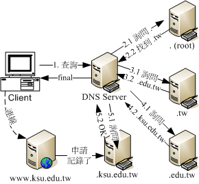

# dns

## 目录

<!-- vim-markdown-toc GFM -->

* [介绍](#介绍)
* [完整主机名称，Fully Qualified Domain Name（FQDN）](#完整主机名称fully-qualified-domain-namefqdn)
* [DNS架构](#dns架构)
    * [授权与分层负责](#授权与分层负责)
    * [通过DNS查询主机名称ip的流程](#通过dns查询主机名称ip的流程)
    * [分层的好处：](#分层的好处)
    * [dig +trance跟踪](#dig-trance跟踪)
    * [DNS使用的port number](#dns使用的port-number)
* [合法的DNS](#合法的dns)
    * [合法域名需要向上层领域注册取得合法的领域查询授权。注册需要花钱](#合法域名需要向上层领域注册取得合法的领域查询授权注册需要花钱)
    * [拥有领域查询权后，所有的主机名资讯都以自己为准，与上层无关](#拥有领域查询权后所有的主机名资讯都以自己为准与上层无关)
* [DNS服务器资料库的记录：正解，反解，zone的意义](#dns服务器资料库的记录正解反解zone的意义)
    * [正解](#正解)
    * [反解](#反解)
    * [每个DNS都需要的正解zone：hint](#每个dns都需要的正解zonehint)
* [DNS的master和slave架构](#dns的master和slave架构)
* [client端的设置](#client端的设置)
* [相关命令](#相关命令)
* [DNS服务器设置](#dns服务器设置)

<!-- vim-markdown-toc -->

## 介绍
由于IP地址不方便人类记忆，所以发明了DNS（Domain Name System）帮我们将主机名称解析为IP好让大家只要知道主机名称就能使用访问服务器。

早期网络未流行且电脑数量不多的时候，/etc/hosts还是够用，自从90年代网络热门化之后，就不够用了。伯克利大学发明了一套阶层式管理主机名对应IP的系统，叫做Berkeley Internet Name Domain, BIND，这是目前世界上使用最广泛的DNS系统。

DNS利用类似树状目录架构，将主机名称的管理分配在不同层级的DNS服务器中，经过这种分层管理，每一个DNS服务器的记忆的数据就不会横夺，而且如果IP异动时也相当容易修改，只需要在自己的DNS服务器中就能修改全世界都可以查到的主机名称，而不用透过上层ISP的维护。

## 完整主机名称，Fully Qualified Domain Name（FQDN）
第一个与DNS有关的主机名称概念，这就是主机名称和领域名称（hostname and domain name）的观念，以及由这两者组成的完整主机名称FQDN的意义。即使你的主机名称相同，但只要不是在同一个领域内，那么就可以被分辨出不同的位置。

## DNS架构
  
在整个DNS系统的最上方一定是.这个DNS服务器（称为root域名服务器），最早以前它底下管理的只有com、edu、gov、mail、org、net这种特殊领域以及以国家分类的第二层的主机名称，这两者称为Top Level Domains（TLDs）顶级域名服务器

### 授权与分层负责
每个上一层的DNS服务器所记录的数据，其实只有其下一层的主机名称而已，至于再下一层，则直接授权给下层的某部主机来管理。这样的好处就是：每部机器管理的只有下一层的hostname对应的ip，所以减少了管理上困扰，而且下层client端如果有问题，只需要询问上一层DNS server即可，不需要跨域上层，排错上也会比较简单。

### 通过DNS查询主机名称ip的流程
  
首先，当你在浏览器的网址输入http://www.ksu.edu.tw时，你的电脑就会依据相关设定（linux底下是利用/etc/resolv.conf这个文件）所提供的DNS的ip去进行连线查询了。以Hinet 168.95.1.1这个DNS为例：
```
1. 收到用户的查询要求，先查看本身有没有记录，如果没有则向.查询：
由于DNS 是阶层式的架构，每部主机都会管理自己辖下的主机名称解译而已。因为hinet 并没有管理台湾学术网路的权力， 因此就无法直接回报给用户端。此时168.95.1.1 就会向最顶层，也就是. (root) 的伺服器查询相关IP 资讯。

2. 向最顶层的.root查询：
168.95.1.1 会主动的向. 询问www.ksu.edu.tw 在哪里呢？但是由于. 只记录了.tw 的资讯(因为台湾只有.tw 向. 注册而已)，此时. 会告知『我是不知道这部主机的IP 啦，不过，你应该向.tw 去询问才对，我这里不管！我跟你说.tw 在哪里吧！ （返回NS记录，记录着.tw域名服务器的域名以及对应的ip地址）

3. 向第二层的.tw服务器查询：
168.95.1.1 接着又到.tw 去查询，而该部机器管理的又仅有.edu.tw, .com.tw, gov.tw... 那几部主机，经过比对后发现我们要的是.edu.tw 的网域，所以这个时候.tw 又告诉168.95.1.1 说：『你要去管理.edu.tw 这个网域的主机那里查询，我有他的IP ！ 』

4. 向第三层的.edu.tw服务器查询：
同理可证， .edu.tw 只会告诉168.95.1.1 ，应该要去.ksu.edu.tw 进行查询，这里只能告知.ksu.edu. tw 的IP 而已。

5. 向第四层的.ksu.edu.tw服务器查询：
等到168.95.1.1 找到.ksu.edu.tw 之后， Bingo ！ .ksu.edu.tw 说：『没错！这部主机名称是我管理的～ 我跟你说他的IP 是...所以此时168.95.1.1 就能够查到www.ksu.edu.tw 的IP 啰！

6. 记录到cache内存中并返回给用户浏览器：
查到了正确的IP 后，168.95.1.1 的DNS 机器总不会在下次有人查询www.ksu.edu.tw 的时候再跑一次这样的流程吧！粉远粉累的呐！而且也很耗系统的资源与网路的频宽，所以呢，168.95.1.1 这个DNS 会很聪明的先记录一份查询的结果在自己的暂存记忆体当中，以方便回应下一次的相同要求啊！最后则将结果回报给client 端！当然啦，那个记忆在cache 当中的资料，其实是有时间性的，当过了 DNS 设定记忆的时间(通常可能是24 小时)，那么该记录就会被释放喔！
```

### 分层的好处：
```
1. 主机名称修改的仅需自己的DNS 更动即可，不需通知其他人：

2. DNS 伺服器对主机名称解析结果的快取时间：
由于每次查询到的结果都会储存在DNS 伺服器的快取记忆体中，以方便若下次有相同需求的解析时，能够快速的回应。不过，查询结果已经被快取了，但是原始DNS 的主机名称与IP 对应却修改了，此时若有人再次查询， 系统可能会回报旧的IP 喔！所以，在快取内的答案是有时间性的！通常是数十分钟到三天之内。这也是为什么我们常说当你修改了一个domain name 之后，可能要2 ~ 3 天后才能全面的启用的缘故啦！

3. 可持续向下授权(子领域名称授权)：
每一部可以记录主机名称与IP 对应的DNS 伺服器都可以随意更动他自己的资料库对应， 因此主机名称与网域名称在各个主机底下都不相同。举例来说， idv.tw 是仅有台湾才有这个idv 的网域～ 因为这个idv 是由.tw 所管理的，所以只要台湾.tw 维护小组同意，就能够建立该网域喔！
```

### dig +trance跟踪
```
[root@www ~]# dig +trace www.ksu.edu.tw
; <<>> DiG 9.3.6-P1-RedHat-9.3.6-16.P1.el5 <<>>+trace www.ksu.edu.tw
;; global options: printcmd
. 486278 IN NS a.root-servers.net.
. 486278 IN NS b.root-servers.net.
....(底下省略)....
# 上面的部分在追踪. 的伺服器，可从a ~ m.root-servers.net.
;; Received 500 bytes from 168.95.1.1#53(168.95.1.1) in 22 ms

tw. 172800 IN NS ns.twnic.net.
tw. 172800 IN NS a.dns.tw.
tw. 172800 IN NS b.dns.tw.
....(底下省略)....
# 上面的部分在追踪.tw. 的伺服器，可从a ~ h.dns.tw. 包括ns.twnic.net.
;; Received 474 bytes from 192.33.4.12#53(c.root-servers.net) in 168 ms

edu.tw. 86400 IN NS a.twnic.net.tw.
edu.tw. 86400 IN NS b.twnic.net.tw.
# 追踪.edu.tw. 的则有7 部伺服器
;; Received 395 bytes from 192.83.166.11#53(ns.twnic.net) in 22 ms

ksu.edu.tw. 86400 IN NS dns2.ksu.edu.tw.
ksu.edu.tw. 86400 IN NS dns3.twaren.net.
ksu.edu.tw. 86400 IN NS dns1.ksu.edu.tw.
;; Received 131 bytes from 192.83.166.9#53(a.twnic.net.tw) in 22 ms

www.ksu.edu.tw. 3600 IN A 120.114.100.101
ksu.edu.tw. 3600 IN NS dns2.ksu.edu.tw.
ksu.edu.tw. 3600 IN NS dns1.ksu.edu.tw.
ksu.edu.tw. 3600 IN NS dns3.twaren.net.
;; Received 147 bytes from 120.114.150.1#53(dns2.ksu.edu.tw) in 14 ms
```

### DNS使用的port number
dns监听53端口，通常DNS 查询的时候，是以udp 这个较快速的资料传输协定来查询的， 但是万一没有办法查询到完整的资讯时，就会再次的以tcp 这个协定来重新查询的！所以启动DNS 的daemon (就是named 啦) 时，会同时启动tcp 及udp 的port 53 喔！所以，记得防火墙也要同时放行tcp, udp port 53呢！

## 合法的DNS

### 合法域名需要向上层领域注册取得合法的领域查询授权。注册需要花钱

领域查询权：我们的.ksu.edu.tw必须要向.edu.tw那部主机注册申请领域授权，因此，未来有任何.ksu.edu.tw的要求时，.edu.tw都会说我不知道，详情去找.ksu.edu.tw吧，此时我们要假设DNS服务器来设定.ksu.edu.tw相关的主机名称对应才行。

让我们归纳一下，要让你的主机名称对应IP 且让其他电脑都可以查询的到，你有两种方式：

上层DNS 授权领域查询权，让你自己设定DNS 伺服器，或者是；

直接请上层DNS 伺服器来帮你设定主机名称对应！

### 拥有领域查询权后，所有的主机名资讯都以自己为准，与上层无关
DNS系统记录的数据非常多，不过重点其实有两个，一个是记录服务器所在NS（nameserver）标志，另一个记录主机名对应的A（Address）标志，我们在网络上面查询到的最终结果，都是查询IP的，因此最终的标志要找的是A这个记录才对。

## DNS服务器资料库的记录：正解，反解，zone的意义
从前面的查询流程中可以看出，最重要的就是.ksu.edu.tw那部DNS服务器内的记录资料。这些记录我们可以统称为资料库，而在资料库里面针对每个要解析的领域（domain），就称为一个区域（zone）
```
从主机名称查询到IP 的流程称为：正解
从IP 反解析到主机名称的流程称为：反解
不管是正解还是反解，每个领域的记录就是一个区域(zone)
```

### 正解
正解zone通常由底下几种标志：
```
SOA：就是开始验证(Start of Authority) 的缩写，相关资料本章后续小节说明；
NS：就是名称伺服器(NameServer) 的缩写，后面记录的资料是DNS 伺服器的意思；
A：就是位址(Address) 的缩写，后面记录的是IP 的对应(最重要)；
```

### 反解
```
除了伺服器必备的NS 以及SOA 之外，最重要的就是：

PTR：就是指向(PoinTeR) 的缩写，后面记录的资料就是反解到主机名称啰！
```

### 每个DNS都需要的正解zone：hint
从DNS查询流程可以知道，当DNS服务器在自己的资料库里找不到所需的记录时，一定会去root去找，所以每个DNS服务器都会有root的zone，被称为hint类型。
```
hint (root)：记录. 的zone；
vbird.org：记录.vbird.org 这个正解的zone。
```

## DNS的master和slave架构
目的是实现DNS服务高可用，所以也要求master和slave的内容都是同步的，完全一致

master/slave的查询优先权问题？ 域名查询是哪台DNS服务器先返回结果就用哪台的结果

master/slave资料同步的过程：
```
slave是需要更新来自master的资料，所以在slave设定之初就需要存在master。基本上，不论是master还是slave的资料库，都会有一个代表该资料库新旧的序号，这个序号值的大小，是会影响是否需要更新的动作。更新的方式主要有两种：

master主动告知：例如在Master 在修改了资料库内容，并且加大资料库序号后， 重新启动DNS 服务，那master 会主动告知slave 来更新资料库，此时就能够达成资料同步；

由slave主动提出要求：基本上， Slave 会定时的向Master 察看资料库的序号， 当发现Master 资料库的序号比Slave 自己的序号还要大(代表比较新)，那么Slave 就会开始更新。如果序号不变， 那么就判断资料库没有更动，因此不会进行同步更新。

记录更新的频率与SOA的标志有关。
```

## client端的设置
查询DNS方式的优先级：
```
/etc/hosts ：这个是最早的hostname 对应IP 的档案；
/etc/resolv.conf ：这个重要！就是ISP 的DNS 伺服器IP 记录处；
/etc/nsswitch.conf：这个档案则是在『决定』先要使用/etc/hosts 还是/etc/resolv.conf 的设定！
```
一般而言Linux都以/etc/hosts为优先，/etc/nsswitch.conf文件记录了`hosts: files dns`，files就表示/etc/hosts，而dns则使用/etc/resolv.conf的DNS服务器来进行查找。

注意：
```
尽量不要设定超过3 部以上的DNS IP 在/etc/resolv.conf 中，因为如果是你的区网出问题，导致无法连线到DNS 伺服器，那么你的主机还是会向每部DNS 伺服器发出连线要求，每次连线都有timeout 时间的等待，会导致浪费非常多的时间喔！
```

## 相关命令
host  可以查到某个领域服务器所管理的所有主机名称对应的资料
```
host [-a] FQDN [server] 
host -l domain [server]
```

nslookup  提供交互式的dns查询
```
nslookup [FQDN] [server]
```

dig  详细专业的dns追踪信息（主流）
```
dig [options] FQDN [@server]
```

whois  查询某个DNS领域是谁负责管理的
```
whois [domainname]

[root@www ~]# whois centos.org
[Querying whois.publicinterestregistry.net]
[whois.publicinterestregistry.net]
# 这中间是一堆whois 伺服器提供的讯息告知！底下是实际注册的资料
Domain ID:D103409469-LROR
Domain Name:CENTOS.ORG
Created On:04-Dec-2003 12:28:30 UTC
Last Updated On:05-Dec-2010 01:23:25 UTC
Expiration Date:04-Dec-2011 12:28:30 UTC   <==记载了建立与与失效的日期
Sponsoring Registrar:Key-Systems GmbH (R51-LROR)
Status:CLIENT TRANSFER PROHIBITED
Registrant ID:P-8686062
Registrant Name:CentOS Domain Administrator
Registrant Organization:The CentOS Project
Registrant Street1:Mechelsesteenweg 170
# 底下则是一堆联络方式，鸟哥将它取消了，免得多占篇幅～
```

## DNS服务器设置
