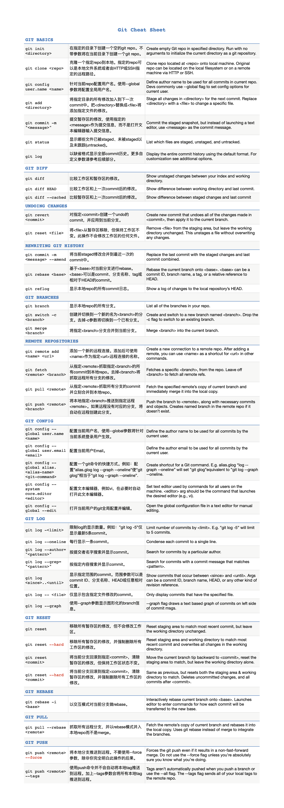

# git

## 目录
<!-- vim-markdown-toc GFM -->

* [实现原理](#实现原理)
* [github](#github)
* [常用命令](#常用命令)
    * [解决冲突：](#解决冲突)
    * [临时修复bug和cherry-pick](#临时修复bug和cherry-pick)
* [忽略特殊文件](#忽略特殊文件)

<!-- vim-markdown-toc -->

## 实现原理
目录结构
```
├── branches             不这么重要，暂不用管                    
├── config               git配置信息，包括用户名，email，remote repository的地址，本地branch和remote
|                        branch的follow关系
├── description          该git库的描述信息，如果使用了GitWeb的话，该描述信息将会被显示在该repo的页面上
├── HEAD                 工作目录当前状态对应的commit，一般来说是当前branch的head，HEAD也可以通过git checkout 命令被直接设置到一个特定的commit上，这种情况被称之为 detached HEAD      
├── hooks                钩子程序，可以被用于在执行git命令时自动执行一些特定操作，例如加入changeid
│   ├── applypatch-msg.sample
│   ├── commit-msg.sample
│   ├── post-update.sample
│   ├── pre-applypatch.sample
│   ├── pre-commit.sample
│   ├── prepare-commit-msg.sample
│   ├── pre-push.sample
│   ├── pre-rebase.sample
│   └── update.sample
├── info                不这么重要，暂不用管
│   └── exclude
├── objects             保存git对象的目录，包括三类对象commit,tag, tree和blob
│   ├── info
│   └── pack
└── refs                保存branch和tag对应的commit
    ├── heads           branch对应的commit
    └── tags            tag对应的commit
```
git中存储了三种类型对象，commit、tree、blob，分别对应git commit、commit中的目录、文件
```
HEAD---> refs/heads/master--> b767d7(commit)
                                    +
                                    |
                                    v
                                ca964f(tree)
                                    +
                                    |
                          +---------+----------+
                          |                    |
                          v                    v
                     065bca(blob)         824244(tree)
                          README              src
                                               +
                                               |
                                               v
                                          3b18e5(blob)
                                             file1.txt                                     
```
当执行git check -b work命令后，修改src/file1.txt文件并新增Makefile文件，提交commit “some change”后，git对象目录结构变成如下
```
                                          (parent)
HEAD--> refs/heads/work--> 4f7399(commit) +-------> b767d7(commit)<---refs/heads/master
                              +                             +
                              |                             |
                              v                             v
                         082b6d(tree)                   ca964f(tree)
                              +                             +
                              |                             |
               +-----------------------------+     +--------+-----------+
               |              |              |     |                    |
               v              v              v     v                    v
           9aeacd(tree)    8cc95f(blob)    065bca(blob)            824244(tree)
         src (version 2)    Makefile         README               src (version 1)
               +                                                        +
               |                                                        |
               v                                                        v
          79ee69(blob)                                             3b18e5(blob)
        file1.txt (version 2)                                    file1.txt (version 1)

```
从上图可以看到，Git会为每次commit时修改的目录/文件生成一个新的版本的tree/blob对象，如果文件没有修改，则会指向老版本的tree/blob对象。而branch则只是指向某一个commit的一个指针。即Git中整个工作目录的version是以commit对象的形式存在的，可以认为一个commit就是一个version，而不同version可以指向相同或者不同的tree和blob对象，对应到不同版本的子目录和文件。如果某一个子目录/文件在版本间没有变化，则不会为该子目录/文件生成新的tree/blob对象，不同version的commit对象会指向同一个tree/object对象。

Tag和branch类似，也是指向某个commit的指针。不同的是tag创建后其指向的commit不能变化，而branch创建后，其指针会在提交新的commit后向前移动。
```bash
$ git tag v1.0
$ cat .git/refs/tags/v1.0 .git/refs/heads/work
4f73993cf81931bc15375f0a23d82c40b3ae6789
4f73993cf81931bc15375f0a23d82c40b3ae6789
```
可以看到新创建的v1.0 tag和work branch都是指向了4f7399这个commit。

总结
```
Commit: Commit可以看作Git中一个Version的所有目录和文件的Snapshot，可以通过git checkout 查看任意一个commit中的内容。
Tree: 目录对象，内部包含目录和文件
Blob: 文件对象，对应一个文件
```

## github
查看仓库信息（大小kb）：https://api.github.com/repos/<user>/<repository>
github公开指纹信息，用来检查ssh时的指纹信息是否和github公开一致，网址：https://help.github.com/articles/what-are-github-s-ssh-key-fingerprints  
命名规范：字母+数字+连字符+下划线+句点+正斜杠，分支名字母开头  

## 常用命令
git reset --hard <commit_id>/HEAD 重置到某个版本，丢弃暂存的修改  
git reset HEAD <file> 把暂存区的修改撤销掉，重新放回工作区  
git reflog 输出参考日志，会记录每一次版本变更，以及commit_id  
git checkout 切换分支或者还原工作区的修改  
git rm --cached <file> 删除暂存区的文件，工作区不做改变
git rebase [<branch>] 基于某个分支重新应用commit，可以把本地未push的分叉提交历史整理成直线
git tag [<name>] [<commit_id>] 给某个commit id打标签  
git config --global alias.st status 设置status别名为st

### 解决冲突：
竞争行
1. 查看冲突文件
2. 修改冲突文件
3. add并且commit冲突文件

删除文件
1. 查看冲突文件
2. add 或者 rm 冲突文件
3. commit

### 临时修复bug和cherry-pick
当手头工作没有完成时，先把工作现场git stash一下，然后去修复bug，修复后，再git stash pop，回到工作现场；  
在master分支上修复的bug，想要合并到当前dev分支，可以用git cherry-pick <commit>命令，把bug提交的修改“复制”到当前分支，避免重复劳动。
git stash 储存当前分支的修改，后期可以再恢复
git stash list 列出已经stash的内容
git stash apply <stash@{0}> 选择恢复到指定的stash
git cherry-pick <commit_id> 把修复bug的哪次提交应用到当前分支

## 忽略特殊文件
在git工作区根目录下创建.gitignore文件，然后把要忽略的文件名一行一行填进去，git会自动忽略管理这些文件  
git add -f <filename> 强制添加被忽略的文件
git check-ignore -v <filename> 查看此文件对应的.gitignore规则

git-cheat-sheet.png

