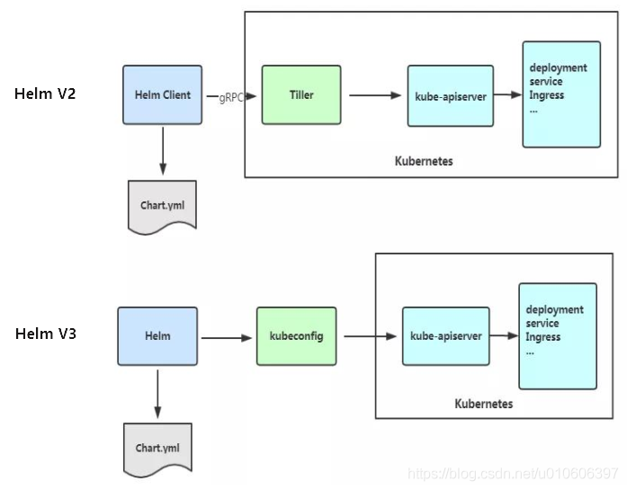

# helm

## 目录
<!-- vim-markdown-toc GFM -->

* [基本知识](#基本知识)
    * [helm安装资源顺序](#helm安装资源顺序)
    * [chart](#chart)
    * [helm2和helm3区别](#helm2和helm3区别)

<!-- vim-markdown-toc -->
## 基本知识
Helm 安装 charts 到 Kubernetes 集群中，每次安装都会创建一个新的 release。你可以在 Helm 的 chart repositories 中寻找新的 chart。

Chart：helm包，它包含在 Kubernetes 集群内部运行应用程序，工具或服务所需的所有资源定义

Repository（仓库）：是用来存放和共享 charts 的地方。它就像 Perl 的 CPAN 档案库网络 或是 Fedora 的 软件包仓库，只不过它是供 Kubernetes 包所使用的。

Release 是运行在 Kubernetes 集群中的 chart 的实例。一个 chart 通常可以在同一个集群中安装多次。每一次安装都会创建一个新的 release。

### helm安装资源顺序
Namespace
NetworkPolicy
ResourceQuota
LimitRange
PodSecurityPolicy
PodDisruptionBudget
ServiceAccount
Secret
SecretList
ConfigMap
StorageClass
PersistentVolume
PersistentVolumeClaim
CustomResourceDefinition
ClusterRole
ClusterRoleList
ClusterRoleBinding
ClusterRoleBindingList
Role
RoleList
RoleBinding
RoleBindingList
Service
DaemonSet
Pod
ReplicationController
ReplicaSet
Deployment
HorizontalPodAutoscaler
StatefulSet
Job
CronJob
Ingress
APIService

### chart
chart的标准目录结构：
```
wordpress/
  Chart.yaml          # 包含了chart信息的YAML文件
  LICENSE             # 可选: 包含chart许可证的纯文本文件
  README.md           # 可选: 可读的README文件
  values.yaml         # chart 默认的配置值
  values.schema.json  # 可选: 一个使用JSON结构的values.yaml文件
  charts/             # 包含chart依赖的其他chart
  crds/               # 自定义资源的定义
  templates/          # 模板目录， 当和values 结合时，可生成有效的Kubernetes manifest文件
  templates/NOTES.txt # 可选: 包含简要使用说明的纯文本文件
``` 

1. Chart.yaml文件
```yaml
apiVersion: chart API 版本 （必需）
name: chart名称 （必需）
version: 语义化2 版本（必需）
kubeVersion: 兼容Kubernetes版本的语义化版本（可选）
description: 一句话对这个项目的描述（可选）
type: chart类型 （可选）
keywords:
  - 关于项目的一组关键字（可选）
home: 项目home页面的URL （可选）
sources:
  - 项目源码的URL列表（可选）
dependencies: # chart 必要条件列表 （可选）
  - name: chart名称 (nginx)
    version: chart版本 ("1.2.3")
    repository: （可选）仓库URL ("https://example.com/charts") 或别名 ("@repo-name")
    condition: （可选） 解析为布尔值的yaml路径，用于启用/禁用chart (e.g. subchart1.enabled )
    tags: # （可选）
      - 用于一次启用/禁用 一组chart的tag
    import-values: # （可选）
      - ImportValue 保存源值到导入父键的映射。每项可以是字符串或者一对子/父列表项
    alias: （可选） chart中使用的别名。当你要多次添加相同的chart时会很有用
maintainers: # （可选）
  - name: 维护者名字 （每个维护者都需要）
    email: 维护者邮箱 （每个维护者可选）
    url: 维护者URL （每个维护者可选）
icon: 用做icon的SVG或PNG图片URL （可选）
appVersion: 包含的应用版本（可选）。不需要是语义化，建议使用引号
deprecated: 不被推荐的chart （可选，布尔值）
annotations:
  example: 按名称输入的批注列表 （可选）.
```
从 v3.3.2，不再允许额外的字段。推荐的方法是在 annotations 中添加自定义元数据。

2. CRD
Helm 3中,CRD被视为一种特殊的对象。它们被安装在chart的其他部分之前，并受到一些限制。

CRD YAML文件应被放置在chart的crds/目录中。 多个CRD(用YAML的开始和结束符分隔)可以被放置在同一个文件中。Helm会尝试加载CRD目录中 所有的 文件到Kubernetes。

CRD 文件 无法模板化，必须是普通的YAML文档。

当Helm安装新chart时，会上传CRD，暂停安装直到CRD可以被API服务使用，然后启动模板引擎， 渲染chart其他部分，并上传到Kubernetes。

限制：
```
CRD的限制
不像大部分的Kubernetes对象，CRD是全局安装的。因此Helm管理CRD时会采取非常谨慎的方式。 CRD受到以下限制：

CRD从不重新安装。 如果Helm确定crds/目录中的CRD已经存在（忽略版本），Helm不会安装或升级。
CRD从不会在升级或回滚时安装。Helm只会在安装时创建CRD。
CRD从不会被删除。自动删除CRD会删除集群中所有命名空间中的所有CRD内容。因此Helm不会删除CRD。
希望升级或删除CRD的操作员应该谨慎地手动执行此操作。
```

### helm2和helm3区别



特性    Helm 2  Helm 3
Tiller  必须部署    已移除
安全性  复杂，依赖 Tiller 的权限    更安全，基于 Kubernetes RBAC（kubeconfig）
Release 存储    存储在 Tiller 中    存储在 ConfigMap 或 Secret 中
CRD 管理    比较繁琐    更加灵活
K8s 版本支持    兼容旧版本 Kubernetes   Kubernetes 1.14+
