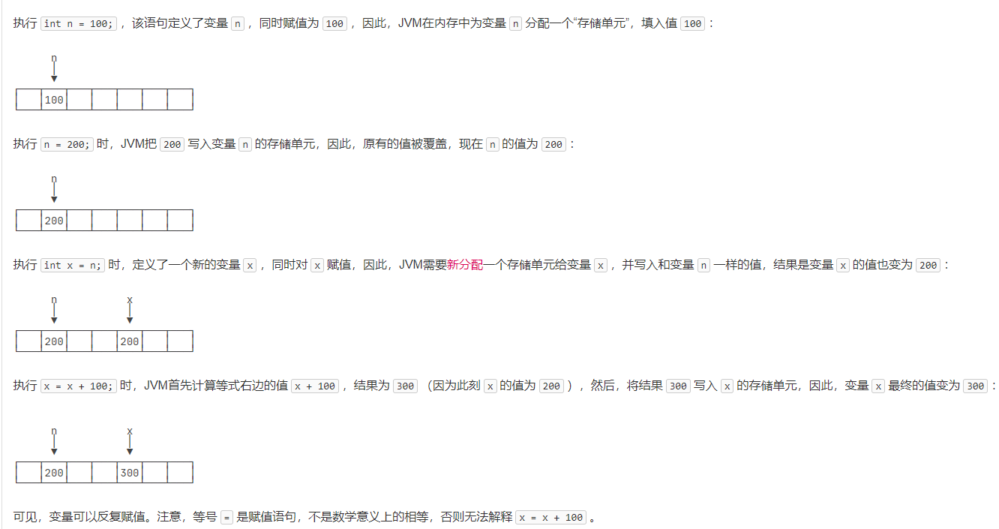
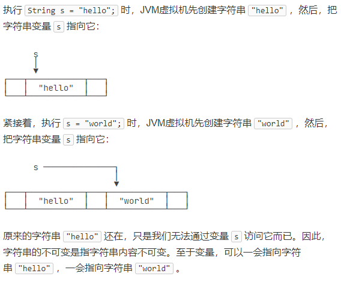
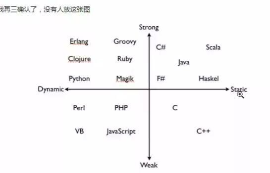
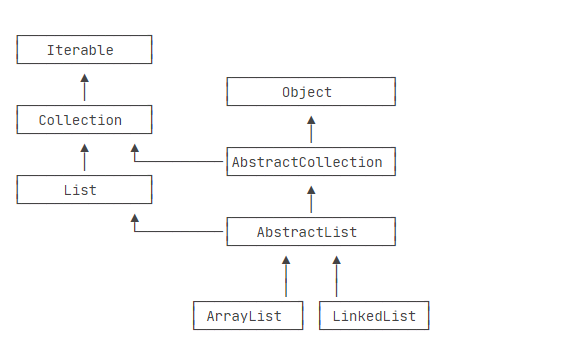
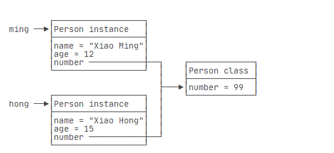

# java语法

## 目录
<!-- vim-markdown-toc GFM -->

* [简介](#简介)
    * [helloworld](#helloworld)
    * [安装](#安装)
* [基本概念](#基本概念)
* [命名](#命名)
* [注释](#注释)
* [变量和数据类型](#变量和数据类型)
    * [变量声明示例](#变量声明示例)
    * [基本数据类型](#基本数据类型)
    * [引用类型](#引用类型)
        * [字符串](#字符串)
        * [空值null](#空值null)
        * [数组](#数组)
            * [命令行参数](#命令行参数)
    * [var关键字](#var关键字)
    * [其他类型](#其他类型)
    * [强类型弱类型，动态语言静态语言](#强类型弱类型动态语言静态语言)
* [运算](#运算)
    * [算数运算符](#算数运算符)
    * [关系运算符](#关系运算符)
    * [逻辑运算符](#逻辑运算符)
    * [位运算](#位运算)
* [输入和输出](#输入和输出)
    * [输出](#输出)
        * [格式化输出](#格式化输出)
    * [输入](#输入)
* [if else](#if-else)
* [switch case](#switch-case)
* [循环](#循环)
    * [while](#while)
    * [do...while](#dowhile)
* [修饰符](#修饰符)
    * [访问修饰符](#访问修饰符)
    * [非访问修饰符](#非访问修饰符)
* [异常处理](#异常处理)
* [包](#包)
    * [包的作用域](#包的作用域)
    * [import](#import)
    * [java文件编译顺序](#java文件编译顺序)
    * [最佳实践](#最佳实践)
        * [编译和运行](#编译和运行)
* [面向对象编程](#面向对象编程)
    * [方法](#方法)
        * [this变量](#this变量)
        * [方法参数](#方法参数)
        * [可变参数](#可变参数)
        * [参数绑定](#参数绑定)
    * [构造方法](#构造方法)
        * [默认构造方法](#默认构造方法)
        * [多构造方法](#多构造方法)
    * [方法重载](#方法重载)
    * [继承](#继承)
        * [protected](#protected)
        * [super](#super)
        * [阻止继承](#阻止继承)
        * [向上转型](#向上转型)
        * [向下转型](#向下转型)
        * [instanceof操作符](#instanceof操作符)
        * [区分继承和组合](#区分继承和组合)
    * [多态Override](#多态override)
        * [方法签名](#方法签名)
        * [复写Object方法](#复写object方法)
        * [final](#final)

<!-- vim-markdown-toc -->

## 简介
Java 是由 Sun Microsystems 公司于 1995 年 5 月推出的高级程序设计语言。常用来开发android app。javac用来编译源码生成字节码，java用来运行字节码文件，解释型的强类型静态语言，语句用分号结束

从互联网到企业平台，Java是应用最广泛的编程语言，原因在于：

Java是基于JVM虚拟机的跨平台语言，一次编写，到处运行；

Java程序易于编写，而且有内置垃圾收集，不必考虑内存管理；

Java虚拟机拥有工业级的稳定性和高度优化的性能，且经过了长时期的考验；

Java拥有最广泛的开源社区支持，各种高质量组件随时可用。

Java语言常年霸占着三大市场：

互联网和企业应用，这是Java EE的长期优势和市场地位；

大数据平台，主要有Hadoop、Spark、Flink等，他们都是Java或Scala（一种运行于JVM的编程语言）开发的；

Android移动平台。

### helloworld
这段代码是一个非常简单的Java程序，它包含一个名为Hello的公共类和一个名为main的公共静态方法。让我详细解释一下每一部分的含义：

1. public class Hello { }：这是一个类的定义。关键字public表示这个类是公共的，可以被其他类访问。类名为Hello，它是一个标识符，遵循Java的命名规范（首字母大写的驼峰命名法）。大括号内是类的主体，这里为空，表示这个类没有任何属性或方法。

2. public static void main(String[] args) { }：这是一个名为main的公共静态方法。在Java程序中，main方法是程序的入口点，JVM会从这里开始执行程序。关键字public表示这个方法是公共的，可以被其他类访问；static表示这个方法是静态的，可以直接通过类名调用，而不需要实例化类；void表示这个方法没有返回值；main是方法的名称；String[] args是一个参数数组，它包含了从命令行传入的参数。

3. System.out.println("Hello, world!");：这是main方法中的唯一一条语句。它使用System.out.println方法在控制台打印一条消息，消息内容是"Hello, world!"。在Java中，System.out是一个PrintStream对象，它提供了各种输出方法，println方法用于打印一行字符串并换行。

所以，这段代码的作用是在控制台输出"Hello, world!"。当你执行这个Java程序时，JVM会调用main方法，并执行其中的代码，从而输出"Hello, world!"到控制台。

```java
// HelloWorld.java
public class HelloWorld {
    public static void main(String[] args) {
        System.out.println("Hello World");
    }
}

// 执行javac HelloWorld.java（或者javac -encoding UTF-8 HelloWorld.java ）
// 会在当前目录下生成HelloWorld.class文件
// 执行java HelloWorld，打印"Hello World"
```

### 安装
1. 从oracle官网下载稳定版jdk
2. 设置环境变量JAVA_HOME（指向jdk的安装目录）和PATH
3. 如果java -version输出的不是指定版本，说明系统存在多个jdk，需要把当前安装jdk版本路径放到PATH之前

jdk：
```
Java Development Kit（JDK）是Sun微系统针对Java开发人员发布的免费软件开发工具包（SDK，Software development kit）。自从Java推出以来，JDK已经成为使用最广泛的Java SDK。由于JDK的一部分特性采用商业许可证，而非开源[2]。因此，2006年Sun微系统宣布将发布基于GPL的开源JDK，使JDK成为自由软件。在去掉了少量闭源特性之后，Sun微系统最终促成了GPL的OpenJDK的发布。sun已经被oracle收购

作为Java语言的SDK，普通用户并不需要安装JDK来运行Java程序，而只需要安装JRE（Java Runtime Environment）。而程序开发者必须安装JDK来编译、调试程序。

JDK包含了一批用于Java开发的组件，其中包括：

javac：编译器，将后缀名为.java的源代码编译成后缀名为“.class”的字节码
java：运行工具，运行.class的字节码
jar：打包工具，将相关的类文件打包成一个文件（.jar），便于发布
javadoc：文档生成器，从源码注释中提取文档，注释需符合规范
jdb debugger：调试工具
jps：显示当前java程序运行的进程状态
javap：反编译程序
appletviewer：运行和调试applet程序的工具，不需要使用浏览器
javah：从Java类生成C头文件和C源文件。这些文件提供了连接胶合，使Java和C代码可进行交互。[3]
javaws：运行JNLP程序
extcheck：一个检测jar包冲突的工具
apt：注释处理工具[4]
jhat：java堆分析工具
jstack：栈跟踪程序
jstat：JVM检测统计工具
jstatd：jstat守护进程
jinfo：获取正在运行或崩溃的java程序配置信息
jmap：获取java进程内存映射信息
idlj：IDL-to-Java编译器。将IDL语言转化为java文件[5]
policytool：一个GUI的策略文件创建和管理工具
jrunscript：命令行脚本运行
JDK中还包括完整的JRE（Java Runtime Environment），Java运行环境，也被称为private runtime。包括了用于产品环境的各种库类，如基础类库rt.jar，以及给开发人员使用的补充库，如国际化与本地化的类库、IDL库等等。

JDK中还包括各种样例程序，用以展示Java API中的各部分。
```

jvm：
```
Java虚拟机（英语：Java Virtual Machine，缩写：JVM），一种能够执行Java字节码的虚拟机，以堆栈结构机器来实现。最早由Sun微系统所研发并实现第一个实现版本，是Java平台的一部分，能够执行以Java语言写作的软件程序。

Java虚拟机有自己完善的硬件架构，如处理器、堆栈、寄存器等，还具有相应的指令系统。JVM屏蔽了与具体操作系统平台相关的信息，使得Java程序只需生成在Java虚拟机上运行的目标代码（字节码），就可以在多种平台上不加修改地运行。通过对中央处理器（CPU）所执行的软件实现，实现能执行编译过的Java程序码（Applet与应用程序）。

作为一种编程语言的虚拟机，实际上不只是专用于Java语言，只要生成的编译文件符合JVM对加载编译文件格式要求，任何语言都可以由JVM编译运行。此外，除了甲骨文公司提供的Java虚拟机，也有其他开源或闭源的实现。
```

## 基本概念
一个 Java 程序可以认为是一系列对象的集合，而这些对象通过调用彼此的方法来协同工作。

* 对象：对象是类的一个实例，有状态和行为。例如，一条狗是一个对象，它的状态有：颜色、名字、品种；行为有：摇尾巴、叫、吃等。
* 类：类是一个模板，它描述一类对象的行为和状态。
* 方法：方法就是行为，一个类可以有很多方法。逻辑运算、数据修改以及所有动作都是在方法中完成的。
* 实例变量：每个对象都有独特的实例变量，对象的状态由这些实例变量的值决定。

基本格式解释：


## 命名
大小写敏感：Java 是大小写敏感的，这就意味着标识符 Hello 与 hello 是不同的。
* 类名：大驼峰，对于所有的类来说，类名的首字母应该大写。如果类名由若干单词组成，那么每个单词的首字母应该大写，例如 MyFirstJavaClass 。
* 变量和方法名：小驼峰，所有的方法名都应该以小写字母开头。如果方法名含有若干单词，则后面的每个单词首字母大写。
* 源文件名：源文件名必须和类名相同。当保存文件的时候，你应该使用类名作为文件名保存（切记 Java 是大小写敏感的），文件名的后缀为 .java。（如果文件名和类名不相同则会导致编译错误）。
* 主方法入口：所有的 Java 程序由 public static void main(String[] args) 方法开始执行。
* 包名：所有字母小写

## 注释
```java
/**
 * 可以用来自动创建文档的注释
 */
public class HelloWorld {
   /* 这是第一个Java程序
    * 它将输出 Hello World
    * 这是一个多行注释的示例
    */
    public static void main(String[] args){
       // 这是单行注释的示例
       /* 这个也是单行注释的示例 */
       System.out.println("Hello World"); 
    }
}
```

## 变量和数据类型 
java中变量分为两种：基本类型变量和引用类型变量  
java中变量需要先声明后使用，也需要被初始化 

### 变量声明示例
```java
int a, b, c;         // 声明三个int型整数：a、 b、c
int d = 3, e = 4, f = 5; // 声明三个整数并赋予初值
byte z = 22;         // 声明并初始化 z
String s = "runoob";  // 声明并初始化字符串 s
double pi = 3.14159; // 声明了双精度浮点型变量 pi
final double PI = 3.14; // PI是一个常量
char x = 'x';        // 声明变量 x 的值是字符 'x'。
double[] myList = new double[d]; // 声明数组，长度为ｄ
double[] myList = {1.9, 2.9, 3.4, 3.5};　// 声明数组并赋值
String[][] str = new String[3][4];  //　声明二维数组
```

### 基本数据类型
基本数据类型是CPU可以直接进行运算的类型。Java定义了以下几种基本数据类型：  
整数类型：byte，short，int，long  
浮点数类型：float，double  
字符类型：char  
布尔类型：boolean  

基础数据类型变量可以反复赋值。每次赋值都会新建或者覆盖之前的变量的内存空间  


### 引用类型
除了上述基本类型的变量，剩下的都是引用类型。例如，引用类型最常用的就是String字符串，引用类型的变量类似于C语言的指针，它内部存储一个“地址”，指向某个对象在内存的位置

#### 字符串
java中加号+用来连接任意字符串和其它数据类型，其它数据类型会自动转为字符串再连接  
从java13开始字符串可以用"""..."""来表示多行字符串
```java
public class Main {
    public static void main(String[] args) {
        String s = """
                   SELECT * FROM
                     users
                   WHERE id > 100
                   ORDER BY name DESC
                   """;
        System.out.println(s);
    }
}

// 多行字符串前面共同的空格会被去掉，总是以最短的行首空格为基准
String s = """
...........SELECT * FROM
...........  users
...........WHERE id > 100
...........ORDER BY name DESC
...........""";
```

字符串变量内容不可变，当对一个已经创建的字符串变量重新赋值时，会新开辟一个内存空间，并把这个字符串变量的指向改成这个新的内存空间，旧的内存空间依旧存在  

```java
public class Main {
    public static void main(String[] args) {
        String s = "hello";
        String t = s;
        s = "world";
        System.out.println(t); // t是"hello"还是"world"?
    }
}

// 输出 hello
```

#### 空值null
引用类型的变量可以指向一个空值null，它表示不存在，即该变量不指向任何对象。例如：
```java
String s1 = null; // s1是null
String s2 = s1; // s2也是null
String s3 = ""; // s3指向空字符串，不是null
```
注意要区分空值null和空字符串""，空字符串是一个有效的字符串对象，它不等于null。

#### 数组
数组所有元素初始化为默认值，整型都是0，浮点型是0.0，布尔型是false；  
数组一旦创建后，大小就不可改变。

##### 命令行参数
java程序的入口是main方法，而main方法可以接受一个命令行参数，它是一个String[]数组。这个命令行参数由JVM接收用户输入并传给main方法：
```java
public class Main {
    public static void main(String[] args) {
        for (String arg : args) {
            System.out.println(arg);
        }
    }
}
```

利用接收到的命令行参数，根据不同的参数执行不同的代码，-version参数，打印程序版本号：
```java
public class Main {
    public static void main(String[] args) {
        for (String arg : args) {
            if ("-version".equals(arg)) {
                System.out.println("v 1.0");
                break;
            }
        }
    }
}

// 必须在命令行执行
// java Main -version
// v 1.0
```

### var关键字
var关键字只能用于局部变量的声明，不能用于成员变量、方法参数、方法返回类型等其它地方
```
有些时候，类型的名字太长，写起来比较麻烦。例如:
StringBuilder sb = new StringBuilder();

这个时候，如果想省略变量类型，可以使用var关键字：
var sb = new StringBuilder();

编译器会根据赋值语句自动推断出变量sb的类型是StringBuilder。对编译器来说，语句：
var sb = new StringBuilder();

实际上会自动变成：
StringBuilder sb = new StringBuilder();

因此，使用var定义变量，仅仅是少写了变量类型而已。

var x = 10; // 编译器推断 x 的类型为 int
var str = "Hello"; // 编译器推断 str 的类型为 String
```

### 其他类型
```java
public class RunoobTest {
    // 成员变量
    private int instanceVar;
    // 静态变量
    private static int staticVar;
    
    public void method(int paramVar) {
        // 局部变量
        int localVar = 10;
        
        // 使用变量
        instanceVar = localVar;
        staticVar = paramVar;
        
        System.out.println("成员变量: " + instanceVar);
        System.out.println("静态变量: " + staticVar);
        System.out.println("参数变量: " + paramVar);
        System.out.println("局部变量: " + localVar);
    }
    
    // 入口
    public static void main(String[] args) {
        RunoobTest v = new RunoobTest();
        v.method(20);
    }
}
```

### 强类型弱类型，动态语言静态语言  


## 运算 
如果参与运算的两个数其中一个是整型，那么整型可以自动提升到浮点型

###  算数运算符
```java
public class Test {
 
  public static void main(String[] args) {
     int a = 10;
     int b = 20;
     int c = 25;
     int d = 25;
     System.out.println("a + b = " + (a + b) );
     System.out.println("a - b = " + (a - b) );
     System.out.println("a * b = " + (a * b) );
     System.out.println("b / a = " + (b / a) );
     System.out.println("b % a = " + (b % a) );
     System.out.println("c % a = " + (c % a) );
     System.out.println("a++   = " +  (a++) );
     System.out.println("a--   = " +  (a--) );
     // 查看  d++ 与 ++d 的不同
     System.out.println("d++   = " +  (d++) );
     System.out.println("++d   = " +  (++d) );
  }
}

/* 输出
a + b = 30
a - b = -10
a * b = 200
b / a = 2
b % a = 0
c % a = 5
a++   = 10
a--   = 11
d++   = 25
++d   = 27 
*/
```

### 关系运算符
```java
public class Test {
 
  public static void main(String[] args) {
     int a = 10;
     int b = 20;
     System.out.println("a == b = " + (a == b) );
     System.out.println("a != b = " + (a != b) );
     System.out.println("a > b = " + (a > b) );
     System.out.println("a < b = " + (a < b) );
     System.out.println("b >= a = " + (b >= a) );
     System.out.println("b <= a = " + (b <= a) );
  }
}

/* 输出
a == b = false
a != b = true
a > b = false
a < b = true
b >= a = true
b <= a = false
*/
```

### 逻辑运算符
```java
public class Test {
  public static void main(String[] args) {
     boolean a = true;
     boolean b = false;
     System.out.println("a && b = " + (a&&b));
     System.out.println("a || b = " + (a||b) );
     System.out.println("!(a && b) = " + !(a && b));
  }
}

/* 输出
a && b = false
a || b = true
!(a && b) = true
*/

// 三元运算符：int x = n >= 0 ? n : -n;
```

### 位运算
pass

## 输入和输出

### 输出
```java
public class Main {
    public static void main(String[] args) {
        System.out.print("A,");
        System.out.print("B,");
        System.out.print("C.");  // 输出不换行
        System.out.println();  // 输出并换行
        System.out.println("END");
    }
}
```

#### 格式化输出
格式化输出使用System.out.printf()
```java
public class Main {
    public static void main(String[] args) {
        double d = 3.1415926;
        System.out.printf("%.2f\n", d); // 显示两位小数3.14
        System.out.printf("%.4f\n", d); // 显示4位小数3.1416
    }
}

// 把一个整数格式化成十六进制，并用0补足8位
public class Main {
    public static void main(String[] args) {
        int n = 12345000;
        System.out.printf("n=%d, hex=%08x", n, n); // 注意，两个%占位符必须传入两个数
    }
}
```

### 输入
从控制台读取一个字符串和一个整数
```java
import java.util.Scanner;

public class Main {
    public static void main(String[] args) {
        Scanner scanner = new Scanner(System.in); // 创建Scanner对象
        System.out.print("Input your name: "); // 打印提示
        String name = scanner.nextLine(); // 读取一行输入并获取字符串
        System.out.print("Input your age: "); // 打印提示
        int age = scanner.nextInt(); // 读取一行输入并获取整数
        System.out.printf("Hi, %s, you are %d\n", name, age); // 格式化输出
    }
}
```


## if else 
在Java中，判断值类型的变量是否相等，可以使用==运算符。但是，判断引用类型的变量是否相等，==表示“引用是否相等”，或者说，是否指向同一个对象。例如，下面的两个String类型，它们的内容是相同的，但是，分别指向不同的对象，用==判断，结果为false, 要判断引用类型的变量内容是否相等，必须使用equals()方法
```java
// if
public class Test {
 
   public static void main(String args[]){
      int x = 10;
 
      if (x < 20) {
         System.out.print("这是 if 语句");
      }
   }
}

// if...else
public class Test {
 
   public static void main(String args[]){
      int x = 30;
 
      if (x < 20) {
         System.out.print("这是 if 语句");
      } else {
         System.out.print("这是 else 语句");
      }
   }
}

//if...else if...else
public class Test {
   public static void main(String args[]){
      int x = 30;
 
      if (x == 10) {
         System.out.print("Value of X is 10");
      } else if (x == 20) {
         System.out.print("Value of X is 20");
      } else if (x == 30) {
         System.out.print("Value of X is 30");
      } else {
         System.out.print("这是 else 语句");
      }
   }
}

// 嵌套if...else
public class Test {
 
   public static void main(String args[]){
      int x = 30;
      int y = 10;
 
      if (x == 30) {
         if (y == 10) {
             System.out.print("X = 30 and Y = 10");
          }
       }
    }
}
```

## switch case
switch语句中的变量可以是：byte、short、int 或者 char
```java
public class Test {
   public static void main(String args[]) {
      //char grade = args[0].charAt(0);
      char grade = 'C';
 
      switch (grade) {
         case 'A':
            System.out.println("优秀"); 
            break;
         case 'B':
         case 'C': 
            System.out.println("良好");
            break;
         case 'D':
            System.out.println("及格");
            break;
         case 'F':
            System.out.println("你需要再努力努力");
            break;
         default:
            System.out.println("未知等级");
      }
      System.out.println("你的等级是 " + grade);
   }
}

/* 输出
良好
你的等级是 C
*/
```

## 循环

### while
```java
public class Test {
   public static void main(String[] args) {
      int x = 10;
      while(x < 20) {
         System.out.print("value of x : " + x );
         x++;
         System.out.print("\n");
      }
   }
}
```
### do...while
```java
public class Test {
   public static void main(String[] args){
      int x = 10;
 
      do {
         System.out.print("value of x : " + x );
         x++;
         System.out.print("\n");
      } while(x < 20);
   }
}
```
3. for
```java
public class Test {
   public static void main(String[] args) {
 
      for (int x=10; x<20; x=x+1) {
         System.out.print("value of x : " + x );
         System.out.print("\n");
      }
   }
}
/* 输出
value of x : 10
value of x : 11
value of x : 12
value of x : 13
value of x : 14
value of x : 15
value of x : 16
value of x : 17
value of x : 18
value of x : 19
*/

// 或 for each
public class Test {
   public static void main(String[] args) {
      int [] numbers = {10, 20, 30, 40, 50};
 
      for (int x : numbers) {
         System.out.print( x );
         System.out.print(",");
      }
      System.out.print("\n");
      String [] names ={"James", "Larry", "Tom", "Lacy"};
      for (String name : names) {
         System.out.print( name );
         System.out.print(",");
      }
   }
}
/*　输出
10,20,30,40,50,
James,Larry,Tom,Lacy,
*/
```

## 修饰符
分为访问修饰符和非访问修饰符，修饰符用来定义类、方法或者变量，通常放在语句的最前端

### 访问修饰符
   * default (即默认，什么也不写）: 在同一包内可见，不使用任何修饰符。使用对象：类、接口、变量、方法。
   * private : 在同一类内可见。使用对象：变量、方法。 注意：不能修饰类（外部类）
   * public : 对所有类可见。使用对象：类、接口、变量、方法
   * protected : 对同一包内的类和所有子类可见。使用对象：变量、方法。 注意：不能修饰类（外部类）。
### 非访问修饰符
   * static 共享修饰符，表示静态的，用于修饰方法、变量，表示方法或变量属于类而不是实例。
        ```java
        public class InstanceCounter {
            private static int numInstances = 0;
            protected static int getCount() {
            return numInstances;
        }

        private static void addInstance() {
            numInstances++;
        }

        InstanceCounter() {
            InstanceCounter.addInstance();
        }

        public static void main(String[] arguments) {
            System.out.println("Starting with " +
            InstanceCounter.getCount() + " instances");
            for (int i = 0; i < 500; ++i){
                new InstanceCounter();
                }
            System.out.println("Created " +
            InstanceCounter.getCount() + " instances");
        }
        }
        ```
   * final 常量修饰符，用来修饰类、方法和变量，final 修饰的类不能够被继承，修饰的方法不能被继承类重新定义，修饰的变量为常量，是不可修改的。
   * abstract 修饰符，用来创建抽象类和抽象方法。
   * synchronized 和 volatile 修饰符，主要用于线程的编程。

## 异常处理
1. 异常捕获try/catch
```java
// 文件名 : ExcepTest.java
import java.io.*;
public class ExcepTest {
 
   public static void main(String args[]) {
      try {
         int a[] = new int[2];
         System.out.println("Access element three :" + a[3]);
      } catch(ArrayIndexOutOfBoundsException e) {
         System.out.println("Exception thrown  :" + e);
      }
      System.out.println("Out of the block");
   }
}

/* 输出：
Exception thrown  :java.lang.ArrayIndexOutOfBoundsException: 3
Out of the block
*/
```
2. 异常抛出
```java
public void checkNumber(int num) {
  if (num < 0) {
    throw new IllegalArgumentException("Number must be positive");
  }
}
```

3. finally，无论是否发生异常，finally 代码块中的代码总会被执行
```java
public class ExcepTest {
  public static void main(String args[]) {
    int a[] = new int[2];
    try {
       System.out.println("Access element three :" + a[3]);
    } catch(ArrayIndexOutOfBoundsException e) {
       System.out.println("Exception thrown  :" + e);
    }
    finally {
       a[0] = 6;
       System.out.println("First element value: " +a[0]);
       System.out.println("The finally statement is executed");
    }
  }
}

/* 输出
Exception thrown  :java.lang.ArrayIndexOutOfBoundsException: 3
First element value: 6
The finally statement is executed
*/
```

## 包
在java中，使用package来解决名字冲突，Java定义了一种名字空间，称之为包：package。一个类总是属于某个包，类名（比如Person）只是一个简写，真正的完整类名是包名.类名

在Java虚拟机执行的时候，JVM只看完整类名，因此，只要包名不同，类就不同

要特别注意：包没有父子关系。java.util和java.util.zip是不同的包，两者没有任何继承关系。

在定义class的时候，我们需要在第一行声明这个class属于哪个包
```java
// Person.java文件
package ming; // 申明包名ming

public class Person {
}

// Arrays.jva文件
package mr.jun; // 申明包名mr.jun

public class Arrays {
}
```

没有定义包名的class，它使用的是默认包，非常容易引起名字冲突，因此，不推荐不写包名的做法。

我们还需要按照包结构把上面的Java文件组织起来。假设以package_sample作为根目录，src作为源码目录，那么所有文件结构就是：
```
package_sample
└─ src
    ├─ hong
    │  └─ Person.java
    │  ming
    │  └─ Person.java
    └─ mr
       └─ jun
          └─ Arrays.java
```

即所有Java文件对应的目录层次要和包的层次一致。

编译后的.class文件也需要按照包结构存放。如果使用IDE，把编译后的.class文件放到bin目录下，那么，编译的文件结构就是：
```
package_sample
└─ bin
   ├─ hong
   │  └─ Person.class
   │  ming
   │  └─ Person.class
   └─ mr
      └─ jun
         └─ Arrays.class
```

### 包的作用域
位于同一个包的类，可以访问包作用域的字段和方法。不用public、protected、private修饰的字段和方法就是包作用域。例如，Person类定义在hello包下面：
```java
package hello;

public class Person {
    // 包作用域:
    void hello() {
        System.out.println("Hello!");
    }
}
```
Main类也定义在hello包下面：
```java
package hello;

public class Main {
    public static void main(String[] args) {
        Person p = new Person();
        p.hello(); // 可以调用，因为Main和Person在同一个包
    }
}
```

### import
在一个class中，我们总会引用其他的class。例如，小明的ming.Person类，如果要引用小军的mr.jun.Arrays类，他有三种写法：

1. 直接写出完整类名
```java
// Person.java
package ming;

public class Person {
    public void run() {
        mr.jun.Arrays arrays = new mr.jun.Arrays();
    }
}
```

2. 使用import语句，导入Arrays，然后写简单类名
```java
// Person.java
package ming;

// 导入完整类名:
import mr.jun.Arrays;

public class Person {
    public void run() {
        Arrays arrays = new Arrays();
    }
}
```

3. import static
```java
package main;

// 导入System类的所有静态字段和静态方法:
import static java.lang.System.*;

public class Main {
    public static void main(String[] args) {
        // 相当于调用System.out.println(…)
        out.println("Hello, world!");
    }
}
```

### java文件编译顺序
java编译器最终编译出.class文件只使用完整类名，因此在代码中，当编译器遇到一个class名称时：

如果是完整类名，就直接根据完整类名查找这个class；

如果是简单类名，按下面的顺序依次查找：

查找当前package是否存在这个class；

查找import的包是否包含这个class；

查找java.lang包是否包含这个class。

如果按照上面的规则还无法确定类名，则编译报错。

如果有两个class名称相同，例如，mr.jun.Arrays和java.util.Arrays，那么只能import其中一个，另一个必须写完整类名。

示例：
```java
// Main.java
package test;

import java.text.Format;

public class Main {
    public static void main(String[] args) {
        java.util.List list; // ok，使用完整类名 -> java.util.List
        Format format = null; // ok，使用import的类 -> java.text.Format
        String s = "hi"; // ok，使用java.lang包的String -> java.lang.String
        System.out.println(s); // ok，使用java.lang包的System -> java.lang.System
        MessageFormat mf = null; // 编译错误：无法找到MessageFormat: MessageFormat cannot be resolved to a type
    }
}

// 在编译class的时候，编译器会自动帮我们做两个import动作：

// 默认自动import当前package的其他class；
// 默认自动import java.lang.*。

//  注意：自动导入的是java.lang包，但类似java.lang.reflect这些包仍需要手动导入。
```

### 最佳实践
为了避免名字冲突，我们需要确定唯一的包名。推荐的做法是使用倒置的域名来确保唯一性。例如：
```
org.apache
org.apache.commons.log
com.liaoxuefeng.sample
```
子包就可以根据功能自行命名。

要注意不要和java.lang包的类重名，即自己的类不要使用这些名字：
```
String
System
Runtime
...
```
要注意也不要和JDK常用类重名：
```
java.util.List
java.text.Format
java.math.BigInteger
...
```

#### 编译和运行
假设我们创建了如下的目录结构：
```
work
├── bin
└── src
    └── com
        └── itranswarp
            ├── sample
            │   └── Main.java
            └── world
                └── Person.java
```
其中，bin目录用于存放编译后的class文件，src目录按包结构存放Java源码，我们怎么一次性编译这些Java源码呢？

首先，确保当前目录是work目录，即存放src和bin的父目录：
```
$ ls 
bin src
```

然后，编译src目录下的所有Java文件：
```
$ javac -d ./bin src/**/*.java

命令行-d指定输出的class文件存放bin目录，后面的参数src/**/*.java表示src目录下的所有.java文件，包括任意深度的子目录。
```

如果编译无误，则javac命令没有任何输出。可以在bin目录下看到如下class文件：
```
bin
└── com
    └── itranswarp
        ├── sample
        │   └── Main.class
        └── world
            └── Person.class
```

现在，我们就可以直接运行class文件了。根据当前目录的位置确定classpath，例如，当前目录仍为work，则classpath为bin或者./bin：
```
-cp 等于 -classpath
$ java -cp bin com.itranswarp.sample.Main  
Hello, world!
```

## 面向对象编程

### 方法
语法：
```
修饰符 方法返回类型 方法名(方法参数列表) {
    若干方法语句;
    return 方法返回值;
}
```
方法返回值通过return语句实现，如果没有返回值，返回类型设置为void，可以省略return

#### this变量
在方法内部，可以使用一个隐含的变量this，它始终指向当前实例。因此，通过this.field就可以访问当前实例的字段。

如果没有命名冲突，可以省略this。例如：
```java
class Person {
    private String name;

    public String getName() {
        return name; // 相当于this.name
    }
}
```

但是，如果有局部变量和字段重名，那么局部变量优先级更高，就必须加上this：
```java
class Person {
    private String name;

    public void setName(String name) {
        this.name = name; // 前面的this不可少，少了就变成局部变量name了
    }
}
```

#### 方法参数
方法可以包含0个或任意个参数。方法参数用于接收传递给方法的变量值。调用方法时，必须严格按照参数的定义一一传递。例如：
```java
class Person {
    ...
    public void setNameAndAge(String name, int age) {
        ...
    }
}
```
调用这个setNameAndAge()方法时，必须有两个参数，且第一个参数必须为String，第二个参数必须为int：

Person ming = new Person();
ming.setNameAndAge("Xiao Ming"); // 编译错误：参数个数不对
ming.setNameAndAge(12, "Xiao Ming"); // 编译错误：参数类型不对

#### 可变参数
可变参数用类型...定义，可变参数相当于数组类型：
```java
class Group {
    private String[] names;

    public void setNames(String... names) {
        this.names = names;
    }
}
```
上面的setNames()就定义了一个可变参数。调用时，可以这么写：
```
Group g = new Group();
g.setNames("Xiao Ming", "Xiao Hong", "Xiao Jun"); // 传入3个String
g.setNames("Xiao Ming", "Xiao Hong"); // 传入2个String
g.setNames("Xiao Ming"); // 传入1个String
g.setNames(); // 传入0个String
```

完全可以把可变参数改写为String[]类型：
```
class Group {
    private String[] names;

    public void setNames(String[] names) {
        this.names = names;
    }
}
```
但是，调用方需要自己先构造String[]，比较麻烦。例如：
```
Group g = new Group();  
g.setNames(new String[] {"Xiao Ming", "Xiao Hong", "Xiao Jun"}); // 传入1个String[]
```

另一个问题是，调用方可以传入null：
```
Group g = new Group();
g.setNames(null);
```
而可变参数可以保证无法传入null，因为传入0个参数时，接收到的实际值是一个空数组而不是null。

#### 参数绑定
调用方把参数传递给实例方法时，调用时传递的值会按参数位置一一绑定。  

结论：
基本类型参数的传递，是调用方值的复制。双方各自的后续修改，互不影响。  
引用类型参数的传递，调用方的变量，和接收方的参数变量，指向的是同一个对象。双方任意一方对这个对象的修改，都会影响对方（因为指向同一个对象嘛）
```java
public class Main {
    public static void main(String[] args) {
        Person p = new Person();
        String bob = "Bob";
        p.setName(bob); // 传入bob变量
        System.out.println(p.getName()); // "Bob"
        bob = "Alice"; // bob改名为Alice
        System.out.println(p.getName()); // "Bob"还是"Alice"?
    }
}

class Person {
    private String name;

    public String getName() {
        return this.name;
    }

    public void setName(String name) {
        this.name = name;
    }
}

// 输出 Bob
// bob改名为Alice实际上是新创建一块内存空间并把bob指向新的内存空间，原有Bob值的内存空间还保留着
```

### 构造方法
能否在创建对象实例时就把内部字段全部初始化为合适的值？

这时，我们就需要构造方法。

创建实例的时候，实际上是通过构造方法来初始化实例的。我们先来定义一个构造方法，能在创建Person实例的时候，一次性传入name和age，完成初始化：
```java
public class Main {
    public static void main(String[] args) {
        Person p = new Person("Xiao Ming", 15);
        System.out.println(p.getName());
        System.out.println(p.getAge());
    }
}

class Person {
    private String name;
    private int age;

    public Person(String name, int age) {
        this.name = name;
        this.age = age;
    }
    
    public String getName() {
        return this.name;
    }

    public int getAge() {
        return this.age;
    }
}
```
由于构造方法是如此特殊，所以构造方法的名称就是类名。构造方法的参数没有限制，在方法内部，也可以编写任意语句。但是，和普通方法相比，构造方法没有返回值（也没有void），调用构造方法，必须用new操作符。

#### 默认构造方法
任何class都有构造方法，如果一个类没有定义构造方法，编译器会自动为我们生成一个默认构造方法，它没有参数，也没有执行语句，类似这样：
```java
class Person {
    public Person() {
    }
}
```
如果我们自定义了一个构造方法，那么，编译器就不再自动创建默认构造方法

如果既要能使用带参数的构造方法，又想保留不带参数的构造方法，那么只能把两个构造方法都定义出来：
```java
public class Main {
    public static void main(String[] args) {
        Person p1 = new Person("Xiao Ming", 15); // 既可以调用带参数的构造方法
        Person p2 = new Person(); // 也可以调用无参数构造方法
    }
}

class Person {
    private String name;
    private int age;

    public Person() {
    }

    public Person(String name, int age) {
        this.name = name;
        this.age = age;
    }
    
    public String getName() {
        return this.name;
    }

    public int getAge() {
        return this.age;
    }
}
```

没有在构造方法中初始化字段时，引用类型的字段默认是null，数值类型的字段用默认值，int类型默认值是0，布尔类型默认值是false
```java
class Person {
    private String name; // 默认初始化为null
    private int age; // 默认初始化为0

    public Person() {
    }
}
```

在Java中，创建对象实例的时候，按照如下顺序进行初始化：

先初始化字段，例如，int age = 10;表示字段初始化为10，double salary;表示字段默认初始化为0，String name;表示引用类型字段默认初始化为null；

执行构造方法的代码进行初始化。

因此，构造方法的代码由于后运行，所以，new Person("Xiao Ming", 12)的字段值最终由构造方法的代码确定。
```java
class Person {
    private String name = "Unamed";
    private int age = 10;

    public Person(String name, int age) {
        this.name = name;
        this.age = age;
    }
}
```

#### 多构造方法
可以定义多个构造方法，在通过new操作符调用的时候，编译器通过构造方法的参数数量、位置和类型自动区分：
```java
class Person {
    private String name;
    private int age;

    public Person(String name, int age) {
        this.name = name;
        this.age = age;
    }

    public Person(String name) {
        this.name = name;
        this.age = 12;
    }

    public Person() {
    }
}
```
如果调用new Person("Xiao Ming", 20);，会自动匹配到构造方法public Person(String, int)。

如果调用new Person("Xiao Ming");，会自动匹配到构造方法public Person(String)。

如果调用new Person();，会自动匹配到构造方法public Person()。

一个构造方法可以调用其他构造方法，这样做的目的是便于代码复用。调用其他构造方法的语法是this(…)：
```java
class Person {
    private String name;
    private int age;

    public Person(String name, int age) {
        this.name = name;
        this.age = age;
    }

    public Person(String name) {
        this(name, 18); // 调用另一个构造方法Person(String, int)
    }

    public Person() {
        this("Unnamed"); // 调用另一个构造方法Person(String)
    }
}
```

### 方法重载
在一个类中，方法名相同，但各自参数不同，称为重载（overload）。方法重载返回值类型通常都是相同的
```java
class Hello {
    public void hello() {
        System.out.println("Hello, world!");
    }

    public void hello(String name) {
        System.out.println("Hello, " + name + "!");
    }

    public void hello(String name, int age) {
        if (age < 18) {
            System.out.println("Hi, " + name + "!");
        } else {
            System.out.println("Hello, " + name + "!");
        }
    }
}
```

方法重载的目的是，功能类似的方法使用同一名字，更容易记住

举个例子，String类提供了多个重载方法indexOf()，可以查找子串：

int indexOf(int ch)：根据字符的Unicode码查找；

int indexOf(String str)：根据字符串查找；

int indexOf(int ch, int fromIndex)：根据字符查找，但指定起始位置；

int indexOf(String str, int fromIndex)根据字符串查找，但指定起始位置。
```java
public class Main {
    public static void main(String[] args) {
        String s = "Test string";
        int n1 = s.indexOf('t');
        int n2 = s.indexOf("st");
        int n3 = s.indexOf("st", 4);
        System.out.println(n1);
        System.out.println(n2);
        System.out.println(n3);
    }
}
```

### 继承
起到复用代码的作用，当我们让Student从Person继承时，Student就获得了Person的所有功能，我们只需要为Student编写新增的功能

java使用extends关键字来实现继承
```java
class Person {
    private String name;
    private int age;

    public String getName() {...}
    public void setName(String name) {...}
    public int getAge() {...}
    public void setAge(int age) {...}
}

class Student extends Person {
    // 不要重复name和age字段/方法,
    // 只需要定义新增score字段/方法:
    private int score;

    public int getScore() { … }
    public void setScore(int score) { … }
}
```
注意：子类自动获得了父类的所有字段，严禁定义与父类重名的字段！

在OOP的术语中，我们把Person称为超类（super class），父类（parent class），基类（base class），把Student称为子类（subclass），扩展类（extended class）

在Java中，没有明确写extends的类，编译器会自动加上extends Object。所以，任何类，除了Object，都会继承自某个类。

Java只允许一个class继承自一个类，因此，一个类有且仅有一个父类。只有Object特殊，它没有父类。

#### protected
继承有个特点，就是子类无法访问父类的private字段或者private方法。例如，Student类就无法访问Person类的name和age字段：
```java
class Person {
    private String name;
    private int age;
}

class Student extends Person {
    public String hello() {
        return "Hello, " + name; // 编译错误：无法访问name字段
    }
}
```

这使得继承的作用被削弱了。为了让子类可以访问父类的字段，我们需要把private改为protected。用protected修饰的字段可以被子类访问：
```java
class Person {
    protected String name;
    protected int age;
}

class Student extends Person {
    public String hello() {
        return "Hello, " + name; // OK!
    }
}
```

因此，protected关键字可以把字段和方法的访问权限控制在继承树内部，一个protected字段和方法可以被其子类，以及子类的子类所访问，后面我们还会详细讲解。

#### super
super关键字表示父类（超类）。子类引用父类的字段时，可以用super.fieldName。例如：
```java
class Student extends Person {
    public String hello() {
        return "Hello, " + super.name;
    }
}
```
实际上，这里使用super.name，或者this.name，或者name，效果都是一样的。编译器会自动定位到父类的name字段。

但是，在某些时候，就必须使用super。我们来看一个例子：
```java
public class Main {
    public static void main(String[] args) {
        Student s = new Student("Xiao Ming", 12, 89);
    }
}

class Person {
    protected String name;
    protected int age;

    public Person(String name, int age) {
        this.name = name;
        this.age = age;
    }
}

class Student extends Person {
    protected int score;

    public Student(String name, int age, int score) {
        this.score = score;
    }
}
```

这段代码会编译失败，这是因为在Java中，任何class的构造方法，第一行语句必须是调用父类的构造方法。如果没有明确地调用父类的构造方法，编译器会帮我们自动加一句super();，所以，Student类的构造方法实际上是这样：
```java
class Student extends Person {
    protected int score;

    public Student(String name, int age, int score) {
        super(); // 自动调用父类的构造方法
        this.score = score;
    }
}
```
但是，Person类并没有无参数的构造方法，因此，编译失败。

解决方法是调用Person类存在的某个构造方法。例如：
```java
class Student extends Person {
    protected int score;

    public Student(String name, int age, int score) {
        super(name, age); // 调用父类的构造方法Person(String, int)
        this.score = score;
    }
}
```

因此我们得出结论：如果父类没有默认的构造方法，子类就必须显式调用super()并给出参数以便让编译器定位到父类的一个合适的构造方法。

子类不会继承任何父类的构造方法。子类默认的构造方法是编译器自动生成的，不是继承的。

#### 阻止继承
正常情况下，只要某个class没有final修饰符，那么任何类都可以从该class继承。

从Java 15开始，允许使用sealed修饰class，并通过permits明确写出能够从该class继承的子类名称。

例如，定义一个Shape类：
```java
public sealed class Shape permits Rect, Circle, Triangle {
    ...
}
```
上述Shape类就是一个sealed类，它只允许指定的3个类继承它。如果写：
```java
public final class Rect extends Shape {...}
```
是没问题的，因为Rect出现在Shape的permits列表中。

#### 向上转型
把一个子类类型安全地变为父类类型的赋值，被称为向上转型（upcasting）。

向上转型实际上是把一个子类型安全地变为更加抽象的父类型：
```java
Student s = new Student();
Person p = s; // upcasting, ok
Object o1 = p; // upcasting, ok
Object o2 = s; // upcasting, ok
```
注意到继承树是Student > Person > Object，所以，可以把Student类型转型为Person，或者更高层次的Object

#### 向下转型
和向上转型相反，如果把一个父类类型强制转型为子类类型，就是向下转型（downcasting）。例如：
```java
Person p1 = new Student(); // upcasting, ok
Person p2 = new Person();
Student s1 = (Student) p1; // ok
Student s2 = (Student) p2; // runtime error! ClassCastException!
```
把p2转型为Student会失败，因为p2的实际类型是Person，不能把父类变为子类，因为子类功能比父类多，多的功能无法凭空变出来。

#### instanceof操作符
为了避免向下转型出错，Java提供了instanceof操作符，可以先判断一个实例究竟是不是某种类型，instanceof实际上判断一个变量所指向的实例是否是指定类型，或者这个类型的子类。如果一个引用变量为null，那么对任何instanceof的判断都为false。

instanceof示例：
```java
Person p = new Student();
if (p instanceof Student) {
    // 只有判断成功才会向下转型:
    Student s = (Student) p; // 一定会成功
}

// 从Java 14开始，判断instanceof后，可以直接转型为指定变量，避免再次强制转型
public class Main {
    public static void main(String[] args) {
        Object obj = "hello";
        if (obj instanceof String s) {
            // 可以直接使用变量s:
            System.out.println(s.toUpperCase());
        }
    }
}
```

#### 区分继承和组合
在使用继承时，我们要注意逻辑一致性。

考察下面的Book类：
```java
class Book {
    protected String name;
    public String getName() {...}
    public void setName(String name) {...}
}
```
这个Book类也有name字段，那么，我们能不能让Student继承自Book呢？
```java
class Student extends Book {
    protected int score;
}
```
显然，从逻辑上讲，这是不合理的，Student不应该从Book继承，而应该从Person继承。

究其原因，是因为Student是Person的一种，它们是is关系，而Student并不是Book。实际上Student和Book的关系是has关系。

具有has关系不应该使用继承，而是使用组合，即Student可以持有一个Book实例：
```java
class Student extends Person {
    protected Book book;
    protected int score;
}
```
因此，继承是is关系，组合是has关系。

### 多态Override 
在继承关系中，子类如果定义了一个与父类方法签名完全相同的方法，被称为覆写（Override）。

例如，在Person类中，我们定义了run()方法：
```java
class Person {
    public void run() {
        System.out.println("Person.run");
    }
}
```
在子类Student中，覆写这个run()方法：
```java
class Student extends Person {
    @Override
    public void run() {
        System.out.println("Student.run");
    }
}
```
Override和Overload不同的是，如果方法签名不同，就是Overload，Overload方法是一个新方法；如果方法签名相同，并且返回值也相同，就是Override

注意：方法名相同，方法参数相同，但方法返回值不同，也是不同的方法。在Java程序中，出现这种情况，编译器会报错。

加上@Override可以让编译器帮助检查是否进行了正确的覆写。但@Override不是必须的

#### 方法签名
方法签名指的是方法的唯一标识，包括方法的名称、参数列表和返回类型。在 Java 中，方法签名用于区分不同的方法，并且决定了方法重载和方法重写的规则。

一个方法的签名由以下三部分组成：

方法名称：方法的名称是唯一的，用于标识方法的功能。  
参数列表：参数列表指定了方法接受的参数的数量、类型和顺序。方法的参数列表中的每个参数都包括参数的类型和参数的名称（可选），参数列表用逗号分隔。  
返回类型：返回类型指定了方法执行后返回的结果的类型。如果方法没有返回值，则返回类型为 void。  

方法签名的形式为：
```java
methodName(parameter1Type parameter1Name, parameter2Type parameter2Name, ...)
```

Java的实例方法调用是基于运行时的实际类型的动态调用，而非变量的声明类型。

这个非常重要的特性在面向对象编程中称之为多态。它的英文拼写非常复杂：Polymorphic。
```java
public class Main {
    public static void main(String[] args) {
        Person p = new Student();
        p.run(); // 应该打印Person.run还是Student.run?
    }
}

class Person {
    public void run() {
        System.out.println("Person.run");
    }
}

class Student extends Person {
    @Override
    public void run() {
        System.out.println("Student.run");
    }
}

// 这里会运行Student中run方法
```

#### 复写Object方法
因为所有的class最终都继承自Object，而Object定义了几个重要的方法：

toString()：把instance输出为String；  
equals()：判断两个instance是否逻辑相等； 
hashCode()：计算一个instance的哈希值。  
在必要的情况下，我们可以覆写Object的这几个方法。例如：
```java
class Person {
    ...
    // 显示更有意义的字符串:
    @Override
    public String toString() {
        return "Person:name=" + name;
    }

    // 比较是否相等:
    @Override
    public boolean equals(Object o) {
        // 当且仅当o为Person类型:
        if (o instanceof Person) {
            Person p = (Person) o;
            // 并且name字段相同时，返回true:
            return this.name.equals(p.name);
        }
        return false;
    }

    // 计算hash:
    @Override
    public int hashCode() {
        return this.name.hashCode();
    }
}
```

#### final
继承可以允许子类覆写父类的方法。如果一个父类不允许子类对它的某个方法进行覆写，可以把该方法标记为final。用final修饰的方法不能被Override：
```java
class Person {
    protected String name;
    public final String hello() {
        return "Hello, " + name;
    }
}

class Student extends Person {
    // compile error: 不允许覆写
    @Override
    public String hello() {
    }
}
```
如果一个类不希望任何其他类继承自它，那么可以把这个类本身标记为final。用final修饰的类不能被继承：
```java
final class Person {
    protected String name;
}

// compile error: 不允许继承自Person
class Student extends Person {
}
```
对于一个类的实例字段，同样可以用final修饰。用final修饰的字段在初始化后不能被修改。例如：
```java
class Person {
    public final String name = "Unamed";
}
对final字段重新赋值会报错：

Person p = new Person();
p.name = "New Name"; // compile error!
可以在构造方法中初始化final字段：
```java
class Person {
    public final String name;
    public Person(String name) {
        this.name = name;
    }
}
```
这种方法更为常用，因为可以保证实例一旦创建，其final字段就不可修改。

### 抽象类abstract
如果父类的方法本身不需要实现任何功能，仅仅是为了定义方法签名，目的是让子类去覆写它，那么，可以把父类的方法声明为抽象方法：
```java
class Person {
    public abstract void run();
}
```
把一个方法声明为abstract，表示它是一个抽象方法，本身没有实现任何方法语句。因为这个抽象方法本身是无法执行的，所以，Person类也无法被实例化。编译器会告诉我们，无法编译Person类，因为它包含抽象方法。

必须把Person类本身也声明为abstract，才能正确编译它：
```java
abstract class Person {
    public abstract void run();
}
```

因为抽象类本身被设计成只能用于被继承，因此，抽象类可以强迫子类实现其定义的抽象方法，否则编译会报错。因此，抽象方法实际上相当于定义了“规范”。

#### 面向抽象编程
当我们定义了抽象类Person，以及具体的Student、Teacher子类的时候，我们可以通过抽象类Person类型去引用具体的子类的实例：
```java
Person s = new Student();
Person t = new Teacher();
```
这种引用抽象类的好处在于，我们对其进行方法调用，并不关心Person类型变量的具体子类型：
```java
// 不关心Person变量的具体子类型:
s.run();
t.run();
```
同样的代码，如果引用的是一个新的子类，我们仍然不关心具体类型：
```java
// 同样不关心新的子类是如何实现run()方法的：
Person e = new Employee();
e.run();
```

这种尽量引用高层类型，避免引用实际子类型的方式，称之为面向抽象编程。

面向抽象编程的本质就是：

上层代码只定义规范（例如：abstract class Person）；

不需要子类就可以实现业务逻辑（正常编译）；

具体的业务逻辑由不同的子类实现，调用者并不关心。

### 接口interface
在抽象类中，抽象方法本质上是定义接口规范：即规定高层类的接口，从而保证所有子类都有相同的接口实现，这样，多态就能发挥出威力。

如果一个抽象类没有字段，所有方法全部都是抽象方法：
```java
abstract class Person {
    public abstract void run();
    public abstract String getName();
}
```
就可以把该抽象类改写为接口：interface。

在Java中，使用interface可以声明一个接口：
```java
interface Person {
    void run();
    String getName();
}
```
所谓interface，就是比抽象类还要抽象的纯抽象接口，因为它连字段都不能有。因为接口定义的所有方法默认都是public abstract的，所以这两个修饰符不需要写出来（写不写效果都一样）。

当一个具体的class去实现一个interface时，需要使用implements关键字。举个例子：
```java
class Student implements Person {
    private String name;

    public Student(String name) {
        this.name = name;
    }

    @Override
    public void run() {
        System.out.println(this.name + " run");
    }

    @Override
    public String getName() {
        return this.name;
    }
}
```
我们知道，在Java中，一个类只能继承自另一个类，不能从多个类继承。但是，一个类可以实现多个interface，例如：
```java
class Student implements Person, Hello { // 实现了两个interface
    ...
}
```

#### 术语
注意区分术语：

Java的接口特指interface的定义，表示一个接口类型和一组方法签名，而编程接口泛指接口规范，如方法签名，数据格式，网络协议等。

抽象类和接口的对比如下：

        abstract class  interface  
继承    只能extends一个class    可以implements多个interface  
字段    可以定义实例字段    不能定义实例字段  
抽象方法    可以定义抽象方法    可以定义抽象方法  
非抽象方法  可以定义非抽象方法  可以定义default方法

#### 接口继承
一个interface可以继承自另一个interface。interface继承自interface使用extends，它相当于扩展了接口的方法。例如：
```java
interface Hello {
    void hello();
}

interface Person extends Hello {
    void run();
    String getName();
}
```
此时，Person接口继承自Hello接口，因此，Person接口现在实际上有3个抽象方法签名，其中一个来自继承的Hello接口。

#### 继承关系
合理设计interface和abstract class的继承关系，可以充分复用代码。一般来说，公共逻辑适合放在abstract class中，具体逻辑放到各个子类，而接口层次代表抽象程度。可以参考Java的集合类定义的一组接口、抽象类以及具体子类的继承关系：  

在使用的时候，实例化的对象永远只能是某个具体的子类，但总是通过接口去引用它，因为接口比抽象类更抽象：
```java
List list = new ArrayList(); // 用List接口引用具体子类的实例 
Collection coll = list; // 向上转型为Collection接口
Iterable it = coll; // 向上转型为Iterable接口
```

#### default方法
在接口中，可以定义default方法（jdk>=1.8）。例如，把Person接口的run()方法改为default方法：
```java
public class Main {
    public static void main(String[] args) {
        Person p = new Student("Xiao Ming");
        p.run();
    }
}

interface Person {
    String getName();
    default void run() {
        System.out.println(getName() + " run");
    }
}

class Student implements Person {
    private String name;

    public Student(String name) {
        this.name = name;
    }

    public String getName() {
        return this.name;
    }
}
```
实现类可以不必覆写default方法。default方法的目的是，当我们需要给接口新增一个方法时，会涉及到修改全部子类。如果新增的是default方法，那么子类就不必全部修改，只需要在需要覆写的地方去覆写新增方法。

default方法和抽象类的普通方法是有所不同的。因为interface没有字段，default方法无法访问字段，而抽象类的普通方法可以访问实例字段。

### 静态字段和静态方法static

#### 静态字段
在一个class中定义的字段，我们称之为实例字段。实例字段的特点是，每个实例都有独立的字段，各个实例的同名字段互不影响。

还有一种字段，是用static修饰的字段，称为静态字段：static field。

实例字段在每个实例中都有自己的一个独立“空间”，但是静态字段只有一个共享“空间”，所有实例都会共享该字段。举个例子：
```java
public class Main {
    public static void main(String[] args) {
        Person ming = new Person("Xiao Ming", 12);
        Person hong = new Person("Xiao Hong", 15);
        ming.number = 88;
        System.out.println(hong.number);
        hong.number = 99;
        System.out.println(ming.number);
    }
}

class Person {
    public String name;
    public int age;

    public static int number;

    public Person(String name, int age) {
        this.name = name;
        this.age = age;
    }
}
```
对于静态字段，无论修改哪个实例的静态字段，效果都是一样的：所有实例的静态字段都被修改了，原因是静态字段并不属于实例：

虽然实例可以访问静态字段，但是它们指向的其实都是Person class的静态字段。所以，所有实例共享一个静态字段。

推荐用类名来访问静态字段。可以把静态字段理解为描述class本身的字段（非实例字段）。对于上面的代码，更好的写法是：
```java
Person.number = 99;
System.out.println(Person.number);
```

#### 静态方法
有静态字段，就有静态方法。用static修饰的方法称为静态方法。

调用实例方法必须通过一个实例变量，而调用静态方法则不需要实例变量，通过类名就可以调用。静态方法类似其它编程语言的函数。例如：
```java
public class Main {
    public static void main(String[] args) {
        Person.setNumber(99);
        System.out.println(Person.number);
    }
}

class Person {
    public static int number;

    public static void setNumber(int value) {
        number = value;
    }
}
```
因为静态方法属于class而不属于实例，因此，静态方法内部，无法访问this变量，也无法访问实例字段，它只能访问静态字段。

通过实例变量也可以调用静态方法，但这只是编译器自动帮我们把实例改写成类名而已。

通常情况下，通过实例变量访问静态字段和静态方法，会得到一个编译警告。

静态方法经常用于工具类。例如：

Arrays.sort()

Math.random()

静态方法也经常用于辅助方法。注意到Java程序的入口main()也是静态方法。

#### 接口的静态字段
因为interface是一个纯抽象类，所以它不能定义实例字段。但是，interface是可以有静态字段的，并且静态字段必须为final类型：
```java
public interface Person {
    public static final int MALE = 1;
    public static final int FEMALE = 2;
}
```
实际上，因为interface的字段只能是public static final类型，所以我们可以把这些修饰符都去掉，上述代码可以简写为：
```java
public interface Person {
    // 编译器会自动加上public statc final:
    int MALE = 1;
    int FEMALE = 2;
}
```
编译器会自动把该字段变为public static final类型。
