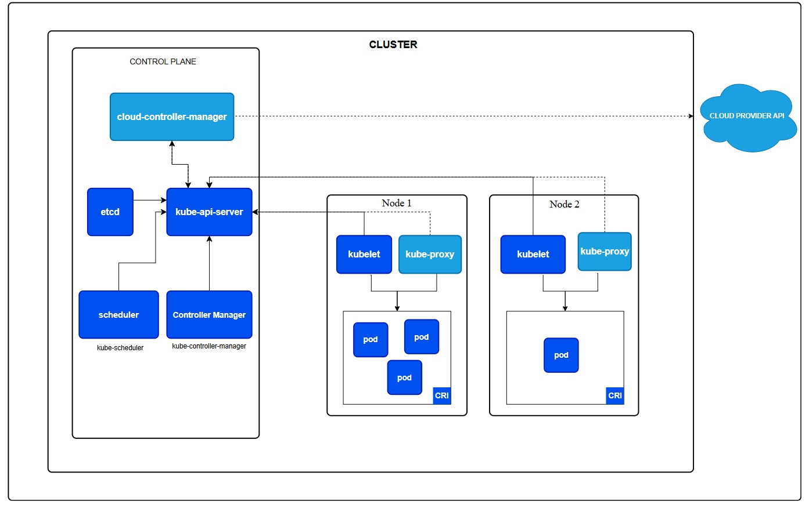
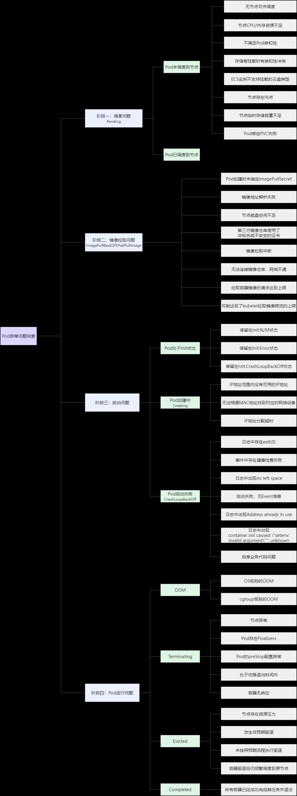
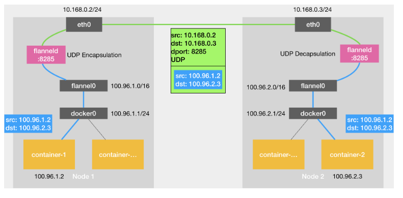
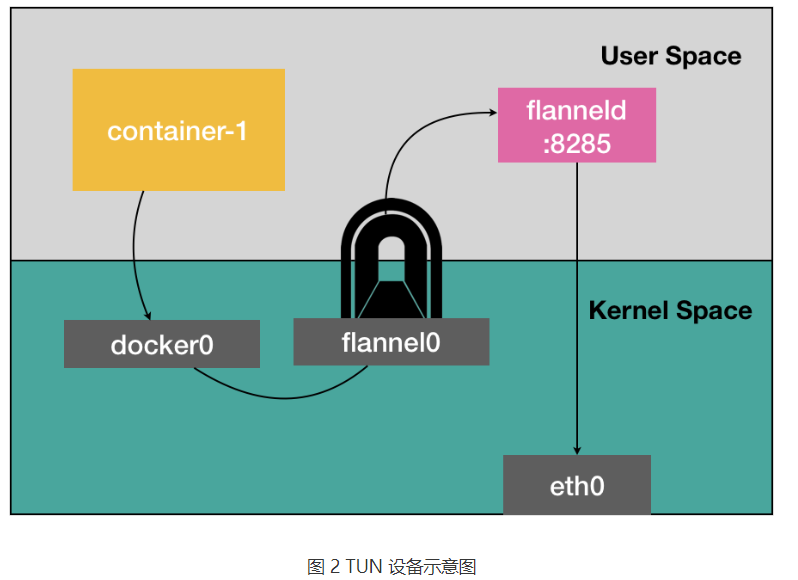
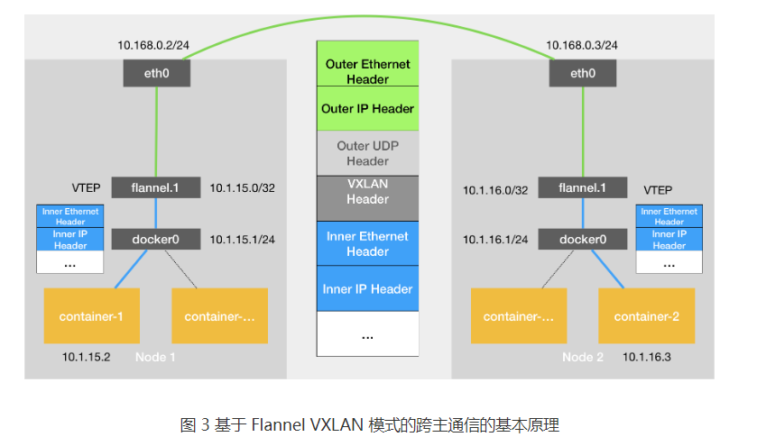
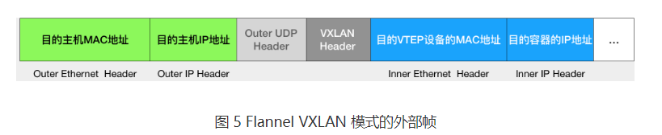
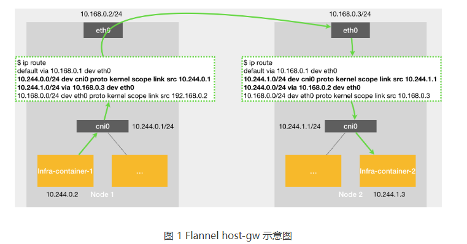
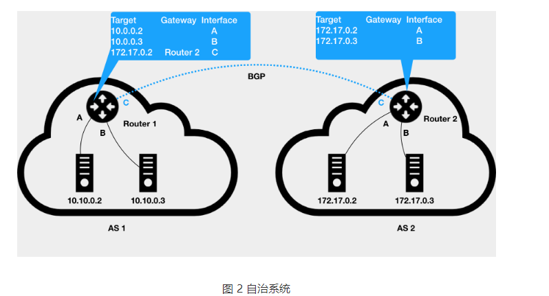
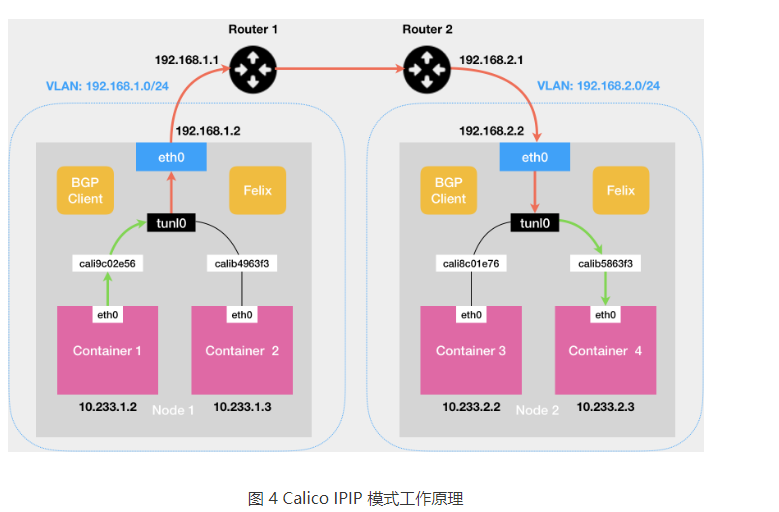

# kubernetes
文档内容基于v1.17.04版本

## 目录
<!-- vim-markdown-toc GFM -->

* [1. 容器发展历史](#1-容器发展历史)
* [2. k8s概述](#2-k8s概述)
    * [架构](#架构)
        * [控制平面](#控制平面)
        * [工作节点](#工作节点)
        * [插件Addons](#插件addons)
        * [容器运行时接口（CRI）](#容器运行时接口cri)
        * [定制和可扩展性](#定制和可扩展性)
        * [cgroup资源限制](#cgroup资源限制)
        * [api](#api)
        * [自定义控制器](#自定义控制器)
        * [自定义api对象：CRD、CR](#自定义api对象crdcr)
        * [operator](#operator)
* [3. label](#3-label)
* [4. annotations注解](#4-annotations注解)
* [4. Finalizer终结器](#4-finalizer终结器)
* [5. pod](#5-pod)
    * [downward api](#downward-api)
    * [容器探针probe](#容器探针probe)
* [6. 控制器](#6-控制器)
* [7. service](#7-service)
    * [实现原理](#实现原理)
    * [headless service](#headless-service)
    * [k8s中的informer](#k8s中的informer)
    * [ipvs模式工作原理](#ipvs模式工作原理)
    * [service相关排错思路](#service相关排错思路)
* [8. ingress](#8-ingress)
* [9. flannel](#9-flannel)
* [9. cni](#9-cni)
* [11. calico](#11-calico)
* [12. k8s中的dns](#12-k8s中的dns)
* [13. 存储](#13-存储)
    * [卷](#卷)
        * [empty](#empty)
        * [hostpath](#hostpath)
        * [configmap](#configmap)
        * [secret](#secret)
    * [pv](#pv)
    * [pvc](#pvc)
    * [StorageClass](#storageclass)
    * [持久化过程](#持久化过程)
    * [本地持久化](#本地持久化)
* [14. rbac](#14-rbac)
    * [Role 或 ClusterRole](#role-或-clusterrole)
    * [RoleBinding 和 ClusterRoleBinding](#rolebinding-和-clusterrolebinding)
* [15. k8s集群管理](#15-k8s集群管理)
    * [集群访问控制](#集群访问控制)
    * [集群故障排查工具](#集群故障排查工具)
    * [节点管理](#节点管理)
    * [升级集群](#升级集群)
    * [证书](#证书)
* [16. 辅助组件](#16-辅助组件)
    * [cert-manager](#cert-manager)
    * [kraken](#kraken)
    * [nfs-provisioner](#nfs-provisioner)
    * [node-local-dns](#node-local-dns)
    * [Istio](#istio)
    * [MetalLB](#metallb)
* [17. k8s集群部署流程（kubeadm）](#17-k8s集群部署流程kubeadm)
    * [k8s集群所支持的规格](#k8s集群所支持的规格)
    * [分布式一致性集群节点数](#分布式一致性集群节点数)
    * [集群内核调优参考](#集群内核调优参考)
* [18. debug](#18-debug)
    * [k8s master机器重启后，coredns两个pod就绪探针失败](#k8s-master机器重启后coredns两个pod就绪探针失败)
* [19. cka](#19-cka)
    * [技巧](#技巧)

<!-- vim-markdown-toc -->


## 1. 容器发展历史
一开始是Cloud Foundry利用Cgroups和Namespace机制隔离各个应用的环境，但由于环境的打包过程不如docker镜像方便进而被docker取代，而由于大规模部署应用的需求出现了swarm这类容器集群管理项目，compose项目的推出也为容器编排提供了有力帮助，这些使得docker在当时站住了主流。而后不满docker一家独大的现状，谷歌、red hat等开源领域玩家牵头建立了CNCF，并以kubernetes项目为核心来对抗docker。由于kubernetes生态迅速崛起，docker将容器运行时containerd捐赠给CNCF，从此也标志着以kubernetes为核心容器技术发展


**容器与虚拟机比较**

容器利用linux的cgroups（资源限制）和namespace（资源隔离）技术实现，实际上是宿主机上的一个特殊的进程，共享内核。而虚拟机利用额外的工具如hypervisor等技术实现对宿主机资源的隔离，相比容器隔离更加的彻底

容器镜像：rootfs

## 2. k8s概述 
一句话：k8s是谷歌一个容器编排的开源系统

Kubernetes 是用于自动部署，扩展和管理容器化应用程序的开源系统，Kubernetes 拥有一个庞大且快速增长的生态系统

提供：服务暴露和负载均衡、存储编排、自动分配部署容器、自动修改容器、密钥和配置管理、自动完成装箱计算

### 架构


一个正常运行k8s集群的组件主要包括部署控制面主节点和工作节点。主节点主要是来管理整个集群的，例如当检测不满足部署的 replicas 字段时，会调度启动新的 pod，工作节点负责托管pod

#### 控制平面
1. kube-apiserver： 理解成Kubernetes 控制平面的前端，是资源操作的唯一入口。负责集群中的不同部分和集群外部组件相互通信，都要通过Api Server这个组件；Kubernetes 控制面的核心是 API 服务器。Kubernetes API 使你可以查询和操纵 Kubernetes API 中对象（例如：Pod、Namespace、ConfigMap 和 Event）的状态。大部分操作都可以通过 kubectl 命令行接口或类似 kubeadm 这类命令行工具来执行， 这些工具在背后也是调用 API。不过，你也可以使用 REST 调用来访问这些 API。可以部署多个kube-apiserver实例来平衡流量

2. etcd：一致且高可用的键值存储，用作 Kubernetes 的所有集群数据的后台数据库。本身实现了集群化，具有高可用性和灾备。v2版数据存入到内存中，v3版数据存储在本地的持久化卷中，不会造成数据丢失。需要对etcd有备份计划

3. kube-scheduler：负责监视新创建的、未指定运行节点（node）的 Pods， 并选择节点来让 Pod 在上面运行。调度决策考虑的因素包括单个 Pod 及 Pods 集合的资源需求、软硬件及策略约束、 亲和性及反亲和性规范、数据位置、工作负载间的干扰及最后时限。

4. kube-controller-manager：负责运行控制器进程。从逻辑上讲， 每个控制器都是一个单独的进程，但是为了降低复杂性，它们都被编译到同一个可执行文件，并在同一个进程中运行。维持副本期望数目，比如故障检测、自动扩展、滚动更新等；

控制器有许多不同类型。以下是一些例子
```
Node 控制器：负责在节点出现故障时进行通知和响应
Job 控制器：监测代表一次性任务的 Job 对象，然后创建 Pod 来运行这些任务直至完成
EndpointSlice 控制器：填充 EndpointSlice 对象（以提供 Service 和 Pod 之间的链接）。
ServiceAccount 控制器：为新的命名空间创建默认的 ServiceAccount。
deployment：部署pod控制器
replicaSET：副本控制器，维持pod副本的数量
cron
```

5. cloud-controller-manager：云控制器管理器允许你将你的集群连接到云提供商的 API 之上

#### 工作节点
1、Kubelet：负责在node上起pod的，当Scheduler确定某个node上运行pod之后，会将pod的具体信息（image，volume）等发送给该节点的kubelet，kubelet根据这些信息创建和运行容器，并向master返回运行状态。（自动修复功能：如果某个节点中的容器宕机，它会尝试重启该容器，若重启无效，则会将该pod杀死，然后重新创建一个容器）；kubelet 不会管理不是由 Kubernetes 创建的容器。

2、Kube-proxy：是node上的网络代理，负责为Service提供集群内部的服务发现暴露和负载均衡功能（外界通过Service访问pod提供的服务时，Service接收到的请求后就是通过kube-proxy来转发到pod上的）；

3、container-runtime：是负责管理运行容器的软件，比如docker、containerd

#### 插件Addons
插件使用 Kubernetes 资源（DaemonSet、 Deployment 等）实现集群功能。 因为这些插件提供集群级别的功能，插件中命名空间域的资源属于 kube-system 命名空间。

1. dns：coreDNS。几乎所有 Kubernetes 集群都应该有集群 DNS， 因为很多示例都需要 DNS 服务。Kubernetes 启动的容器自动将此 DNS 服务器包含在其 DNS 搜索列表中（/etc/resolv.conf）

2. Web 界面（dashboard)：官方的k8s网页管理平台，其他：lens、rancher、prometheus+grafana（不能直接操作k8s集群）

3. 监控：官方metrics-server，监控cpu内存，用于hpa、hpv；其他：Prometheus

4. 集群层面日志：elk。在集群中，日志应该具有独立的存储，并且其生命周期与节点、Pod 或容器的生命周期相独立。 这个概念叫集群级的日志。

5. 网络插件：flannel、calico。实现容器网络接口（CNI）规范的软件组件。它们负责为 Pod 分配 IP 地址，并使这些 Pod 能在集群内部相互通信。容器运行时必须配置为加载所需的 CNI 插件，从而实现 Kubernetes 网络模型。

6. 存储插件：CSI（Container Storage Interface）：CSI:标准化存储接口，可支持多种存储后端。 Ceph：分布式存储系统，支持 RBD 和 CephFS。 NFS：网络文件系统插件，用于共享存储。

```
类型        主要插件
网络插件    Calico, Flannel, Cilium, Weave Net, Multus
存储插件    CSI, Ceph, NFS, GlusterFS, Rook
安全插件    OPA-Gatekeeper, Kyverno, Falco, Trivy
监控和日志插件  Prometheus, Grafana, EFK, Loki
自动化和调度插件    Cluster Autoscaler, Karpenter, Descheduler
CI/CD 插件  ArgoCD, Jenkins X, Tekton, Flux
可观测性插件    Weave Scope, Kiali, New Relic
服务发现和负载均衡插件  CoreDNS, MetalLB, Traefik, NGINX Ingress Controller
数据备份与恢复插件  Velero, Stash, Restic
扩展管理插件    Helm, Kustomize, kubectl 插件
```

#### 容器运行时接口（CRI）
CRI 是一个插件接口，它使 kubelet 能够使用各种容器运行时，无需重新编译集群组件。

主要 gRPC 协议， 用于节点组件 kubelet 和容器运行时之间的通信

CRI是接口，CRT是实现
```
containerd  轻量级、高性能，默认支持 Kubernetes cri   默认的 Kubernetes 容器运行时
CRI-O   专为 Kubernetes 设计，支持 OCI 标准 替代 Docker，优化 Kubernetes 集群
Docker  功能全面，需 cri-dockerd 适配 Kubernetes    开发环境或小型集群
Kata    高隔离性，结合容器和虚拟机  多租户、高安全性需求的场景
gVisor  用户态沙箱运行，增强隔离和安全性    对隔离性和安全性要求高的环境
```

#### 定制和可扩展性
```
Kubernetes 架构允许大幅度的定制：

你可以部署自定义的调度器与默认的 Kubernetes 调度器协同工作，也可以完全替换掉默认的调度器。
API 服务器可以通过 CustomResourceDefinition 和 API 聚合进行扩展。
云平台可以使用 cloud-controller-manager 与 Kubernetes 深度集成。

Kubernetes 架构的灵活性使各组织能够根据特定需求调整其集群，平衡操作复杂性、性能和管理开销等因素
```

#### cgroup资源限制
在 Linux 上，控制组（CGroup）用于限制分配给进程的资源。

kubelet 和底层容器运行时都需要对接控制组来强制执行 为 Pod 和容器管理资源 并为诸如 CPU、内存这类资源设置请求和限制。若要对接控制组，kubelet 和容器运行时需要使用一个 cgroup 驱动。 关键的一点是 kubelet 和容器运行时需使用相同的 cgroup 驱动并且采用相同的配置。

可用的 cgroup 驱动有两个：cgroupfs、systemd

cgroupfs 驱动
cgroupfs 驱动是 kubelet 中默认的 cgroup 驱动。 当使用 cgroupfs 驱动时， kubelet 和容器运行时将直接对接 cgroup 文件系统来配置 cgroup。

当 systemd 是初始化系统时， 不推荐使用 cgroupfs 驱动，因为 systemd 期望系统上只有一个 cgroup 管理器。 此外，如果你使用 cgroup v2， 则应用 systemd cgroup 驱动取代 cgroupfs。

systemd cgroup 驱动
当某个 Linux 系统发行版使用 systemd 作为其初始化系统时，初始化进程会生成并使用一个 root 控制组（cgroup），并充当 cgroup 管理器。

systemd 与 cgroup 集成紧密，并将为每个 systemd 单元分配一个 cgroup。 因此，如果你 systemd 用作初始化系统，同时使用 cgroupfs 驱动，则系统中会存在两个不同的 cgroup 管理器。

同时存在两个 cgroup 管理器将造成系统中针对可用的资源和使用中的资源出现两个视图。某些情况下， 将 kubelet 和容器运行时配置为使用 cgroupfs、但为剩余的进程使用 systemd 的那些节点将在资源压力增大时变得不稳定。

当 systemd 是选定的初始化系统时，缓解这个不稳定问题的方法是针对 kubelet 和容器运行时将 systemd 用作 cgroup 驱动。

#### api
在 Kubernetes 项目中，一个 API 对象在 Etcd 里的完整资源路径，是由：Group（API 组）、Version（API 版本）和 Resource（API 资源类型）三个部分组成的
```yaml
# Cronjob是资源类型，batch是组，v2alpha1是版本
apiVersion: batch/v2alpha1
kind: CronJob
...
```
对于 Kubernetes 里的核心 API 对象，比如：Pod、Node 等，是不需要 Group 的（即：它们 Group 是“”）

#### 自定义控制器
通过k8s开放的api，自己定义一个控制器，并注册到kube-apiserver中去，类似deployment、statefulset等，打包成镜像然后可以通过deployment的方式部署，然后部署该自定义控制器能识别crd，之后应用cr的时候，该控制器就能识别该cr，并该cr对应的pod做对应的CRUD的操作，并负责后续的运维管理

#### 自定义api对象：CRD、CR 
允许用户在k8s中添加一个跟pod、node类似的、新的api资源类型：自定义资源类型

CRD 仅仅是资源的定义，而 Controller 可以去监听 CRD 的 CRUD 事件来添加自定义业务逻辑。

示例：
```
要为k8s添加一个名叫Network的api资源类型

它的作用，一旦用户创建一个Network对象，那么k8s就应该使用这个对象定义的网络参数，调用真实的网络插件，比如Neutron项目，为用户创建一个真正的“网络”，这样将来用户创建的pod，就可以声明使用这个“网络”

CR声明：
apiVersion: samplecrd.k8s.io/v1
kind: Network
metadata:
  name: example-network
spec:
  cidr: "192.168.0.0/16"
  gateway: "192.168.0.1"


CRD宏观定义CR：
apiVersion: apiextensions.k8s.io/v1beta1
kind: CustomResourceDefinition
metadata:
  name: networks.samplecrd.k8s.io
spec:
  group: samplecrd.k8s.io
  version: v1
  names:
    kind: Network
    plural: networks
  scope: Namespaced
```

#### operator
operator=crd+controller

Operator 的工作原理，实际上是利用了 Kubernetes 的自定义 API 资源（CRD），来描述我们想要部署的“有状态应用”；然后在自定义控制器里，根据自定义 API 对象的变化，来完成具体的部署和运维工作。operator本身也是一个deployment

operator启动后会自动创建对应的crd，然后当有cr创建的时候，operator就会监听并做相应的动作


## 3. label
```
标签：是当相同类型的资源对象越来越多的时候，为了更好的管理，可以按照标签将其分为一个组，为的是提升资源对象的管理效率。

标签选择算符：就是标签的查询过滤条件。目前API支持两种标签选择器：

基于等值关系的，如：“=”、“”“==”、“！=”（注：“==”也是等于的意思，yaml文件中的matchLabels字段）；
基于集合的，如：in、notin、exists（yaml文件中的matchExpressions字段）；
注：in:在这个集合中；notin：不在这个集合中；exists：要么全在（exists）这个集合中，要么都不在（notexists）；
```

示例
```yaml
apiVersion: v1
kind: Pod
metadata:
  name: label-demo
  labels:
    environment: production
    app: nginx
spec:
  containers:
  - name: nginx
    image: nginx:1.14.2
    ports:
    - containerPort: 80
```


## 4. annotations注解
Kubernetes 的 **Annotations** 是一种为资源对象附加非标识性元数据的机制，通常用于存储小型的、非关键的信息。与标签（Labels）不同，Annotations 不被用于选择或分组资源，而是提供额外的信息。

**常见用途：**
- 提供调试和诊断信息。
- 标记部署工具、管理工具的元数据。
- 配置扩展功能（如 Ingress、Service 等的特定行为）。
- 为运维和开发提供额外的描述信息。

**特点：**
- 注解的值可以是任意字符串。
- 每个对象的注解可以包含多个键值对。
- 注解的值大小受限于 etcd 的存储限制（通常约 1MB）。

**注解的使用格式**

在资源的 YAML 文件中，Annotations 位于 `metadata.annotations` 字段下，例如：

```yaml
apiVersion: v1
kind: Pod
metadata:
  name: example-pod
  annotations:
    example.com/owner: "John Doe"
    example.com/purpose: "Demo Pod"
spec:
  containers:
  - name: nginx
    image: nginx
```

---

**常见的应用场景和示例**

**1. 调试和诊断信息**
通过注解记录创建时间、创建人等信息，便于运维管理。

```yaml
metadata:
  annotations:
    created-by: "automation-tool"
    creation-timestamp: "2024-11-16T10:00:00Z"
```

---

**2. 配置 Ingress 的行为**
为 Ingress 配置注解以控制 NGINX Ingress Controller 的功能。

**示例：启用 HTTP 转 HTTPS 重定向**
```yaml
metadata:
  annotations:
    nginx.ingress.kubernetes.io/ssl-redirect: "true"
    nginx.ingress.kubernetes.io/force-ssl-redirect: "true"
```

**示例：设置请求超时时间**
```yaml
metadata:
  annotations:
    nginx.ingress.kubernetes.io/proxy-connect-timeout: "10"
    nginx.ingress.kubernetes.io/proxy-send-timeout: "10"
    nginx.ingress.kubernetes.io/proxy-read-timeout: "10"
```

---

**3. Service 的自定义配置**
为 Service 添加注解，控制云提供商（如 AWS、阿里云等）负载均衡器的行为。

**示例：指定负载均衡器类型**
```yaml
metadata:
  annotations:
    service.beta.kubernetes.io/aws-load-balancer-type: "nlb"
```

**示例：指定阿里云 SLB 的内网模式**
```yaml
metadata:
  annotations:
    service.beta.kubernetes.io/alicloud-loadbalancer-address-type: "intranet"
```

---

**4. 配置 Pod 的调度行为**
使用注解为调度器提供额外的指示信息。

**示例：禁止 kubelet 重启 Pod 时拉取镜像**
```yaml
metadata:
  annotations:
    container.image.pullPolicy: "IfNotPresent"
```

**示例：为 Pod 设置自定义调度器**
```yaml
metadata:
  annotations:
    scheduler.alpha.kubernetes.io/name: "custom-scheduler"
```

---

**5. 配置 Sidecar 容器自动注入**
使用注解为 Pod 配置 Sidecar 容器注入（如 Istio 或 Linkerd）。

**示例：启用 Istio Sidecar 自动注入**
```yaml
metadata:
  annotations:
    sidecar.istio.io/inject: "true"
```

---

**6. 配置 Persistent Volume 的行为**
通过注解控制存储的行为，例如动态供应时的配置。

**示例：配置存储类的访问模式**
```yaml
metadata:
  annotations:
    volume.beta.kubernetes.io/mount-options: "ro,nosuid"
```

---

**7. 标记资源管理工具的元数据**
为资源打上管理工具的标记，便于追踪资源的来源。

**示例：标记 Helm 部署的资源**
```yaml
metadata:
  annotations:
    meta.helm.sh/release-name: "my-release"
    meta.helm.sh/release-namespace: "default"
```

---

**8. 配置 Horizontal Pod Autoscaler (HPA) 的行为**
通过注解为 HPA 提供指标来源或行为配置。

**示例：从外部指标来源扩展**
```yaml
metadata:
  annotations:
    autoscaling.alpha.kubernetes.io/metrics: |
      [{"type": "External", "external": {"metricName": "queue_length", "targetValue": 100}}]
```

## 4. Finalizer终结器
在 Kubernetes 中，Finalizers 是一种机制，用于确保在资源被删除之前执行某些操作。它通常用于执行清理、资源释放或其他终止操作，以确保资源的删除流程能够顺利进行，且不会对系统造成影响。Finalizers 在 Kubernetes 资源的生命周期管理中扮演着重要角色。

1. 当资源对象（如 Pod、Deployment、Namespace 等）被删除时，Kubernetes 会将该资源的状态设置为 "Terminating"。
2. 在删除过程中，Kubernetes 会检查资源的 Finalizer 列表。如果有 Finalizer，Kubernetes 会等待 Finalizer 执行并完成清理操作。
3. 一旦 Finalizer 执行完成，资源才会从集群中被彻底删除。
4. 如果某个 Finalizer 在执行过程中遇到问题，资源的删除操作会被阻塞，直到该 Finalizer 执行完成或被手动移除。


## 5. pod 
类似于共享命名空间和文件系统卷的一组容器，是k8s集群里面最小的单位。每个pod里边可以运行一个或多个container（容器），如果一个pod中有两个container，那么container的USR（用户）、MNT（挂载点）、PID（进程号）是相互隔离的，UTS（主机名和域名）、IPC（消息队列）、NET（网络栈）是相互共享的。

**pod中容器类型**

1. pause：是每个 Pod 中的第一个启动的容器，其主要作用是为 Pod 提供一个共享的 Linux Namespace（命名空间） 环境给其他容器共用。容器本身非常轻量，仅运行一个简单的命令 sleep infinity，保持容器持续运行。

2. init：容器本身非常轻量，仅运行一个简单的命令 sleep infinity，保持容器持续运行。

3. sidecar：是一种与主业务容器共享同一个 Pod 的容器，通常用于提供额外的功能，例如日志处理、数据同步、代理服务等。

4. 应用容器：跑主业务服务

---

**pod 状态**



--- 

**创建pod的流程**

1. 客户端提交Pod的配置信息（可以是yaml文件定义好的信息）到kube-apiserver；
2. Apiserver收到指令后，将pod的配置信息存储到ETCD数据中心中
3. 通知给controller-manager创建一个资源对象（repllicaSet），去创建所需要的pod
4. Kube-scheduler检测到pod信息会开始调度预选，会先过滤掉不符合Pod资源配置要求的节点，然后开始调度调优，主要是挑选出更适合运行pod的节点，然后将pod的资源配置单发送到node节点上的kubelet组件上。
5. Kubelet根据scheduler发来的资源配置单运行pod（调docker），运行成功后，将pod的运行信息返回给scheduler，scheduler将返回的pod运行状况的信息存储到etcd数据中心。如果Pod状态发生变化，Kubelet 会通过API server更新Pod状态
6. 后由kubeproxy负责pod的网络通信，服务发布和负载均衡

---

**删除pod的流程**

Kube-apiserver会接受到用户的删除指令，默认有30秒时间等待优雅退出，超过30秒会被标记为死亡状态，此时Pod的状态Terminating，kubelet看到pod标记为Terminating就开始了关闭Pod的工作；

关闭流程如下：
1. pod从service的endpoint列表中被移除；
2. 如果该pod定义了一个停止前的钩子，其会在pod内部被调用，停止钩子一般定义了如何优雅的结束进程；
3. 进程被发送SIGTERM信号（kill -15）
4. 当超过优雅退出的时间后，Pod中的所有进程都会被发送SIGKILL信号（kill -9）。

---

**static pod**

在 Kubernetes 中，Static Pod（静态 Pod）是一种特殊类型的 Pod，与普通的 Pod 相比有一些不同之处。

普通的 Pod 是由 Kubernetes API Server 管理的，它们的定义通常存储在 etcd 中，并由 kubelet 运行在集群中的节点上。而 Static Pod 是直接由 kubelet 管理的，它的定义文件通常存储在节点上的特定目录中，而不是存储在集群的 etcd 中。这使得 Static Pod 与特定的节点绑定，而不是与整个集群绑定，这样就可以方便地将它们与特定节点的生命周期关联起来。

Static Pod 的定义文件通常存储在 /etc/kubernetes/manifests 或 /etc/kubernetes/static-pods 等目录中，kubelet 会定期检查这些目录，然后根据定义文件启动、管理和监视对应的 Pod。Static Pod 的启动、停止和重启等操作通常是由 kubelet 自动完成的，而不需要用户手动操作。

Static Pod 主要用于在集群中启动一些基础服务或辅助服务，如 kube-proxy、kube-dns、kube-scheduler 等。由于 Static Pod 是由 kubelet 直接管理的，因此它们通常用于启动一些在 kubelet 启动之前或 kubelet 启动失败时需要运行的服务。此外，Static Pod 还可以用于启动一些与 kubelet 相关的组件或工具，以方便地与 kubelet 进行交互和管理。

需要注意的是，Static Pod 不受 Kubernetes 控制平面的管理，因此在使用 Static Pod 时需要格外小心，确保其配置与集群的其他部分保持一致，以避免引起集群的不一致性或故障。

### downward api
让 Pod 里的容器能够直接获取到这个 Pod API 对象本身的信息

此yaml文件申明了一个projected类型的Volume，来源为downward api，声明了要暴露pod的metadata.labels信息给容器，这样pod的labels字段的值，就会被kubernetes自动挂载成为容器里的/etc/podinfo/labels文件

projected volume包括secret，configmap，downward api，serviceaccounttoken
```yaml
apiVersion: v1
kind: Pod
metadata:
  name: test-downwardapi-volume
  labels:
    zone: us-est-coast
    cluster: test-cluster1
    rack: rack-22
spec:
  containers:
    - name: client-container
      image: k8s.gcr.io/busybox
      command: ["sh", "-c"]
      args:
      - while true; do
          if [[ -e /etc/podinfo/labels ]]; then
            echo -en '\n\n'; cat /etc/podinfo/labels; fi;
          sleep 5;
        done;
      volumeMounts:
        - name: podinfo
          mountPath: /etc/podinfo
          readOnly: false
  volumes:
    - name: podinfo
      projected:
        sources:
        - downwardAPI:
            items:
              - path: "labels"
                fieldRef:
                  fieldPath: metadata.labels
```

### 容器探针probe
只要 Pod 的 restartPolicy 指定的策略允许重启异常的容器（比如：Always），那么这个 Pod 就会保持 Running 状态，并进行容器重启。否则，Pod 就会进入 Failed 状态 。

对于包含多个容器的 Pod，只有它里面所有的容器都进入异常状态后，Pod 才会进入 Failed 状态。在此之前，Pod 都是 Running 状态。此时，Pod 的 READY 字段会显示正常容器的个数

1. 三种探针
针对运行中的容器，kubelet 可以选择是否执行以下三种探针，以及如何针对探测结果作出反应：
```
livenessProbe
指示容器是否正在运行。如果存活态探测失败，则 kubelet 会杀死容器， 并且容器将根据其重启策略决定未来。如果容器不提供存活探针， 则默认状态为 Success。
readinessProbe
指示容器是否准备好为请求提供服务。如果就绪态探测失败， 端点控制器将从与 Pod 匹配的所有服务的端点列表中删除该 Pod 的 IP 地址。 初始延迟之前的就绪态的状态值默认为 Failure。 如果容器不提供就绪态探针，则默认状态为 Success。
startupProbe
指示容器中的应用是否已经启动。如果提供了启动探针，则所有其他探针都会被 禁用，直到此探针成功为止。如果启动探测失败，kubelet 将杀死容器，而容器依其 重启策略进行重启。 如果容器没有提供启动探测，则默认状态为 Success。
```

2. 检查机制
使用探针来检查容器有四种不同的方法。 每个探针都必须准确定义为这四种机制中的一种：
```
exec
在容器内执行指定命令。如果命令退出时返回码为 0 则认为诊断成功。
grpc
使用 gRPC 执行一个远程过程调用。 目标应该实现 gRPC健康检查。 如果响应的状态是 "SERVING"，则认为诊断成功。 gRPC 探针是一个 alpha 特性，只有在你启用了 "GRPCContainerProbe" 特性门控时才能使用。
httpGet
对容器的 IP 地址上指定端口和路径执行 HTTP GET 请求。如果响应的状态码大于等于 200 且小于 400，则诊断被认为是成功的。
tcpSocket
对容器的 IP 地址上的指定端口执行 TCP 检查。如果端口打开，则诊断被认为是成功的。 如果远程系统（容器）在打开连接后立即将其关闭，这算作是健康的。
```

3. 探测结果
```
每次探测都将获得以下三种结果之一：

Success（成功）
容器通过了诊断。
Failure（失败）
容器未通过诊断。
Unknown（未知）
诊断失败，因此不会采取任何行动。

探测失败会让kubelet重启该容器
```

4. 检查参数
```
每种探测方法能支持以下几个相同的检查参数，用于设置控制检查时间：
initialDelaySeconds：初始第一次探测间隔，用于应用启动的时间，防止应用还没启动而健康检查失败
periodSeconds：检查间隔，多久执行probe检查，默认为10s；
timeoutSeconds：检查超时时长，探测应用timeout后为失败；
successThreshold：成功探测阈值，表示探测多少次为健康正常，默认探测1次。
```

示例：
```yaml
apiVersion: v1
kind: Pod
metadata:
  labels:
    test: liveness
  name: liveness-exec
spec:
  containers:
  - name: liveness
    image: registry.k8s.io/busybox
    args:
    - /bin/sh
    - -c
    - touch /tmp/healthy; sleep 30; rm -f /tmp/healthy; sleep 600
    livenessProbe:
      exec:
        command:
        - cat
        - /tmp/healthy
      initialDelaySeconds: 5
      periodSeconds: 5
```


## 6. 控制器
主要基于控制循环
```
for {
  实际状态 := 获取集群中对象 X 的实际状态（Actual State）
  期望状态 := 获取集群中对象 X 的期望状态（Desired State）
  if 实际状态 == 期望状态{
    什么都不做
  } else {
    执行编排动作，将实际状态调整为期望状态
  }
}
```

在 Kubernetes（K8s）中，**工作负载（Workloads）** 是对运行在集群中的应用程序的抽象。通过不同类型的工作负载，用户可以管理和调度容器化应用的生命周期。以下是 Kubernetes 中常见的工作负载类型及其特点和适用场景。

---
```
### **1. Pod**
#### **简介**
- Pod 是 Kubernetes 中最小的部署单元，代表一个或多个容器的集合。
- 容器共享网络、存储和配置。
  
#### **特点**
- 通常用作更高层级工作负载（如 Deployment、StatefulSet）的基础。
- 不直接推荐使用裸 Pod 管理应用，因为其不具备高可用和自动重建功能。

#### **适用场景**
- 临时调试或测试。

---

### **2. Deployment**
#### **简介**
- 用于管理无状态应用的声明式更新和扩缩容。
- 是 Kubernetes 中最常用的工作负载。

#### **特点**
- 支持滚动更新、回滚操作。
- 提供副本控制（ReplicaSet），保证应用的高可用性。

#### **适用场景**
- 无状态服务（如 Web 服务、API 服务）。
- 需要频繁更新或扩缩容的应用。

---

### **3. StatefulSet**
#### **简介**
- 用于管理有状态应用，提供稳定的网络标识和存储。

#### **特点**
- Pod 有固定的名称（如 `my-app-0`，`my-app-1`）。
- 每个 Pod 都有独立的持久化存储卷。
- 严格按顺序启动和停止 Pod。

#### **适用场景**
- 数据库（如 MySQL、MongoDB）。
- 分布式系统（如 Kafka、ZooKeeper）。

---

### **4. DaemonSet**
#### **简介**
- 确保每个节点上运行一个特定的 Pod。

#### **特点**
- 自动在新加入的节点上部署指定 Pod。
- 通常用于运行与节点相关的任务。

#### **适用场景**
- 节点级别监控（如 Prometheus Node Exporter、cAdvisor）。
- 日志收集（如 Fluentd、Logstash）。

---

### **5. Job**
#### **简介**
- 用于运行一次性任务（短期任务），任务完成后 Pod 会自动停止。

#### **特点**
- 确保任务完成指定次数。
- 可配置失败重试策略。

#### **适用场景**
- 数据处理任务（如 ETL）。
- 备份任务。

---

### **6. CronJob**
#### **简介**
- 在指定时间间隔运行的定时任务。

#### **特点**
- 是 Job 的扩展，提供定时调度功能。
- 使用类 Cron 表达式配置任务调度。

#### **适用场景**
- 定时备份。
- 定时清理任务。

---

### **7. ReplicaSet**
#### **简介**
- 确保指定数量的 Pod 在任何时间运行。

#### **特点**
- 是 Deployment 的基础组件，用户通常直接使用 Deployment，而非单独使用 ReplicaSet。

#### **适用场景**
- 用于替代过时的 ReplicationController。
- 作为 Deployment 的底层支持组件。

---

### **8. ReplicationController**
#### **简介**
- 类似于 ReplicaSet，但功能较旧，不建议新项目使用。

#### **特点**
- 确保集群中始终运行指定数量的 Pod。
- 与 ReplicaSet 类似，但功能更简化。

#### **适用场景**
- 老旧系统的维护。

---

### **9. HorizontalPodAutoscaler（HPA）**
#### **简介**
- 自动根据负载（如 CPU、内存使用率）调整 Pod 副本数量。--cpu-percent  20% 是pod的limit限制值豪核的20%，例如： limit值为200m   * 20% = 40m

#### **特点**
- 动态扩缩容 Pod 副本数量。
- 基于指标（如 Metrics Server 提供的资源使用数据）。

#### **适用场景**
- 应用负载波动较大的场景。

---

### **10. VerticalPodAutoscaler（VPA）**
#### **简介**
- 自动调整 Pod 的资源请求和限制（CPU 和内存）。

#### **特点**
- 改变 Pod 的资源配置。
- 通常需要重新创建 Pod。

#### **适用场景**
- 自动优化资源分配。

---

### **11. Garbage Collection（GC）相关工作负载**
#### **简介**
- Kubernetes 提供自动清理功能，用于删除不再需要的资源，例如：
  - 过时的 ReplicaSet。
  - 失败或完成的 Pod。

#### **特点**
- 减少资源浪费。
- 简化运维管理。

#### **适用场景**
- 集群资源优化。

---

### **工作负载总结**
| **工作负载类型**       | **主要特点**                             | **适用场景**                |
|---------------------|-------------------------------------|-------------------------|
| **Pod**             | 最小部署单元，不推荐直接使用                 | 测试或调试               |
| **Deployment**      | 无状态服务，支持滚动更新和扩缩容             | Web 服务、API 服务        |
| **StatefulSet**     | 有状态服务，支持稳定存储和网络标识            | 数据库、分布式系统         |
| **DaemonSet**       | 确保每个节点运行一个 Pod                   | 节点监控、日志收集          |
| **Job**             | 一次性任务，短期任务                       | 数据处理、备份任务          |
| **CronJob**         | 定时任务                                 | 定时备份、清理任务          |
| **ReplicaSet**      | 保证 Pod 数量，不常直接使用                 | 老系统维护、替代 ReplicationController |
| **HPA**             | 自动扩缩容 Pod 数量                       | 负载波动大的服务           |
| **VPA**             | 动态调整资源请求和限制                      | 优化资源分配              |

根据业务需求选择合适的工作负载类型，可以更好地发挥 Kubernetes 的调度和管理能力。
```


## 7. service
暴露集群内的服务，并对服务提供负载均衡功能，默认使用TCP协议

### 实现原理
1. clusterIP
```
由kube-proxy组件加上iptables（默认）来共同实现的

比如现在有一个service vip是10.0.1.175/32的80端口代理着三个pod10.244.0.5:9376,10.244.0.6:9376,10.244.0.7:9376

当创建这个service的时候，kube-proxy就可以通过service的informer感知到这样一个service对象的添加，然后kube-proxy就会在宿主机上创建一条iptables规则：
-A KUBE-SERVICES -d 10.0.1.175/32 -p tcp -m comment --comment "default/hostnames: cluster IP" -m tcp --dport 80 -j KUBE-SVC-NWV5X2332I4OT4T3

* `-A KUBE-SERVICES`：这表示将规则添加到名为 `KUBE-SERVICES` 的iptables链中。`-A` 选项用于添加规则到链的末尾。
  
* `-d 10.0.1.175/32`：这指定了目标地址为 `10.0.1.175`，后面的 `/32` 表示这是一个CIDR表示法，表示单个IP地址。
  
* `-p tcp`：这表示匹配传输层协议为TCP的数据包。
  
* `-m comment --comment "default/hostnames: cluster IP"`：这是一个注释，提供了关于规则目的的信息，这对于管理规则集合时非常有用。
  
* `-m tcp --dport 80`：这表示匹配目标端口为80的TCP数据包。 `-m tcp` 表示使用TCP模块来匹配数据包。
  
* `-j KUBE-SVC-NWV5X2332I4OT4T3`：这表示如果数据包符合以上条件，将跳转到名为 `KUBE-SVC-NWV5X2332I4OT4T3` 的目标。 `-j` 表示跳转到目标。

这条规则就为这个service设置了一个固定入口地址，接着跳转到KUBE-SVC-NWV5X2332I4OT4T3：
-A KUBE-SVC-NWV5X2332I4OT4T3 -m comment --comment "default/hostnames:" -m statistic --mode random --probability 0.33332999982 -j KUBE-SEP-WNBA2IHDGP2BOBGZ
-A KUBE-SVC-NWV5X2332I4OT4T3 -m comment --comment "default/hostnames:" -m statistic --mode random --probability 0.50000000000 -j KUBE-SEP-X3P2623AGDH6CDF3
-A KUBE-SVC-NWV5X2332I4OT4T3 -m comment --comment "default/hostnames:" -j KUBE-SEP-57KPRZ3JQVENLNBR

用-mode random的模式，随机转发到目的地，分别是 KUBE-SEP-WNBA2IHDGP2BOBGZ、KUBE-SEP-X3P2623AGDH6CDF3 和 KUBE-SEP-57KPRZ3JQVENLNBR。而这三条链指向的最终目的地，其实就是这个 Service 代理的三个 Pod。

由于iptables规则是从上到下逐条进行的，所以为了保证上述三条规则每条被选中的概率都相同，我们应该将它们的 probability 字段的值分别设置为 1/3（0.333…）、1/2 和 1。

这么设置的原理很简单：第一条规则被选中的概率就是 1/3；而如果第一条规则没有被选中，那么这时候就只剩下两条规则了，所以第二条规则的 probability 就必须设置为 1/2；类似地，最后一条就必须设置为 1。

上述三条链的明细：
-A KUBE-SEP-57KPRZ3JQVENLNBR -s 10.244.3.6/32 -m comment --comment "default/hostnames:" -j MARK --set-xmark 0x00004000/0x00004000
-A KUBE-SEP-57KPRZ3JQVENLNBR -p tcp -m comment --comment "default/hostnames:" -m tcp -j DNAT --to-destination 10.244.3.6:9376

-A KUBE-SEP-WNBA2IHDGP2BOBGZ -s 10.244.1.7/32 -m comment --comment "default/hostnames:" -j MARK --set-xmark 0x00004000/0x00004000
-A KUBE-SEP-WNBA2IHDGP2BOBGZ -p tcp -m comment --comment "default/hostnames:" -m tcp -j DNAT --to-destination 10.244.1.7:9376

-A KUBE-SEP-X3P2623AGDH6CDF3 -s 10.244.2.3/32 -m comment --comment "default/hostnames:" -j MARK --set-xmark 0x00004000/0x00004000
-A KUBE-SEP-X3P2623AGDH6CDF3 -p tcp -m comment --comment "default/hostnames:" -m tcp -j DNAT --to-destination 10.244.2.3:9376
可以看到，这三条链，其实是三条 DNAT 规则。但在 DNAT 规则之前，iptables 对流入的 IP 包还设置了一个“标志”（–set-xmark）。而 DNAT 规则的作用，就是在 PREROUTING 检查点之前，也就是在路由之前，将流入 IP 包的目的地址和端口，改成–to-destination 所指定的新的目的地址和端口。可以看到，这个目的地址和端口，正是被代理 Pod 的 IP 地址和端口。

总结：这些 Endpoints 对应的 iptables 规则，正是 kube-proxy 通过监听 Pod 的变化事件，在宿主机上生成并维护的。当流量通过nodrport或者负载均衡器进入，也会执行相同的基本流程，只是在这些情况下，客户端ip地址会被更改
```

2. nodeport实现原理
```
外部流量到达 Node 的 NodePort 后，会被转发到 Service 的 ClusterIP

当以nodeport类型，service的8080端口代理pod80端口，service的443端口代理pod的443端口。此时kube-proxy会在每台node上生成这样一条iptables规则：
-A KUBE-NODEPORTS -p tcp -m comment --comment "default/my-nginx: nodePort" -m tcp --dport 8080 -j KUBE-SVC-67RL4FN6JRUPOJYM

KUBE-SVC-67RL4FN6JRUPOJYM 其实就是一组随机模式的 iptables 规则。所以接下来的流程，就跟 ClusterIP 模式完全一样了。

需要注意的是，在 NodePort 方式下，Kubernetes 会在 IP 包离开宿主机发往目的 Pod 时，对这个 IP 包做一次 SNAT 操作，如下所示：
-A KUBE-POSTROUTING -m comment --comment "kubernetes service traffic requiring SNAT" -m mark --mark 0x4000/0x4000 -j MASQUERADE

可以看到，这条规则设置在 POSTROUTING 检查点，也就是说，它给即将离开这台主机的 IP 包，进行了一次 SNAT 操作，将这个 IP 包的源地址替换成了这台宿主机上的 CNI 网桥地址，或者宿主机本身的 IP 地址（如果 CNI 网桥不存在的话）。

当然，这个 SNAT 操作只需要对 Service 转发出来的 IP 包进行（否则普通的 IP 包就被影响了）。而 iptables 做这个判断的依据，就是查看该 IP 包是否有一个“0x4000”的“标志”。你应该还记得，这个标志正是在 IP 包被执行 DNAT 操作之前被打上去的。

对流出包做SNAT的原因：
           client
             \ ^
              \ \
               v \
   node 1 <--- node 2
    | ^   SNAT
    | |   --->
    v |
 endpoint

当一个外部的 client 通过 node 2 的地址访问一个 Service 的时候，node 2 上的负载均衡规则，就可能把这个 IP 包转发给一个在 node 1 上的 Pod。这里没有任何问题。

而当 node 1 上的这个 Pod 处理完请求之后，它就会按照这个 IP 包的源地址发出回复。

可是，如果没有做 SNAT 操作的话，这时候，被转发来的 IP 包的源地址就是 client 的 IP 地址。所以此时，Pod 就会直接将回复发给client。对于 client 来说，它的请求明明发给了 node 2，收到的回复却来自 node 1，这个 client 很可能会报错。

所以，在上图中，当 IP 包离开 node 2 之后，它的源 IP 地址就会被 SNAT 改成 node 2 的 CNI 网桥地址或者 node 2 自己的地址。这样，Pod 在处理完成之后就会先回复给 node 2（而不是 client），然后再由 node 2 发送给 client。

当然，这也就意味着这个 Pod 只知道该 IP 包来自于 node 2，而不是外部的 client。对于 Pod 需要明确知道所有请求来源的场景来说，这是不可以的。

所以这时候，你就可以将 Service 的 spec.externalTrafficPolicy 字段设置为 local，这就保证了所有 Pod 通过 Service 收到请求之后，一定可以看到真正的、外部 client 的源地址。

而这个机制的实现原理也非常简单：这时候，一台宿主机上的 iptables 规则，会设置为只将 IP 包转发给运行在这台宿主机上的 Pod。所以这时候，Pod 就可以直接使用源地址将回复包发出，不需要事先进行 SNAT 了。这个流程，如下所示：
       client
       ^ /   \
      / /     \
     / v       X
   node 1     node 2
    ^ |
    | |
    | v
 endpoint

当然，这也就意味着如果在一台宿主机上，没有任何一个被代理的 Pod 存在，比如上图中的 node 2，那么你使用 node 2 的 IP 地址访问这个 Service，就是无效的。此时，你的请求会直接被 DROP 掉。
```

3. loadbalancer实现原理
在 NodePort 的基础上，结合云服务商的负载均衡器（如 AWS ELB、GCP Load Balancer），将服务暴露到外部。

- **云提供商集成**：
  - LoadBalancer 类型的 Service 会调用云平台的 API，动态创建一个负载均衡器。
  - 负载均衡器将外部流量转发到集群节点的 NodePort。

- **内部转发**：
  - 外部流量首先到达云负载均衡器。
  - 云负载均衡器将流量分发到指定节点的 NodePort。
  - 节点上的 Kube-proxy 通过 NodePort 将流量转发到后端 Pod。

- **请求流程**：
  1. 客户端请求负载均衡器的外部 IP。
  2. 云负载均衡器将流量转发到某个节点的 NodePort。
  3. NodePort 再将流量转发到后端 Pod。

4. externalName实现原理
通过 DNS 映射，将 Service 名称解析为外部服务的 DNS 名称。

- **DNS 解析**：
  - ExternalName 类型的 Service 不分配 ClusterIP，也不会绑定到任何后端 Pod。
  - 它在 Kubernetes 内部仅起到 DNS 映射的作用。
  - 当应用程序通过 Service 名称访问服务时，DNS 服务器会直接解析为配置的外部域名。

- **请求流程**：
  1. 服务消费者请求 Service 名称（如 `myservice.default.svc.cluster.local`）。
  2. Kubernetes DNS 将此名称解析为指定的外部域名（如 `example.com`）。
  3. 流量直接发送到外部服务。

### headless service
访问“my-svc.my-namespace.svc.cluster.local”解析到的，直接就是 my-svc 代理的某一个 Pod 的 IP 地址。这里的区别在于，Headless Service 不需要分配一个 VIP，而是可以直接以 DNS 记录的方式解析出被代理 Pod 的 IP 地址。

clusterIP字段为None
```yaml
apiVersion: v1
kind: Service
metadata:
  name: nginx
  labels:
    app: nginx
spec:
  ports:
  - port: 80
    name: web
  clusterIP: None
  selector:
    app: nginx
```

### k8s中的informer
在 Kubernetes 中，Informer 是一种用于监视 Kubernetes 资源对象变化的机制。它是 Kubernetes 中客户端库的一部分，用于跟踪集群中特定类型资源对象的状态变化。

Informer 的主要作用是从 Kubernetes API Server 中获取资源对象的信息，并在这些资源对象发生变化时通知注册的监听器或回调函数。这些变化可以包括创建、更新、删除等操作，因此 Informer 是一种非常强大的工具，用于实现对 Kubernetes 资源对象的实时监控和响应。

在 Kubernetes 的开发中，开发者可以使用 Informer 来编写自定义的控制器、操作器或其他应用程序，以实现更高级的自动化管理功能。通过注册适当的回调函数，开发者可以在资源对象发生变化时执行一些逻辑操作，例如更新缓存、发送通知、触发其他操作等。

通常情况下，使用 Informer 时，开发者需要指定要监视的资源类型（如 Pod、Service、Deployment 等）、筛选条件（可选）、以及注册相应的事件处理函数。Informer 会负责与 Kubernetes API Server 进行通信，并在资源对象发生变化时将相应的事件通知传递给注册的处理函数。

在 Kubernetes 中，常见的 Informer 实现包括 client-go 库中的 Informer，它是 Kubernetes 官方提供的 Go 语言客户端库之一，用于与 Kubernetes API 进行交互和操作。此外，还有其他基于不同语言的客户端库也提供了类似的 Informer 机制。

### ipvs模式工作原理
当你的宿主机上有大量 Pod 的时候，成百上千条 iptables 规则不断地被刷新，会大量占用该宿主机的 CPU 资源，甚至会让宿主机“卡”在这个过程中。所以说，一直以来，基于 iptables 的 Service 实现，都是制约 Kubernetes 项目承载更多量级的 Pod 的主要障碍。

而 IPVS 模式的 Service，就是解决这个问题的一个行之有效的方法。

IPVS 模式的工作原理，其实跟 iptables 模式类似。当我们创建了前面的 Service 之后，kube-proxy 首先会在宿主机上创建一个虚拟网卡（叫作：kube-ipvs0），并为它分配 Service VIP 作为 IP 地址，如下所示：
```
# ip addr
  ...
  73：kube-ipvs0：<BROADCAST,NOARP>  mtu 1500 qdisc noop state DOWN qlen 1000
  link/ether  1a:ce:f5:5f:c1:4d brd ff:ff:ff:ff:ff:ff
  inet 10.0.1.175/32  scope global kube-ipvs0
  valid_lft forever  preferred_lft forever
```

而接下来，kube-proxy 就会通过 Linux 的 IPVS 模块，为这个 IP 地址设置三个 IPVS 虚拟主机，并设置这三个虚拟主机之间使用轮询模式 (rr) 来作为负载均衡策略。我们可以通过 ipvsadm 查看到这个设置，如下所示：
```
# ipvsadm -ln
 IP Virtual Server version 1.2.1 (size=4096)
  Prot LocalAddress:Port Scheduler Flags
    ->  RemoteAddress:Port           Forward  Weight ActiveConn InActConn     
  TCP  10.102.128.4:80 rr
    ->  10.244.3.6:9376    Masq    1       0          0         
    ->  10.244.1.7:9376    Masq    1       0          0
    ->  10.244.2.3:9376    Masq    1       0          0
```
可以看到，这三个 IPVS 虚拟主机的 IP 地址和端口，对应的正是三个被代理的 Pod。

这时候，任何发往 10.102.128.4:80 的请求，就都会被 IPVS 模块转发到某一个后端 Pod 上了。

而相比于 iptables，IPVS 在内核中的实现其实也是基于 Netfilter 的 NAT 模式，所以在转发这一层上，理论上 IPVS 并没有显著的性能提升。但是，IPVS 并不需要在宿主机上为每个 Pod 设置 iptables 规则（netlink创建ipvs规则，底层数据结构采用了hash table，不像iptables是线性匹配规则），而是把对这些“规则”的处理放到了内核态，从而极大地降低了维护这些规则的代价。这也正印证了我在前面提到过的，“将重要操作放入内核态”是提高性能的重要手段。

ipvs模式还为负载均衡提供了更多的选择：rr、wrr、lc、wlc等等

不过需要注意的是，IPVS 模块只负责上述的负载均衡和代理功能。而一个完整的 Service 流程正常工作所需要的包过滤、SNAT 等操作，还是要靠 iptables 来实现。只不过，这些辅助性的 iptables 规则数量有限，也不会随着 Pod 数量的增加而增加。

所以，在大规模集群里，我非常建议你为 kube-proxy 设置–proxy-mode=ipvs 来开启这个功能。它为 Kubernetes 集群规模带来的提升，还是非常巨大的。

### service相关排错思路
1. 区分是service本身的配置文件还是k8s集群的dns服务出了问题
在一个pod中执行命令nslookup + dns服务器vip地址（或者域名），观察dns是否正常返回，如果返回值有问题，就需要检查kube—dns的运行状态和日志；否则去检查自己的service定义是不是有问题

2. 如果你的 Service 没办法通过 ClusterIP 访问到的时候，你首先应该检查的是这个 Service 是否有 Endpoints：
```
$ kubectl get endpoints hostnames
NAME        ENDPOINTS
hostnames   10.244.0.5:9376,10.244.0.6:9376,10.244.0.7:9376
```

3. 如果endpoints正常，那么就需要确认kube-proxy是否正在正确运行

4. 如果kube-proxy也正常，那么就需要仔细检查宿主机上的iptables
```
KUBE-SERVICES 或者 KUBE-NODEPORTS 规则对应的 Service 的入口链，这个规则应该与 VIP 和 Service 端口一一对应；

KUBE-SEP-(hash) 规则对应的 DNAT 链，这些规则应该与 Endpoints 一一对应；

KUBE-SVC-(hash) 规则对应的负载均衡链，这些规则的数目应该与 Endpoints 数目一致；

如果是 NodePort 模式的话，还有 POSTROUTING 处的 SNAT 链。

通过查看这些链的数量、转发目的地址、端口、过滤条件等信息，你就能很容易发现一些异常的蛛丝马迹。
```

5. 还有一种典型问题，就是 Pod 没办法通过 Service 访问到自己。这往往就是因为 kubelet 的 hairpin-mode 没有被正确设置。关于 Hairpin 的原理我在前面已经介绍过，这里就不再赘述了。你只需要确保将 kubelet 的 hairpin-mode 设置为 hairpin-veth 或者 promiscuous-bridge 即可。


## 8. ingress
工作在七层，是service的“service”，ingress就是kubernetes中全局的反向代理，负责k8s内部所有service的负载均衡，根据定义的rules转发到不同的service上去。它是本身也是通过Nodetype或者loadbalancer类型的service来对外提供服务的。 

首先需要在集群中安装ingress-controller，然后这个pod会监听ingress对象以及它所代理的后端service变化的控制器，当一个新的ingress对象创建后，ingress-controller会根据ingress对象里定义的内容生成一份对应的nginx配置文件（/etc/nginx/nginx.conf），并使用这个配置文件启动一个nginx服务，而一旦ingress对象被更新，ingress-controller就会更新这个配置文件，如果只是被代理的service对象被更新，ingress-controller所管理的nginx是不需要reload的，此外ingress-controller还允许通过configmap对象来对上述的nginx配置文件进行定制。

为了让用户能够用到这个nginx，我们需要创建一个service来把ingress-controller管理的nginx服务暴露出去

此时 Nginx Ingress Controller 的 Service 会默认创建一个 LoadBalancer 类型的 Service。如果在公有云服务器上部署，会自动拿到LB地址


## 9. flannel
实现容器跨主机通信，其后端实现主要有vxlan、host-gw、udp

宿主机 Node 1 上有一个容器 container-1，它的 IP 地址是 100.96.1.2，对应的 docker0 网桥的地址是：100.96.1.1/24。 
宿主机 Node 2 上有一个容器 container-2，它的 IP 地址是 100.96.2.3，对应的 docker0 网桥的地址是：100.96.2.1/24。

container-1访问container-2

安装flannel后会在宿主机创建出一系列路由规则，以Node1为例，如下：
```
# 在 Node 1 上
$ ip route
default via 10.168.0.1 dev eth0
100.96.0.0/16 dev flannel0  proto kernel  scope link  src 100.96.1.0
100.96.1.0/24 dev docker0  proto kernel  scope link  src 100.96.1.1
10.168.0.0/24 dev eth0  proto kernel  scope link  src 10.168.0.2

# 在 Node 2 上
$ ip route
default via 10.168.0.1 dev eth0
100.96.0.0/16 dev flannel0  proto kernel  scope link  src 100.96.2.0
100.96.2.0/24 dev docker0  proto kernel  scope link  src 100.96.2.1
10.168.0.0/24 dev eth0  proto kernel  scope link  src 10.168.0.3
```

一、udp模式



1. 首先ip包会通过docker0出现在宿主机上，接着会匹配宿主机上的第二条路由，从而把包交给虚拟网卡flannel0处理，然后这个包由内核态（网卡设备）流向用户态（宿主机上的flanneld进程）

2. flanneld收到这个包后，由于Flannel管理的容器网络里，一台宿主机上的所有容器都属于该宿主机分配的一个子网，在我们的例子中，Node 1 的子网是 100.96.1.0/24，container-1 的 IP 地址是 100.96.1.2。Node 2 的子网是 100.96.2.0/24，container-2 的 IP 地址是 100.96.2.3。而这些子网与宿主机的对应关系，正式保存在了etcd当中，即etcd保存子网对应的宿主机ip地址，对flanneld来说只要Node 1和Node 2是互通的，那么flanneld作为Node 1 上的一个普通进程，就一定能把这个ip包封装在udp中发给Node 2。

3. 这个udp包的源地址就是flanneld所在的node1的地址，而目的地址则是container-2所在的宿主机node2的地址，每台宿主机上的flanneld都监听着一个8285端口，所以flanneld只要把udp包发往node2的8285端口即可

4. node2上的flanneld收到这个ip包后会发给它所管理的TUN设备，即flannel0设备处理，这时是一个从用户态向内核态流动的方向，将udp包解封装后发现他的目的ip地址是100.96.2.3，就会匹配node2上第三条路由，从而把这个ip包转发给docker0网桥

5. 接着docker0 网桥会扮演二层交换机的角色，将数据包发送给正确的端口，进而通过 Veth Pair 设备进入到 container-2 的 Network Namespace 里。

注意：所有宿主机上的docker0网桥地址范围必须是flannel为宿主机分配的子网
```
$ FLANNEL_SUBNET=100.96.1.1/24
$ dockerd --bip=$FLANNEL_SUBNET ...
```

**udp模式下ip包用户态与内核态之间的数据拷贝**



第一次：用户态的容器进程发出的 IP 包经过 docker0 网桥进入内核态；

第二次：IP 包根据路由表进入 TUN（flannel0）设备，从而回到用户态的 flanneld 进程；

第三次：flanneld 进行 UDP 封包之后重新进入内核态，将 UDP 包通过宿主机的 eth0 发出去。

此外，我们还可以看到，Flannel 进行 UDP 封装（Encapsulation）和解封装（Decapsulation）的过程，也都是在用户态完成的。在 Linux 操作系统中，上述这些上下文切换和用户态操作的代价其实是比较高的，这也正是造成 Flannel UDP 模式性能不好的主要原因。

所以说，我们在进行系统级编程的时候，有一个非常重要的优化原则，就是要减少用户态到内核态的切换次数，并且把核心的处理逻辑都放在内核态进行。这也是为什么，Flannel 后来支持的VXLAN 模式，逐渐成为了主流的容器网络方案的原因。


二、vxlan模式 

vxlan，即virtual extensible lan（虚拟可扩展网），是linux内核本身就支持的一种网络，所以vxlan可以完全在内核态上实现上述的封装和解封装的工作



1. 每台宿主机上叫flannel.1的设备就是vxlan所需的vtep（VXLAN Tunnel End Point 虚拟隧道端点）设备，它既有ip地址也有mac地址。 container-1 的 IP 地址是 10.1.15.2，要访问的 container-2 的 IP 地址是 10.1.16.3。

2. 当container-1发出请求后，这个ip包会先出现在docker0网桥，然后被路由到本机flannel.1设备进行处理

3. 每台宿主机上的flanneld进程负责维护路由，比如，当 Node 2 启动并加入 Flannel 网络之后，在 Node 1（以及所有其他节点）上，flanneld 就会添加一条如下所示的路由规则：
```
$ route -n
Kernel IP routing table
Destination     Gateway         Genmask         Flags Metric Ref    Use Iface
...
10.1.16.0       10.1.16.0       255.255.255.0   UG    0      0        0 flannel.1
```
这条规则告诉了通向目的vtep设备的包应该交给flannel.1来处理

4. 此时根据上面的路由记录会知道目的vtep设备的ip地址，然后会通过arp表知道目的vtep设备的mac地址。arp信息会在当flanneld进程在node2节点启动时，会自动添加node1上的：
```
# 在 Node 1 上
$ ip neigh show dev flannel.1
10.1.16.0 lladdr 5e:f8:4f:00:e3:37 PERMANENT
```

5. 得到mac地址后，linux内核会进行封包（目的vtep设备mac地址+目的容器地址），并加上VNI标志，值为1，用来表示这是一个vxlan要使用的数据帧

6. 接下来会进一步封装成一个宿主机上普通包通过eth0网卡进行传输，Linux 内核会把这个数据帧封装进一个 UDP 包里发出去。

7. 同时flanneld还维护着一个叫FDB（forwarding database）的转发数据库，记录着目的vtep设备mac地址对应的宿主机地址：
```
# 在 Node 1 上，使用“目的 VTEP 设备”的 MAC 地址进行查询
$ bridge fdb show flannel.1 | grep 5e:f8:4f:00:e3:37
5e:f8:4f:00:e3:37 dev flannel.1 dst 10.168.0.3 self permanent
```
发往我们前面提到的“目的 VTEP 设备”（MAC 地址是 5e:f8:4f:00:e3:37）的二层数据帧，应该通过 flannel.1 设备，发往 IP 地址为 10.168.0.3 的主机。显然，这台主机正是 Node 2，UDP 包要发往的目的地就找到了。

最终的帧结构：  


8. 接下来，node1上的flannel.1设备就可以把这个数据帧从node1的eth0网卡发送到node2的eth0网卡，node2的内核网络栈发现这个数据帧中有vxlan header，并且VNI=1，所以linux内核会对他进行解包，拿到内部数据帧把它交给node2上的flannel.1设备。而flannel.1会进一步解包，取出原始ip包，最终会进入到container-2的network namespace


三、host-gw模式



1. 当node1上infra-container-1访问node2上的infra-container2时，当设置flannel使用host-gw模式后，flanneld会在宿主机上创建一条规则，以node1为例：
```
$ ip route
...
10.244.1.0/24 via 10.168.0.3 dev eth0
```

2. 这个下一跳10.168.0.3的地址正是node2的地址，所以infra-container-1发出的ip包通过宿主机二层网络到达node2上

3. node2解包后看到这个目的地址为10.244.1.3，则会根据node2上的路由表，进入到cni0网桥，从而到infra-container-2中

host-gw模式的工作原理，就是将每个flanne子网的下一跳设置成了子网对应的宿主机地址，flannel子网和主机的信息都是保存在etcd当中的。

基于以上，所以说，Flannel host-gw 模式必须要求集群宿主机之间是二层连通的。


## 9. cni
Kubernetes 是通过一个叫作 CNI 的接口，维护了一个单独的网桥来代替 docker0。这个网桥的名字就叫作：CNI 网桥，它在宿主机上的设备名称默认是：cni0。

flannel的vxlan模式中，在kubernetes环境里，docker0网桥会替换成cni网桥：


在这里，Kubernetes 为 Flannel 分配的子网范围是 10.244.0.0/16

1. 当infra-container-1访问infra-container-2，源地址10.244.0.2，目的地址10.244.1.3，这个包会经过cni0出现在宿主机上

2. 匹配的宿主机上的路由，会将包交给flannel.1设备处理，接下来就跟flannel vxlan模式完全一样了。

cni网桥只是接管所有的cni插件负责的、即kubernetes创建的容器（pod），不管理由docker单独创建的容器

cni原理：
1. 在kubernetes部署的时候，有一个步骤是安装kubernetes-cni包，他的目的就是在宿主机上安装cni插件所需的基础可执行文件，可在宿主机/opt/cni/bin目录下看到
```
$ ls -al /opt/cni/bin/
total 73088
-rwxr-xr-x 1 root root  3890407 Aug 17  2017 bridge
-rwxr-xr-x 1 root root  9921982 Aug 17  2017 dhcp
-rwxr-xr-x 1 root root  2814104 Aug 17  2017 flannel
-rwxr-xr-x 1 root root  2991965 Aug 17  2017 host-local
-rwxr-xr-x 1 root root  3475802 Aug 17  2017 ipvlan
-rwxr-xr-x 1 root root  3026388 Aug 17  2017 loopback
-rwxr-xr-x 1 root root  3520724 Aug 17  2017 macvlan
-rwxr-xr-x 1 root root  3470464 Aug 17  2017 portmap
-rwxr-xr-x 1 root root  3877986 Aug 17  2017 ptp
-rwxr-xr-x 1 root root  2605279 Aug 17  2017 sample
-rwxr-xr-x 1 root root  2808402 Aug 17  2017 tuning
-rwxr-xr-x 1 root root  3475750 Aug 17  2017 vlan
```

2. 这些cni的基础可执行文件，按功能可分为三类：

第一类，叫作 Main 插件，它是用来创建具体网络设备的二进制文件。比如，bridge（网桥设备）、ipvlan、loopback（lo 设备）、macvlan、ptp（Veth Pair 设备），以及 vlan。

我在前面提到过的 Flannel、Weave 等项目，都属于“网桥”类型的 CNI 插件。所以在具体的实现中，它们往往会调用 bridge 这个二进制文件。这个流程，我马上就会详细介绍到。

第二类，叫作 IPAM（IP Address Management）插件，它是负责分配 IP 地址的二进制文件。比如，dhcp，这个文件会向 DHCP 服务器发起请求；host-local，则会使用预先配置的 IP 地址段来进行分配。

第三类，是由 CNI 社区维护的内置 CNI 插件。比如：flannel，就是专门为 Flannel 项目提供的 CNI 插件；tuning，是一个通过 sysctl 调整网络设备参数的二进制文件；portmap，是一个通过 iptables 配置端口映射的二进制文件；bandwidth，是一个使用 Token Bucket Filter (TBF) 来进行限流的二进制文件。

3. 实现给kubernetes用的容器网络方案，需要两部分工作：

首先，实现这个网络方案本身。这一部分需要编写的，其实就是 flanneld 进程里的主要逻辑。比如，创建和配置 flannel.1 设备、配置宿主机路由、配置 ARP 和 FDB 表里的信息等等。

然后，实现该网络方案对应的 CNI 插件。这一部分主要需要做的，就是配置 Infra 容器里面的网络栈，并把它连接在 CNI 网桥上。

4. 接下来就需要在宿主机上安装flanneld（网络方案本身），flanneld启动后会在每台宿主机上生成它对应的CNI配置文件（一个config），从而告诉kuberntes这个集群使用flannel作为容器网络方案
```
$ cat /etc/cni/net.d/10-flannel.conflist 
{
  "name": "cbr0",
  "plugins": [
    {
      "type": "flannel",
      "delegate": {
        "hairpinMode": true,
        "isDefaultGateway": true
      }
    },
    {
      "type": "portmap",
      "capabilities": {
        "portMappings": true
      }
    }
  ]
}
```

5. 接下来dockershim会加载上述的cni配置文件，并把列表中的第一个插件，也就是flannel设置为默认插件，而在后面的执行过程中，flannel和portmap插件会按照定义顺序被调用，从而完成配置容器网络和配置端口映射

6. 当 kubelet 组件需要创建 Pod 的时候，它第一个创建的一定是 Infra 容器。所以在这一步，dockershim 就会先调用 Docker API 创建并启动 Infra 容器，紧接着执行一个叫作 SetUpPod 的方法。这个方法的作用就是：为 CNI 插件准备参数，然后调用 CNI 插件为 Infra 容器配置网络。

第一部分，是由 dockershim 设置的一组 CNI 环境变量。最重要的环境变量为CNI_COMMAND取值为ADD和DEL，这个ADD和DEL操作就是CNI插件唯一需要实现的两个方法。对于网桥类型cni插件来说，这两个操作意味着把容器以veth pair的方法插到cni网桥上或者从网桥上拔掉

第二部分，则是 dockershim 从 CNI 配置文件里加载到的、默认插件的配置信息。这个配置信息在 CNI 中被叫作 Network Configuration。dockershim 会把 Network Configuration 以 JSON 数据的格式，通过标准输入（stdin）的方式传递给 Flannel CNI 插件。

7. 在执行完上述操作之后，CNI 插件会把容器的 IP 地址等信息返回给 dockershim，然后被 kubelet 添加到 Pod 的 Status 字段。


## 11. calico
Calico 项目提供的网络解决方案，与 Flannel 的 host-gw 模式，几乎是完全一样的。Calico 也会在每台宿主机上，添加一个格式如下所示的路由规则：
`< 目的容器 IP 地址段 > via < 网关的 IP 地址 > dev eth0`
其中，网关的 IP 地址，正是目的容器所在宿主机的 IP 地址。

不过，不同于 Flannel 通过 Etcd 和宿主机上的 flanneld 来维护路由信息的做法，Calico 项目使用了一个“重型武器”来自动地在整个集群中分发路由信息。

这个“重型武器”，就是 BGP。

BGP 的全称是 Border Gateway Protocol，即：边界网关协议。它是一个 Linux 内核原生就支持的、专门用在大规模数据中心里维护不同的“自治系统”之间路由信息的、无中心的路由协议。



在这个图中，我们有两个自治系统（Autonomous System，简称为 AS）：AS 1 和 AS 2。而所谓的一个自治系统，指的是一个组织管辖下的所有 IP 网络和路由器的全体。但是，如果这样两个自治系统里的主机，要通过 IP 地址直接进行通信，我们就必须使用路由器把这两个自治系统连接起来。

边界网关会负责维护不同网络的路由，使得每个网络下主机访问另一个网络主机时，它所在网络的路由器有对应的路由规则告诉应该把这个网络包发往哪个网关。

在使用了 BGP 之后，你可以认为，在每个边界网关上都会运行着一个小程序，它们会将各自的路由表信息，通过 TCP 传输给其他的边界网关。而其他边界网关上的这个小程序，则会对收到的这些数据进行分析，然后将需要的信息添加到自己的路由表里。

这样，图中 Router 2 的路由表里，就会自动出现 10.10.0.2 和 10.10.0.3 对应的路由规则了。

所以说，所谓 BGP，就是在大规模网络中实现节点路由信息共享的一种协议。

---

**calico的架构**

1. Calico 的 CNI 插件。这是 Calico 与 Kubernetes 对接的部分。我已经在上一篇文章中，和你详细分享了 CNI 插件的工作原理，这里就不再赘述了。

2. Felix。它是一个 DaemonSet，负责在宿主机上插入路由规则（即：写入 Linux 内核的 FIB 转发信息库），以及维护 Calico 所需的网络设备等工作。

3. BIRD。它就是 BGP 的客户端，专门负责在集群里分发路由规则信息。

除了对路由信息的维护方式之外，Calico 项目与 Flannel 的 host-gw 模式的另一个不同之处，就是它不会在宿主机上创建任何网桥设备。


由于 Calico 没有使用 CNI 的网桥模式，Calico 的 CNI 插件还需要在宿主机上为每个容器的 Veth Pair 设备配置一条路由规则，用于接收传入的 IP 包。比如，宿主机 Node 2 上的 Container 4 对应的路由规则，如下所示：
`10.233.2.3 dev cali5863f3 scope link`
即：发往 10.233.2.3 的 IP 包，应该进入 cali5863f3 设备。

---

**calico模式**

默认为 node to node mesh模式，推荐用于少于100个节点的集群中，因为随着节点数量 N 的增加，这些连接的数量就会以 N²的规模快速增长，从而给集群本身的网络带来巨大的压力。更大规模的集群需要用route reflector模式

在这种模式下，Calico 会指定一个或者几个专门的节点，来负责跟所有节点建立 BGP 连接从而学习到全局的路由规则。而其他节点，只需要跟这几个专门的节点交换路由信息，就可以获得整个集群的路由规则信息了。


**calico ipip模式**

当出现两台宿主机不在同一个网络,没办法通过二层网络把 IP 包发送到下一跳地址时需要开启ipip模式



1. 在 Calico 的 IPIP 模式下，Felix 进程在 Node 1 上添加的路由规则，会稍微不同，如下所示：
`10.233.2.0/24 via 192.168.2.2 tunl0` 包会交给tunl0设备处理

2. ip包进入tunl0后，linux内核的ipip驱动会将这个ip包直接封装在一个宿主机网络的ip包中

3. 这样，原先从容器到 Node 2 的 IP 包，就被伪装成了一个从 Node 1 到 Node 2 的 IP 包。

4. 由于宿主机之间已经使用路由器配置了三层转发，也就是设置了宿主机之间的“下一跳”。所以这个 IP 包在离开 Node 1 之后，就可以经过路由器，最终“跳”到 Node 2 上。

5. 这时，Node 2 的网络内核栈会使用 IPIP 驱动进行解包，从而拿到原始的 IP 包。然后，原始 IP 包就会经过路由规则和 Veth Pair 设备到达目的容器内部。

不难看到，当 Calico 使用 IPIP 模式的时候，集群的网络性能会因为额外的封包和解包工作而下降。在实际测试中，Calico IPIP 模式与 Flannel VXLAN 模式的性能大致相当。所以，在实际使用时，如非硬性需求，我建议你将所有宿主机节点放在一个子网里，避免使用 IPIP。

## 12. k8s中的dns
Kubernetes 为 Service 和 Pod 创建 DNS 记录。 你可以使用一致的 DNS 名称而非 IP 地址访问 Service。

 DNS 服务器（例如 CoreDNS）会监视 Kubernetes API 中的新 Service， 并为每个 Service 创建一组 DNS 记录。如果在整个集群中都启用了 DNS，则所有 Pod 都应该能够通过 DNS 名称自动解析 Service。

例如，如果你在 Kubernetes 命名空间 my-ns 中有一个名为 my-service 的 Service， 则控制平面和 DNS 服务共同为 my-service.my-ns 生成 DNS 记录。 名字空间 my-ns 中的 Pod 应该能够通过按名检索 my-service 来找到服务 （my-service.my-ns 也可以）。

其他名字空间中的 Pod 必须将名称限定为 my-service.my-ns。 这些名称将解析为分配给 Service 的集群 IP。

Kubernetes 还支持命名端口的 DNS SRV（Service）记录。 如果 Service my-service.my-ns 具有名为 http　的端口，且协议设置为 TCP， 则可以用 `_http._tcp.my-service.my-ns` 执行 DNS SRV 查询以发现 http 的端口号以及 IP 地址。

Kubernetes DNS 服务器是唯一的一种能够访问 ExternalName 类型的 Service 的方式。

DNS 查询可以使用 Pod 中的 /etc/resolv.conf 展开。 Kubelet 为每个 Pod 配置此文件。 例如，对 data 的查询可能被展开为 data.test.svc.cluster.local。 search 选项的取值会被用来展开查询。
```
nameserver 10.32.0.10
search <namespace>.svc.cluster.local svc.cluster.local cluster.local
options ndots:5
```

## 13. 存储

### 卷
```
解决的问题：
1、容器崩溃时文件丢失，数据持久化
2、多容器共享文件，数据共享

内容：
卷的核心是一个宿主机上的目录，其中可能存有数据，Pod 中的容器可以访问该目录中的数据。 所采用的特定的卷类型将决定该目录如何形成的、使用何种介质保存数据以及目录中存放的内容。

使用：
使用卷时, 在 .spec.volumes 字段中设置为 Pod 提供的卷，并在 .spec.containers[*].volumeMounts 字段中声明卷在容器中的挂载位置。
```

#### empty
应用场景：1.init容器共享文件、2.在 Web 服务器容器服务数据时，保存内容管理器容器获取的文件。

没有指定要挂载宿主机上的某个目录，直接由Pod内保部映射到宿主机上。类似于docker中的manager volume

当 Pod 分派到某个节点上时，emptyDir 卷会被创建，并且在 Pod 在该节点上运行期间，卷一直存在，当 Pod 因为某些原因被从节点上删除时，emptyDir 卷中的数据也会被永久删除。容器崩溃并不会导致 Pod 被从节点上移除，因此容器崩溃期间 emptyDir 卷中的数据是安全的。适用于临时存放数据

emptyDir 卷存储在该节点所使用的介质上；这里的介质可以是磁盘或 SSD 或网络存储。但是，你可以将 emptyDir.medium 字段设置为 "Memory"，以告诉 Kubernetes 为你挂载 tmpfs（基于 RAM 的文件系统）。 虽然 tmpfs 速度非常快，但是要注意它与磁盘不同。 tmpfs 在节点重启时会被清除，并且你所写入的所有文件都会计入容器的内存消耗，受容器内存限制约束。

#### hostpath
应用场景：调试、日志、访问主机文件系统 

将宿主机上已存在的目录或文件挂载到容器内部。类似于docker中的bind mount挂载方式。这种数据持久化方式，运用场景不多，因为它增加了pod与节点之间的耦合。一般对于k8s集群本身的数据持久化和docker本身的数据持久化会使用这种方式，可以自行参考apiService的yaml文件

#### configmap
```
介绍：
用于存储配置文件、环境变量等配置信息。
配置可以挂载到容器的文件系统中，或者以环境变量的形式传递。

应用场景：
配置管理：如应用的配置文件、连接字符串等。

优点：
易于修改和更新。
不与容器镜像绑定，增强灵活性。

缺点：
不适合存储大规模数据。
```

#### secret
```
介绍：
用于存储敏感信息（如密码、密钥、证书）。
数据以加密方式存储，挂载到容器中时可以以文件或环境变量形式提供。

应用场景：
保护敏感数据，如数据库密码、TLS 证书等。

优点：
提供了安全的存储方式。
支持数据加密。

缺点：
依赖 Kubernetes 的安全机制
```

### pv
持久卷（PersistentVolume，PV） 是集群中的一块存储，可以由管理员事先制备静态， 或者使用存储类（Storage Class）来动态制备。 持久卷是集群资源，就像节点也是集群资源一样。PV 持久卷和普通的 Volume 一样， 也是使用卷插件来实现的，只是它们拥有独立于任何使用 PV 的 Pod 的生命周期。 此 API 对象中记述了存储的实现细节，无论其背后是 NFS、iSCSI 还是特定于云平台的存储系统。

访问模式
```
ReadWriteOnce
卷可以被一个节点以读写方式挂载。 ReadWriteOnce 访问模式也允许运行在同一节点上的多个 Pod 访问卷。
ReadOnlyMany
卷可以被多个节点以只读方式挂载。
ReadWriteMany
卷可以被多个节点以读写方式挂载。
ReadWriteOncePod
卷可以被单个 Pod 以读写方式挂载。 如果你想确保整个集群中只有一个 Pod 可以读取或写入该 PVC， 请使用 ReadWriteOncePod 访问模式。这只支持 CSI 卷以及需要 Kubernetes 1.22 以上版本。

在命令行接口（CLI）中，访问模式也使用以下缩写形式：
RWO - ReadWriteOnce
ROX - ReadOnlyMany
RWX - ReadWriteMany
RWOP - ReadWriteOncePod
```

回收策略
```
retain保留：pvc被删除后，pv里任然保留pvc曾经的数据，需要手工去删除
recycle回收：回收策略 Recycle 已被废弃。取而代之的建议方案是使用动态制备
delete删除：删除动作会将 PersistentVolume 对象从 Kubernetes 中移除。
```

### pvc
持久卷申领（PersistentVolumeClaim）PVC是向PV申请应用所需的容量大小，K8s集群中可能会有多个PV，PVC和PV若要关联，其定义的访问模式必须一致。定义的storageClassName也必须一致，若群集中存在相同的（名字、访问模式都一致）两个PV，那么PVC会选择向它所需容量接近的PV去申请，或者随机申请。同样 PVC 申领也可以请求特定的大小和访问模式（例如，可以挂载为 ReadWriteOnce、ReadOnlyMany、ReadWriteMany 或 ReadWriteOncePod， 请参阅访问模式）。）

### StorageClass
sc对象的作用就是创建pv的模板，sc对象会定义以下两个部分内容：
1. PV 的属性。比如，存储类型、Volume 的大小等等。  
2. 创建这种 PV 需要用到的存储插件。比如，Ceph 等等。
有了这两个信息，kubernetes就能够根据用户提交的pvc找到一个对应的sc，然后kubrnetes就会调用该sc声明的存储插件，创建出需要的pv

示例
```yaml
apiVersion: storage.k8s.io/v1
kind: StorageClass
metadata:
  name: example-nfs
provisioner: example.com/external-nfs
parameters:
  server: nfs-server.example.com
  path: /share
  readOnly: "false"
```

### 持久化过程
当一个pod调度到一个节点上后，kubelet就要负责为这个pod创建它的volume目录。默认情况下这个路径在宿主机上为
```
/var/lib/kubelet/pods/<Pod 的 ID>/volumes/kubernetes.io~<Volume 类型 >/<Volume 名字 >
```
接下来，如果volume类型是远程块存储即一款磁盘，需要通过api调用把块挂载到pod所在的宿主机上，这一步称为attach
```
gcloud compute instances attach-disk < 虚拟机名字 > --disk < 远程磁盘名字 >
```
attach完成后，kubelet需要格式化这个磁盘设备，然后将它挂载到宿主机指定的挂载点上，这个挂载点即volume宿主机目录，这一步称为mount。  
如果volume类型为远程文件存储，比如nfs，kubelet会跳过attach操作，直接mount
```
mount -t nfs <NFS 服务器地址 >:/ /var/lib/kubelet/pods/<Pod 的 ID>/volumes/kubernetes.io~<Volume 类型 >/<Volume 名字 > 
```
经过attach和mount的处理，kubelet只要把这个volume目录通过cri里的mounts参数传递给cr，然后就可以为pod里的容器挂载这个持久化的volume了，这一步相当于执行了如下命令
```
docker run -v /var/lib/kubelet/pods/<Pod 的 ID>/volumes/kubernetes.io~<Volume 类型 >/<Volume 名字 >:/< 容器内的目标目录 > 我的镜像 ...
```
对应的，在删除一个pv的时候，kubernetes也需要unmount和dettach两个阶段来处理

### 本地持久化
比较适用于高优先级的系统应用，需要在多个不同的节点上存储数据，并且对i/o较为敏感，相比于正常的pv，一旦这些节点宕机且不能恢复，本地数据就可能丢失，这就要求使用本地持久化的应用必须具备数据备份和恢复的能力，允许把这些数据定时备份在其他位置


## 14. rbac
kubernetes中的所有api对象，都保存在etcd中，对这些api对象的操作，一定都是通过kube-apiserver实现的，所以需要apiserver来完成授权工作，rbac是k8s默认的权限策略

### Role 或 ClusterRole
包含一组代表相关权限的规则。 这些权限是纯粹累加的（不存在拒绝某操作的规则）。如果你希望在名字空间内定义角色，应该使用 Role； 如果你希望定义集群范围的角色，应该使用 ClusterRole。

role示例：
```
apiVersion: rbac.authorization.k8s.io/v1
kind: Role
metadata:
  namespace: default
  name: pod-reader
rules:
- apiGroups: [""] # "" 标明 core API 组
  resources: ["pods"]
  verbs: ["get", "watch", "list"]
```

ClusterRole 示例
```
apiVersion: rbac.authorization.k8s.io/v1
kind: ClusterRole
metadata:
  # "namespace" 被忽略，因为 ClusterRoles 不受名字空间限制
  name: secret-reader
rules:
- apiGroups: [""]
  # 在 HTTP 层面，用来访问 Secret 资源的名称为 "secrets"
  resources: ["secrets"]
  verbs: ["get", "watch", "list"]
```

### RoleBinding 和 ClusterRoleBinding
角色绑定（Role Binding）是将角色中定义的权限赋予一个或者一组用户。 它包含若干主体（Subject）（用户、组或服务账户）的列表和对这些主体所获得的角色的引用。 RoleBinding 在指定的名字空间中执行授权，而 ClusterRoleBinding 在集群范围执行授权。

一个 RoleBinding 可以引用同一的名字空间中的任何 Role。 或者，一个 RoleBinding 可以引用某 ClusterRole 并将该 ClusterRole 绑定到 RoleBinding 所在的名字空间。 如果你希望将某 ClusterRole 绑定到集群中所有名字空间，你要使用 ClusterRoleBinding。

RoleBinding 示例
```
apiVersion: rbac.authorization.k8s.io/v1
# 此角色绑定允许 "jane" 读取 "default" 名字空间中的 Pod
# 你需要在该名字空间中有一个名为 “pod-reader” 的 Role
kind: RoleBinding
metadata:
  name: read-pods
  namespace: default
subjects:
# 你可以指定不止一个“subject（主体）”
- kind: User
  name: jane # "name" 是区分大小写的
  apiGroup: rbac.authorization.k8s.io
roleRef:
  # "roleRef" 指定与某 Role 或 ClusterRole 的绑定关系
  kind: Role        # 此字段必须是 Role 或 ClusterRole
  name: pod-reader  # 此字段必须与你要绑定的 Role 或 ClusterRole 的名称匹配
  apiGroup: rbac.authorization.k8s.io
```

ClusterRoleBinding 示例
```
apiVersion: rbac.authorization.k8s.io/v1
# 此集群角色绑定允许 “manager” 组中的任何人访问任何名字空间中的 Secret 资源
kind: ClusterRoleBinding
metadata:
  name: read-secrets-global
subjects:
- kind: Group
  name: manager      # 'name' 是区分大小写的
  apiGroup: rbac.authorization.k8s.io
roleRef:
  kind: ClusterRole
  name: secret-reader
  apiGroup: rbac.authorization.k8s.io
```

kubernetes内置用户：ServiceAccount  
每个ServiceAccount都有一个secret，用来与apiserver进行交互的授权文件
如果一个 Pod 没有声明 serviceAccountName，Kubernetes 会自动在它的 Namespace 下创建一个名叫 default 的默认 ServiceAccount，然后分配给这个 Pod。默认的ServiceAccount没有关联任何role，有访问APIServer的绝大多数权限

ServiceAccount用户：`system:serviceaccount:<ServiceAccount 名字 >`  
ServiceAccount用户组：`system:serviceaccounts:<Namespace 名字 >`  

kubernetes中内置了很多个为系统保留的Clusterrole，名字都以`system:`前缀，通常是绑定给kubernetes系统组件对应的sa使用的  

cluster-admin角色，是kubernetes中的最高权限（vers=*）  

## 15. k8s集群管理

### 集群访问控制
1. 在将集群、用户和上下文定义在一个或多个配置文件中之后，用户可以使用 kubectl config use-context 命令快速地在集群之间进行切换
```yaml
apiVersion: v1
clusters:
- cluster:  # 指定集群
    certificate-authority: fake-ca-file  # 集群根ca，/etc/kubernetes/pki/ca.crt
    server: https://10.0.1.201  # 集群地址
  name: development  # 自定义集群命名
- cluster:
    insecure-skip-tls-verify: true
    server: https://10.0.1.201
  name: test
contexts:
- context:  # 上下文定义（集群、命名空间、用户）
    cluster: development
    namespace: frontend
    user: developer
  name: dev-frontend
- context:
    cluster: development
    namespace: storage
    user: developer
  name: dev-storage
- context:
    cluster: test
    namespace: default
    user: experimenter
  name: exp-test
current-context: dev-frontend  # 当前上下文
kind: Config
preferences: {}
users:
- name: developer
  user:
    client-certificate: fake-cert-file  # kubelet客户端证书
    client-key: fake-key-seefile  # kubelet客户端证书，参考/etc/kubernetes/kubelet.conf
- name: experimenter
  user:
    password: some-password
    username: exp
```

2. 结合rbac、sa配合kubeconfig
在 Kubernetes 中，可以通过创建一个只读权限的角色（Role）和角色绑定（RoleBinding），然后生成一个带有相关权限的 kubeconfig 文件来实现。

以下是具体步骤：

1. 创建一个命名空间（可选）
如果命名空间 `a` 不存在，可以创建它：
kubectl create namespace a

2. 创建只读的角色（Role）
编写一个 YAML 文件（`readonly-role.yaml`）定义只读权限：

```yaml
apiVersion: rbac.authorization.k8s.io/v1
kind: Role
metadata:
  namespace: a
  name: readonly
rules:
  - apiGroups: [""]
    resources: ["*"]
    verbs: ["get", "list", "watch"]
  - apiGroups: ["apps", "batch"]
    resources: ["*"]
    verbs: ["get", "list", "watch"]
  - apiGroups: ["extensions"]
    resources: ["*"]
    verbs: ["get", "list", "watch"]
```

应用此文件：
```bash
kubectl apply -f readonly-role.yaml
```

3. 创建服务账号（ServiceAccount）
为访问命名空间创建一个服务账号：
```bash
kubectl -n a create serviceaccount readonly-sa
```

4. 绑定角色和服务账号
创建一个角色绑定（RoleBinding）将服务账号和只读角色绑定：
```bash
kubectl -n a create rolebinding readonly-binding \
  --role=readonly \
  --serviceaccount=a:readonly-sa
```

5. 获取服务账号的 Token
获取服务账号的 Token，用于 kubeconfig：
```bash
SECRET_NAME=$(kubectl -n a get sa readonly-sa -o jsonpath='{.secrets[0].name}')
TOKEN=$(kubectl -n a get secret $SECRET_NAME -o jsonpath='{.data.token}' | base64 --decode)
```

6. 生成 kubeconfig 文件
使用以下命令生成 kubeconfig 文件（替换 `<KUBE_APISERVER>` 为集群的 API Server 地址）：

```bash
cat <<EOF > readonly-kubeconfig.yaml
apiVersion: v1
kind: Config
clusters:
- cluster:
    server: <KUBE_APISERVER>
    certificate-authority-data: $(kubectl config view --raw -o jsonpath='{.clusters[0].cluster.certificate-authority-data}')
  name: kubernetes
contexts:
- context:
    cluster: kubernetes
    namespace: a
    user: readonly-user
  name: readonly-context
current-context: readonly-context
users:
- name: readonly-user
  user:
    token: $TOKEN
EOF
```

7. 使用生成的 kubeconfig
将 `readonly-kubeconfig.yaml` 分发给需要只读权限的用户：
```bash
kubectl --kubeconfig=readonly-kubeconfig.yaml get pods -n a
```
这样，用户就可以使用该文件访问 `a` 命名空间的资源，只能执行只读操作。


### 集群故障排查工具
kubectl get nodes  列举节点状态

kubectl cluster-info dump  了解集群总体健康状态详情

kubectl describe node 查看节点信息

kubectl get nodes -o yaml  yaml查看节点详细信息

/var/log/kube-apiserver.log —— API 服务器，负责提供 API 服务

/var/log/kube-scheduler.log —— 调度器，负责制定调度决策

/var/log/kube-controller-manager.log —— 运行大多数 Kubernetes 内置控制器的组件，除了调度（kube-scheduler 处理调度）。

/var/log/kubelet.log —— 负责在节点运行容器的 kubelet 所产生的日志

/var/log/kube-proxy.log —— 负责将流量转发到服务端点的 kube-proxy 所产生的日志

crictl  pod和容器调试

kubectl debug node/mynode -it --image=ubuntu  将 Pod 部署到要排查故障的节点上，并打开一个shell

kubectl delete pod node-debugger-mynode-pdx84 --now  删除pod

kubectl debug -it ephemeral-demo --image=busybox:1.28 --target=ephemeral-demo  使用临时容器调试

通过pod副本调试：

kubectl debug myapp -it --image=ubuntu --share-processes --copy-to=myapp-debug

kubectl debug myapp -it --copy-to=myapp-debug --container=myapp -- sh

kubectl debug myapp --copy-to=myapp-debug --set-image=`*=ubuntu`


### 节点管理
1. 设置节点不可调度
```
kubectl cordon <node name>
```

2. 排空节点上的pod
```
kubectl drain --ignore-daemonsets <节点名称>
```

3. 节点维护好后可以重新设置节点可调度
```
kubectl uncordon <node name>
```

### 升级集群

一、升级 etcd 时的注意事项

由于 kube-apiserver 静态 Pod 始终在运行（即使你已经执行了腾空节点的操作）， 因此当你执行包括 etcd 升级在内的 kubeadm 升级时，对服务器正在进行的请求将停滞， 因为要重新启动新的 etcd 静态 Pod。作为一种解决方法，可以在运行 kubeadm upgrade apply 命令之前主动停止 kube-apiserver 进程几秒钟。这样可以允许正在进行的请求完成处理并关闭现有连接， 并最大限度地减少 etcd 停机的后果。此操作可以在控制平面节点上按如下方式完成：
```
killall -s SIGTERM kube-apiserver # 触发 kube-apiserver 体面关闭
sleep 20 # 等待一下，以完成进行中的请求
kubeadm upgrade ... # 执行 kubeadm 升级命令
```

二、确定要升级到哪个版本
```
在列表中查找最新的 1.31 版本
它看起来应该是 1.31.x-*，其中 x 是最新的补丁版本
sudo yum list --showduplicates kubeadm --disableexcludes=kubernetes
```

三、升级控制平面节点

控制面节点上的升级过程应该每次处理一个节点。 首先选择一个要先行升级的控制面节点。该节点上必须拥有 /etc/kubernetes/admin.conf 文件

1. 升级kubeadm
```
用最新的补丁版本号替换 1.31.x-* 中的 x
sudo yum install -y kubeadm-'1.31.x-*' --disableexcludes=kubernetes
```

2. 验证kubeadm版本正确
```
kubeadm version
```

3. 验证升级计划
```
sudo kubeadm upgrade plan
```
此命令检查你的集群是否可被升级，并取回你要升级的目标版本。 命令也会显示一个包含组件配置版本状态的表格。

kubeadm upgrade 也会自动对 kubeadm 在节点上所管理的证书执行续约操作。 如果需要略过证书续约操作，可以使用标志 --certificate-renewal=false

4. 选择要升级到的目标版本，运行合适的命令。例如：
```
将 x 替换为你为此次升级所选择的补丁版本号
sudo kubeadm upgrade apply v1.31.x
```
一旦该命令结束，你应该会看到：
```
[upgrade/successful] SUCCESS! Your cluster was upgraded to "v1.31.x". Enjoy!

[upgrade/kubelet] Now that your control plane is upgraded, please proceed with upgrading your kubelets if you haven't already done so.
```

5. 手动升级你的 CNI 驱动插件。
你的容器网络接口（CNI）驱动应该提供了程序自身的升级说明。 参阅插件页面查找你的 CNI 驱动， 并查看是否需要其他升级步骤。

如果 CNI 驱动作为 DaemonSet 运行，则在其他控制平面节点上不需要此步骤。

6. 对于其它控制面节点
与第一个控制面节点相同，但是使用：
```
sudo kubeadm upgrade node
```
而不是：
```
sudo kubeadm upgrade apply
```
此外，不需要执行 kubeadm upgrade plan 和更新 CNI 驱动插件的操作。

7. 腾空节点
将节点标记为不可调度并驱逐所有负载，准备节点的维护：
```
将 <node-to-drain> 替换为你要腾空的控制面节点名称
kubectl drain <node-to-drain> --ignore-daemonsets
```

8. 升级 kubelet 和 kubectl
```
用最新的补丁版本号替换 1.31.x-* 中的 x
sudo yum install -y kubelet-'1.31.x-*' kubectl-'1.31.x-*' --disableexcludes=kubernetes
```

重启kubelet
```
sudo systemctl daemon-reload
sudo systemctl restart kubelet
```

9. 解除节点的保护
通过将节点标记为可调度，让其重新上线：
```
将 <node-to-uncordon> 替换为你的节点名称
kubectl uncordon <node-to-uncordon>
```

四、升级工作节点

工作节点上的升级过程应该一次执行一个节点，或者一次执行几个节点， 以不影响运行工作负载所需的最小容量。

1. 升级kubeadm
```
将 1.31.x-* 中的 x 替换为最新的补丁版本
sudo yum install -y kubeadm-'1.31.x-*' --disableexcludes=kubernetes
```

2. 执行 "kubeadm upgrade"
对于工作节点，下面的命令会升级本地的 kubelet 配置：
```
sudo kubeadm upgrade node
```

3. 腾空节点
将节点标记为不可调度并驱逐所有负载，准备节点的维护：
```
在控制平面节点上执行此命令
将 <node-to-drain> 替换为你正腾空的节点的名称
kubectl drain <node-to-drain> --ignore-daemonsets
```

4. 升级kubectl和kubelet
```
将 1.31.x-* 中的 x 替换为最新的补丁版本
sudo yum install -y kubelet-'1.31.x-*' kubectl-'1.31.x-*' --disableexcludes=kubernetes
```

重启kubelet
```
sudo systemctl daemon-reload
sudo systemctl restart kubelet
```

5. 取消对节点的保护
通过将节点标记为可调度，让节点重新上线：
```
在控制平面节点上执行此命令
将 <node-to-uncordon> 替换为你的节点名称
kubectl uncordon <node-to-uncordon>
```

五、验证集群的状态

在所有节点上升级 kubelet 后，通过从 kubectl 可以访问集群的任何位置运行以下命令， 验证所有节点是否再次可用：
```
kubectl get nodes
```
STATUS 应显示所有节点为 Ready 状态，并且版本号已经被更新。


六、从故障状态恢复

如果 kubeadm upgrade 失败并且没有回滚，例如由于执行期间节点意外关闭， 你可以再次运行 kubeadm upgrade。 此命令是幂等的，并最终确保实际状态是你声明的期望状态。

要从故障状态恢复，你还可以运行 sudo kubeadm upgrade apply --force 而无需更改集群正在运行的版本。

在升级期间，kubeadm 向 /etc/kubernetes/tmp 目录下的如下备份文件夹写入数据：
```
kubeadm-backup-etcd-<date>-<time>
kubeadm-backup-manifests-<date>-<time>
```
kubeadm-backup-etcd 包含当前控制面节点本地 etcd 成员数据的备份。 如果 etcd 升级失败并且自动回滚也无法修复，则可以将此文件夹中的内容复制到 /var/lib/etcd 进行手工修复。如果使用的是外部的 etcd，则此备份文件夹为空。

kubeadm-backup-manifests 包含当前控制面节点的静态 Pod 清单文件的备份版本。 如果升级失败并且无法自动回滚，则此文件夹中的内容可以复制到 /etc/kubernetes/manifests 目录实现手工恢复。 如果由于某些原因，在升级前后某个组件的清单未发生变化，则 kubeadm 也不会为之生成备份版本。

说明：集群通过 kubeadm 升级后，备份目录 /etc/kubernetes/tmp 将保留，这些备份文件需要手动清理。


七、工作原理

kubeadm upgrade apply 做了以下工作：
```
检查你的集群是否处于可升级状态:
API 服务器是可访问的
所有节点处于 Ready 状态
控制面是健康的
强制执行版本偏差策略。
确保控制面的镜像是可用的或可拉取到服务器上。
如果组件配置要求版本升级，则生成替代配置与/或使用用户提供的覆盖版本配置。
升级控制面组件或回滚（如果其中任何一个组件无法启动）。
应用新的 CoreDNS 和 kube-proxy 清单，并强制创建所有必需的 RBAC 规则。
如果旧文件在 180 天后过期，将创建 API 服务器的新证书和密钥文件并备份旧文件。
```

kubeadm upgrade node 在其他控制平节点上执行以下操作：
```
从集群中获取 kubeadm ClusterConfiguration。
（可选操作）备份 kube-apiserver 证书。
升级控制平面组件的静态 Pod 清单。
为本节点升级 kubelet 配置
```

kubeadm upgrade node 在工作节点上完成以下工作：
```
从集群取回 kubeadm ClusterConfiguration。
为本节点升级 kubelet 配置。
```

### 证书
用于控制k8s内部之间和外部通信的

1. 常见证书
通过kubeadm命令自动生成的证书目录：
```
[root@dev ~]# tree /etc/kubernetes/ 
/etc/kubernetes/
├── admin.conf  # 通验证apiserver服务端证书的ca证书、过kubectl命令访问apiserver使用的客户端证书和对应的私钥
├── controller-manager.conf  # 验证apiserver服务端证书的ca证书、作为客户端访问apiserver使用的证书和对应的私钥
├── kubelet.conf  # 同上
<!-- ├── manifests
│   ├── etcd.yaml
│   ├── kube-apiserver.yaml
│   ├── kube-controller-manager.yaml
│   └── kube-scheduler.yaml -->
├── pki
│   ├── apiserver.crt  # 对外提供服务的服务器证书
│   ├── apiserver-etcd-client.crt  # 用于访问 etcd 的客户端证书
│   ├── apiserver-etcd-client.key  # 用于访问 etcd 的客户端证书的私钥
│   ├── apiserver.key  # 服务器证书对应的私钥
│   ├── apiserver-kubelet-client.crt  # 用于访问 kubelet 的客户端证书
│   ├── apiserver-kubelet-client.key  # 用于访问 kubelet 的客户端证书的私钥
│   ├── ca.crt  # 用于验证访问 kube-apiserver 的客户端的证书的 CA 根证书
│   ├── ca.key
│   ├── etcd
│   │   ├── ca.crt  # 用于验证访问 etcd 服务器的客户端证书的 CA 根证书
│   │   ├── ca.key
│   │   ├── healthcheck-client.crt
│   │   ├── healthcheck-client.key
│   │   ├── peer.crt  # peer 证书，用于 etcd 节点之间的相互访问，同时用作服务器证书和客户端证书
│   │   ├── peer.key  # peer 证书对应的私钥
│   │   ├── server.crt  # 对外提供服务的服务器证书
│   │   └── server.key  # 服务器证书对应的私钥
│   ├── front-proxy-ca.crt
│   ├── front-proxy-ca.key
│   ├── front-proxy-client.crt  # 作为客户端访问apiserver的证书
│   ├── front-proxy-client.key  # 作为客户端访问apiserver的证书的私钥
│   ├── sa.key  # 用于生成和验证service account token的公钥和私钥
│   └── sa.pub  
└── scheduler.conf  # 验证apiserver服务端证书的ca证书、作为客户端访问apiserver使用的证书和对应的私钥
```

kubelet证书目录
```
[zj@centos-7-01 create_k8s]$ tree /var/lib/kubelet/pki/
/var/lib/kubelet/pki/
├── kubelet-client-2024-03-03-03-18-42.pem  # 作为客户端访问apiserver使用的证书
├── kubelet-client-current.pem -> /var/lib/kubelet/pki/kubelet-client-2024-03-03-03-18-42.pem
├── kubelet.crt  # 对外提供服务使用的服务端证书
└── kubelet.key  # 服务器证书对应的私钥
```

2. 手动生成证书
easyrsa、openssl、cfssl等工具生成证书

流程（cfssl为例）：下载工具，自定义配置文件内容ca-config.json，自定义csr文件，基于配置文件和csr文件生成ca，再基于ca签名和其他csr文件生成所需要的证书，再将证书放到需要目录下

3. kubeadm管理证书
kubeadm certs check-expiration 查看证书过期状态信息  
```
[zj@centos-7-01 Documents]$ sudo kubeadm certs check-expiration
[check-expiration] Reading configuration from the cluster...
[check-expiration] FYI: You can look at this config file with 'kubectl -n kube-system get cm kubeadm-config -o yaml'

CERTIFICATE                EXPIRES                  RESIDUAL TIME   CERTIFICATE AUTHORITY   EXTERNALLY MANAGED
admin.conf                 Mar 03, 2025 11:18 UTC   362d            ca                      no
apiserver                  Mar 03, 2025 11:18 UTC   362d            ca                      no
apiserver-etcd-client      Mar 03, 2025 11:18 UTC   362d            etcd-ca                 no
apiserver-kubelet-client   Mar 03, 2025 11:18 UTC   362d            ca                      no
controller-manager.conf    Mar 03, 2025 11:18 UTC   362d            ca                      no
etcd-healthcheck-client    Mar 03, 2025 11:18 UTC   362d            etcd-ca                 no
etcd-peer                  Mar 03, 2025 11:18 UTC   362d            etcd-ca                 no
etcd-server                Mar 03, 2025 11:18 UTC   362d            etcd-ca                 no
front-proxy-client         Mar 03, 2025 11:18 UTC   362d            front-proxy-ca          no
scheduler.conf             Mar 03, 2025 11:18 UTC   362d            ca                      no
super-admin.conf           Mar 03, 2025 11:18 UTC   362d            ca                      no

CERTIFICATE AUTHORITY   EXPIRES                  RESIDUAL TIME   EXTERNALLY MANAGED
ca                      Mar 01, 2034 11:18 UTC   9y              no
etcd-ca                 Mar 01, 2034 11:18 UTC   9y              no
front-proxy-ca          Mar 01, 2034 11:18 UTC   9y              no
```
kubeadm upgrade 会自动更新证书  
kubeadm alpha certs renew all 更新所有证书，更新完后需要移除manifests下文件以重启静态pod  

kubeadm不管理由外部ca签名的证书。  
kubeadm不管理ca证书的更新  
kubelet会自动轮换证书，不由kubeadm更新。  
如果是HA集群需要在所有master节点执行更新证书动作

4. 手动更换ca证书（todo）
https://kubernetes.io/zh-cn/docs/tasks/tls/manual-rotation-of-ca-certificates/

5. 证书api（todo）
   
6. 启用已签名的 kubelet 服务证书（todo）


## 16. 辅助组件

### cert-manager
当把cert-manager部署在k8s集群后，他会根据请求自动生成证书，并定期检查证书的有效期，及时更新。

流程：先要部署证书颁发者（issuer），后续证书的生成以及更新都由issuer来完成。

### kraken
加速集群中docker镜像的分发，p2p模式，避免镜像都从docker仓库拉取

### nfs-provisioner
根据需要自动生成nfs类型存储卷

### node-local-dns
在各节点设置dns缓存，加速dns解析

### Istio
通过在pod创建时往里面添加一个envoy容器来管理pod网络的进出流量，从而实现微服务的治理。这个添加的容器的功能是由控制器Initializer实时监控完成的

### MetalLB
MetalLB 是一种轻量级的负载均衡解决方案，可以为 LoadBalancer 类型的 Service 提供外部 IP


## 17. k8s集群部署流程（kubeadm）

### k8s集群所支持的规格
```
每个节点的 Pod 数量不超过 110
节点数不超过 5,000
Pod 总数不超过 150,000
容器总数不超过 300,000
```

### 分布式一致性集群节点数
集群节点数需要为奇数个，通常是为了确保**高可用性和一致性**，特别是在分布式系统中，这种设计与**分布式一致性算法**（如 Raft 和 Paxos）的工作原理密切相关。以下是需要奇数节点的具体情况及原因： 

```
### **1. 避免脑裂和实现仲裁**
   - **场景**：在使用一致性算法的分布式系统（如 etcd、ZooKeeper、Consul）中，选主或决策需要多数节点达成共识。
   - **原因**：
     - 奇数节点可以避免发生平票的情况。
     - 奇数节点允许系统在部分节点失联时，仍能通过仲裁机制判断并保持集群的高可用性。

---

### **2. 容忍节点故障**
   - **场景**：为保证系统在部分节点故障后还能正常运行，分布式系统通常要求超过一半的节点存活。
   - **原因**：
     - 假设总节点数为 \(n\)，系统需要至少 \(\lfloor n/2 \rfloor + 1\) 个节点在线，才能达成多数派（quorum）。
     - 奇数节点时，可以在同样的多数派规则下**容忍更多的单点故障**。 
       示例： 
       - 3 个节点时允许 1 个节点故障； 
       - 5 个节点时允许 2 个节点故障。 

---

### **3. 减少选主延迟**
   - **场景**：在主从架构中（如 MySQL 主从复制、Kafka 集群），需要快速选主以恢复服务。
   - **原因**：
     - 奇数节点集群更容易快速达成多数派共识，减少选主延迟。
     - 偶数节点可能导致平票，从而需要额外的故障处理逻辑，增加延迟。

---

### **4. 资源利用效率**
   - **场景**：在资源有限的情况下（如小型集群）。
   - **原因**：
     - 奇数节点能避免在划分多数派时浪费额外节点。例如：
       - 4 个节点时，多数派要求 3 个节点在线，实际和 3 个节点集群无明显区别。 

---

### **实际应用**
   - **Kubernetes 集群**：etcd 通常建议使用奇数个节点（如 3、5、7 个）。
   - **分布式数据库**：如 TiDB、CockroachDB 使用奇数节点以优化高可用性。
   - **选主系统**：如 ZooKeeper、Consul 等。

---

### **总结**
集群节点数选择奇数的主要目的是优化系统在节点故障情况下的高可用性和一致性，确保能够快速达成多数派共识，并降低选主延迟。如果需要更高的容错能力，可以选择更大的奇数节点数。
```

基于kubernetes-v1.29.2、dockerCE-v25.0.3、cri-dockerd-v0.3.10、flannel-v0.24.2、CentOS-7

1. 准备机器配置
RAM：>2GB  
cpu_cores：>2  
节点之中不可以有重复的主机名、MAC 地址或 product_uuid  
开启机器上的某些端口，并不被占用：6443、2379-2380、10250、10259、10257

关闭swap：
```bash
sudo swapoff -a
sudo sed -i '/.*swap.*/d' /etc/fstab 
```

2. 安装容器运行时
配置网络环境：
```bash
cat <<EOF | sudo tee /etc/modules-load.d/k8s.conf
overlay
br_netfilter
EOF

sudo modprobe overlay
sudo modprobe br_netfilter

# 设置所需的 sysctl 参数，参数在重新启动后保持不变
cat <<EOF | sudo tee /etc/sysctl.d/k8s.conf
net.bridge.bridge-nf-call-iptables  = 1
net.bridge.bridge-nf-call-ip6tables = 1
net.ipv4.ip_forward                 = 1
EOF

# 应用 sysctl 参数而不重新启动
sudo sysctl --system

# 检查模块是否被加载
lsmod | grep br_netfilter
lsmod | grep overlay
```

### 集群内核调优参考
```bash
cat >> /etc/sysctl.d/99-k8s.conf << EOF
#sysctls for k8s node config
net.bridge.bridge-nf-call-ip6tables=1
net.bridge.bridge-nf-call-iptables=1
net.ipv4.tcp_slow_start_after_idle=0
net.core.rmem_max=16777216
fs.inotify.max_user_watches=524288
kernel.softlockup_all_cpu_backtrace=1
kernel.softlockup_panic=1
fs.file-max=2097152
fs.inotify.max_user_instances=8192
fs.inotify.max_queued_events=16384
vm.max_map_count=262144
net.core.netdev_max_backlog=16384
net.ipv4.tcp_wmem=4096 12582912 16777216
net.core.wmem_max=16777216
net.core.somaxconn=32768
net.ipv4.ip_forward=1
net.ipv4.tcp_max_syn_backlog=8096
net.ipv4.tcp_rmem=4096 12582912 16777216
EOF

sysctl --system

以上配置是为 Kubernetes 集群优化节点网络、内核和文件系统性能而设置的 `sysctl` 参数。这些参数的主要目标是提升节点的稳定性、网络性能和并发能力。以下是每个参数的详细解释及其在 Kubernetes 中的意义：

---

### **网络相关参数**

1. **`net.bridge.bridge-nf-call-ip6tables=1`**
   - 启用桥接网络通过 IPv6 的数据包过滤。
   - 在使用 Kubernetes 网络插件时，确保数据包在桥接时可以被 iptables 规则处理。

2. **`net.bridge.bridge-nf-call-iptables=1`**
   - 启用桥接网络通过 IPv4 的数据包过滤。
   - 必须开启，否则 kube-proxy 和网络插件可能无法正常工作。

3. **`net.ipv4.ip_forward=1`**
   - 启用 IP 转发功能。
   - Kubernetes 网络需要启用 IP 转发，以支持 Pod 间的通信和网络流量路由。

4. **`net.core.rmem_max=16777216`**
   - 设置内核接收缓冲区的最大值（单位：字节）。
   - 提升高负载网络环境下的接收性能。

5. **`net.core.wmem_max=16777216`**
   - 设置内核发送缓冲区的最大值（单位：字节）。
   - 提升高负载网络环境下的发送性能。

6. **`net.ipv4.tcp_wmem=4096 12582912 16777216`**
   - 配置 TCP 连接的发送缓冲区大小范围：
     - 最小：4096 字节
     - 默认：12582912 字节
     - 最大：16777216 字节
   - 增强 TCP 数据传输性能。

7. **`net.ipv4.tcp_rmem=4096 12582912 16777216`**
   - 配置 TCP 连接的接收缓冲区大小范围（与发送缓冲区类似）。
   - 提升 TCP 流量的接收能力。

8. **`net.ipv4.tcp_max_syn_backlog=8096`**
   - 设置 TCP SYN 队列的最大长度（未完成握手的连接）。
   - 提升高并发情况下对新连接的处理能力，减少丢包现象。

9. **`net.core.somaxconn=32768`**
   - 设置系统允许的最大监听队列长度。
   - 提升高并发时的连接处理能力，减少应用层因队列溢出导致的连接丢失。

10. **`net.core.netdev_max_backlog=16384`**
    - 设置网卡数据包处理队列的最大长度。
    - 避免网络繁忙时的数据包丢失。

11. **`net.ipv4.tcp_slow_start_after_idle=0`**
    - 禁用 TCP 在连接空闲后重新进入慢启动的机制。
    - 在长连接的场景中（如 Kubernetes 中的组件通信），提高连接性能。

---

### **文件系统相关参数**

1. **`fs.file-max=2097152`**
   - 设置系统允许的最大打开文件数。
   - 在 Kubernetes 节点运行大量 Pod 时，防止因文件描述符不足导致的系统异常。

2. **`fs.inotify.max_user_watches=524288`**
   - 设置 inotify 可以监视的最大文件数。
   - Kubernetes 组件（如 kubelet）需要监控大量文件变化，增加此值可以避免 `Too many open files` 错误。

3. **`fs.inotify.max_user_instances=8192`**
   - 设置单个用户可创建的最大 inotify 实例数量。
   - 提升系统对文件变化的监控能力，避免 inotify 实例不足。

4. **`fs.inotify.max_queued_events=16384`**
   - 设置 inotify 事件队列的最大长度。
   - 防止事件过多导致队列溢出。

---

### **内核稳定性相关参数**

1. **`kernel.softlockup_all_cpu_backtrace=1`**
   - 在发生 CPU 死锁时记录所有 CPU 的回溯信息。
   - 提供问题诊断线索。

2. **`kernel.softlockup_panic=1`**
   - 在检测到 CPU 死锁时触发内核 panic。
   - 防止死锁问题进一步影响系统运行。

---

### **虚拟内存相关参数**

1. **`vm.max_map_count=262144`**
   - 设置进程可以创建的最大内存映射区域数量。
   - 一些应用（如 Elasticsearch）在 Kubernetes 中运行时需要较大的映射数量。

---

### **总结**
这组参数调整了系统的网络、文件系统和内核行为，优化了 Kubernetes 节点的运行环境。应用这些设置可以有效提升节点的性能和可靠性，适用于生产环境的大规模 Kubernetes 集群。
```

按照docker官网，设置systemctl enable --now，/etc/docker/daemon.json配置文件如下
```json
{
        "registry-mirrors": ["https://dockerproxy.com"],
        "exec-opts": ["native.cgroupdriver=systemd"],
        "storage-driver": "overlay2"
}
```

3. 安装容器运行时接口
按照cri-dockerd GitHub仓库，cri-dockerd服务启动参数需要指定--pod-infra-container-image registry.aliyuncs.com/google_containers/pause:3.9，设置systemctl enable --now

4. 安装kubeadm、kubelet、kubectl
按照kubernetes官网，设置kubelet systemctl enable --now

5. 初始化master节点
sudo kubeadm init --config kubeadm_init_config.yaml --upload-certs

重新上传证书：kubeadm init phase upload-certs --upload-certs --config=SOME_YAML_FILE
```yaml
apiVersion: kubeadm.k8s.io/v1beta3
bootstrapTokens:
- groups:
  - system:bootstrappers:kubeadm:default-node-token
  token: abcdef.0123456789abcdef
  ttl: 24h0m0s
  usages:
  - signing
  - authentication
kind: InitConfiguration
localAPIEndpoint:
  advertiseAddress: 192.168.1.5
  bindPort: 6443
nodeRegistration:
  criSocket: unix:///var/run/cri-dockerd.sock
  imagePullPolicy: IfNotPresent
  name: master-01
  taints: []
---
apiServer:
  timeoutForControlPlane: 4m0s
apiVersion: kubeadm.k8s.io/v1beta3
certificatesDir: /etc/kubernetes/pki
clusterName: kubernetes
controlPlaneEndpoint: 192.168.1.5:6443
controllerManager:
  extraArgs:
    "node-cidr-mask-size": "25"
dns: {}
etcd:
  local:
    dataDir: /var/lib/etcd
imageRepository: registry.aliyuncs.com/google_containers
kind: ClusterConfiguration
kubernetesVersion: 1.29.0
networking:
  dnsDomain: cluster.local
  podSubnet: 10.1.0.0/16
  serviceSubnet: 10.2.0.0/16
scheduler: {}
---
kind: KubeletConfiguration
apiVersion: kubelet.config.k8s.io/v1beta1
cgroupDriver: systemd
containerRuntimeEndpoint: unix:///var/run/cri-dockerd.sock
```

6. 配置kubeconfig文件
```bash
mkdir -p $HOME/.kube
sudo cp -i /etc/kubernetes/admin.conf $HOME/.kube/config
sudo chown $(id -u):$(id -g) $HOME/.kube/config
```

7. 安装网络插件flannel，使各节点各pod能相互通信
```yaml
apiVersion: v1
kind: Namespace
metadata:
  labels:
    k8s-app: flannel
    pod-security.kubernetes.io/enforce: privileged
  name: kube-flannel
---
apiVersion: v1
kind: ServiceAccount
metadata:
  labels:
    k8s-app: flannel
  name: flannel
  namespace: kube-flannel
---
apiVersion: rbac.authorization.k8s.io/v1
kind: ClusterRole
metadata:
  labels:
    k8s-app: flannel
  name: flannel
rules:
- apiGroups:
  - ""
  resources:
  - pods
  verbs:
  - get
- apiGroups:
  - ""
  resources:
  - nodes
  verbs:
  - get
  - list
  - watch
- apiGroups:
  - ""
  resources:
  - nodes/status
  verbs:
  - patch
- apiGroups:
  - networking.k8s.io
  resources:
  - clustercidrs
  verbs:
  - list
  - watch
---
apiVersion: rbac.authorization.k8s.io/v1
kind: ClusterRoleBinding
metadata:
  labels:
    k8s-app: flannel
  name: flannel
roleRef:
  apiGroup: rbac.authorization.k8s.io
  kind: ClusterRole
  name: flannel
subjects:
- kind: ServiceAccount
  name: flannel
  namespace: kube-flannel
---
apiVersion: v1
data:
  cni-conf.json: |
    {
      "name": "cbr0",
      "cniVersion": "0.3.1",
      "plugins": [
        {
          "type": "flannel",
          "delegate": {
            "hairpinMode": true,
            "isDefaultGateway": true
          }
        },
        {
          "type": "portmap",
          "capabilities": {
            "portMappings": true
          }
        }
      ]
    }
  net-conf.json: |
    {
      "Network": "10.1.0.0/16",
      "Backend": {
        "Type": "vxlan"
      }
    }
kind: ConfigMap
metadata:
  labels:
    app: flannel
    k8s-app: flannel
    tier: node
  name: kube-flannel-cfg
  namespace: kube-flannel
---
apiVersion: apps/v1
kind: DaemonSet
metadata:
  labels:
    app: flannel
    k8s-app: flannel
    tier: node
  name: kube-flannel-ds
  namespace: kube-flannel
spec:
  selector:
    matchLabels:
      app: flannel
      k8s-app: flannel
  template:
    metadata:
      labels:
        app: flannel
        k8s-app: flannel
        tier: node
    spec:
      affinity:
        nodeAffinity:
          requiredDuringSchedulingIgnoredDuringExecution:
            nodeSelectorTerms:
            - matchExpressions:
              - key: kubernetes.io/os
                operator: In
                values:
                - linux
      containers:
      - args:
        - --ip-masq
        - --kube-subnet-mgr
        command:
        - /opt/bin/flanneld
        env:
        - name: POD_NAME
          valueFrom:
            fieldRef:
              fieldPath: metadata.name
        - name: POD_NAMESPACE
          valueFrom:
            fieldRef:
              fieldPath: metadata.namespace
        - name: EVENT_QUEUE_DEPTH
          value: "5000"
        image: docker.io/flannel/flannel:v0.24.2
        name: kube-flannel
        resources:
          requests:
            cpu: 100m
            memory: 50Mi
        securityContext:
          capabilities:
            add:
            - NET_ADMIN
            - NET_RAW
          privileged: false
        volumeMounts:
        - mountPath: /run/flannel
          name: run
        - mountPath: /etc/kube-flannel/
          name: flannel-cfg
        - mountPath: /run/xtables.lock
          name: xtables-lock
      hostNetwork: true
      initContainers:
      - args:
        - -f
        - /flannel
        - /opt/cni/bin/flannel
        command:
        - cp
        image: docker.io/flannel/flannel-cni-plugin:v1.4.0-flannel1
        name: install-cni-plugin
        volumeMounts:
        - mountPath: /opt/cni/bin
          name: cni-plugin
      - args:
        - -f
        - /etc/kube-flannel/cni-conf.json
        - /etc/cni/net.d/10-flannel.conflist
        command:
        - cp
        image: docker.io/flannel/flannel:v0.24.2
        name: install-cni
        volumeMounts:
        - mountPath: /etc/cni/net.d
          name: cni
        - mountPath: /etc/kube-flannel/
          name: flannel-cfg
      priorityClassName: system-node-critical
      serviceAccountName: flannel
      tolerations:
      - effect: NoSchedule
        operator: Exists
      volumes:
      - hostPath:
          path: /run/flannel
        name: run
      - hostPath:
          path: /opt/cni/bin
        name: cni-plugin
      - hostPath:
          path: /etc/cni/net.d
        name: cni
      - configMap:
          name: kube-flannel-cfg
        name: flannel-cfg
      - hostPath:
          path: /run/xtables.lock
          type: FileOrCreate
        name: xtables-lock
```

8. 注意事项
```
cr、cri的配置
机器是否开启了http代理而影响了组件与apiserver的通信
```

kubeadm init
```
在执行kubeadm init时，会为集群生成一个bootstrap token，在后面只要持有和这个token，任何安装kubelet和kubeadm的节点都可以通过kubeadm join加入到这个集群中

在token生成之后，kubeadm会将ca.crt等master节点的重要信息通过configmap的方式保存在etcd中，供后续节点使用，这个configmap名字是cluster-info

kubeadm init最后一步是安装默认插件，默认会安装kube-proxy和dns这两个插件，分别为集群提供服务发现和dns功能，也是两个容器镜像
```

kubeadm join
```
此时kubeadm至少需要发起一次“不安全模式”的访问到kube-apiserver，从而拿到保存在configmap中cluster-info信息，而bootstrap token扮演就是这个过程中安全验证的角色
```

## 18. debug

### k8s master机器重启后，coredns两个pod就绪探针失败
环境：centos 7、k8s 1.29、docker25.0、kube-proxy使用iptables模式

**现象**

kubectl get pod,svc,endpoints -A -o wide
```
[zj@centos-7-01 create_k8s]$ kubectl get pod,svc,endpoints  -A -o wide
NAMESPACE       NAME                                                   READY   STATUS             RESTARTS        AGE     IP            NODE        NOMINATED NODE   READINESS GATES
ingress-nginx   pod/ingress-nginx-controller-75dbc5d7f7-qhlml          0/1     CrashLoopBackOff   426 (27s ago)   4d14h   10.1.0.53     master-01   <none>           <none>
jenkins         pod/jenkins-0                                          0/2     Completed          0               3d13h   10.1.0.52     master-01   <none>           <none>
kube-flannel    pod/kube-flannel-ds-rjrtw                              1/1     Running            7 (23h ago)     4d21h   192.168.1.5   master-01   <none>           <none>
kube-system     pod/coredns-5b8bf7b657-5gjrq                           0/1     Running            7 (23h ago)     4d22h   10.1.0.55     master-01   <none>           <none>
kube-system     pod/coredns-5b8bf7b657-rqndm                           0/1     Running            7 (23h ago)     4d22h   10.1.0.54     master-01   <none>           <none>
kube-system     pod/etcd-master-01                                     1/1     Running            13 (23h ago)    7d20h   192.168.1.5   master-01   <none>           <none>
kube-system     pod/kube-apiserver-master-01                           1/1     Running            13 (23h ago)    7d20h   192.168.1.5   master-01   <none>           <none>
kube-system     pod/kube-controller-manager-master-01                  1/1     Running            7 (23h ago)     7d20h   192.168.1.5   master-01   <none>           <none>
kube-system     pod/kube-proxy-s5x84                                   1/1     Running            7 (23h ago)     7d20h   192.168.1.5   master-01   <none>           <none>
kube-system     pod/kube-scheduler-master-01                           1/1     Running            7 (23h ago)     7d20h   192.168.1.5   master-01   <none>           <none>
kube-system     pod/nfs-subdir-external-provisioner-6676cf59d8-j9grt   0/1     CrashLoopBackOff   298 (97s ago)   4d21h   10.1.0.56     master-01   <none>           <none>

NAMESPACE       NAME                                         TYPE           CLUSTER-IP     EXTERNAL-IP   PORT(S)                      AGE     SELECTOR
default         service/kubernetes                           ClusterIP      10.2.0.1       <none>        443/TCP                      7d20h   <none>
ingress-nginx   service/ingress-nginx-controller             LoadBalancer   10.2.73.220    <pending>     80:31674/TCP,443:31306/TCP   4d14h   app.kubernetes.io/component=controller,app.kubernetes.io/instance=ingress-nginx,app.kubernetes.io/name=ingress-nginx
ingress-nginx   service/ingress-nginx-controller-admission   ClusterIP      10.2.142.214   <none>        443/TCP                      4d14h   app.kubernetes.io/component=controller,app.kubernetes.io/instance=ingress-nginx,app.kubernetes.io/name=ingress-nginx
jenkins         service/jenkins                              NodePort       10.2.226.53    <none>        8080:32117/TCP               4d14h   app.kubernetes.io/component=jenkins-controller,app.kubernetes.io/instance=jenkins
jenkins         service/jenkins-agent                        ClusterIP      10.2.237.8     <none>        50000/TCP                    4d14h   app.kubernetes.io/component=jenkins-controller,app.kubernetes.io/instance=jenkins
kube-system     service/kube-dns                             ClusterIP      10.2.0.10      <none>        53/UDP,53/TCP,9153/TCP       7d20h   k8s-app=kube-dns

NAMESPACE       NAME                                                      ENDPOINTS          AGE
default         endpoints/kubernetes                                      192.168.1.5:6443   7d20h
ingress-nginx   endpoints/ingress-nginx-controller                                           4d14h
ingress-nginx   endpoints/ingress-nginx-controller-admission                                 4d14h
jenkins         endpoints/jenkins                                                            4d14h
jenkins         endpoints/jenkins-agent                                                      4d14h
kube-system     endpoints/cluster.local-nfs-subdir-external-provisioner   <none>             4d21h
kube-system     endpoints/kube-dns                                                           7d20h
```

kubectl describe pod coredns... 
```
[zj@centos-7-01 create_k8s]$ kubectl describe pod  coredns-5b8bf7b657-5gjrq -n kube-system
Name:                 coredns-5b8bf7b657-5gjrq
Namespace:            kube-system
Priority:             2000000000
Priority Class Name:  system-cluster-critical
Service Account:      coredns
Node:                 master-01/192.168.1.5
Start Time:           Wed, 06 Mar 2024 17:09:42 +0800
Labels:               k8s-app=kube-dns
                      pod-template-hash=5b8bf7b657
Annotations:          kubectl.kubernetes.io/restartedAt: 2024-03-06T17:09:42+08:00
Status:               Running
IP:                   10.1.0.55
IPs:
  IP:           10.1.0.55
Controlled By:  ReplicaSet/coredns-5b8bf7b657
Containers:
  coredns:
    Container ID:  docker://cff11b157ef5154f52897338e2fbb398059cd3516a5f5268bc313458fc4bf686
    Image:         registry.aliyuncs.com/google_containers/coredns:v1.11.1
    Image ID:      docker-pullable://registry.aliyuncs.com/google_containers/coredns@sha256:a6b67bdb2a6750b591e6b07fac29653fc82ee964e5fc53baf4c1ad3f944b655a
    Ports:         53/UDP, 53/TCP, 9153/TCP
    Host Ports:    0/UDP, 0/TCP, 0/TCP
    Args:
      -conf
      /etc/coredns/Corefile
    State:          Running
      Started:      Sun, 10 Mar 2024 20:33:09 +0800
    Last State:     Terminated
      Reason:       Completed
      Exit Code:    0
      Started:      Fri, 08 Mar 2024 13:47:52 +0800
      Finished:     Sun, 10 Mar 2024 15:37:01 +0800
    Ready:          False
    Restart Count:  7
    Limits:
      memory:  170Mi
    Requests:
      cpu:        100m
      memory:     70Mi
    Liveness:     http-get http://:8080/health delay=60s timeout=5s period=10s #success=1 #failure=5
    Readiness:    http-get http://:8181/ready delay=0s timeout=1s period=10s #success=1 #failure=3
    Environment:  <none>
    Mounts:
      /etc/coredns from config-volume (ro)
      /var/run/secrets/kubernetes.io/serviceaccount from kube-api-access-pkzsg (ro)
Conditions:
  Type                        Status
  PodReadyToStartContainers   True
  Initialized                 True
  Ready                       False
  ContainersReady             False
  PodScheduled                True
Volumes:
  config-volume:
    Type:      ConfigMap (a volume populated by a ConfigMap)
    Name:      coredns
    Optional:  false
  kube-api-access-pkzsg:
    Type:                    Projected (a volume that contains injected data from multiple sources)
    TokenExpirationSeconds:  3607
    ConfigMapName:           kube-root-ca.crt
    ConfigMapOptional:       <nil>
    DownwardAPI:             true
QoS Class:                   Burstable
Node-Selectors:              kubernetes.io/os=linux
Tolerations:                 CriticalAddonsOnly op=Exists
                             node-role.kubernetes.io/control-plane:NoSchedule
                             node.kubernetes.io/not-ready:NoExecute op=Exists for 300s
                             node.kubernetes.io/unreachable:NoExecute op=Exists for 300s
Events:
  Type     Reason     Age                  From     Message
  ----     ------     ----                 ----     -------
  Warning  Unhealthy  4m (x2755 over 19h)  kubelet  Readiness probe failed: HTTP probe failed with statuscode: 503
```

kubectl logs pod coredns...
```
[INFO] plugin/ready: Still waiting on: "kubernetes"
[INFO] plugin/ready: Still waiting on: "kubernetes"
[INFO] plugin/ready: Still waiting on: "kubernetes"
[INFO] plugin/ready: Still waiting on: "kubernetes"
[INFO] plugin/ready: Still waiting on: "kubernetes"
[INFO] plugin/kubernetes: pkg/mod/k8s.io/client-go@v0.27.4/tools/cache/reflector.go:231: failed to list *v1.Namespace: Get "https://10.2.0.1:443/api/v1/namespaces?limit=500&resourceVersion=0": dial tcp 10.2.0.1:443: i/o timeout
[INFO] plugin/kubernetes: Trace[1924150888]: "Reflector ListAndWatch" name:pkg/mod/k8s.io/client-go@v0.27.4/tools/cache/reflector.go:231 (11-Mar-2024 07:34:16.841) (total time: 30012ms):
Trace[1924150888]: ---"Objects listed" error:Get "https://10.2.0.1:443/api/v1/namespaces?limit=500&resourceVersion=0": dial tcp 10.2.0.1:443: i/o timeout 30012ms (07:34:46.853)
Trace[1924150888]: [30.012054617s] [30.012054617s] END
[ERROR] plugin/kubernetes: pkg/mod/k8s.io/client-go@v0.27.4/tools/cache/reflector.go:231: Failed to watch *v1.Namespace: failed to list *v1.Namespace: Get "https://10.2.0.1:443/api/v1/namespaces?limit=500&resourceVersion=0": dial tcp 10.2.0.1:443: i/o timeout
[INFO] plugin/kubernetes: pkg/mod/k8s.io/client-go@v0.27.4/tools/cache/reflector.go:231: failed to list *v1.EndpointSlice: Get "https://10.2.0.1:443/apis/discovery.k8s.io/v1/endpointslices?limit=500&resourceVersion=0": dial tcp 10.2.0.1:443: connect: no route to host
[ERROR] plugin/kubernetes: pkg/mod/k8s.io/client-go@v0.27.4/tools/cache/reflector.go:231: Failed to watch *v1.EndpointSlice: failed to list *v1.EndpointSlice: Get "https://10.2.0.1:443/apis/discovery.k8s.io/v1/endpointslices?limit=500&resourceVersion=0": dial tcp 10.2.0.1:443: connect: no route to host
[INFO] plugin/ready: Still waiting on: "kubernetes"
```

iptables-save 
```
# Generated by iptables-save v1.4.21 on Mon Mar 11 16:35:18 2024
*mangle
:PREROUTING ACCEPT [4644794:3553279999]
:INPUT ACCEPT [4534307:3548307044]
:FORWARD ACCEPT [110487:4972955]
:OUTPUT ACCEPT [4566644:3552829610]
:POSTROUTING ACCEPT [4566663:3552832906]
:KUBE-IPTABLES-HINT - [0:0]
:KUBE-KUBELET-CANARY - [0:0]
:KUBE-PROXY-CANARY - [0:0]
-A POSTROUTING -o virbr0 -p udp -m udp --dport 68 -j CHECKSUM --checksum-fill
COMMIT
# Completed on Mon Mar 11 16:35:18 2024
# Generated by iptables-save v1.4.21 on Mon Mar 11 16:35:18 2024
*nat
:PREROUTING ACCEPT [11756:534806]
:INPUT ACCEPT [0:0]
:OUTPUT ACCEPT [6632:402707]
:POSTROUTING ACCEPT [6632:402707]
:DOCKER - [0:0]
:FLANNEL-POSTRTG - [0:0]
:KUBE-KUBELET-CANARY - [0:0]
:KUBE-MARK-MASQ - [0:0]
:KUBE-NODEPORTS - [0:0]
:KUBE-POSTROUTING - [0:0]
:KUBE-PROXY-CANARY - [0:0]
:KUBE-SEP-54IUPJM2TTG4TKF2 - [0:0]
:KUBE-SERVICES - [0:0]
:KUBE-SVC-NPX46M4PTMTKRN6Y - [0:0]
-A PREROUTING -m comment --comment "kubernetes service portals" -j KUBE-SERVICES
-A PREROUTING -m addrtype --dst-type LOCAL -j DOCKER
-A OUTPUT -m comment --comment "kubernetes service portals" -j KUBE-SERVICES
-A OUTPUT ! -d 127.0.0.0/8 -m addrtype --dst-type LOCAL -j DOCKER
-A POSTROUTING -m comment --comment "kubernetes postrouting rules" -j KUBE-POSTROUTING
-A POSTROUTING -s 172.17.0.0/16 ! -o docker0 -j MASQUERADE
-A POSTROUTING -s 192.168.122.0/24 -d 224.0.0.0/24 -j RETURN
-A POSTROUTING -s 192.168.122.0/24 -d 255.255.255.255/32 -j RETURN
-A POSTROUTING -s 192.168.122.0/24 ! -d 192.168.122.0/24 -p tcp -j MASQUERADE --to-ports 1024-65535
-A POSTROUTING -s 192.168.122.0/24 ! -d 192.168.122.0/24 -p udp -j MASQUERADE --to-ports 1024-65535
-A POSTROUTING -s 192.168.122.0/24 ! -d 192.168.122.0/24 -j MASQUERADE
-A POSTROUTING -m comment --comment "flanneld masq" -j FLANNEL-POSTRTG
-A DOCKER -i docker0 -j RETURN
-A FLANNEL-POSTRTG -m mark --mark 0x4000/0x4000 -m comment --comment "flanneld masq" -j RETURN
-A FLANNEL-POSTRTG -s 10.1.0.0/25 -d 10.1.0.0/16 -m comment --comment "flanneld masq" -j RETURN
-A FLANNEL-POSTRTG -s 10.1.0.0/16 -d 10.1.0.0/25 -m comment --comment "flanneld masq" -j RETURN
-A FLANNEL-POSTRTG ! -s 10.1.0.0/16 -d 10.1.0.0/25 -m comment --comment "flanneld masq" -j RETURN
-A FLANNEL-POSTRTG -s 10.1.0.0/16 ! -d 224.0.0.0/4 -m comment --comment "flanneld masq" -j MASQUERADE
-A FLANNEL-POSTRTG ! -s 10.1.0.0/16 -d 10.1.0.0/16 -m comment --comment "flanneld masq" -j MASQUERADE
-A KUBE-MARK-MASQ -j MARK --set-xmark 0x4000/0x4000
-A KUBE-POSTROUTING -m mark ! --mark 0x4000/0x4000 -j RETURN
-A KUBE-POSTROUTING -j MARK --set-xmark 0x4000/0x0
-A KUBE-POSTROUTING -m comment --comment "kubernetes service traffic requiring SNAT" -j MASQUERADE
-A KUBE-SEP-54IUPJM2TTG4TKF2 -s 192.168.1.5/32 -m comment --comment "default/kubernetes:https" -j KUBE-MARK-MASQ
-A KUBE-SEP-54IUPJM2TTG4TKF2 -p tcp -m comment --comment "default/kubernetes:https" -m tcp -j DNAT --to-destination 192.168.1.5:6443
-A KUBE-SERVICES -d 10.2.0.1/32 -p tcp -m comment --comment "default/kubernetes:https cluster IP" -m tcp --dport 443 -j KUBE-SVC-NPX46M4PTMTKRN6Y
-A KUBE-SERVICES -m comment --comment "kubernetes service nodeports; NOTE: this must be the last rule in this chain" -m addrtype --dst-type LOCAL -j KUBE-NODEPORTS
-A KUBE-SVC-NPX46M4PTMTKRN6Y ! -s 10.1.0.0/16 -d 10.2.0.1/32 -p tcp -m comment --comment "default/kubernetes:https cluster IP" -m tcp --dport 443 -j KUBE-MARK-MASQ
-A KUBE-SVC-NPX46M4PTMTKRN6Y -m comment --comment "default/kubernetes:https -> 192.168.1.5:6443" -j KUBE-SEP-54IUPJM2TTG4TKF2
COMMIT
# Completed on Mon Mar 11 16:35:18 2024
# Generated by iptables-save v1.4.21 on Mon Mar 11 16:35:18 2024
*filter
:INPUT ACCEPT [0:0]
:FORWARD ACCEPT [0:0]
:OUTPUT ACCEPT [488143:376292718]
:DOCKER - [0:0]
:DOCKER-ISOLATION-STAGE-1 - [0:0]
:DOCKER-ISOLATION-STAGE-2 - [0:0]
:DOCKER-USER - [0:0]
:FLANNEL-FWD - [0:0]
:KUBE-EXTERNAL-SERVICES - [0:0]
:KUBE-FIREWALL - [0:0]
:KUBE-FORWARD - [0:0]
:KUBE-KUBELET-CANARY - [0:0]
:KUBE-NODEPORTS - [0:0]
:KUBE-PROXY-CANARY - [0:0]
:KUBE-PROXY-FIREWALL - [0:0]
:KUBE-SERVICES - [0:0]
-A INPUT -m conntrack --ctstate NEW -m comment --comment "kubernetes load balancer firewall" -j KUBE-PROXY-FIREWALL
-A INPUT -m comment --comment "kubernetes health check service ports" -j KUBE-NODEPORTS
-A INPUT -m conntrack --ctstate NEW -m comment --comment "kubernetes externally-visible service portals" -j KUBE-EXTERNAL-SERVICES
-A INPUT -j KUBE-FIREWALL
-A INPUT -i virbr0 -p udp -m udp --dport 53 -j ACCEPT
-A INPUT -i virbr0 -p tcp -m tcp --dport 53 -j ACCEPT
-A INPUT -i virbr0 -p udp -m udp --dport 67 -j ACCEPT
-A INPUT -i virbr0 -p tcp -m tcp --dport 67 -j ACCEPT
-A INPUT -m state --state RELATED,ESTABLISHED -j ACCEPT
-A INPUT -p icmp -j ACCEPT
-A INPUT -i lo -j ACCEPT
-A INPUT -p tcp -m state --state NEW -m tcp --dport 22 -j ACCEPT
-A INPUT -j REJECT --reject-with icmp-host-prohibited
-A FORWARD -m conntrack --ctstate NEW -m comment --comment "kubernetes load balancer firewall" -j KUBE-PROXY-FIREWALL
-A FORWARD -m comment --comment "kubernetes forwarding rules" -j KUBE-FORWARD
-A FORWARD -m conntrack --ctstate NEW -m comment --comment "kubernetes service portals" -j KUBE-SERVICES
-A FORWARD -m conntrack --ctstate NEW -m comment --comment "kubernetes externally-visible service portals" -j KUBE-EXTERNAL-SERVICES
-A FORWARD -j DOCKER-USER
-A FORWARD -j DOCKER-ISOLATION-STAGE-1
-A FORWARD -o docker0 -m conntrack --ctstate RELATED,ESTABLISHED -j ACCEPT
-A FORWARD -o docker0 -j DOCKER
-A FORWARD -i docker0 ! -o docker0 -j ACCEPT
-A FORWARD -i docker0 -o docker0 -j ACCEPT
-A FORWARD -d 192.168.122.0/24 -o virbr0 -m conntrack --ctstate RELATED,ESTABLISHED -j ACCEPT
-A FORWARD -s 192.168.122.0/24 -i virbr0 -j ACCEPT
-A FORWARD -i virbr0 -o virbr0 -j ACCEPT
-A FORWARD -o virbr0 -j REJECT --reject-with icmp-port-unreachable
-A FORWARD -i virbr0 -j REJECT --reject-with icmp-port-unreachable
-A FORWARD -j REJECT --reject-with icmp-host-prohibited
-A FORWARD -m comment --comment "flanneld forward" -j FLANNEL-FWD
-A OUTPUT -m conntrack --ctstate NEW -m comment --comment "kubernetes load balancer firewall" -j KUBE-PROXY-FIREWALL
-A OUTPUT -m conntrack --ctstate NEW -m comment --comment "kubernetes service portals" -j KUBE-SERVICES
-A OUTPUT -j KUBE-FIREWALL
-A OUTPUT -o virbr0 -p udp -m udp --dport 68 -j ACCEPT
-A DOCKER-ISOLATION-STAGE-1 -i docker0 ! -o docker0 -j DOCKER-ISOLATION-STAGE-2
-A DOCKER-ISOLATION-STAGE-1 -j RETURN
-A DOCKER-ISOLATION-STAGE-2 -o docker0 -j DROP
-A DOCKER-ISOLATION-STAGE-2 -j RETURN
-A DOCKER-USER -j RETURN
-A FLANNEL-FWD -s 10.1.0.0/16 -m comment --comment "flanneld forward" -j ACCEPT
-A FLANNEL-FWD -d 10.1.0.0/16 -m comment --comment "flanneld forward" -j ACCEPT
-A KUBE-EXTERNAL-SERVICES -p tcp -m comment --comment "ingress-nginx/ingress-nginx-controller:https has no endpoints" -m addrtype --dst-type LOCAL -m tcp --dport 31306 -j REJECT --reject-with icmp-port-unreachable
-A KUBE-EXTERNAL-SERVICES -p tcp -m comment --comment "ingress-nginx/ingress-nginx-controller:http has no endpoints" -m addrtype --dst-type LOCAL -m tcp --dport 31674 -j REJECT --reject-with icmp-port-unreachable
-A KUBE-EXTERNAL-SERVICES -p tcp -m comment --comment "jenkins/jenkins:http has no endpoints" -m addrtype --dst-type LOCAL -m tcp --dport 32117 -j REJECT --reject-with icmp-port-unreachable
-A KUBE-FIREWALL ! -s 127.0.0.0/8 -d 127.0.0.0/8 -m comment --comment "block incoming localnet connections" -m conntrack ! --ctstate RELATED,ESTABLISHED,DNAT -j DROP
-A KUBE-FORWARD -m conntrack --ctstate INVALID -j DROP
-A KUBE-FORWARD -m comment --comment "kubernetes forwarding rules" -m mark --mark 0x4000/0x4000 -j ACCEPT
-A KUBE-FORWARD -m comment --comment "kubernetes forwarding conntrack rule" -m conntrack --ctstate RELATED,ESTABLISHED -j ACCEPT
-A KUBE-SERVICES -d 10.2.73.220/32 -p tcp -m comment --comment "ingress-nginx/ingress-nginx-controller:https has no endpoints" -m tcp --dport 443 -j REJECT --reject-with icmp-port-unreachable
-A KUBE-SERVICES -d 10.2.73.220/32 -p tcp -m comment --comment "ingress-nginx/ingress-nginx-controller:http has no endpoints" -m tcp --dport 80 -j REJECT --reject-with icmp-port-unreachable
-A KUBE-SERVICES -d 10.2.142.214/32 -p tcp -m comment --comment "ingress-nginx/ingress-nginx-controller-admission:https-webhook has no endpoints" -m tcp --dport 443 -j REJECT --reject-with icmp-port-unreachable
-A KUBE-SERVICES -d 10.2.226.53/32 -p tcp -m comment --comment "jenkins/jenkins:http has no endpoints" -m tcp --dport 8080 -j REJECT --reject-with icmp-port-unreachable
-A KUBE-SERVICES -d 10.2.0.10/32 -p udp -m comment --comment "kube-system/kube-dns:dns has no endpoints" -m udp --dport 53 -j REJECT --reject-with icmp-port-unreachable
-A KUBE-SERVICES -d 10.2.0.10/32 -p tcp -m comment --comment "kube-system/kube-dns:dns-tcp has no endpoints" -m tcp --dport 53 -j REJECT --reject-with icmp-port-unreachable
-A KUBE-SERVICES -d 10.2.0.10/32 -p tcp -m comment --comment "kube-system/kube-dns:metrics has no endpoints" -m tcp --dport 9153 -j REJECT --reject-with icmp-port-unreachable
-A KUBE-SERVICES -d 10.2.237.8/32 -p tcp -m comment --comment "jenkins/jenkins-agent:agent-listener has no endpoints" -m tcp --dport 50000 -j REJECT --reject-with icmp-port-unreachable
COMMIT
# Completed on Mon Mar 11 16:35:18 2024
```

**原因**  
重启过程中iptables相关规则丢失了，比如与coredns servcie相关的规则丢失，导致集群域名解析不能正常工作

**解决**  
```bash
systemctl stop kubelet
systemctl stop docker
iptables --flush
iptables -tnat --flush
systemctl start kubelet
systemctl start docker

# 尝试在集群正常状态下，自动保存当前的iptables规则，使得下次机器重启后iptables不被丢失
```

**结果**  

kubectl get ...
```
[zj@centos-7-01 create_k8s]$ kubectl get pod,svc,endpoints -A -o wide
NAMESPACE       NAME                                                   READY   STATUS    RESTARTS          AGE     IP            NODE        NOMINATED NODE   READINESS GATES
ingress-nginx   pod/ingress-nginx-controller-75dbc5d7f7-qhlml          1/1     Running   467 (8m57s ago)   4d16h   10.1.0.66     master-01   <none>           <none>
jenkins         pod/jenkins-0                                          2/2     Running   2 (3d4h ago)      3d15h   10.1.0.63     master-01   <none>           <none>
kube-flannel    pod/kube-flannel-ds-rjrtw                              1/1     Running   8 (8m57s ago)     4d23h   192.168.1.5   master-01   <none>           <none>
kube-system     pod/coredns-857d9ff4c9-7m27z                           1/1     Running   1 (8m52s ago)     31m     10.1.0.67     master-01   <none>           <none>
kube-system     pod/coredns-857d9ff4c9-wwczd                           1/1     Running   1 (8m52s ago)     31m     10.1.0.64     master-01   <none>           <none>
kube-system     pod/etcd-master-01                                     1/1     Running   14 (8m57s ago)    7d22h   192.168.1.5   master-01   <none>           <none>
kube-system     pod/kube-apiserver-master-01                           1/1     Running   14 (8m47s ago)    7d22h   192.168.1.5   master-01   <none>           <none>
kube-system     pod/kube-controller-manager-master-01                  1/1     Running   8 (8m57s ago)     7d22h   192.168.1.5   master-01   <none>           <none>
kube-system     pod/kube-proxy-s5x84                                   1/1     Running   8 (8m57s ago)     7d22h   192.168.1.5   master-01   <none>           <none>
kube-system     pod/kube-scheduler-master-01                           1/1     Running   8 (8m57s ago)     7d22h   192.168.1.5   master-01   <none>           <none>
kube-system     pod/nfs-subdir-external-provisioner-6676cf59d8-j9grt   1/1     Running   325 (13m ago)     4d23h   10.1.0.65     master-01   <none>           <none>

NAMESPACE       NAME                                         TYPE           CLUSTER-IP     EXTERNAL-IP   PORT(S)                      AGE     SELECTOR
default         service/kubernetes                           ClusterIP      10.2.0.1       <none>        443/TCP                      7d22h   <none>
ingress-nginx   service/ingress-nginx-controller             LoadBalancer   10.2.73.220    <pending>     80:31674/TCP,443:31306/TCP   4d16h   app.kubernetes.io/component=controller,app.kubernetes.io/instance=ingress-nginx,app.kubernetes.io/name=ingress-nginx
ingress-nginx   service/ingress-nginx-controller-admission   ClusterIP      10.2.142.214   <none>        443/TCP                      4d16h   app.kubernetes.io/component=controller,app.kubernetes.io/instance=ingress-nginx,app.kubernetes.io/name=ingress-nginx
jenkins         service/jenkins                              NodePort       10.2.226.53    <none>        8080:32117/TCP               4d16h   app.kubernetes.io/component=jenkins-controller,app.kubernetes.io/instance=jenkins
jenkins         service/jenkins-agent                        ClusterIP      10.2.237.8     <none>        50000/TCP                    4d16h   app.kubernetes.io/component=jenkins-controller,app.kubernetes.io/instance=jenkins
kube-system     service/kube-dns                             ClusterIP      10.2.0.10      <none>        53/UDP,53/TCP,9153/TCP       7d22h   k8s-app=kube-dns

NAMESPACE       NAME                                                      ENDPOINTS                                            AGE
default         endpoints/kubernetes                                      192.168.1.5:6443                                     7d22h
ingress-nginx   endpoints/ingress-nginx-controller                        10.1.0.66:443,10.1.0.66:80                           4d16h
ingress-nginx   endpoints/ingress-nginx-controller-admission              10.1.0.66:8443                                       4d16h
jenkins         endpoints/jenkins                                         10.1.0.63:8080                                       4d16h
jenkins         endpoints/jenkins-agent                                   10.1.0.63:50000                                      4d16h
kube-system     endpoints/cluster.local-nfs-subdir-external-provisioner   <none>                                               4d23h
kube-system     endpoints/kube-dns                                        10.1.0.64:53,10.1.0.67:53,10.1.0.64:53 + 3 more...   7d22h
[zj@centos-7-01 create_k8s]$ kubectl logs  coredns-857d9ff4c9-7m27z -n kube-system
.:53
[INFO] plugin/reload: Running configuration SHA512 = 591cf328cccc12bc490481273e738df59329c62c0b729d94e8b61db9961c2fa5f046dd37f1cf888b953814040d180f52594972691cd6ff41be96639138a43908
CoreDNS-1.11.1
linux/amd64, go1.20.7, ae2bbc2
```

iptabls-save 
```
[zj@centos-7-01 create_k8s]$ sudo iptables-save
# Generated by iptables-save v1.4.21 on Mon Mar 11 17:55:00 2024
*mangle
:PREROUTING ACCEPT [5479891:4217540884]
:INPUT ACCEPT [5353488:4211849117]
:FORWARD ACCEPT [126403:5691767]
:OUTPUT ACCEPT [5383124:4217373218]
:POSTROUTING ACCEPT [5383171:4217378810]
:KUBE-IPTABLES-HINT - [0:0]
:KUBE-KUBELET-CANARY - [0:0]
:KUBE-PROXY-CANARY - [0:0]
-A POSTROUTING -o virbr0 -p udp -m udp --dport 68 -j CHECKSUM --checksum-fill
COMMIT
# Completed on Mon Mar 11 17:55:00 2024
# Generated by iptables-save v1.4.21 on Mon Mar 11 17:55:00 2024
*nat
:PREROUTING ACCEPT [6:638]
:INPUT ACCEPT [16:1238]
:OUTPUT ACCEPT [1455:88016]
:POSTROUTING ACCEPT [1455:88016]
:DOCKER - [0:0]
:FLANNEL-POSTRTG - [0:0]
:KUBE-EXT-CG5I4G2RS3ZVWGLK - [0:0]
:KUBE-EXT-EDNDUDH2C75GIR6O - [0:0]
:KUBE-EXT-KLKESZFIHQ5XX6FZ - [0:0]
:KUBE-KUBELET-CANARY - [0:0]
:KUBE-MARK-MASQ - [0:0]
:KUBE-NODEPORTS - [0:0]
:KUBE-POSTROUTING - [0:0]
:KUBE-PROXY-CANARY - [0:0]
:KUBE-SEP-24CQDNH5YB2GOAMH - [0:0]
:KUBE-SEP-54IUPJM2TTG4TKF2 - [0:0]
:KUBE-SEP-H3DHMFYS7S42CFSN - [0:0]
:KUBE-SEP-IV6EKVYQS77JP6M7 - [0:0]
:KUBE-SEP-O2YBC32BIIPN4DGD - [0:0]
:KUBE-SEP-O5LSP4IVD436RT3J - [0:0]
:KUBE-SEP-PM7R7IIC56RV32VC - [0:0]
:KUBE-SEP-TT4D5P4LY4YRBPNS - [0:0]
:KUBE-SEP-V4YRN7CFGU5XUNXJ - [0:0]
:KUBE-SEP-VZGDTBTQB7EQ6ERQ - [0:0]
:KUBE-SEP-X4HAJPVNMCYDHGMV - [0:0]
:KUBE-SEP-XQCFPAQSGQ46R77P - [0:0]
:KUBE-SERVICES - [0:0]
:KUBE-SVC-CG5I4G2RS3ZVWGLK - [0:0]
:KUBE-SVC-EDNDUDH2C75GIR6O - [0:0]
:KUBE-SVC-ERIFXISQEP7F7OF4 - [0:0]
:KUBE-SVC-EZYNCFY2F7N6OQA2 - [0:0]
:KUBE-SVC-JD5MR3NA4I4DYORP - [0:0]
:KUBE-SVC-KLKESZFIHQ5XX6FZ - [0:0]
:KUBE-SVC-NDI7DJ6D7ATLKECA - [0:0]
:KUBE-SVC-NPX46M4PTMTKRN6Y - [0:0]
:KUBE-SVC-TCOU7JCQXEZGVUNU - [0:0]
-A PREROUTING -m comment --comment "kubernetes service portals" -j KUBE-SERVICES
-A OUTPUT -m comment --comment "kubernetes service portals" -j KUBE-SERVICES
-A POSTROUTING -m comment --comment "kubernetes postrouting rules" -j KUBE-POSTROUTING
-A POSTROUTING -m comment --comment "flanneld masq" -j FLANNEL-POSTRTG
-A FLANNEL-POSTRTG -m mark --mark 0x4000/0x4000 -m comment --comment "flanneld masq" -j RETURN
-A FLANNEL-POSTRTG -s 10.1.0.0/25 -d 10.1.0.0/16 -m comment --comment "flanneld masq" -j RETURN
-A FLANNEL-POSTRTG -s 10.1.0.0/16 -d 10.1.0.0/25 -m comment --comment "flanneld masq" -j RETURN
-A FLANNEL-POSTRTG ! -s 10.1.0.0/16 -d 10.1.0.0/25 -m comment --comment "flanneld masq" -j RETURN
-A FLANNEL-POSTRTG -s 10.1.0.0/16 ! -d 224.0.0.0/4 -m comment --comment "flanneld masq" -j MASQUERADE
-A FLANNEL-POSTRTG ! -s 10.1.0.0/16 -d 10.1.0.0/16 -m comment --comment "flanneld masq" -j MASQUERADE
-A KUBE-EXT-CG5I4G2RS3ZVWGLK -m comment --comment "masquerade traffic for ingress-nginx/ingress-nginx-controller:http external destinations" -j KUBE-MARK-MASQ
-A KUBE-EXT-CG5I4G2RS3ZVWGLK -j KUBE-SVC-CG5I4G2RS3ZVWGLK
-A KUBE-EXT-EDNDUDH2C75GIR6O -m comment --comment "masquerade traffic for ingress-nginx/ingress-nginx-controller:https external destinations" -j KUBE-MARK-MASQ
-A KUBE-EXT-EDNDUDH2C75GIR6O -j KUBE-SVC-EDNDUDH2C75GIR6O
-A KUBE-EXT-KLKESZFIHQ5XX6FZ -m comment --comment "masquerade traffic for jenkins/jenkins:http external destinations" -j KUBE-MARK-MASQ
-A KUBE-EXT-KLKESZFIHQ5XX6FZ -j KUBE-SVC-KLKESZFIHQ5XX6FZ
-A KUBE-MARK-MASQ -j MARK --set-xmark 0x4000/0x4000
-A KUBE-NODEPORTS -p tcp -m comment --comment "ingress-nginx/ingress-nginx-controller:http" -m tcp --dport 31674 -j KUBE-EXT-CG5I4G2RS3ZVWGLK
-A KUBE-NODEPORTS -p tcp -m comment --comment "ingress-nginx/ingress-nginx-controller:https" -m tcp --dport 31306 -j KUBE-EXT-EDNDUDH2C75GIR6O
-A KUBE-NODEPORTS -p tcp -m comment --comment "jenkins/jenkins:http" -m tcp --dport 32117 -j KUBE-EXT-KLKESZFIHQ5XX6FZ
-A KUBE-POSTROUTING -m mark ! --mark 0x4000/0x4000 -j RETURN
-A KUBE-POSTROUTING -j MARK --set-xmark 0x4000/0x0
-A KUBE-POSTROUTING -m comment --comment "kubernetes service traffic requiring SNAT" -j MASQUERADE
-A KUBE-SEP-24CQDNH5YB2GOAMH -s 10.1.0.64/32 -m comment --comment "kube-system/kube-dns:metrics" -j KUBE-MARK-MASQ
-A KUBE-SEP-24CQDNH5YB2GOAMH -p tcp -m comment --comment "kube-system/kube-dns:metrics" -m tcp -j DNAT --to-destination 10.1.0.64:9153
-A KUBE-SEP-54IUPJM2TTG4TKF2 -s 192.168.1.5/32 -m comment --comment "default/kubernetes:https" -j KUBE-MARK-MASQ
-A KUBE-SEP-54IUPJM2TTG4TKF2 -p tcp -m comment --comment "default/kubernetes:https" -m tcp -j DNAT --to-destination 192.168.1.5:6443
-A KUBE-SEP-H3DHMFYS7S42CFSN -s 10.1.0.66/32 -m comment --comment "ingress-nginx/ingress-nginx-controller:http" -j KUBE-MARK-MASQ
-A KUBE-SEP-H3DHMFYS7S42CFSN -p tcp -m comment --comment "ingress-nginx/ingress-nginx-controller:http" -m tcp -j DNAT --to-destination 10.1.0.66:80
-A KUBE-SEP-IV6EKVYQS77JP6M7 -s 10.1.0.66/32 -m comment --comment "ingress-nginx/ingress-nginx-controller-admission:https-webhook" -j KUBE-MARK-MASQ
-A KUBE-SEP-IV6EKVYQS77JP6M7 -p tcp -m comment --comment "ingress-nginx/ingress-nginx-controller-admission:https-webhook" -m tcp -j DNAT --to-destination 10.1.0.66:8443
-A KUBE-SEP-O2YBC32BIIPN4DGD -s 10.1.0.67/32 -m comment --comment "kube-system/kube-dns:metrics" -j KUBE-MARK-MASQ
-A KUBE-SEP-O2YBC32BIIPN4DGD -p tcp -m comment --comment "kube-system/kube-dns:metrics" -m tcp -j DNAT --to-destination 10.1.0.67:9153
-A KUBE-SEP-O5LSP4IVD436RT3J -s 10.1.0.67/32 -m comment --comment "kube-system/kube-dns:dns" -j KUBE-MARK-MASQ
-A KUBE-SEP-O5LSP4IVD436RT3J -p udp -m comment --comment "kube-system/kube-dns:dns" -m udp -j DNAT --to-destination 10.1.0.67:53
-A KUBE-SEP-PM7R7IIC56RV32VC -s 10.1.0.63/32 -m comment --comment "jenkins/jenkins:http" -j KUBE-MARK-MASQ
-A KUBE-SEP-PM7R7IIC56RV32VC -p tcp -m comment --comment "jenkins/jenkins:http" -m tcp -j DNAT --to-destination 10.1.0.63:8080
-A KUBE-SEP-TT4D5P4LY4YRBPNS -s 10.1.0.64/32 -m comment --comment "kube-system/kube-dns:dns" -j KUBE-MARK-MASQ
-A KUBE-SEP-TT4D5P4LY4YRBPNS -p udp -m comment --comment "kube-system/kube-dns:dns" -m udp -j DNAT --to-destination 10.1.0.64:53
-A KUBE-SEP-V4YRN7CFGU5XUNXJ -s 10.1.0.64/32 -m comment --comment "kube-system/kube-dns:dns-tcp" -j KUBE-MARK-MASQ
-A KUBE-SEP-V4YRN7CFGU5XUNXJ -p tcp -m comment --comment "kube-system/kube-dns:dns-tcp" -m tcp -j DNAT --to-destination 10.1.0.64:53
-A KUBE-SEP-VZGDTBTQB7EQ6ERQ -s 10.1.0.66/32 -m comment --comment "ingress-nginx/ingress-nginx-controller:https" -j KUBE-MARK-MASQ
-A KUBE-SEP-VZGDTBTQB7EQ6ERQ -p tcp -m comment --comment "ingress-nginx/ingress-nginx-controller:https" -m tcp -j DNAT --to-destination 10.1.0.66:443
-A KUBE-SEP-X4HAJPVNMCYDHGMV -s 10.1.0.63/32 -m comment --comment "jenkins/jenkins-agent:agent-listener" -j KUBE-MARK-MASQ
-A KUBE-SEP-X4HAJPVNMCYDHGMV -p tcp -m comment --comment "jenkins/jenkins-agent:agent-listener" -m tcp -j DNAT --to-destination 10.1.0.63:50000
-A KUBE-SEP-XQCFPAQSGQ46R77P -s 10.1.0.67/32 -m comment --comment "kube-system/kube-dns:dns-tcp" -j KUBE-MARK-MASQ
-A KUBE-SEP-XQCFPAQSGQ46R77P -p tcp -m comment --comment "kube-system/kube-dns:dns-tcp" -m tcp -j DNAT --to-destination 10.1.0.67:53
-A KUBE-SERVICES -d 10.2.237.8/32 -p tcp -m comment --comment "jenkins/jenkins-agent:agent-listener cluster IP" -m tcp --dport 50000 -j KUBE-SVC-NDI7DJ6D7ATLKECA
-A KUBE-SERVICES -d 10.2.0.10/32 -p tcp -m comment --comment "kube-system/kube-dns:dns-tcp cluster IP" -m tcp --dport 53 -j KUBE-SVC-ERIFXISQEP7F7OF4
-A KUBE-SERVICES -d 10.2.73.220/32 -p tcp -m comment --comment "ingress-nginx/ingress-nginx-controller:http cluster IP" -m tcp --dport 80 -j KUBE-SVC-CG5I4G2RS3ZVWGLK
-A KUBE-SERVICES -d 10.2.73.220/32 -p tcp -m comment --comment "ingress-nginx/ingress-nginx-controller:https cluster IP" -m tcp --dport 443 -j KUBE-SVC-EDNDUDH2C75GIR6O
-A KUBE-SERVICES -d 10.2.226.53/32 -p tcp -m comment --comment "jenkins/jenkins:http cluster IP" -m tcp --dport 8080 -j KUBE-SVC-KLKESZFIHQ5XX6FZ
-A KUBE-SERVICES -d 10.2.0.10/32 -p tcp -m comment --comment "kube-system/kube-dns:metrics cluster IP" -m tcp --dport 9153 -j KUBE-SVC-JD5MR3NA4I4DYORP
-A KUBE-SERVICES -d 10.2.0.1/32 -p tcp -m comment --comment "default/kubernetes:https cluster IP" -m tcp --dport 443 -j KUBE-SVC-NPX46M4PTMTKRN6Y
-A KUBE-SERVICES -d 10.2.142.214/32 -p tcp -m comment --comment "ingress-nginx/ingress-nginx-controller-admission:https-webhook cluster IP" -m tcp --dport 443 -j KUBE-SVC-EZYNCFY2F7N6OQA2
-A KUBE-SERVICES -d 10.2.0.10/32 -p udp -m comment --comment "kube-system/kube-dns:dns cluster IP" -m udp --dport 53 -j KUBE-SVC-TCOU7JCQXEZGVUNU
-A KUBE-SERVICES -m comment --comment "kubernetes service nodeports; NOTE: this must be the last rule in this chain" -m addrtype --dst-type LOCAL -j KUBE-NODEPORTS
-A KUBE-SVC-CG5I4G2RS3ZVWGLK ! -s 10.1.0.0/16 -d 10.2.73.220/32 -p tcp -m comment --comment "ingress-nginx/ingress-nginx-controller:http cluster IP" -m tcp --dport 80 -j KUBE-MARK-MASQ
-A KUBE-SVC-CG5I4G2RS3ZVWGLK -m comment --comment "ingress-nginx/ingress-nginx-controller:http -> 10.1.0.66:80" -j KUBE-SEP-H3DHMFYS7S42CFSN
-A KUBE-SVC-EDNDUDH2C75GIR6O ! -s 10.1.0.0/16 -d 10.2.73.220/32 -p tcp -m comment --comment "ingress-nginx/ingress-nginx-controller:https cluster IP" -m tcp --dport 443 -j KUBE-MARK-MASQ
-A KUBE-SVC-EDNDUDH2C75GIR6O -m comment --comment "ingress-nginx/ingress-nginx-controller:https -> 10.1.0.66:443" -j KUBE-SEP-VZGDTBTQB7EQ6ERQ
-A KUBE-SVC-ERIFXISQEP7F7OF4 ! -s 10.1.0.0/16 -d 10.2.0.10/32 -p tcp -m comment --comment "kube-system/kube-dns:dns-tcp cluster IP" -m tcp --dport 53 -j KUBE-MARK-MASQ
-A KUBE-SVC-ERIFXISQEP7F7OF4 -m comment --comment "kube-system/kube-dns:dns-tcp -> 10.1.0.64:53" -m statistic --mode random --probability 0.50000000000 -j KUBE-SEP-V4YRN7CFGU5XUNXJ
-A KUBE-SVC-ERIFXISQEP7F7OF4 -m comment --comment "kube-system/kube-dns:dns-tcp -> 10.1.0.67:53" -j KUBE-SEP-XQCFPAQSGQ46R77P
-A KUBE-SVC-EZYNCFY2F7N6OQA2 ! -s 10.1.0.0/16 -d 10.2.142.214/32 -p tcp -m comment --comment "ingress-nginx/ingress-nginx-controller-admission:https-webhook cluster IP" -m tcp --dport 443 -j KUBE-MARK-MASQ
-A KUBE-SVC-EZYNCFY2F7N6OQA2 -m comment --comment "ingress-nginx/ingress-nginx-controller-admission:https-webhook -> 10.1.0.66:8443" -j KUBE-SEP-IV6EKVYQS77JP6M7
-A KUBE-SVC-JD5MR3NA4I4DYORP ! -s 10.1.0.0/16 -d 10.2.0.10/32 -p tcp -m comment --comment "kube-system/kube-dns:metrics cluster IP" -m tcp --dport 9153 -j KUBE-MARK-MASQ
-A KUBE-SVC-JD5MR3NA4I4DYORP -m comment --comment "kube-system/kube-dns:metrics -> 10.1.0.64:9153" -m statistic --mode random --probability 0.50000000000 -j KUBE-SEP-24CQDNH5YB2GOAMH
-A KUBE-SVC-JD5MR3NA4I4DYORP -m comment --comment "kube-system/kube-dns:metrics -> 10.1.0.67:9153" -j KUBE-SEP-O2YBC32BIIPN4DGD
-A KUBE-SVC-KLKESZFIHQ5XX6FZ ! -s 10.1.0.0/16 -d 10.2.226.53/32 -p tcp -m comment --comment "jenkins/jenkins:http cluster IP" -m tcp --dport 8080 -j KUBE-MARK-MASQ
-A KUBE-SVC-KLKESZFIHQ5XX6FZ -m comment --comment "jenkins/jenkins:http -> 10.1.0.63:8080" -j KUBE-SEP-PM7R7IIC56RV32VC
-A KUBE-SVC-NDI7DJ6D7ATLKECA ! -s 10.1.0.0/16 -d 10.2.237.8/32 -p tcp -m comment --comment "jenkins/jenkins-agent:agent-listener cluster IP" -m tcp --dport 50000 -j KUBE-MARK-MASQ
-A KUBE-SVC-NDI7DJ6D7ATLKECA -m comment --comment "jenkins/jenkins-agent:agent-listener -> 10.1.0.63:50000" -j KUBE-SEP-X4HAJPVNMCYDHGMV
-A KUBE-SVC-NPX46M4PTMTKRN6Y ! -s 10.1.0.0/16 -d 10.2.0.1/32 -p tcp -m comment --comment "default/kubernetes:https cluster IP" -m tcp --dport 443 -j KUBE-MARK-MASQ
-A KUBE-SVC-NPX46M4PTMTKRN6Y -m comment --comment "default/kubernetes:https -> 192.168.1.5:6443" -j KUBE-SEP-54IUPJM2TTG4TKF2
-A KUBE-SVC-TCOU7JCQXEZGVUNU ! -s 10.1.0.0/16 -d 10.2.0.10/32 -p udp -m comment --comment "kube-system/kube-dns:dns cluster IP" -m udp --dport 53 -j KUBE-MARK-MASQ
-A KUBE-SVC-TCOU7JCQXEZGVUNU -m comment --comment "kube-system/kube-dns:dns -> 10.1.0.64:53" -m statistic --mode random --probability 0.50000000000 -j KUBE-SEP-TT4D5P4LY4YRBPNS
-A KUBE-SVC-TCOU7JCQXEZGVUNU -m comment --comment "kube-system/kube-dns:dns -> 10.1.0.67:53" -j KUBE-SEP-O5LSP4IVD436RT3J
COMMIT
# Completed on Mon Mar 11 17:55:00 2024
# Generated by iptables-save v1.4.21 on Mon Mar 11 17:55:00 2024
*filter
:INPUT ACCEPT [105976:75984836]
:FORWARD ACCEPT [0:0]
:OUTPUT ACCEPT [104769:76233827]
:DOCKER - [0:0]
:DOCKER-ISOLATION-STAGE-1 - [0:0]
:DOCKER-ISOLATION-STAGE-2 - [0:0]
:DOCKER-USER - [0:0]
:FLANNEL-FWD - [0:0]
:KUBE-EXTERNAL-SERVICES - [0:0]
:KUBE-FIREWALL - [0:0]
:KUBE-FORWARD - [0:0]
:KUBE-KUBELET-CANARY - [0:0]
:KUBE-NODEPORTS - [0:0]
:KUBE-PROXY-CANARY - [0:0]
:KUBE-PROXY-FIREWALL - [0:0]
:KUBE-SERVICES - [0:0]
-A INPUT -m conntrack --ctstate NEW -m comment --comment "kubernetes load balancer firewall" -j KUBE-PROXY-FIREWALL
-A INPUT -m comment --comment "kubernetes health check service ports" -j KUBE-NODEPORTS
-A INPUT -m conntrack --ctstate NEW -m comment --comment "kubernetes externally-visible service portals" -j KUBE-EXTERNAL-SERVICES
-A INPUT -j KUBE-FIREWALL
-A FORWARD -m conntrack --ctstate NEW -m comment --comment "kubernetes load balancer firewall" -j KUBE-PROXY-FIREWALL
-A FORWARD -m comment --comment "kubernetes forwarding rules" -j KUBE-FORWARD
-A FORWARD -m conntrack --ctstate NEW -m comment --comment "kubernetes service portals" -j KUBE-SERVICES
-A FORWARD -m conntrack --ctstate NEW -m comment --comment "kubernetes externally-visible service portals" -j KUBE-EXTERNAL-SERVICES
-A FORWARD -m comment --comment "flanneld forward" -j FLANNEL-FWD
-A OUTPUT -m conntrack --ctstate NEW -m comment --comment "kubernetes load balancer firewall" -j KUBE-PROXY-FIREWALL
-A OUTPUT -m conntrack --ctstate NEW -m comment --comment "kubernetes service portals" -j KUBE-SERVICES
-A OUTPUT -j KUBE-FIREWALL
-A FLANNEL-FWD -s 10.1.0.0/16 -m comment --comment "flanneld forward" -j ACCEPT
-A FLANNEL-FWD -d 10.1.0.0/16 -m comment --comment "flanneld forward" -j ACCEPT
-A KUBE-FIREWALL ! -s 127.0.0.0/8 -d 127.0.0.0/8 -m comment --comment "block incoming localnet connections" -m conntrack ! --ctstate RELATED,ESTABLISHED,DNAT -j DROP
-A KUBE-FORWARD -m conntrack --ctstate INVALID -j DROP
-A KUBE-FORWARD -m comment --comment "kubernetes forwarding rules" -m mark --mark 0x4000/0x4000 -j ACCEPT
-A KUBE-FORWARD -m comment --comment "kubernetes forwarding conntrack rule" -m conntrack --ctstate RELATED,ESTABLISHED -j ACCEPT
COMMIT
# Completed on Mon Mar 11 17:55:00 2024
```


## 19. cka

### 技巧
1. 熟悉vim、jq、tmux的使用

2. 使用kubectl的自动补全功能
```
source <(kubectl completion bash)
echo "source <(kubectl completion bash)" >> ~/.bashrc
```

3. 使用k8s resource的缩写名而不是全称
```
Short name  Full name
cm  configmaps
ds  daemonsets
deploy  deployments
ep  endpoints
ev  events
hpa horizontalpodautoscalers
ing ingresses
limits  limitranges
ns  namespaces
no  nodes
pvc persistentvolumeclaims
pv  persistentvolumes
po  pods
rs  replicasets
rc  replicationcontrollers
quota   resourcequotas
sa  serviceaccounts
svc services
```

4. 采用 dry run 来生成 yaml
```
export do="--dry-run=client -o yaml"

k run nginx --image=nginx $do > pod.yaml
```

5. 快速删除pod
```
export now="--force --grace-period 0"

k delete pod test $now
```

6. 利用 kubectl command help 查看创建资源示例

7. 采用 kubectl explain 来查看 resource 的定义
```
k explain pod.spec //查看 pod 的 spec
k explain pod.spec.containers //进一步查看 pod spec 中 containers 部分的定义
k explain pod.spec.containers.resources //进一步查看 resources 部分的定义
k explain pod.spec.containers.resources.limits //进一步查看 limits 部分的定义
```

8. 创建临时 Pod 来进行测试
```
kubectl -it  run busybox --rm --image=busybox -- sh
If you don't see a command prompt, try pressing enter.
/ # wget -O- 172.17.254.255
```

9. 安装容器运行时

10. 初始化master节点

11. 安装 CNI 插件
