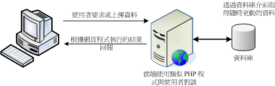
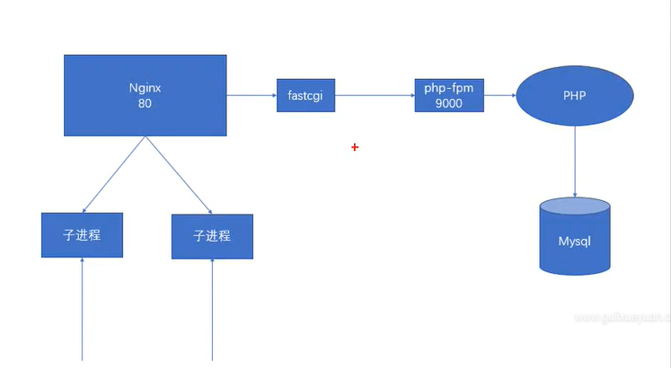
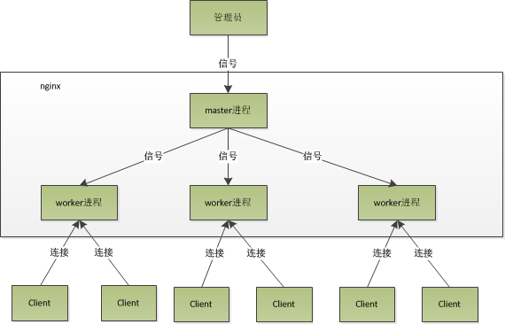
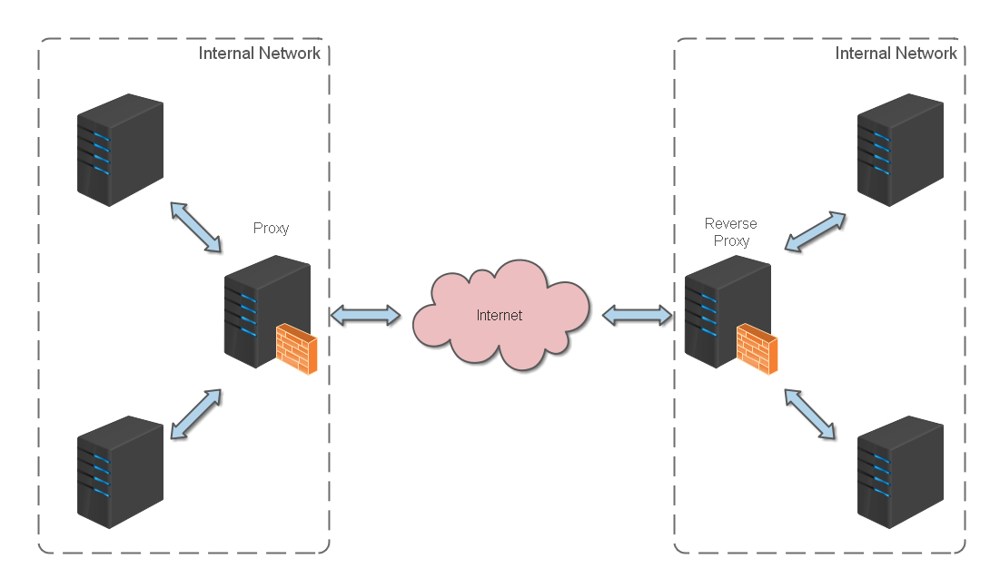

# nginx

## 目录
<!-- vim-markdown-toc GFM -->

* [网站服务介绍](#网站服务介绍)
    * [发展历史](#发展历史)
    * [网站服务器目录资源](#网站服务器目录资源)
    * [仅提供使用者浏览的单向静态网页](#仅提供使用者浏览的单向静态网页)
    * [提供使用者互动介面的动态网站](#提供使用者互动介面的动态网站)
    * [LAMP](#lamp)
    * [LAMP所需的软件和其结构](#lamp所需的软件和其结构)
        * [Apache文件结构](#apache文件结构)
        * [MySQL文件结构](#mysql文件结构)
        * [PHP文件结构](#php文件结构)
* [在讲Nginx之前](#在讲nginx之前)
    * [同步与异步](#同步与异步)
    * [阻塞与非阻塞](#阻塞与非阻塞)
* [nginx概述](#nginx概述)
    * [LNMP架构图](#lnmp架构图)
* [nginx架构](#nginx架构)
    * [kill -HUP pid / nginx -s reload原理](#kill--hup-pid--nginx--s-reload原理)
    * [epoll模型](#epoll模型)
    * [为什么Nginx比其他Web服务器并发高](#为什么nginx比其他web服务器并发高)
        * [上下文切换介绍](#上下文切换介绍)
        * [为什么推荐设置worker个数为cpu核数](#为什么推荐设置worker个数为cpu核数)
* [nginx基本概念](#nginx基本概念)
    * [connection](#connection)
        * [最大连接数](#最大连接数)
        * [连接是如何在多个worker中分配的](#连接是如何在多个worker中分配的)
    * [request（todo）](#requesttodo)
    * [keepalive](#keepalive)
    * [pipe](#pipe)
    * [lingering_close](#lingering_close)
* [nginx的配置系统](#nginx的配置系统)
    * [指令概述](#指令概述)
    * [指令参数](#指令参数)
    * [指令上下文](#指令上下文)
    * [示例配置](#示例配置)
* [nginx的模块体系结构](#nginx的模块体系结构)
    * [模块概述](#模块概述)
    * [模块的分类](#模块的分类)
    * [nginx的请求处理](#nginx的请求处理)
    * [请求的处理流程](#请求的处理流程)
* [nginx健康检查机制](#nginx健康检查机制)
* [nginx实际应用](#nginx实际应用)
    * [nginx常用命令](#nginx常用命令)
    * [http反向代理](#http反向代理)
    * [https反向代理](#https反向代理)
    * [负载均衡](#负载均衡)
        * [负载均衡策略](#负载均衡策略)
            * [轮询](#轮询)
            * [加权轮询](#加权轮询)
            * [最少连接](#最少连接)
            * [加权最少连接](#加权最少连接)
            * [ip hash](#ip-hash)
            * [普通hash](#普通hash)
    * [网站有多个 webapp 的配置](#网站有多个-webapp-的配置)
    * [静态站点](#静态站点)
    * [搭建文件服务器](#搭建文件服务器)
    * [解决跨域](#解决跨域)
    * [nginx配置](#nginx配置)
        * [nginx.conf配置文件示例](#nginxconf配置文件示例)
        * [配置http请求限制和50x路由](#配置http请求限制和50x路由)
        * [隐藏nginx版本](#隐藏nginx版本)
        * [nginx状态统计](#nginx状态统计)
        * [实现网页认证功能：ngx_http_auth_basic_module](#实现网页认证功能ngx_http_auth_basic_module)
        * [实现http跳转到https页面功能](#实现http跳转到https页面功能)
        * [配置web服务器知道客户端的ip地址](#配置web服务器知道客户端的ip地址)
            * [后端real server不使用realip模块](#后端real-server不使用realip模块)
            * [在后端real server上使用realip模块](#在后端real-server上使用realip模块)
        * [主机域名配置文件路径](#主机域名配置文件路径)

<!-- vim-markdown-toc -->

## 网站服务介绍
web架构包括提供资料的网站服务器和负责解析资料的浏览器，网站服务器主要的资料是HTML、多媒体（图片、影视、声音、文字等）

### 发展历史
伯纳斯-李(Tim Berners-Lee) 在1980 年代为了更有效率的让欧洲核子物理实验室的科学家可以分享及更新他们的研究成果， 于是他发展出一个超文件传输协定(Hyper Text Transport Protocol , HTTP)。如同前面提到的，在这个协定上面的伺服器需要软体，而用户端则需要浏览器来解析伺服器所提供的资料。那么这些软体怎么来的？

为了让HTTP 这个协定得以顺利的应用，大约在90 年代初期由伊利诺大学的国家超级电脑应用中心 (NCSA, http://www.ncsa.illinois.edu/ ) 开发出伺服器HTTPd (HTTP daemon 之意)。 HTTPd 为自由软体，所以很快的领导了WWW 伺服器市场。后来网景通讯(Netscape) 开发出更强大的伺服器与相对应的用户端浏览器，那就是大家曾经熟悉的Netscape 这套软体啦。这套软体分为伺服器与浏览器，其中浏览器相对便宜，不过伺服器可就贵的吓人了。所以，在伺服器市场上主要还是以HTTPd 为主的。

后来由于HTTPd 这个伺服器一直没有妥善的发展，于是一群社群朋友便发起一个计画，这个计画主要在改善原本的HTTPd 伺服器软体，他们称这个改良过的软体为Apache，取其『一个修修改改的伺服器(A patch server)』的双关语！ 这个Apache 在1996 年以后便成为WWW 伺服器上市占率最高的软体了 ( http://httpd.apache.org/ )。

### 网站服务器目录资源
举例来说，鸟哥的网站www 资料放置在我主机的/var/www/html/ 当中，所以说：
```
http://linux.vbird.org --> /var/www/html/
http://linux.vbird.org/linux_basic/index.php --> /var/www/html/linux_basic/index.php
```
另外，通常首页目录底下会有个特殊的档案名称，例如index.html 或index.??? 等。举例来说，如果你直接按下： http://linux.vbird.org 会发现其实与http://linux.vbird.org/index.php 是一样的！这是因为WWW 伺服器会主动的以该目录下的『首页』来显示啦！

所以啦，我们的伺服器会由于浏览器传来的要求协定不同而给予不一样的回应资料。

### 仅提供使用者浏览的单向静态网页
这种类型的网站大多是提供『单向静态』的网页，或许有提供一些动画图示，但基本上就仅止于此啦！因为单纯是由伺服器单向提供资料给客户端，Server 不需要与Client 端有互动，所以你可以到该网站上去浏览， 但是无法进行进行资料的上传喔！目前主要的免费虚拟主机大多是这种类型。所以，你只要依照HTML 的语法写好你的网页，并且上传到该网站空间上，那么你的资料就可以让大家浏览了！

### 提供使用者互动介面的动态网站
这种类型的网站可以让伺服器与使用者互动，常见的例如讨论区论坛与留言版，包括一些部落格也都是属于这类型。这类型的网站需要的技术程度比较高，因为他是藉由『网页程式语言』来达成与使用者互动的行为， 常见的例如PHP 网页程式语言，配合MySQL 资料库系统来进行资料的读、写。整个互动可以使用下图来说明：  
  
这就是所谓的伺服器端工作任务介面(Server Side Include, SSI)，因为不论你要求的资料是什么，其实都是透过伺服器端同一支网页程式在负责将资料读出或写入资料库，处理完毕后将结果传给用户端的一种方式，变动的是资料库内的资料，网页程式其实并没有任何改变的。这部份的网页程式包括 PHP, ASP, Perl...很多啦！

另外一种互动式的动态网页主要是在用户端达成的！举例来说，我们可以透过利用所谓的Java scripts 这种语法， 将可执行的程式码(java script) 传送给用户端，用户端的浏览器如果有提供java script 的功能， 那么该程式就可以在用户端的电脑上面运作了。由于程式是在用户端电脑上执行， 因此如果伺服器端所制作的程式是恶意的，那么用户端的电脑就可能会遭到破坏。这也是为啥很多浏览器都已经将一些危险的java script 关闭的原因。

### LAMP
组成：Linux、Apache、PHP、Mysql

Apache：托管文件的服务，负责处理请求并把文件传给用户端，PHP在这上面运行，APache仅能提供最基本的静态网站资料，想要达成动态网站的话需要PHP和MySQL的支持。  
  
PHP：实现页面解析的解析器。用来建立动态网页，PHP可以直接在HTML网页中嵌入，一种编程语言，开源、跨平台、易学习、性能高，与会与数据库交互

MySQL：数据存储

浏览器仅能解析简单的HTML语言，无法直接解析PHP语言

### LAMP所需的软件和其结构
PHP 是挂在Apache 底下执行的一个模组， 而我们要用网页的PHP 程式控制MySQL 时，你的PHP 就得要支援MySQL 的模组才行
```
httpd (提供Apache 主程式)
mysql (MySQL 客户端程式)
mysql-server (MySQL 伺服器程式)
php (PHP 主程式含给apache 使用的模组)
php-devel (PHP 的发展工具，这个与PHP 外挂的加速软体有关)
php-mysql (提供给PHP 程式读取MySQL 资料库的模组)
```
yum install httpd mysql mysql-server php php-mysql

#### Apache文件结构
```
/etc/httpd/conf/httpd.conf (主要设定档)
httpd 最主要的设定档，其实整个Apache 也不过就是这个设定档啦！里面真是包山包海啊！不过很多其他的distribution 都将这个档案拆成数个小档案分别管理不同的参数。但是主要设定档还是以这个档名为主的！你只要找到这个档名就知道如何设定啦！

/etc/httpd/conf.d/*.conf (很多的额外参数档，副档名是.conf)
如果你不想要修改原始设定档httpd.conf 的话，那么可以将你自己的额外参数档独立出来， 例如你想要有自己的额外设定值，可以将他写入/etc/httpd/conf.d/vbird.conf (注意，副档名一定是 .conf 才行) 而启动Apache 时，这个档案就会被读入主要设定档当中了！这有什么好处？好处就是当你系统升级的时候， 你几乎不需要更动原本的设定档，只要将你自己的额外参数档复制到正确的地点即可！维护更方便啦！

/usr/lib64/httpd/modules/, /etc/httpd/modules/
Apache 支援很多的外挂模组，例如php 以及ssl 都是apache 外挂的一种喔！所有你想要使用的模组档案预设是放置在这个目录当中的！

/var/www/html/
这就是我们CentOS 预设的apache 『首页』所在目录啦！当你输入『http://localhost』时所显示的资料， 就是放在这个目录当中的首页档(预设为index.html)。

/var/www/error/
如果因为伺服器设定错误，或者是浏览器端要求的资料错误时，在浏览器上出现的错误讯息就以这个目录的预设讯息为主！

/var/www/icons/
这个目录提供Apache 预设给予的一些小图示，你可以随意使用啊！当你输入『http://localhost/icons/』 时所显示的资料所在。

/var/www/cgi-bin/
预设给一些可执行的CGI (网页程式) 程式放置的目录；当你输入『http://localhost/cgi-bin/』 时所显示的资料所在。

/var/log/httpd/
预设的Apache 登录档都放在这里，对于流量比较大的网站来说，这个目录要很小心， 因为以鸟哥网站的流量来说，一个星期的登录档资料可以大到700MBytes 至1GBytes左右，所以你务必要修改一下你的logrotate 让登录档被压缩，否则...

/usr/sbin/apachectl
这个就是Apache 的主要执行档，这个执行档其实是 shell script而已， 他可以主动的侦测系统上面的一些设定值，好让你启动Apache 时更简单！

/usr/sbin/httpd
呵呵！这个才是主要的Apache 二进位执行档啦！

/usr/bin/htpasswd (Apache 密码保护)
在某些网页当你想要登入时你需要输入帐号与密码对吧！那Apache 本身就提供一个最基本的密码保护方式， 该密码的产生就是透过这个指令来达成的！相关的设定方式我们会在WWW 进阶设定当中说明的。
```

#### MySQL文件结构
```
/etc/my.cnf
这个是MySQL 的设定档，包括你想要进行MySQL 资料库的最佳化，或者是针对MySQL 进行一些额外的参数指定， 都可以在这个档案里面达成的！

/var/lib/mysql/
这个目录则是MySQL 资料库档案放置的所在处啦！当你有启动任何MySQL 的服务时， 请务必记得在备份时，这个目录也要完整的备份下来才行啊！
```

#### PHP文件结构
```
/etc/httpd/conf.d/php.conf
那你要不要手动将该模组写入httpd.conf 当中？不需要的，因为系统主动将PHP 设定参数写入这个档案中了！而这个档案会在Apache 重新启动时被读入，所以OK 的啦！

/etc/php.ini
就是PHP 的主要设定档，包括你的PHP 能不能允许使用者上传档案？能不能允许某些低安全性的标志等等， 都在这个设定档当中设定的啦！

/usr/lib64/httpd/modules/libphp5.so
PHP 这个软体提供给Apache 使用的模组！这也是我们能否在Apache 网页上面设计PHP 程式语言的最重要的咚咚！务必要存在才行！

/etc/php.d/mysql.ini, /usr/lib64/php/modules/mysql.so
你的PHP 是否可以支援MySQL 介面呢？就看这两个东西啦！这两个咚咚是由php-mysql 软体提供的呢！

/usr/bin/phpize, /usr/include/php/
如果你未来想要安装类似PHP 加速器以让浏览速度加快的话，那么这个档案与目录就得要存在， 否则加速器软体可无法编译成功喔！这两个资料也是php-devel 软体所提供的啦！
```

## 在讲Nginx之前

### 同步与异步
同步与异步的重点在消息通知的方式上，也就是调用结果的通知方式不同。

同步：当一个同步调用发送出去之后，调用者要一直等待调用的结果通知后，才能进行后续的执行。  
异步：当一个异步调用发出去之后，调用者不必一直等待调用结果的返回，异步调用，要想获得结果，一般有两种方式：  
1. 主动轮询异步调用的结果。
2. 被调用方通过callback（回调通知）来通知调用方调用结果。

### 阻塞与非阻塞
阻塞和非阻塞的重点在于进/线程等待消息的时候的行为，也就是在等待消息的时候，当进/线程是挂起状态，还是非挂起状态。

阻塞：调用在发出去之后，在消息返回之前，当前进/线程会被挂起，直到有消息返回，当前进/线程才会被激活。  
非阻塞：调用在发出去后，不会阻塞当前进/线程，而会立即返回。

## nginx概述
nginx是一款轻量级web服务器/反向代理服务器以及电子邮件（IMAP/POP3）代理服务器，在BSD-like协议下发行。特点是占有内存少，并发能力强。第一个公开版本发布于2004-10-4

### LNMP架构图


## nginx架构
nginx在启动后，会有一个master进程和多个woker进程。master进程主要用来管理worker进程，包含：接收来自外界的信号，向各worker进程发送信号，监控worker进程的运行状态，当woker进程退出后（异常情况下），会自动重新启动新的worker进程。而基本的网络事件，则是放在了worker进程中来处理了。多个worker进程之间是对等的，他们同等竞争来自客户端的请求，各进程互相之间是独立的。一个请求，只可能在一个worker进程中处理，一个worker进程，不可能处理其他进程的请求。woker进程的个数是可以设置的，一般我们会设置与cpu核数一致，这里面的原因与nginx的进程模型以及事件处理模型是分不开的。nginx的进程模型，可以由下图来表示：   
  

### kill -HUP pid / nginx -s reload原理
首先master进程在接收到信号后，会先重新加载配置文件，然后再启动新的worker进程，并向所有老的worker进程发送信号，告诉他们可以光荣退休了。新的worker再启动后，就开始接收新的请求，而老的worker在收到来自master的信号后，就不再接收新的请求，并在当前进程中的所有未处理完的请求处理完后，再退出。

Apache同步阻塞，Nginx异步非阻塞

### epoll模型
当连接有I/O事件产生的时候，epoll就会告诉进程哪个连接有I/O事建产生，然后进程就去处理这个事件。

### 为什么Nginx比其他Web服务器并发高
Nginx配置use epool后，以异步非阻塞方式工作，能够轻松处理百万级的并发连接。  

处理过程：每当一个request，会有一个worker进程去处理，但不是全程的处理，处理到可能发生阻塞的地方。比如向后端服务转发request，并等待请求返回。那么，这个处理的worker不会这么傻等着，他会在发送请求后，注册一个事建：“如果后端服务器返回了，告诉我一声，我再接着干“。于是他就去休息去了。此时，如果再有新的request进来，他就可以很快再按照这种方式处理。而一旦后端服务器
返回了，就会触发这个事件，worker才会来接手，这个request才会接着往下走。通过这种快速处理，快速释放请求的方式，达到同样的配置可以处理更大并发量的目的。

由于work中线程只有一个，所以能同时处理的请求也只有一个，只是在请求间进行不断的切换而已，切换也是因为异步事件未准备好，而主动让出的。这里的切换是没有任何代价的，可以理解为循环处理多个准备好的事件。与多线程相比，这种事件处理方式有很大的优势，不需要创建线程，每个请求占用的内存也很少，没有上下文切换，事件处理非常的轻量级。并发数再多也不会导致无谓的资源浪费（上下文切换）。更多的并发数，只会占用更多的内存而已。

#### 上下文切换介绍
上下文切换是指操作系统在多任务环境下，将CPU从一个正在运行的进程或线程切换到另一个进程或线程的过程。在多任务操作系统中，有多个进程或线程可以同时运行，但是由于 CPU 只能同时执行一个任务，因此需要通过上下文切换来实现多任务的并发执行。

当操作系统决定要切换到另一个进程或线程时，它会保存当前执行进程或线程的状态（称为上下文），包括寄存器的内容、程序计数器的值、内存映像等。然后，操作系统会加载下一个要执行的进程或线程的状态，使其可以继续执行。这个过程涉及保存和恢复大量的状态信息，因此会消耗一定的系统资源和时间。

上下文切换是实现多任务调度的重要机制，它允许操作系统在不同的进程或线程之间进行快速切换，以实现对系统资源的有效利用和任务的高效执行。然而，频繁的上下文切换可能会带来一定的性能开销，因此在设计和实现操作系统时，需要权衡上下文切换的频率和系统的响应性能。

#### 为什么推荐设置worker个数为cpu核数
更多的worker数，只会导致进程来竞争cpu资源，从而带来不必要的上下文切换。而且，nginx为了更好的利用多核特性，提供了cpu亲缘性的绑定选项，我们可以将某一个进程绑定再某一个核上，这样就不会因为进程的切换带来cache的失效。像这种小的优化在nginx中非常常见，同时也说明了nginx作者的苦心孤诣。比如，nginx在做4个字节的字符串比较时，会将4个字符转换成一个int型，再作比较，以减少cpu的指令数等等。

## nginx基本概念

### connection
在nginx中connection就是对tcp连接的封装，其中包括连接的socket，读事件，写事件。利用nginx封装的connection，我们可以很方便的使用nginx来处理与连接相关的事情，比如，建立连接，发送与接受数据等。而nginx中的http请求的处理就是建立在connection之上的，所以nginx不仅可以作为一个web服务器，也可以作为邮件服务器。当然，利用nginx提供的connection，我们可以与任何后端服务打交道。

结合一个tcp连接的生命周期，我们看看nginx是如何处理一个连接的。首先，nginx在启动时，会解析配置文件，得到需要监听的端口与ip地址，然后在nginx的master进程里面，先初始化好这个监控的socket(创建socket，设置addrreuse等选项，绑定到指定的ip地址端口，再listen)，然后再fork出多个子进程出来，然后子进程会竞争accept新的连接。此时，客户端就可以向nginx发起连接了。当客户端与服务端通过三次握手建立好一个连接后，nginx的某一个子进程会accept成功，得到这个建立好的连接的socket，然后创建nginx对连接的封装，即ngx_connection_t结构体。接着，设置读写事件处理函数并添加读写事件来与客户端进行数据的交换。最后，nginx或客户端来主动关掉连接，到此，一个连接就寿终正寝了。

当然，nginx也是可以作为客户端来请求其它server的数据的（如upstream模块），此时，与其它server创建的连接，也封装在ngx_connection_t中。作为客户端，nginx先获取一个ngx_connection_t结构体，然后创建socket，并设置socket的属性（ 比如非阻塞）。然后再通过添加读写事件，调用connect/read/write来调用连接，最后关掉连接，并释放ngx_connection_t。

#### 最大连接数
在nginx中，每个进程会有一个连接数的最大上限，这个上限与系统对fd的限制不一样。在操作系统中，通过ulimit -n，我们可以得到一个进程所能够打开的fd的最大数，即nofile，因为每个socket连接会占用掉一个fd，所以这也会限制我们进程的最大连接数，当然也会直接影响到我们程序所能支持的最大并发数，当fd用完后，再创建socket时，就会失败。nginx通过设置worker_connectons来设置每个进程支持的最大连接数。如果该值大于nofile，那么实际的最大连接数是nofile，nginx会有警告。nginx在实现时，是通过一个连接池来管理的，每个worker进程都有一个独立的连接池，连接池的大小是worker_connections。这里的连接池里面保存的其实不是真实的连接，它只是一个worker_connections大小的一个ngx_connection_t结构的数组。并且，nginx会通过一个链表free_connections来保存所有的空闲ngx_connection_t，每次获取一个连接时，就从空闲连接链表中获取一个，用完后，再放回空闲连接链表里面。

在这里，很多人会误解worker_connections这个参数的意思，认为这个值就是nginx所能建立连接的最大值。其实不然，这个值是表示每个worker进程所能建立连接的最大值，所以，一个nginx能建立的最大连接数，应该是worker_connections * worker_processes。当然，这里说的是最大连接数，对于HTTP请求本地资源来说，能够支持的最大并发数量是worker_connections * worker_processes，而如果是HTTP作为反向代理来说，最大并发数量应该是worker_connections * worker_processes/2。因为作为反向代理服务器，每个并发会建立与客户端的连接和与后端服务的连接，会占用两个连接。

#### 连接是如何在多个worker中分配的
那么，我们前面有说过一个客户端连接过来后，多个空闲的进程，会竞争这个连接，很容易看到，这种竞争会导致不公平，如果某个进程得到accept的机会比较多，它的空闲连接很快就用完了，如果不提前做一些控制，当accept到一个新的tcp连接后，因为无法得到空闲连接，而且无法将此连接转交给其它进程，最终会导致此tcp连接得不到处理，就中止掉了。很显然，这是不公平的，有的进程有空余连接，却没有处理机会，有的进程因为没有空余连接，却人为地丢弃连接。那么，如何解决这个问题呢？首先，nginx的处理得先打开accept_mutex选项，此时，只有获得了accept_mutex的进程才会去添加accept事件，也就是说，nginx会控制进程是否添加accept事件。nginx使用一个叫ngx_accept_disabled的变量来控制是否去竞争accept_mutex锁。在第一段代码中，计算ngx_accept_disabled的值，这个值是nginx单进程的所有连接总数的八分之一，减去剩下的空闲连接数量，得到的这个ngx_accept_disabled有一个规律，当剩余连接数小于总连接数的八分之一时，其值才大于0，而且剩余的连接数越小，这个值越大。再看第二段代码，当ngx_accept_disabled大于0时，不会去尝试获取accept_mutex锁，并且将ngx_accept_disabled减1，于是，每次执行到此处时，都会去减1，直到小于0。不去获取accept_mutex锁，就是等于让出获取连接的机会，很显然可以看出，当空余连接越少时，ngx_accept_disable越大，于是让出的机会就越多，这样其它进程获取锁的机会也就越大。不去accept，自己的连接就控制下来了，其它进程的连接池就会得到利用，这样，nginx就控制了多进程间连接的平衡了。
```
ngx_accept_disabled = ngx_cycle->connection_n / 8
    - ngx_cycle->free_connection_n;

if (ngx_accept_disabled > 0) {
    ngx_accept_disabled--;

} else {
    if (ngx_trylock_accept_mutex(cycle) == NGX_ERROR) {
        return;
    }

    if (ngx_accept_mutex_held) {
        flags |= NGX_POST_EVENTS;

    } else {
        if (timer == NGX_TIMER_INFINITE
                || timer > ngx_accept_mutex_delay)
        {
            timer = ngx_accept_mutex_delay;
        }
    }
}
```

### request（todo）

### keepalive
当然，在nginx中，对于http1.0与http1.1也是支持长连接的。什么是长连接呢？我们知道，http请求是基于TCP协议之上的，那么，当客户端在发起请求前，需要先与服务端建立TCP连接，而每一次的TCP连接是需要三次握手来确定的，如果客户端与服务端之间网络差一点，这三次交互消费的时间会比较多，而且三次交互也会带来网络流量。当然，当连接断开后，也会有四次的交互，当然对用户体验来说就不重要了。而http请求是请求应答式的，如果我们能知道每个请求头与响应体的长度，那么我们是可以在一个连接上面执行多个请求的，这就是所谓的长连接，但前提条件是我们先得确定请求头与响应体的长度。对于请求来说，如果当前请求需要有body，如POST请求，那么nginx就需要客户端在请求头中指定content-length来表明body的大小，否则返回400错误。也就是说，请求体的长度是确定的，那么响应体的长度呢？先来看看http协议中关于响应body长度的确定：

对于http1.0协议来说，如果响应头中有content-length头，则以content-length的长度就可以知道body的长度了，客户端在接收body时，就可以依照这个长度来接收数据，接收完后，就表示这个请求完成了。而如果没有content-length头，则客户端会一直接收数据，直到服务端主动断开连接，才表示body接收完了。
而对于http1.1协议来说，如果响应头中的Transfer-encoding为chunked传输，则表示body是流式输出，body会被分成多个块，每块的开始会标识出当前块的长度，此时，body不需要通过长度来指定。如果是非chunked传输，而且有content-length，则按照content-length来接收数据。否则，如果是非chunked，并且没有content-length，则客户端接收数据，直到服务端主动断开连接。
从上面，我们可以看到，除了http1.0不带content-length以及http1.1非chunked不带content-length外，body的长度是可知的。此时，当服务端在输出完body之后，会可以考虑使用长连接。能否使用长连接，也是有条件限制的。如果客户端的请求头中的connection为close，则表示客户端需要关掉长连接，如果为keep-alive，则客户端需要打开长连接，如果客户端的请求中没有connection这个头，那么根据协议，如果是http1.0，则默认为close，如果是http1.1，则默认为keep-alive。如果结果为keepalive，那么，nginx在输出完响应体后，会设置当前连接的keepalive属性，然后等待客户端下一次请求。当然，nginx不可能一直等待下去，如果客户端一直不发数据过来，岂不是一直占用这个连接？所以当nginx设置了keepalive等待下一次的请求时，同时也会设置一个最大等待时间，这个时间是通过选项keepalive_timeout来配置的，如果配置为0，则表示关掉keepalive，此时，http版本无论是1.1还是1.0，客户端的connection不管是close还是keepalive，都会强制为close。

如果服务端最后的决定是keepalive打开，那么在响应的http头里面，也会包含有connection头域，其值是”Keep-Alive”，否则就是”Close”。如果connection值为close，那么在nginx响应完数据后，会主动关掉连接。所以，对于请求量比较大的nginx来说，关掉keepalive最后会产生比较多的time-wait状态的socket。一般来说，当客户端的一次访问，需要多次访问同一个server时，打开keepalive的优势非常大，比如图片服务器，通常一个网页会包含很多个图片。打开keepalive也会大量减少time-wait的数量

### pipe 
在http1.1中，引入了一种新的特性，即pipeline。那么什么是pipeline呢？pipeline其实就是流水线作业，它可以看作为keepalive的一种升华，因为pipeline也是基于长连接的，目的就是利用一个连接做多次请求。如果客户端要提交多个请求，对于keepalive来说，那么第二个请求，必须要等到第一个请求的响应接收完全后，才能发起，这和TCP的停止等待协议是一样的，得到两个响应的时间至少为`2*RTT`。而对pipeline来说，客户端不必等到第一个请求处理完后，就可以马上发起第二个请求。得到两个响应的时间可能能够达到`1*RTT`。nginx是直接支持pipeline的，但是，nginx对pipeline中的多个请求的处理却不是并行的，依然是一个请求接一个请求的处理，只是在处理第一个请求的时候，客户端就可以发起第二个请求。这样，nginx利用pipeline减少了处理完一个请求后，等待第二个请求的请求头数据的时间。其实nginx的做法很简单，前面说到，nginx在读取数据时，会将读取的数据放到一个buffer里面，所以，如果nginx在处理完前一个请求后，如果发现buffer里面还有数据，就认为剩下的数据是下一个请求的开始，然后就接下来处理下一个请求，否则就设置keepalive

### lingering_close
lingering_close，字面意思就是延迟关闭，也就是说，当nginx要关闭连接时，并非立即关闭连接，而是先关闭tcp连接的写，再等待一段时间后再关掉连接的读。为什么要这样呢？我们先来看看这样一个场景。nginx在接收客户端的请求时，可能由于客户端或服务端出错了，要立即响应错误信息给客户端，而nginx在响应错误信息后，大分部情况下是需要关闭当前连接。nginx执行完write()系统调用把错误信息发送给客户端，write()系统调用返回成功并不表示数据已经发送到客户端，有可能还在tcp连接的write buffer里。接着如果直接执行close()系统调用关闭tcp连接，内核会首先检查tcp的read buffer里有没有客户端发送过来的数据留在内核态没有被用户态进程读取，如果有则发送给客户端RST报文来关闭tcp连接丢弃write buffer里的数据，如果没有则等待write buffer里的数据发送完毕，然后再经过正常的4次分手报文断开连接。所以,当在某些场景下出现tcp write buffer里的数据在write()系统调用之后到close()系统调用执行之前没有发送完毕，且tcp read buffer里面还有数据没有读，close()系统调用会导致客户端收到RST报文且不会拿到服务端发送过来的错误信息数据。那客户端肯定会想，这服务器好霸道，动不动就reset我的连接，连个错误信息都没有。

在上面这个场景中，我们可以看到，关键点是服务端给客户端发送了RST包，导致自己发送的数据在客户端忽略掉了。所以，解决问题的重点是，让服务端别发RST包。再想想，我们发送RST是因为我们关掉了连接，关掉连接是因为我们不想再处理此连接了，也不会有任何数据产生了。对于全双工的TCP连接来说，我们只需要关掉写就行了，读可以继续进行，我们只需要丢掉读到的任何数据就行了，这样的话，当我们关掉连接后，客户端再发过来的数据，就不会再收到RST了。当然最终我们还是需要关掉这个读端的，所以我们会设置一个超时时间，在这个时间过后，就关掉读，客户端再发送数据来就不管了，作为服务端我会认为，都这么长时间了，发给你的错误信息也应该读到了，再慢就不关我事了，要怪就怪你RP不好了。当然，正常的客户端，在读取到数据后，会关掉连接，此时服务端就会在超时时间内关掉读端。这些正是lingering_close所做的事情。协议栈提供 SO_LINGER 这个选项，它的一种配置情况就是来处理lingering_close的情况的，不过nginx是自己实现的lingering_close。lingering_close存在的意义就是来读取剩下的客户端发来的数据，所以nginx会有一个读超时时间，通过lingering_timeout选项来设置，如果在lingering_timeout时间内还没有收到数据，则直接关掉连接。nginx还支持设置一个总的读取时间，通过lingering_time来设置，这个时间也就是nginx在关闭写之后，保留socket的时间，客户端需要在这个时间内发送完所有的数据，否则nginx在这个时间过后，会直接关掉连接。当然，nginx是支持配置是否打开lingering_close选项的，通过lingering_close选项来配置。 那么，我们在实际应用中，是否应该打开lingering_close呢？这个就没有固定的推荐值了，如Maxim Dounin所说，lingering_close的主要作用是保持更好的客户端兼容性，但是却需要消耗更多的额外资源（比如连接会一直占着）。

## nginx的配置系统
nginx的配置系统由一个主配置文件和其他一些辅助的配置文件构成。这些配置文件均是纯文本文件，全部位于nginx安装目录下的conf目录下。

配置文件中以#开始的行，或者是前面有若干空格或者TAB，然后再跟#的行，都被认为是注释，也就是只对编辑查看文件的用户有意义，程序在读取这些注释行的时候，其实际的内容是被忽略的。

由于除主配置文件nginx.conf以外的文件都是在某些情况下才使用的，而只有主配置文件是在任何情况下都被使用的。所以在这里我们就以主配置文件为例，来解释nginx的配置系统。

在nginx.conf中，包含若干配置项。每个配置项由配置指令和指令参数2个部分构成。指令参数也就是配置指令对应的配置值。

### 指令概述
配置指令是一个字符串，可以用单引号或者双引号括起来，也可以不括。但是如果配置指令包含空格，一定要引起来。

### 指令参数
指令的参数使用一个或者多个空格或者TAB字符与指令分开。指令的参数有一个或者多个TOKEN串组成。TOKEN串之间由空格或者TAB键分隔。

TOKEN串分为简单字符串或者是复合配置块。复合配置块即是由大括号括起来的一堆内容。一个复合配置块中可能包含若干其他的配置指令。

如果一个配置指令的参数全部由简单字符串构成，也就是不包含复合配置块，那么我们就说这个配置指令是一个简单配置项，否则称之为复杂配置项。例如下面这个是一个简单配置项：
```
error_page   500 502 503 504  /50x.html;
```

对于简单配置，配置项的结尾使用分号结束。对于复杂配置项，包含多个TOKEN串的，一般都是简单TOKEN串放在前面，复合配置块一般位于最后，而且其结尾，并不需要再添加分号。例如下面这个复杂配置项：
```
location / {
    root   /home/jizhao/nginx-book/build/html;
    index  index.html index.htm;
}
```

### 指令上下文
nginx.conf中的配置信息，根据其逻辑上的意义，对它们进行了分类，也就是分成了多个作用域，或者称之为配置指令上下文。不同的作用域含有一个或者多个配置项。

当前nginx支持的几个指令上下文：
```
main:   nginx在运行时与具体业务功能（比如http服务或者email服务代理）无关的一些参数，比如工作进程数，运行的身份等。
http:   与提供http服务相关的一些配置参数。例如：是否使用keepalive啊，是否使用gzip进行压缩等。
server: http服务上支持若干虚拟主机。每个虚拟主机一个对应的server配置项，配置项里面包含该虚拟主机相关的配置。在提供mail服务的代理时，也可以建立若干server.每个server通过监听的地址来区分。
location:   http服务中，某些特定的URL对应的一系列配置项。
mail:   实现email相关的SMTP/IMAP/POP3代理时，共享的一些配置项（因为可能实现多个代理，工作在多个监听地址上）。
```
指令上下文，可能有包含的情况出现。例如：通常http上下文和mail上下文一定是出现在main上下文里的。在一个上下文里，可能包含另外一种类型的上下文多次。例如：如果http服务，支持了多个虚拟主机，那么在http上下文里，就会出现多个server上下文。

### 示例配置
```
user  nobody;
worker_processes  1;
error_log  logs/error.log  info;

events {
    worker_connections  1024;
}

http {
    server {
        listen          80;
        server_name     www.linuxidc.com;
        access_log      logs/linuxidc.access.log main;
        location / {
            index index.html;
            root  /var/www/linuxidc.com/htdocs;
        }
    }

    server {
        listen          80;
        server_name     www.Androidj.com;
        access_log      logs/androidj.access.log main;
        location / {
            index index.html;
            root  /var/www/androidj.com/htdocs;
        }
    }
}

mail {
    auth_http  127.0.0.1:80/auth.php;
    pop3_capabilities  "TOP"  "USER";
    imap_capabilities  "IMAP4rev1"  "UIDPLUS";

    server {
        listen     110;
        protocol   pop3;
        proxy      on;
    }
    server {
        listen      25;
        protocol    smtp;
        proxy       on;
        smtp_auth   login plain;
        xclient     off;
    }
}
```
在这个配置中，上面提到个五种配置指令上下文都存在。
```
存在于main上下文中的配置指令如下:

user
worker_processes
error_log
events
http
mail
存在于http上下文中的指令如下:

server
存在于mail上下文中的指令如下：

server
auth_http
imap_capabilities
存在于server上下文中的配置指令如下：

listen
server_name
access_log
location
protocol
proxy
smtp_auth
xclient
存在于location上下文中的指令如下：

index
root
当然，这里只是一些示例。具体有哪些配置指令，以及这些配置指令可以出现在什么样的上下文中，需要参考nginx的使用文档。
```

## nginx的模块体系结构
nginx的内部结构是由核心部分和一系列的功能模块所组成。这样划分是为了使得每个模块的功能相对简单，便于开发，同时也便于对系统进行功能扩展。为了便于描述，下文中我们将使用nginx core来称呼nginx的核心功能部分。

nginx提供了web服务器的基础功能，同时提供了web服务反向代理，email服务反向代理功能。nginx core实现了底层的通讯协议，为其他模块和nginx进程构建了基本的运行时环境，并且构建了其他各模块的协作基础。除此之外，或者说大部分与协议相关的，或者应用相关的功能都是在这些模块中所实现的。

### 模块概述
nginx将各功能模块组织成一条链，当有请求到达的时候，请求依次经过这条链上的部分或者全部模块，进行处理。每个模块实现特定的功能。例如，实现对请求解压缩的模块，实现SSI的模块，实现与上游服务器进行通讯的模块，实现与FastCGI服务进行通讯的模块。

有两个模块比较特殊，他们居于nginx core和各功能模块的中间。这两个模块就是http模块和mail模块。这2个模块在nginx core之上实现了另外一层抽象，处理与HTTP协议和email相关协议（SMTP/POP3/IMAP）有关的事件，并且确保这些事件能被以正确的顺序调用其他的一些功能模块。

目前HTTP协议是被实现在http模块中的，但是有可能将来被剥离到一个单独的模块中，以扩展nginx支持SPDY协议。

### 模块的分类
nginx的模块根据其功能基本上可以分为以下几种类型：
```
event module:   搭建了独立于操作系统的事件处理机制的框架，及提供了各具体事件的处理。包括ngx_events_module， ngx_event_core_module和ngx_epoll_module等。nginx具体使用何种事件处理模块，这依赖于具体的操作系统和编译选项。
phase handler:  此类型的模块也被直接称为handler模块。主要负责处理客户端请求并产生待响应内容，比如ngx_http_static_module模块，负责客户端的静态页面请求处理并将对应的磁盘文件准备为响应内容输出。
output filter:  也称为filter模块，主要是负责对输出的内容进行处理，可以对输出进行修改。例如，可以实现对输出的所有html页面增加预定义的footbar一类的工作，或者对输出的图片的URL进行替换之类的工作。
upstream:   upstream模块实现反向代理的功能，将真正的请求转发到后端服务器上，并从后端服务器上读取响应，发回客户端。upstream模块是一种特殊的handler，只不过响应内容不是真正由自己产生的，而是从后端服务器上读取的。
load-balancer:  负载均衡模块，实现特定的算法，在众多的后端服务器中，选择一个服务器出来作为某个请求的转发服务器。
```

### nginx的请求处理
nginx使用一个多进程模型来对外提供服务，其中一个master进程，多个worker进程。master进程负责管理nginx本身和其他worker进程。

所有实际上的业务处理逻辑都在worker进程。worker进程中有一个函数，执行无限循环，不断处理收到的来自客户端的请求，并进行处理，直到整个nginx服务被停止。

worker进程中，ngx_worker_process_cycle()函数就是这个无限循环的处理函数。在这个函数中，一个请求的简单处理流程如下：

1. 操作系统提供的机制（例如epoll, kqueue等）产生相关的事件。
2. 接收和处理这些事件，如是接受到数据，则产生更高层的request对象。
3. 处理request的header和body。
4. 产生响应，并发送回客户端。
5. 完成request的处理。
6. 重新初始化定时器及其他事件。

### 请求的处理流程
为了让大家更好的了解nginx中请求处理过程，我们以HTTP Request为例，来做一下详细地说明。

从nginx的内部来看，一个HTTP Request的处理过程涉及到以下几个阶段。

1. 初始化HTTP Request（读取来自客户端的数据，生成HTTP Request对象，该对象含有该请求所有的信息）。
2. 处理请求头。
3. 处理请求体。
4. 如果有的话，调用与此请求（URL或者Location）关联的handler。
5. 依次调用各phase handler进行处理。

在这里，我们需要了解一下phase handler这个概念。phase字面的意思，就是阶段。所以phase handlers也就好理解了，就是包含若干个处理阶段的一些handler。

在每一个阶段，包含有若干个handler，再处理到某个阶段的时候，依次调用该阶段的handler对HTTP Request进行处理。

通常情况下，一个phase handler对这个request进行处理，并产生一些输出。通常phase handler是与定义在配置文件中的某个location相关联的。

一个phase handler通常执行以下几项任务：

1. 获取location配置。
2. 产生适当的响应。
3. 发送response header。
4. 发送response body。

当nginx读取到一个HTTP Request的header的时候，nginx首先查找与这个请求关联的虚拟主机的配置。如果找到了这个虚拟主机的配置，那么通常情况下，这个HTTP Request将会经过以下几个阶段的处理（phase handlers）
```
NGX_HTTP_POST_READ_PHASE:
    读取请求内容阶段
NGX_HTTP_SERVER_REWRITE_PHASE:
    Server请求地址重写阶段
NGX_HTTP_FIND_CONFIG_PHASE:
    配置查找阶段:
NGX_HTTP_REWRITE_PHASE:
    Location请求地址重写阶段
NGX_HTTP_POST_REWRITE_PHASE:
    请求地址重写提交阶段
NGX_HTTP_PREACCESS_PHASE:
    访问权限检查准备阶段
NGX_HTTP_ACCESS_PHASE:
    访问权限检查阶段
NGX_HTTP_POST_ACCESS_PHASE:
    访问权限检查提交阶段
NGX_HTTP_TRY_FILES_PHASE:
    配置项try_files处理阶段
NGX_HTTP_CONTENT_PHASE:
    内容产生阶段
NGX_HTTP_LOG_PHASE:
    日志模块处理阶段
```
quest产生正确的响应，nginx必须把这个request交给一个合适的content handler去处理。如果这个request对应的location在配置文件中被明确指定了一个content handler，那么nginx就可以通过对location的匹配，直接找到这个对应的handler，并把这个request交给这个content handler去处理。这样的配置指令包括像，perl，flv，proxy_pass，mp4等。

如果一个request对应的location并没有直接有配置的content handler，那么nginx依次尝试:

1. 如果一个location里面有配置 random_index on，那么随机选择一个文件，发送给客户端。
2. 如果一个location里面有配置 index指令，那么发送index指令指明的文件，给客户端。
3. 如果一个location里面有配置 autoindex on，那么就发送请求地址对应的服务端路径下的文件列表给客户端。
4. 如果这个request对应的location上有设置gzip_static on，那么就查找是否有对应的.gz文件存在，有的话，就发送这个给客户端（客户端支持gzip的情况下）。
5. 请求的URI如果对应一个静态文件，static module就发送静态文件的内容到客户端。

内容产生阶段完成以后，生成的输出会被传递到filter模块去进行处理。filter模块也是与location相关的。所有的fiter模块都被组织成一条链。输出会依次穿越所有的filter，直到有一个filter模块的返回值表明已经处理完成。

内容产生阶段完成以后，生成的输出会被传递到filter模块去进行处理。filter模块也是与location相关的。所有的fiter模块都被组织成一条链。输出会依次穿越所有的filter，直到有一个filter模块的返回值表明已经处理完成。

这里列举几个常见的filter模块，例如：

1. server-side includes。
2. XSLT filtering。
3. 图像缩放之类的。
4. gzip压缩。

在所有的filter中，有几个filter模块需要关注一下。按照调用的顺序依次说明如下：
```
write:  写输出到客户端，实际上是写到连接对应的socket上。
postpone:   这个filter是负责subrequest的，也就是子请求的。
copy:   将一些需要复制的buf(文件或者内存)重新复制一份然后交给剩余的body filter处理。
```

## nginx健康检查机制

https://mp.weixin.qq.com/s/VyWfY6ad0gW9mmMonJ69bQ


## nginx实际应用

### nginx常用命令
```
nginx -s stop       快速关闭Nginx，可能不保存相关信息，并迅速终止web服务。
nginx -s quit       平稳关闭Nginx，保存相关信息，有安排的结束web服务。
nginx -s reload     因改变了Nginx相关配置，需要重新加载配置而重载。
nginx -s reopen     重新打开日志文件。
nginx -c filename   为 Nginx 指定一个配置文件，来代替缺省的。
nginx -t            不运行，仅仅测试配置文件。nginx 将检查配置文件的语法的正确性，并尝试打开配置文件中所引用到的文件。
nginx -v            显示 nginx 的版本。
nginx -V            显示 nginx 的版本，编译器版本和配置参数。
```

### http反向代理

```
#运行用户
#user somebody;

#启动进程,通常设置成和cpu的数量相等
worker_processes  1;

#全局错误日志
error_log  D:/Tools/nginx-1.10.1/logs/error.log;
error_log  D:/Tools/nginx-1.10.1/logs/notice.log  notice;
error_log  D:/Tools/nginx-1.10.1/logs/info.log  info;

#PID文件，记录当前启动的nginx的进程ID
pid        D:/Tools/nginx-1.10.1/logs/nginx.pid;

#工作模式及连接数上限
events {
    worker_connections 1024;    #单个后台worker process进程的最大并发链接数
}

#设定http服务器，利用它的反向代理功能提供负载均衡支持
http {
    #设定mime类型(邮件支持类型),类型由mime.types文件定义
    include       D:/Tools/nginx-1.10.1/conf/mime.types;
    default_type  application/octet-stream;

    #设定日志
    log_format  main  '[$remote_addr] - [$remote_user] [$time_local] "$request" '
                      '$status $body_bytes_sent "$http_referer" '
                      '"$http_user_agent" "$http_x_forwarded_for"';

    access_log    D:/Tools/nginx-1.10.1/logs/access.log main;
    rewrite_log     on;

    #sendfile 指令指定 nginx 是否调用 sendfile 函数（zero copy 方式）来输出文件，对于普通应用，
    #必须设为 on,如果用来进行下载等应用磁盘IO重负载应用，可设置为 off，以平衡磁盘与网络I/O处理速度，降低系统的uptime.
    sendfile        on;
    #tcp_nopush     on;

    #连接超时时间
    keepalive_timeout  120;
    tcp_nodelay        on;

    #gzip压缩开关
    #gzip  on;

    #设定实际的服务器列表
    upstream zp_server1{
        server 127.0.0.1:8089;
    }

    #HTTP服务器
    server {
        #监听80端口，80端口是知名端口号，用于HTTP协议
        listen       80;

        #定义使用www.xx.com访问
        server_name  www.helloworld.com;

        #首页
        index index.html

        #指向webapp的目录
        root D:\01_Workspace\Project\github\zp\SpringNotes\spring-security\spring-shiro\src\main\webapp;

        #编码格式
        charset utf-8;

        #代理配置参数
        proxy_connect_timeout 180;
        proxy_send_timeout 180;
        proxy_read_timeout 180;
        proxy_set_header Host $host;
        proxy_set_header X-Forwarder-For $remote_addr;

        #反向代理的路径（和upstream绑定），location 后面设置映射的路径
        location / {
            proxy_pass http://zp_server1;
        }

        #静态文件，nginx自己处理
        location ~ ^/(images|javascript|js|css|flash|media|static)/ {
            root D:\01_Workspace\Project\github\zp\SpringNotes\spring-security\spring-shiro\src\main\webapp\views;
            #过期30天，静态文件不怎么更新，过期可以设大一点，如果频繁更新，则可以设置得小一点。
            expires 30d;
        }

        #设定查看Nginx状态的地址
        location /NginxStatus {
            stub_status           on;
            access_log            on;
            auth_basic            "NginxStatus";
            auth_basic_user_file  conf/htpasswd;
        }

        #禁止访问 .htxxx 文件
        location ~ /\.ht {
            deny all;
        }

        #错误处理页面（可选择性配置）
        #error_page   404              /404.html;
        #error_page   500 502 503 504  /50x.html;
        #location = /50x.html {
        #    root   html;
        #}
    }
}
```
好了，让我们来试试吧：
1. 启动 webapp，注意启动绑定的端口要和 nginx 中的 upstream 设置的端口保持一致。
2. 更改 host：在 C:\Windows\System32\drivers\etc 目录下的 host 文件中添加一条 DNS 记录  
127.0.0.1 www.helloworld.com
3. 启动前文中 startup.bat 的命令
4. 在浏览器中访问 www.helloworld.com，不出意外，已经可以访问了。

### https反向代理
一些对安全性要求比较高的站点，可能会使用 HTTPS（一种使用 ssl 通信标准的安全 HTTP 协议）。

这里不科普 HTTP 协议和 SSL 标准。但是，使用 nginx 配置 https 需要知道几点：
```
HTTPS 的固定端口号是 443，不同于 HTTP 的 80 端口
SSL 标准需要引入安全证书，所以在 nginx.conf 中你需要指定证书和它对应的 key
```
其他和 http 反向代理基本一样，只是在 Server 部分配置有些不同。
```
  #HTTP服务器
  server {
      #监听443端口。443为知名端口号，主要用于HTTPS协议
      listen       443 ssl;

      #定义使用www.xx.com访问
      server_name  www.helloworld.com;

      #ssl证书文件位置(常见证书文件格式为：crt/pem)
      ssl_certificate      cert.pem;
      #ssl证书key位置
      ssl_certificate_key  cert.key;

      #ssl配置参数（选择性配置）
      ssl_session_cache    shared:SSL:1m;
      ssl_session_timeout  5m;
      #数字签名，此处使用MD5
      ssl_ciphers  HIGH:!aNULL:!MD5;
      ssl_prefer_server_ciphers  on;

      location / {
          root   /root;
          index  index.html index.htm;
      }
  }
```

### 负载均衡

  
假设这样一个应用场景：将应用部署在 192.168.1.11:80、192.168.1.12:80、192.168.1.13:80 三台 linux 环境的服务器上。网站域名叫 www.helloworld.com，公网 IP 为 192.168.1.11。在公网 IP 所在的服务器上部署 nginx，对所有请求做负载均衡处理（下面例子中使用的是加权轮询策略）。

nginx.conf配置如下：

```
http {
     #设定mime类型,类型由mime.type文件定义
    include       /etc/nginx/mime.types;
    default_type  application/octet-stream;
    #设定日志格式
    access_log    /var/log/nginx/access.log;

    #设定负载均衡的服务器列表
    upstream load_balance_server {
        #weigth参数表示权值，权值越高被分配到的几率越大
        server 192.168.1.11:80   weight=5;
        server 192.168.1.12:80   weight=1;
        server 192.168.1.13:80   weight=6;
    }

   #HTTP服务器
   server {
        #侦听80端口
        listen       80;

        #定义使用www.xx.com访问
        server_name  www.helloworld.com;

        #对所有请求进行负载均衡请求
        location / {
            root        /root;                 #定义服务器的默认网站根目录位置
            index       index.html index.htm;  #定义首页索引文件的名称
            proxy_pass  http://load_balance_server ;#请求转向load_balance_server 定义的服务器列表

            #以下是一些反向代理的配置(可选择性配置)
            #proxy_redirect off;
            proxy_set_header Host $host;
            proxy_set_header X-Real-IP $remote_addr;
            #后端的Web服务器可以通过X-Forwarded-For获取用户真实IP
            proxy_set_header X-Forwarded-For $remote_addr;
            proxy_connect_timeout 90;          #nginx跟后端服务器连接超时时间(代理连接超时)
            proxy_send_timeout 90;             #后端服务器数据回传时间(代理发送超时)
            proxy_read_timeout 90;             #连接成功后，后端服务器响应时间(代理接收超时)
            proxy_buffer_size 4k;              #设置代理服务器（nginx）保存用户头信息的缓冲区大小
            proxy_buffers 4 32k;               #proxy_buffers缓冲区，网页平均在32k以下的话，这样设置
            proxy_busy_buffers_size 64k;       #高负荷下缓冲大小（proxy_buffers*2）
            proxy_temp_file_write_size 64k;    #设定缓存文件夹大小，大于这个值，将从upstream服务器传

            client_max_body_size 10m;          #允许客户端请求的最大单文件字节数
            client_body_buffer_size 128k;      #缓冲区代理缓冲用户端请求的最大字节数
        }
    }
}
```

#### 负载均衡策略

##### 轮询

```
upstream bck_testing_01 {
  # 默认所有服务器权重为 1
  server 192.168.250.220:8080
  server 192.168.250.221:8080
  server 192.168.250.222:8080
}
```

##### 加权轮询

```
upstream bck_testing_01 {
  server 192.168.250.220:8080   weight=3
  server 192.168.250.221:8080              # default weight=1
  server 192.168.250.222:8080              # default weight=1
}
```

##### 最少连接

```
upstream bck_testing_01 {
  least_conn;

  # with default weight for all (weight=1)
  server 192.168.250.220:8080
  server 192.168.250.221:8080
  server 192.168.250.222:8080
}
```

##### 加权最少连接

```
upstream bck_testing_01 {
  least_conn;

  server 192.168.250.220:8080   weight=3
  server 192.168.250.221:8080              # default weight=1
  server 192.168.250.222:8080              # default weight=1
}
```

##### ip hash

```
upstream bck_testing_01 {

  ip_hash;

  # with default weight for all (weight=1)
  server 192.168.250.220:8080
  server 192.168.250.221:8080
  server 192.168.250.222:8080

}
```

##### 普通hash

```
upstream bck_testing_01 {

  hash $request_uri;

  # with default weight for all (weight=1)
  server 192.168.250.220:8080
  server 192.168.250.221:8080
  server 192.168.250.222:8080

}
```

### 网站有多个 webapp 的配置

当一个网站功能越来越丰富时，往往需要将一些功能相对独立的模块剥离出来，独立维护。这样的话，通常，会有多个 webapp。

举个例子：假如 www.helloworld.com 站点有好几个 webapp，finance（金融）、product（产品）、admin（用户中心）。访问这些应用的方式通过上下文(context)来进行区分:

www.helloworld.com/finance/

www.helloworld.com/product/

www.helloworld.com/admin/

我们知道，http 的默认端口号是 80，如果在一台服务器上同时启动这 3 个 webapp 应用，都用 80 端口，肯定是不成的。所以，这三个应用需要分别绑定不同的端口号。

那么，问题来了，用户在实际访问 www.helloworld.com 站点时，访问不同 webapp，总不会还带着对应的端口号去访问吧。所以，你再次需要用到反向代理来做处理。

配置也不难，来看看怎么做吧：

```nginx
http {
	#此处省略一些基本配置

	upstream product_server{
		server www.helloworld.com:8081;
	}

	upstream admin_server{
		server www.helloworld.com:8082;
	}

	upstream finance_server{
		server www.helloworld.com:8083;
	}

	server {
		#此处省略一些基本配置
		#默认指向product的server
		location / {
			proxy_pass http://product_server;
		}

		location /product/{
			proxy_pass http://product_server;
		}

		location /admin/ {
			proxy_pass http://admin_server;
		}

		location /finance/ {
			proxy_pass http://finance_server;
		}
	}
}
```

### 静态站点

有时候，我们需要配置静态站点(即 html 文件和一堆静态资源)。

举例来说：如果所有的静态资源都放在了 `/app/dist` 目录下，我们只需要在 `nginx.conf` 中指定首页以及这个站点的 host 即可。

配置如下：

```nginx
worker_processes  1;

events {
	worker_connections  1024;
}

http {
    include       mime.types;
    default_type  application/octet-stream;
    sendfile        on;
    keepalive_timeout  65;

    gzip on;
    gzip_types text/plain application/x-javascript text/css application/xml text/javascript application/javascript image/jpeg image/gif image/png;
    gzip_vary on;

    server {
		listen       80;
		server_name  static.zp.cn;

		location / {
			root /app/dist;
			index index.html;
			#转发任何请求到 index.html
		}
	}
}
```

然后，添加 HOST：

127.0.0.1 static.zp.cn

此时，在本地浏览器访问 static.zp.cn ，就可以访问静态站点了。

### 搭建文件服务器

有时候，团队需要归档一些数据或资料，那么文件服务器必不可少。使用 Nginx 可以非常快速便捷的搭建一个简易的文件服务。

Nginx 中的配置要点：

- 将 autoindex 开启可以显示目录，默认不开启。
- 将 autoindex_exact_size 开启可以显示文件的大小。
- 将 autoindex_localtime 开启可以显示文件的修改时间。
- root 用来设置开放为文件服务的根路径。
- charset 设置为 `charset utf-8,gbk;`，可以避免中文乱码问题（windows 服务器下设置后，依然乱码，本人暂时没有找到解决方法）。

一个最简化的配置如下：

```nginx
autoindex on;# 显示目录
autoindex_exact_size on;# 显示文件大小
autoindex_localtime on;# 显示文件时间

server {
    charset      utf-8,gbk; # windows 服务器下设置后，依然乱码，暂时无解
    listen       9050 default_server;
    listen       [::]:9050 default_server;
    server_name  _;
    root         /share/fs;
}
```

### 解决跨域

web 领域开发中，经常采用前后端分离模式。这种模式下，前端和后端分别是独立的 web 应用程序，例如：后端是 Java 程序，前端是 React 或 Vue 应用。

各自独立的 web app 在互相访问时，势必存在跨域问题。解决跨域问题一般有两种思路：

1.  **CORS**

在后端服务器设置 HTTP 响应头，把你需要允许访问的域名加入 `Access-Control-Allow-Origin` 中。

2.  **jsonp**

把后端根据请求，构造 json 数据，并返回，前端用 jsonp 跨域。


这两种思路，本文不展开讨论。

需要说明的是，nginx 根据第一种思路，也提供了一种解决跨域的解决方案。

举例：www.helloworld.com 网站是由一个前端 app ，一个后端 app 组成的。前端端口号为 9000， 后端端口号为 8080。

前端和后端如果使用 http 进行交互时，请求会被拒绝，因为存在跨域问题。来看看，nginx 是怎么解决的吧：

首先，在 enable-cors.conf 文件中设置 cors ：

```nginx
# allow origin list
set $ACAO '*';

# set single origin
if ($http_origin ~* (www.helloworld.com)$) {
  set $ACAO $http_origin;
}

if ($cors = "trueget") {
	add_header 'Access-Control-Allow-Origin' "$http_origin";
	add_header 'Access-Control-Allow-Credentials' 'true';
	add_header 'Access-Control-Allow-Methods' 'GET, POST, OPTIONS';
	add_header 'Access-Control-Allow-Headers' 'DNT,X-Mx-ReqToken,Keep-Alive,User-Agent,X-Requested-With,If-Modified-Since,Cache-Control,Content-Type';
}

if ($request_method = 'OPTIONS') {
  set $cors "${cors}options";
}

if ($request_method = 'GET') {
  set $cors "${cors}get";
}

if ($request_method = 'POST') {
  set $cors "${cors}post";
}
```

接下来，在你的服务器中 `include enable-cors.conf` 来引入跨域配置：

```nginx
# ----------------------------------------------------
# 此文件为项目 nginx 配置片段
# 可以直接在 nginx config 中 include（推荐）
# 或者 copy 到现有 nginx 中，自行配置
# www.helloworld.com 域名需配合 dns hosts 进行配置
# 其中，api 开启了 cors，需配合本目录下另一份配置文件
# ----------------------------------------------------
upstream front_server{
  server www.helloworld.com:9000;
}
upstream api_server{
  server www.helloworld.com:8080;
}

server {
  listen       80;
  server_name  www.helloworld.com;

  location ~ ^/api/ {
    include enable-cors.conf;
    proxy_pass http://api_server;
    rewrite "^/api/(.*)$" /$1 break;
  }

  location ~ ^/ {
    proxy_pass http://front_server;
  }
}
```

### nginx配置

编译安装目录

```
[root@localhost ~]# tree /usr/local/nginx
/usr/local/nginx
├── client_body_temp                 # POST 大文件暂存目录
├── conf                             # Nginx所有配置文件的目录
│   ├── fastcgi.conf                 # fastcgi相关参数的配置文件
│   ├── fastcgi.conf.default         # fastcgi.conf的原始备份文件
│   ├── fastcgi_params               # fastcgi的参数文件
│   ├── fastcgi_params.default      
│   ├── koi-utf
│   ├── koi-win
│   ├── mime.types                   # 媒体类型
│   ├── mime.types.default
│   ├── nginx.conf                   #这是Nginx默认的主配置文件，日常使用和修改的文件
│   ├── nginx.conf.default
│   ├── scgi_params                 # scgi相关参数文件
│   ├── scgi_params.default  
│   ├── uwsgi_params                 # uwsgi相关参数文件
│   ├── uwsgi_params.default
│   └── win-utf
├── fastcgi_temp                     # fastcgi临时数据目录
├── html                             # Nginx默认站点目录
│   ├── 50x.html                     # 错误页面优雅替代显示文件，例如出现502错误时会调用此页面
│   └── index.html                   # 默认的首页文件
├── logs                             # Nginx日志目录
│   ├── access.log                   # 访问日志文件
│   ├── error.log                   # 错误日志文件
│   └── nginx.pid                   # pid文件，Nginx进程启动后，会把所有进程的ID号写到此文件
├── proxy_temp                       # 临时目录
├── sbin                             # Nginx 可执行文件目录
│   └── nginx                       # Nginx 二进制可执行程序
├── scgi_temp                       # 临时目录
└── uwsgi_temp                       # 临时目录
```

#### nginx.conf配置文件示例

```
#定义 nginx 运行的用户和用户组
user www www;

#nginx 进程数，建议设置为等于 CPU 总核心数。
worker_processes 8;

#nginx 默认没有开启利用多核 CPU, 通过增加 worker_cpu_affinity 配置参数来充分利用多核 CPU 以下是 8 核的配置参数
worker_cpu_affinity 00000001 00000010 00000100 00001000 00010000 00100000 01000000 10000000;

#全局错误日志定义类型，[ debug | info | notice | warn | error | crit ]，这里表示info以上级别的都记录
error_log /var/log/nginx/error.log info;

#进程文件
pid /var/run/nginx.pid;

#一个 nginx 进程打开的最多文件描述符数目，理论值应该是最多打开文件数（系统的值 ulimit -n）与 nginx 进程数相除，但是 nginx 分配请求并不均匀，所以建议与 ulimit -n 的值保持一致。
worker_rlimit_nofile 65535;

#工作模式与连接数上限
events
{
    #参考事件模型，use [ kqueue | rtsig | epoll | /dev/poll | select | poll ]; epoll 模型是 Linux 2.6 以上版本内核中的高性能网络 I/O 模型，如果跑在 FreeBSD 上面，就用 kqueue 模型。
    #epoll 是多路复用 IO(I/O Multiplexing) 中的一种方式，但是仅用于 linux2.6 以上内核，可以大大提高 nginx 的性能
    use epoll;

    ############################################################################
    #单个后台 worker process 进程的最大并发链接数
    #事件模块指令，定义 nginx 每个进程最大连接数，默认 1024。最大客户连接数由 worker_processes 和 worker_connections 决定
    #即 max_client=worker_processes*worker_connections, 在作为反向代理时：max_client=worker_processes*worker_connections / 4
    worker_connections 65535;
    ############################################################################
}

#设定 http 服务器
http {
    include mime.types; #文件扩展名与文件类型映射表
    default_type application/octet-stream; #默认文件类型
    #charset utf-8; #默认编码

    server_names_hash_bucket_size 128; #服务器名字的 hash 表大小
    client_header_buffer_size 32k; #上传文件大小限制
    large_client_header_buffers 4 64k; #设定请求缓
    client_max_body_size 8m; #设定请求缓
    sendfile on; #开启高效文件传输模式，sendfile 指令指定 nginx 是否调用 sendfile 函数来输出文件，对于普通应用设为 on，如果用来进行下载等应用磁盘 IO 重负载应用，可设置为 off，以平衡磁盘与网络 I/O 处理速度，降低系统的负载。注意：如果图片显示不正常把这个改成 off。
    autoindex on; #开启目录列表访问，合适下载服务器，默认关闭。
    tcp_nopush on; #防止网络阻塞
    tcp_nodelay on; #防止网络阻塞

    ##连接客户端超时时间各种参数设置##
    keepalive_timeout  120;          #单位是秒，客户端连接时时间，超时之后服务器端自动关闭该连接 如果 nginx 守护进程在这个等待的时间里，一直没有收到浏览发过来 http 请求，则关闭这个 http 连接
    client_header_timeout 10;        #客户端请求头的超时时间
    client_body_timeout 10;          #客户端请求主体超时时间
    reset_timedout_connection on;    #告诉 nginx 关闭不响应的客户端连接。这将会释放那个客户端所占有的内存空间
    send_timeout 10;                 #客户端响应超时时间，在两次客户端读取操作之间。如果在这段时间内，客户端没有读取任何数据，nginx 就会关闭连接
    ################################

    #FastCGI 相关参数是为了改善网站的性能：减少资源占用，提高访问速度。下面参数看字面意思都能理解。
    fastcgi_connect_timeout 300;
    fastcgi_send_timeout 300;
    fastcgi_read_timeout 300;
    fastcgi_buffer_size 64k;
    fastcgi_buffers 4 64k;
    fastcgi_busy_buffers_size 128k;
    fastcgi_temp_file_write_size 128k;

    ###作为代理缓存服务器设置#######
    ###先写到 temp 再移动到 cache
    #proxy_cache_path /var/tmp/nginx/proxy_cache levels=1:2 keys_zone=cache_one:512m inactive=10m max_size=64m;
    ###以上 proxy_temp 和 proxy_cache 需要在同一个分区中
    ###levels=1:2 表示缓存级别，表示缓存目录的第一级目录是 1 个字符，第二级目录是 2 个字符 keys_zone=cache_one:128m 缓存空间起名为 cache_one 大小为 512m
    ###max_size=64m 表示单个文件超过 128m 就不缓存了  inactive=10m 表示缓存的数据，10 分钟内没有被访问过就删除
    #########end####################

    #####对传输文件压缩###########
    #gzip 模块设置
    gzip on; #开启 gzip 压缩输出
    gzip_min_length 1k; #最小压缩文件大小
    gzip_buffers 4 16k; #压缩缓冲区
    gzip_http_version 1.0; #压缩版本（默认 1.1，前端如果是 squid2.5 请使用 1.0）
    gzip_comp_level 2; #压缩等级，gzip 压缩比，1 为最小，处理最快；9 为压缩比最大，处理最慢，传输速度最快，也最消耗 CPU；
    gzip_types text/plain application/x-javascript text/css application/xml;
    #压缩类型，默认就已经包含 text/html，所以下面就不用再写了，写上去也不会有问题，但是会有一个 warn。
    gzip_vary on;
    ##############################

    #limit_zone crawler $binary_remote_addr 10m; #开启限制 IP 连接数的时候需要使用

    upstream blog.ha97.com {
        #upstream 的负载均衡，weight 是权重，可以根据机器配置定义权重。weigth 参数表示权值，权值越高被分配到的几率越大。
        server 192.168.80.121:80 weight=3;
        server 192.168.80.122:80 weight=2;
        server 192.168.80.123:80 weight=3;
    }

    #虚拟主机的配置
    server {
        #监听端口
        listen 80;

        #############https##################
        #listen 443 ssl;
        #ssl_certificate /opt/https/xxxxxx.crt;
        #ssl_certificate_key /opt/https/xxxxxx.key;
        #ssl_protocols SSLv3 TLSv1;
        #ssl_ciphers HIGH:!ADH:!EXPORT57:RC4+RSA:+MEDIUM;
        #ssl_prefer_server_ciphers on;
        #ssl_session_cache shared:SSL:2m;
        #ssl_session_timeout 5m;
        ####################################end

        #域名可以有多个，用空格隔开
        server_name www.ha97.com ha97.com;
        index index.html index.htm index.php;
        root /data/www/ha97;
        location ~ .*.(php|php5)?$ {
            fastcgi_pass 127.0.0.1:9000;
            fastcgi_index index.php;
            include fastcgi.conf;
        }

        #图片缓存时间设置
        location ~ .*.(gif|jpg|jpeg|png|bmp|swf)$ {
            expires 10d;
        }

        #JS 和 CSS 缓存时间设置
        location ~ .*.(js|css)?$ {
            expires 1h;
        }

        #日志格式设定
        log_format access '$remote_addr - $remote_user [$time_local] "$request" ' '$status $body_bytes_sent "$http_referer" ' '"$http_user_agent" $http_x_forwarded_for';

        #定义本虚拟主机的访问日志
        access_log /var/log/nginx/ha97access.log access;

        #对 "/" 启用反向代理
        location / {
            proxy_pass http://127.0.0.1:88;
            proxy_redirect off;
            proxy_set_header X-Real-IP $remote_addr;
            #后端的 Web 服务器可以通过 X-Forwarded-For 获取用户真实 IP
            proxy_set_header X-Forwarded-For $proxy_add_x_forwarded_for;
            #以下是一些反向代理的配置，可选。
            proxy_set_header Host $host;
            client_max_body_size 10m; #允许客户端请求的最大单文件字节数
            client_body_buffer_size 128k; #缓冲区代理缓冲用户端请求的最大字节数，

            ##代理设置 以下设置是 nginx 和后端服务器之间通讯的设置##
            proxy_connect_timeout 90; #nginx 跟后端服务器连接超时时间（代理连接超时）
            proxy_send_timeout 90; #后端服务器数据回传时间（代理发送超时）
            proxy_read_timeout 90; #连接成功后，后端服务器响应时间（代理接收超时）
            proxy_buffering on;    #该指令开启从后端被代理服务器的响应内容缓冲 此参数开启后 proxy_buffers 和 proxy_busy_buffers_size 参数才会起作用
            proxy_buffer_size 4k;  #设置代理服务器（nginx）保存用户头信息的缓冲区大小
            proxy_buffers 4 32k;   #proxy_buffers 缓冲区，网页平均在 32k 以下的设置
            proxy_busy_buffers_size 64k; #高负荷下缓冲大小（proxy_buffers*2）
            proxy_max_temp_file_size 2048m; #默认 1024m, 该指令用于设置当网页内容大于 proxy_buffers 时，临时文件大小的最大值。如果文件大于这个值，它将从 upstream 服务器同步地传递请求，而不是缓冲到磁盘
            proxy_temp_file_write_size 512k; 这是当被代理服务器的响应过大时 nginx 一次性写入临时文件的数据量。
            proxy_temp_path  /var/tmp/nginx/proxy_temp;    ##定义缓冲存储目录，之前必须要先手动创建此目录
            proxy_headers_hash_max_size 51200;
            proxy_headers_hash_bucket_size 6400;
            #######################################################
        }

        #设定查看 nginx 状态的地址
        location /nginxStatus {
            stub_status on;
            access_log on;
            auth_basic "nginxStatus";
            auth_basic_user_file conf/htpasswd;
            #htpasswd 文件的内容可以用 apache 提供的 htpasswd 工具来产生。
        }

        #本地动静分离反向代理配置
        #所有 jsp 的页面均交由 tomcat 或 resin 处理
        location ~ .(jsp|jspx|do)?$ {
            proxy_set_header Host $host;
            proxy_set_header X-Real-IP $remote_addr;
            proxy_set_header X-Forwarded-For $proxy_add_x_forwarded_for;
            proxy_pass http://127.0.0.1:8080;
        }

        #所有静态文件由 nginx 直接读取不经过 tomcat 或 resin
        location ~ .*.(htm|html|gif|jpg|jpeg|png|bmp|swf|ioc|rar|zip|txt|flv|mid|doc|ppt|pdf|xls|mp3|wma)$
        { expires 15d; }

        location ~ .*.(js|css)?$
        { expires 1h; }
    }
}
``` 

#### 配置http请求限制和50x路由 

1. 修改配置文件http块里添加这一行：

```
#制定访问次数的政策，1秒钟允许访问1次（每秒生成通行证的数量），统计的依据是根据客户机的IP地址
limit_req_zone $binary_remote_addr zone=perip:10m rate=1r/s;
```

2. 在想要包含此配置的server里添加这一行：

```
#把http下的限制政策应用到本server里，burst表示初始通信证数量，每个访问都需要一个通行证
limit_req zone=perip burst=1 nodelay;
```

3. server里加上的50x错误

```
error_page  500 502 503 504  /50x.html;  #默认会到server里root指定的目录下查找
location = /50x.html{
    root html;   #指定路由，访问50x.html页面的时候到html目录下查找
}
```

#### 隐藏nginx版本

在http块里添加一行：server_tokens off;

#### nginx状态统计

pv：page view页面浏览量

打开状态统计页面：在server配置块添加状态统计信息功能

localtion = /sc_status { stub_status; }

统计数据的意思：这些信息存放在nginx内存中，nginx重启数据就会丢失

```
Active connections：1  # 目前活跃的用户，处于establish状态
server accepts handled requests  # accepts累计接收客户端连接的次数，handled连接后的累计处理数量，requests累计请求数
3 3 3
Reading：0 Writing：1 Waiting：0  # Reading当前正在连接的数，Writing当前正在回复的数，Waiting当前正在连接的闲置数（没有动作的）
```

拿到统计数据：

```
拿active：curl http://192.168.50.131/status 2>/dev/null|awk '/Active/{print $NF}'
拿requests：curl http://192.168.50.131/status 2>/dev/null|awk 'NR==3{print $NF}'
```

#### 实现网页认证功能：ngx_http_auth_basic_module

1. 安装httpd-tool软件得到htpasswd命令：yum install httpd-tools -y 
2. 创建账号密码：htpasswd -c /usr/local/sclilin99/conf/htpasswd cali
3. 然后在nginx配置文件里想要添加认证的location块下添加这两行：auth_basic  "sanchuang site";   auth_basic_user_file  htpasswd;
4. ngx_http_access_module：allow、deny命令指定路由是否可以访问

#### 实现http跳转到https页面功能

在http的server块里修改

```
server {
    listen 80;
    server_name www.sanchaungedu.cn;
    # retrun 301 https://www.sanchaungedu.cn
    # rewrite ^/(.*) https://www.sanchuangedu.cn redirect;  # 临时重定向，浏览器不会缓存当前域名的解析记录
    rewrite ^/(.*) https://www.sanchuangedu.cn permannent;  # 永久重定向，浏览器缓存当前解析记录，可以减轻服务器压力
}
```

#### 配置web服务器知道客户端的ip地址

##### 后端real server不使用realip模块

1. 在反向代理nginx机器上修改http请求报文头部字段，添加一个X-REAL-IP字段，将nginx内部的remote_addr这个变量的值，赋值给X-Real-IP这个变量，X-Real-IP这个变量会在http协议的请求报文添加一个X-Real-IP的字段，后端的real server上nginx就可以读取这个字段的值，X-Real-IP这个变量名可以自定义，引用的时候不区分大小写

```
server {
    listen 80;
    server_name www.sc.com;
    location / {
        proxy_pass http://myweb1;
        proxy_set_header X-Real-IP $remote_addr;
    }
}
```

2. 在后端real server的http块中log_format上使用这个X-Real-IP这个字段

```
http {
    log_format main "$remote_addr - $HTTP_X_REAL_IP - ..."
}
```

##### 在后端real server上使用realip模块

1. 前提条件需要在real server编译安装的nginx的时候，接--with-http-realip_module来开启这个功能

2. 在负载均衡器上修改http请求报文头部字段，添加一个X-REAL-IP字段

3. 在后端real server上的server块中使用set_real_ip_from 192.168.43.2，告诉本机nginx 192.168.43.2是负载均衡地址，不是真正的client

#### 主机域名配置文件路径

Windows域名配置文件路径：c:\windows\system32\drivers\etc\hosts  

Linux: /etc/hosts
