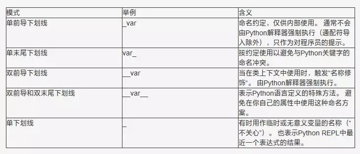

# python语法

[toc]

## 编码规范
在Python中，有一个被广泛接受的官方代码风格规范，称为PEP 8（Python Enhancement Proposal 8）。PEP 8定义了Python代码的编写风格和约定，以提高代码的可读性和一致性。

以下是一些PEP 8代码风格规范的主要要点：
### pep8
1. **缩进：** 使用4个空格作为缩进，不要使用制表符。在Python中，缩进是非常重要的，它决定了代码的结构和层次。

2. **行长度：** 每行代码应尽量保持在79个字符以内。过长的行应该使用括号进行换行，并在新行上进行对齐。

3. **命名规范：** 变量名、函数名和类名使用小写字母，单词之间用下划线分隔（snake_case）。类的首字母应大驼峰（CamelCase）。```module_name, package_name, ClassName, method_name, ExceptionName, function_name, GLOBAL_CONSTANT_NAME, global_var_name, instance_var_name, function_parameter_name, local_var_name, query_proper_noun_for_thing, send_acronym_via_https.```

4. **空行：** 在函数之间和类的方法之间应该用空行进行分隔，以提高代码的可读性。

5. **导入：** 导入应放在文件的顶部，每个导入应该独占一行。标准库的导入应该放在第一组导入之前，然后是第三方库的导入，最后是本地库的导入。

6. **注释：** 使用注释来解释代码的功能、算法和重要细节。注释应该尽量清晰和详细，但也要避免过度注释。

7. **空格：** 在操作符和逗号后应添加空格，但是在括号内部不需要添加空格。比如：`x = 10 + y` 和 `spam(eggs)`。

8. **代码块：** 使用空格来组织代码块，而不是使用多余的缩进。

9. **避免多余的括号：** 在没有歧义的情况下，应尽量避免使用多余的括号。

10. **函数和方法的参数：** 函数和方法的参数列表应该放在括号内，并在逗号后添加一个空格。

### pylint
使用pylint检测代码

### import
1. 用import导入包和模块，不用来导入单独的类和函数
2. 可以为导入的包或模块起别名，如`from x import y as z`
3. 不要使用相对路径来导入，用完整路径，例如
```python
from sound.effects import echo
...
echo.EchoFilter(input, output, delay=0.7, atten=4)

Yes:
  # Reference flags in code with just the module name (common).
  from absl import flags
  from doctor.who import jodie

  _FOO = flags.DEFINE_string(...)

No:
  # Unclear what module the author wanted and what will be imported.  The actual
  # import behavior depends on external factors controlling sys.path.
  # Which possible jodie module did the author intend to import?
  import jodie
```

## 推导式和生成式
简单list, dict, set可以用推导式让代码的变得清晰简洁  
根据需要使用生成器，以减少内存的占用

## 条件表达式
```python
Yes:
    one_line = 'yes' if predicate(value) else 'no'
    slightly_split = ('yes' if predicate(value)
                      else 'no, nein, nyet')
    the_longest_ternary_style_that_can_be_done = (
        'yes, true, affirmative, confirmed, correct'
        if predicate(value)
        else 'no, false, negative, nay')

No:
    bad_line_breaking = ('yes' if predicate(value) else
                         'no')
    portion_too_long = ('yes'
                        if some_long_module.some_long_predicate_function(
                            really_long_variable_name)
                        else 'no, false, negative, nay')
```

## 默认参数值
不要在函数或方法定义中使用可变对象作为默认值。
```python
Yes: def foo(a, b=None):
         if b is None:
             b = []
Yes: def foo(a, b: Sequence | None = None):
         if b is None:
             b = []
Yes: def foo(a, b: Sequence = ()):  # Empty tuple OK since tuples are immutable.
         ...
from absl import flags
_FOO = flags.DEFINE_string(...)

No:  def foo(a, b=[]):
         ...
No:  def foo(a, b=time.time()):  # The time the module was loaded???
         ...
No:  def foo(a, b=_FOO.value):  # sys.argv has not yet been parsed...
         ...
No:  def foo(a, b: Mapping = {}):  # Could still get passed to unchecked code.
         ...
```

## 使用隐式false
```python
Yes: if not users:
         print('no users')

     if i % 10 == 0:
         self.handle_multiple_of_ten()

     def f(x=None):
         if x is None:
             x = []

No:  if len(users) == 0:
         print('no users')

     if not i % 10:
         self.handle_multiple_of_ten()

     def f(x=None):
         x = x or []

请注意'0'（即，0作为字符串）计算结果为 true。
```

## 隐式换行符
```python
Yes: foo_bar(self, width, height, color='black', design=None, x='foo',
             emphasis=None, highlight=0)

Yes: if (width == 0 and height == 0 and
         color == 'red' and emphasis == 'strong'):

     (bridge_questions.clarification_on
      .average_airspeed_of.unladen_swallow) = 'African or European?'

     with (
         very_long_first_expression_function() as spam,
         very_long_second_expression_function() as beans,
         third_thing() as eggs,
     ):
       place_order(eggs, beans, spam, beans)


No:  if width == 0 and height == 0 and \
         color == 'red' and emphasis == 'strong':

     bridge_questions.clarification_on \
         .average_airspeed_of.unladen_swallow = 'African or European?'

     with very_long_first_expression_function() as spam, \
           very_long_second_expression_function() as beans, \
           third_thing() as eggs:
       place_order(eggs, beans, spam, beans)


当文字字符串无法容纳在一行中时，请使用括号进行隐式行连接。
x = ('This will build a very long long '
     'long long long long long long string')
```

## 换行后的行与上一行对应的内容对齐，缩进４个空格
```python
Yes:   # Aligned with opening delimiter.
       foo = long_function_name(var_one, var_two,
                                var_three, var_four)
       meal = (spam,
               beans)

       # Aligned with opening delimiter in a dictionary.
       foo = {
           'long_dictionary_key': value1 +
                                  value2,
           ...
       }

       # 4-space hanging indent; nothing on first line.
       foo = long_function_name(
           var_one, var_two, var_three,
           var_four)
       meal = (
           spam,
           beans)

       # 4-space hanging indent; nothing on first line,
       # closing parenthesis on a new line.
       foo = long_function_name(
           var_one, var_two, var_three,
           var_four
       )
       meal = (
           spam,
           beans,
       )

       # 4-space hanging indent in a dictionary.
       foo = {
           'long_dictionary_key':
               long_dictionary_value,
           ...
       }
No:    # Stuff on first line forbidden.
       foo = long_function_name(var_one, var_two,
           var_three, var_four)
       meal = (spam,
           beans)

       # 2-space hanging indent forbidden.
       foo = long_function_name(
         var_one, var_two, var_three,
         var_four)

       # No hanging indent in a dictionary.
       foo = {
           'long_dictionary_key':
           long_dictionary_value,
           ...
       }
```

## 线程
使用queue模块的Queue数据类型作为线程之间通信数据的首选方式。否则，使用该threading模块及其锁定原语。优先使用条件变量，而threading.Condition不是使用较低级别的锁。

## 注释规范
1. 文档注释
每个文件都应包含许可证样板。为项目使用的许可证选择适当的样板（例如，Apache 2.0、BSD、LGPL、GPL）。
文件应以描述模块内容和用法的文档字符串开头。
```python
"""A one-line summary of the module or program, terminated by a period.

Leave one blank line.  The rest of this docstring should contain an
overall description of the module or program.  Optionally, it may also
contain a brief description of exported classes and functions and/or usage
examples.

Typical usage example:

  foo = ClassFoo()
  bar = foo.FunctionBar()
"""
```
2. 函数和方法
```python
def fetch_smalltable_rows(
    table_handle: smalltable.Table,
    keys: Sequence[bytes | str],
    require_all_keys: bool = False,
) -> Mapping[bytes, tuple[str, ...]]:
    """Fetches rows from a Smalltable.

    Retrieves rows pertaining to the given keys from the Table instance
    represented by table_handle.  String keys will be UTF-8 encoded.

    Args:
      table_handle:
        An open smalltable.Table instance.
      keys:
        A sequence of strings representing the key of each table row to
        fetch.  String keys will be UTF-8 encoded.
      require_all_keys:
        If True only rows with values set for all keys will be returned.

    Returns:
      A dict mapping keys to the corresponding table row data
      fetched. Each row is represented as a tuple of strings. For
      example:

      {b'Serak': ('Rigel VII', 'Preparer'),
       b'Zim': ('Irk', 'Invader'),
       b'Lrrr': ('Omicron Persei 8', 'Emperor')}

      Returned keys are always bytes.  If a key from the keys argument is
      missing from the dictionary, then that row was not found in the
      table (and require_all_keys must have been False).

    Raises:
      IOError: An error occurred accessing the smalltable.
    """
```
3. 类
类应该在类定义下面有一个描述类的文档字符串。如果您的类具有公共属性，则应将它们记录在此处的一个 Attributes部分中，并遵循与 函数Args部分相同的格式。
```python
class SampleClass:
    """Summary of class here.

    Longer class information...
    Longer class information...

    Attributes:
        likes_spam: A boolean indicating if we like SPAM or not.
        eggs: An integer count of the eggs we have laid.
    """

    def __init__(self, likes_spam: bool = False):
        """Initializes the instance based on spam preference.

        Args:
          likes_spam: Defines if instance exhibits this preference.
        """
        self.likes_spam = likes_spam
        self.eggs = 0

    def public_method(self):
        """Performs operation blah."""
```

## 字符串
1. 使用 f-string、%运算符或format格式化字符串的方法，可以使用+进行单个连接，但不要使用+进行格式胡
```python
Yes: x = f'name: {name}; score: {n}'
     x = '%s, %s!' % (imperative, expletive)
     x = '{}, {}'.format(first, second)
     x = 'name: %s; score: %d' % (name, n)
     x = 'name: %(name)s; score: %(score)d' % {'name':name, 'score':n}
     x = 'name: {}; score: {}'.format(name, n)
     x = a + b
No: x = first + ', ' + second
    x = 'name: ' + name + '; score: ' + str(n)
```
2. 使用.join来拼接字符串而不是+=，以减少时间复杂度
```python
Yes: items = ['<table>']
     for last_name, first_name in employee_list:
         items.append('<tr><td>%s, %s</td></tr>' % (last_name, first_name))
     items.append('</table>')
     employee_table = ''.join(items)
No: employee_table = '<table>'
    for last_name, first_name in employee_list:
        employee_table += '<tr><td>%s, %s</td></tr>' % (last_name, first_name)
    employee_table += '</table>'
```

## 下划线的含义

单下划线开头的属性或方法称之为保护方法或保护属性，和普通实例方法没有太大区别  
双下划线开头，称之为私有成员。python中的私有其实是一种伪私有，就是把双下划线开头的变量改了个名字( _类名__变量名)，双下划线前缀会导致Python解释器重写属性名称，以避免子类中的命名冲突  
双下线开头双下划线结尾都是python的内置方法或属性

## 坑
1. 对于可迭代对象，不能一边删除一边遍历
```python
# no:
def need_delete(objects: list, exception: set):
    for obj in objects:
        filename = obj.key.split('/')[-1]
        if filename in exception:
            objects.remove(obj)
    
    return objects

# yes:
def need_delete(objects: list, exception: set):
    init_list = objects
    for obj in objects:
        filename = obj.key.split('/')[-1]
        if filename in exception:
            init_list.remove(obj)
    
    return init_list
```

2. 判断两个变量值是否相等使用等于号而不是is