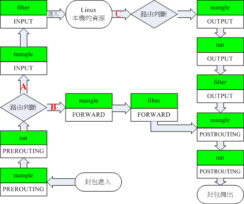

# 服务器架设
连接服务器流程图


## 防火墙
防火墙就是透过订定一些有顺序的规则，并管制进入到我们网域内的主机(或者可以说是网域) 资料封包的一种机制

常见工具：Netfilter、TCP Wrappers、Proxy

常见防护手段：封端口、封源ip、封tcp包中的特殊flag（syn）、封mac

### TCP Wrapper
通过服务名称进行管理，例如ftp的Vstpd，不需要端口21

通过/etc/hosts.allow，/etc/hosts.deny管理，可以通过软件xinetd和libwrap.so来操作

### iptables
基于Netfilter，根据封包的分析资料"比对" 你预先定义的规则内容， 若封包资料与规则内容相同则进行动作，否则就继续下一条规则的比对。

相关软件：
iptables-service，此软件包含了iptables 服务和 ip6tables 服务，实现开机自动加载规则  
iptables-persistent，ubuntu中实现开机自动加载iptables规则

iptables是传统的防火墙管理工具，centos7中firewalld和ubuntu中ufw都是新出的linux防火墙工具，不过这些都基于内核中的netfilter，三个防火墙管理工具之间会互相影响，所以一般建议只用其中一种

主要的表有三个：
```
(defualt)控制本机的封包filter：INPUT OUTPUT FORWARD
控制路由nat：PREROUTING POSTROUTING OUTPUT
主要与特殊封包的flag相关mangle：PREROUTING OUTPUT INPUT FORWARD
```
表和链的关系：


iptables-save  将防火墙规则打印到标准输出

filter表预设都为ACCEPT

iptables支持外挂模组：这个想要进入的封包是否为刚刚我发出去的回应？如果是就放行

示例
```bash
# 设定lo 成为受信任的装置，亦即进出lo 的封包都予以接受
iptables -A INPUT -i lo -j ACCEPT

# 只要是来自内网的(192.168.100.0/24) 的封包通通接受
iptables -A INPUT -i eth1 -s 192.168.100.0/24 -j ACCEPT 

# 记录匹配到该规则的封包写到/var/log/messages中，LOG 这个动作仅在进行记录而已，并不会影响到这个封包的其他规则比对的
iptables -A INPUT -s 192.168.2.200 -j LOG 

# 只要来自 192.168.1.0/24 的1024:65535 埠口的封包，且想要连线到本机的ssh port 就予以抵挡
iptables -A INPUT -i eth0 -p tcp -s 192.168.1.0/24 --sport 1024:65534 --dport ssh -j DROP

# 将来自任何地方来源port 1:1023 的主动连线到本机端的1:1023 连线丢弃
iptables -A INPUT -i eth0 -p tcp --sport 1:1023 --dport 1:1023 --syn -j DROP

# 只要已建立或相关封包就予以通过，只要是不合法封包就丢弃
iptables -A INPUT -m state --state RELATED,ESTABLISHED -j ACCEPT
iptables -A INPUT -m state --state INVALID -j DROP

# 针对区域网路内的aa:bb:cc:dd:ee:ff 主机开放其连线
iptables -A INPUT -m mac --mac-source aa:bb:cc:dd:ee:ff -j ACCEPT
```

## nat
主要工作在2，3，4层

nat服务器一定是路由器，通常会修改ip包表头，一定有一个public ip和private ip，让lan内的private ip可以透过nat的public ip传出去，而路由器通常两边都是public ip或private ip

snat修改源ip地址，让内网能够连通外网  
dnat修改目的ip地址，让外网主动能够连通内网

示例
```bash
# IP 伪装成为封包出去 (-o) 的那块装置上的IP
iptables -t nat -A POSTROUTING -s 192.168.100.0/24 -o eth0 -j MASQUERADE 

# snat
iptables -t nat -A POSTROUTING -o eth0 -j SNAT --to-source 192.168.1.100

# dnat
iptables -t nat -A PREROUTING -i eth0 -p tcp --dport 80 -j DNAT --to-destination 192.168.100.10:80

# 端口转发80-->8080
iptables -t nat -A PREROUTING -p tcp --dport 80 -j REDIRECT --to-ports 8080
```

## rsync
传输文件的工具，主要用来同步备份，默认是增量备份，默认端口为873

rsync [-avrlptgoD] [-e ssh] [user@host:/dir] [/local/path]

## dhcp
让子网中的电脑开机就能立即自动设置好网络参数，基于udp广播。他主要藉由用户端传送广播封包给整个物理网段内的所有主机， 若区域网路内有DHCP 伺服器时，才会回应用户端的IP 参数要求。服务端默认端口为67

## nfs
nfs服务启动时会随机取几个端口并主动向rpc注册，因此rpc知道每个端口对应的nfs功能

rpc会指定每个nfs功能所对应的端口号，并返回给客户端，让客户端连接。rpc默认端口为111

要启动nfs必须先启动rpc

nfs服务包括的后台进程：rpc.nfsd、rpc.mountd、rpc.lockd、rpc.statd

nfs服务所需的软件：rpcbind、nfs-utils

### 配置文件/etc/exports
```
rw读写
ro只读
sync：同步，在将之前的请求所做的更改写入磁盘前，NFS 服务器不会回复请求。
async：异步，数据会先暂存于记忆体中，而不是直接读取硬碟
no_root_squash：允许用户端以root权限操作nfs目录
root_squash：用户端的root会被压缩成nfsnobody账户，保护系统
all_squash：所有用户都被压缩成nfsnobody
```

### 示例
```bash
# 任何人都能使用/tmp，并开放root用户
/tmp *(rw,no_root_squash)

# 同一目录针对不同范围开放不同权限
/home/public 192.168.100.0/24(rw) *(ro)
```

### 用户映射原理
基于uid和gid而不是名字

nfsnobody是由NFS服务在系统中自动创建的一个程序用户账号，该账号不能用于登录系统，专门用作NFS服务的匿名用户账号。

如果客户端所使用的用户身份不是root，而是一个普通用户，那么默认情况下在服务器端会将其视作其它用户（other）而不是nfsnobody

其中默认值是root_squash，即当客户端以root用户的身份访问NFS共享时，在服务器端会自动被映射为匿名账号nfsnobody

如果在服务器端赋予某个用户对共享目录具有相应权限，而且在客户端恰好也有一个具有相同uid的用户，那么当在客户端以该用户身份访问共享时，将自动具有服务器端对应用户的权限
```
root_squash，当NFS客户端以root用户身份访问时，映射为NFS服务器的nfsnobody用户。
no_root_squash，当NFS客户端以root身份访问时，映射为NFS服务器的root用户，也就是要为超级用户保留权限。这个选项会留下严重的安全隐患，一般不建议采用。
all_squash，无论NFS客户端以哪种用户身份访问，均映射为NFS服务器的nfsnobody用户。
```

注意：
```
但也正是因为这个原因，才会导致出现用户身份重叠的问题，对于NFS服务而言，这也是一个比较严重的安全隐患。
如何避免用户身份重叠呢？可以从以下两个方面着手：

一是在设置NFS共享时，建议采用“all_squash”选项，将所有客户端用户均映射为nfsnobody。这样就可以有效避免用户身份重叠的问题。
二是应严格控制NFS共享目录的系统权限，尽量不用为普通用户赋予权限。
```

查询服务器提供哪些资源给我们使用呢？ 
[root@clientlinux ~]# showmount -e 192.168.100.254

autofs：当我们要用到nfs共享目录时再把他挂载进来，不用时再卸载

## NIS
network information servier，用来管理其他主机账号信息的服务器

## ntp
network time protocol  
一个时间服务器，原来是通过国家授时中心同步时间，然后再给其它终端提供时间同步服务的  
UTC 标准时间虽然与GMT 时间放在同一个时区为  
ntp可以自动处理延迟带来的误差  
电脑主机上面的BIOS 内部就含有一个原子钟在纪录与计算时间的进行  
ntpdate手动更新主机时间

hwclock -w 将目前linux时间写入bios系统，因为重启会重新从bios读取时间

## SAMBA
让linux与windows之间实现文件和打印机共享

## proxy
主要工作在OSI七层应用层部分，常作为网站代理，内网防火墙

让机器都使用代理：
(1)在对外的防火墙伺服器(NAT) 上面安装proxy； (2)在proxy 上头启动transparent 功能； (3) NAT 伺服器加上一条 port 80 转port 3128 的规则

## iSCSI
iSCSI（Internet Small Computer System Interface）是一种用于在 IP 网络上传输 SCSI（Small Computer System Interface）协议的存储协议。SCSI 是一种用于连接计算机和外部设备（如硬盘驱动器、打印机等）的标准接口协议，而 iSCSI 则通过网络传输 SCSI 命令和数据，将 SCSI 技术扩展到IP网络环境中

nas，network attached storage，相当于挂载一个文件系统，只能立即使用不能格式化  
san，storage area networks，面向大容量存储，提供硬盘

## ftp
后端服务器：Vsftpd
连接服务器的工具：ftp、lftp

## tcpdump
关键字：src dst host、net、tcp port、and、or
选项：-X 解析ascii和16进制封包，翻译成明文

## nc
-l ：作为监听之用，亦即开启一个port 来监听用户的连线；
-u ：不使用TCP 而是使用UDP 作为连线的封包状态

## dns
需要的软件：bind、bind-utils  
bind（berkeley Internet name domain）是伯克利大学开发的  
主要工具命令：dig

国内公网搭dns服务需要得到isp授权（上层dns服务器）

主要配置文件：
```
/etc/named.conf ：这就是我们的主设定档啦！
/etc/sysconfig/named ：是否启动chroot 及额外的参数，就由这个档案控制；
/var/named/ ：资料库档案预设放置在这个目录（zone文件）
/var/run/named ：named 这支程式执行时预设放置pid-file 在此目录内。
```

### rndc  
包括可以检查已经存在DNS 快取当中的资料、重新更新某个zone 而不需要重新启动整个DNS ， 以及检查DNS 的状态与统计资料等等的

### ddns
自动的动态修改ip

## web
lamp：linux、apache、mysql、php

## mail
电子邮件的发送过程会通过dns的MX记录类型解析得到邮件服务器地址
