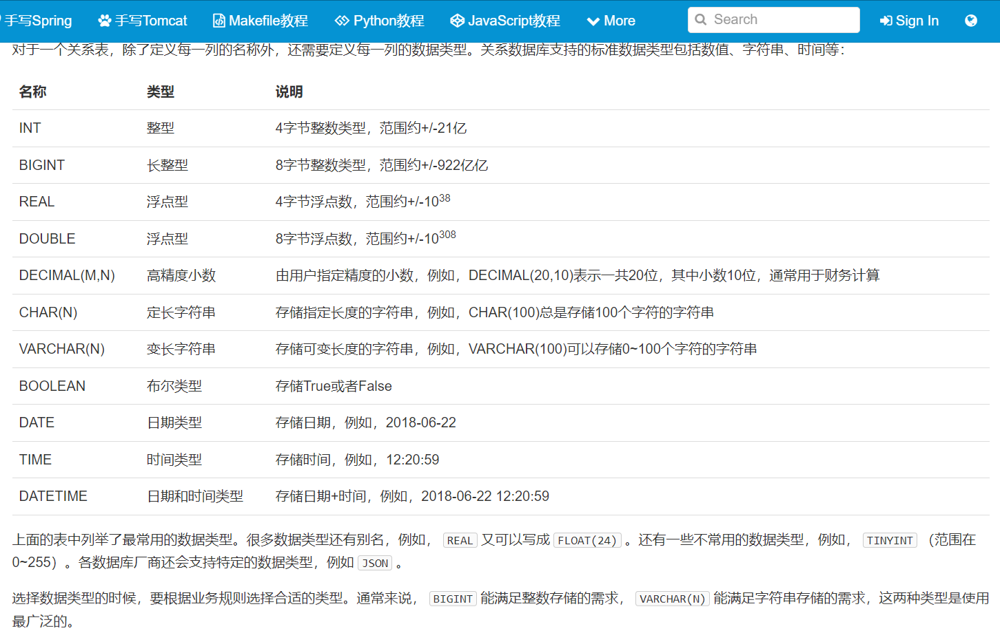

# sql

## 目录
<!-- vim-markdown-toc GFM -->

* [介绍](#介绍)
* [nosql](#nosql)
* [关系型数据库](#关系型数据库)
    * [数据类型](#数据类型)
    * [主流关系型数据库](#主流关系型数据库)
* [主键](#主键)
    * [联合主键](#联合主键)
* [外键](#外键)
    * [多对多](#多对多)
    * [一对一](#一对一)
* [索引](#索引)
    * [唯一索引](#唯一索引)
* [查询数据](#查询数据)
    * [基本查询](#基本查询)
    * [条件查询](#条件查询)
        * [常用的条件表达式](#常用的条件表达式)
    * [投影查询](#投影查询)
    * [查询结果排序](#查询结果排序)
    * [分页查询](#分页查询)
    * [聚合查询](#聚合查询)
        * [常见聚合函数](#常见聚合函数)
        * [分组聚合](#分组聚合)
    * [多表查询](#多表查询)
    * [连接查询](#连接查询)
* [修改数据](#修改数据)
    * [INSERT](#insert)
    * [UPDATE](#update)
    * [DELETE](#delete)
* [管理mysql](#管理mysql)
    * [数据库](#数据库)
    * [表](#表)
    * [退出mysql](#退出mysql)
* [实用sql](#实用sql)
    * [插入或替换](#插入或替换)
    * [插入或更新](#插入或更新)
    * [插入或忽略](#插入或忽略)
    * [快照](#快照)
    * [写入查询结果集](#写入查询结果集)
    * [强制使用指定索引](#强制使用指定索引)
* [事务](#事务)
    * [read uncommitted](#read-uncommitted)
    * [read committed](#read-committed)
    * [repeatable read](#repeatable-read)
    * [Serializable](#serializable)
    * [默认隔离级别](#默认隔离级别)

<!-- vim-markdown-toc -->

## 介绍
什么是SQL？SQL是结构化查询语言的缩写，用来访问和操作数据库系统。SQL语句既可以查询数据库中的数据，也可以添加、更新和删除数据库中的数据，还可以对数据库进行管理和维护操作。不同的数据库，都支持SQL，这样，我们通过学习SQL这一种语言，就可以操作各种不同的数据库。

虽然SQL已经被ANSI组织定义为标准，不幸地是，各个不同的数据库对标准的SQL支持不太一致。并且，大部分数据库都在标准的SQL上做了扩展。也就是说，如果只使用标准SQL，理论上所有数据库都可以支持，但如果使用某个特定数据库的扩展SQL，换一个数据库就不能执行了。例如，Oracle把自己扩展的SQL称为PL/SQL，Microsoft把自己扩展的SQL称为T-SQL。

现实情况是，如果我们只使用标准SQL的核心功能，那么所有数据库通常都可以执行。不常用的SQL功能，不同的数据库支持的程度都不一样。而各个数据库支持的各自扩展的功能，通常我们把它们称之为“方言”。

总的来说，SQL语言定义了这么几种操作数据库的能力：

DDL：Data Definition Language

DDL允许用户定义数据，也就是创建表、删除表、修改表结构这些操作。通常，DDL由数据库管理员执行。

DML：Data Manipulation Language

DML为用户提供添加、删除、更新数据的能力，这些是应用程序对数据库的日常操作。

DQL：Data Query Language

DQL允许用户查询数据，这也是通常最频繁的数据库日常操作。

语法特定：

SQL语言关键字不区分大小写！！！但是，针对不同的数据库，对于表名和列名，有的数据库区分大小写，有的数据库不区分大小写。同一个数据库，有的在Linux上区分大小写，有的在Windows上不区分大小写。

所以，本教程约定：SQL关键字总是大写，以示突出，表名和列名均使用小写。

## nosql
你可能还听说过NoSQL数据库，也就是非SQL的数据库，包括MongoDB、Cassandra、Dynamo等等，它们都不是关系数据库。有很多人鼓吹现代Web程序已经无需关系数据库了，只需要使用NoSQL就可以。但事实上，SQL数据库从始至终从未被取代过。回顾一下NoSQL的发展历程：
```
1970: NoSQL = We have no SQL
1980: NoSQL = Know SQL
2000: NoSQL = No SQL!
2005: NoSQL = Not only SQL
2013: NoSQL = No, SQL!
```
今天，SQL数据库仍然承担了各种应用程序的核心数据存储，而NoSQL数据库作为SQL数据库的补充，两者不再是二选一的问题，而是主从关系。所以，无论使用哪种编程语言，无论是Web开发、游戏开发还是手机开发，掌握SQL，是所有软件开发人员所必须的。

## 关系型数据库
随着应用程序的功能越来越复杂，数据量越来越大，如何管理这些数据就成了大问题：
```
读写文件并解析出数据需要大量重复代码；
从成千上万的数据中快速查询出指定数据需要复杂的逻辑。
```
如果每个应用程序都各自写自己的读写数据的代码，一方面效率低，容易出错，另一方面，每个应用程序访问数据的接口都不相同，数据难以复用。

所以，数据库作为一种专门管理数据的软件就出现了。应用程序不需要自己管理数据，而是通过数据库软件提供的接口来读写数据。至于数据本身如何存储到文件，那是数据库软件的事情，应用程序自己并不关心

### 数据类型


### 主流关系型数据库
1. 商用数据库，例如：Oracle，SQL Server，DB2等；
2. 开源数据库，例如：MySQL，PostgreSQL等；
3. 桌面数据库，以微软Access为代表，适合桌面应用程序使用；
4. 嵌入式数据库，以Sqlite为代表，适合手机应用和桌面程序。

## 主键
对于关系表，有个很重要的约束，就是任意两条记录不能重复。不能重复不是指两条记录不完全相同，而是指能够通过某个字段唯一区分出不同的记录，这个字段被称为主键。

例如，假设我们把name字段作为主键，那么通过名字小明或小红就能唯一确定一条记录。但是，这么设定，就没法存储同名的同学了，因为插入相同主键的两条记录是不被允许的。

对主键的要求，最关键的一点是：记录一旦插入到表中，主键最好不要再修改，因为主键是用来唯一定位记录的，修改了主键，会造成一系列的影响。

由于主键的作用十分重要，如何选取主键会对业务开发产生重要影响。如果我们以学生的身份证号作为主键，似乎能唯一定位记录。然而，身份证号也是一种业务场景，如果身份证号升位了，或者需要变更，作为主键，不得不修改的时候，就会对业务产生严重影响。

所以，选取主键的一个基本原则是：不使用任何业务相关的字段作为主键。

因此，身份证号、手机号、邮箱地址这些看上去可以唯一的字段，均不可用作主键。

作为主键最好是完全业务无关的字段，我们一般把这个字段命名为id。常见的可作为id字段的类型有：

1. 自增整数类型：数据库会在插入数据时自动为每一条记录分配一个自增整数，这样我们就完全不用担心主键重复，也不用自己预先生成主键；

2. 全局唯一GUID类型：使用一种全局唯一的字符串作为主键，类似8f55d96b-8acc-4636-8cb8-76bf8abc2f57。GUID算法通过网卡MAC地址、时间戳和随机数保证任意计算机在任意时间生成的字符串都是不同的，大部分编程语言都内置了GUID算法，可以自己预算出主键。

对于大部分应用来说，通常自增类型的主键就能满足需求。我们在students表中定义的主键也是BIGINT NOT NULL AUTO_INCREMENT类型。

（ 如果使用INT自增类型，那么当一张表的记录数超过2147483647（约21亿）时，会达到上限而出错。使用BIGINT自增类型则可以最多约922亿亿条记录。）

### 联合主键
关系数据库实际上还允许通过多个字段唯一标识记录，即两个或更多的字段都设置为主键，这种主键被称为联合主键。

对于联合主键，允许一列有重复，只要不是所有主键列都重复即可：

没有必要的情况下，我们尽量不使用联合主键，因为它给关系表带来了复杂度的上升。

## 外键
students表中能通过class_id字段，可以把数据的另一张班级表表关联起来，这种称为“外键”

外键并不是通过列名实现的，而是通过定义外键约束实现的：
```
ALTER TABLE students
ADD CONSTRAINT fk_class_id
FOREIGN KEY (class_id)
REFERENCES classes (id);
```
其中，外键约束的名称fk_class_id可以任意，FOREIGN KEY (class_id)指定了class_id作为外键，REFERENCES classes (id)指定了这个外键将关联到classes表的id列（即classes表的主键）。

通过定义外键约束，关系数据库可以保证无法插入无效的数据。即如果classes表不存在id=99的记录，students表就无法插入class_id=99的记录。

由于外键约束会降低数据库的性能，大部分互联网应用程序为了追求速度，并不设置外键约束，而是仅靠应用程序自身来保证逻辑的正确性。这种情况下，class_id仅仅是一个普通的列，只是它起到了外键的作用而已。

要删除一个外键约束，也是通过ALTER TABLE实现的：
```
ALTER TABLE students
DROP FOREIGN KEY fk_class_id;
```
注意：删除外键约束并没有删除外键这一列。删除列是通过DROP COLUMN ...实现的。

### 多对多
通过一个表的外键关联到另一个表，我们可以定义出一对多关系。有些时候，还需要定义“多对多”关系。例如，一个老师可以对应多个班级，一个班级也可以对应多个老师，因此，班级表和老师表存在多对多关系。

多对多关系实际上是通过两个一对多关系实现的，即通过一个中间表，关联两个一对多关系，就形成了多对多关系：

teachers表：
```
id  name
1   张老师
2   王老师
3   李老师
4   赵老师
```

classes表：
```
id  name
1   一班
2   二班
```

中间表teacher_class关联两个一对多关系：
```
id  teacher_id  class_id
1   1   1
2   1   2
3   2   1
4   2   2
5   3   1
6   4   2
```

通过中间表teacher_class可知teachers到classes的关系：
```
id=1的张老师对应id=1,2的一班和二班；
id=2的王老师对应id=1,2的一班和二班；
id=3的李老师对应id=1的一班；
id=4的赵老师对应id=2的二班。
```
同理可知classes到teachers的关系：
```
id=1的一班对应id=1,2,3的张老师、王老师和李老师；
id=2的二班对应id=1,2,4的张老师、王老师和赵老师；
```
因此，通过中间表，我们就定义了一个“多对多”关系。

### 一对一
一对一关系是指，一个表的记录对应到另一个表的唯一一个记录。

例如，students表的每个学生可以有自己的联系方式，如果把联系方式存入另一个表contacts，我们就可以得到一个“一对一”关系：
```
id  student_id  mobile
1   1   135xxxx6300
2   2   138xxxx2209
3   5   139xxxx8086
```
有细心的童鞋会问，既然是一对一关系，那为啥不给students表增加一个mobile列，这样就能合二为一了？

如果业务允许，完全可以把两个表合为一个表。但是，有些时候，如果某个学生没有手机号，那么，contacts表就不存在对应的记录。实际上，一对一关系准确地说，是contacts表一对一对应students表。

还有一些应用会把一个大表拆成两个一对一的表，目的是把经常读取和不经常读取的字段分开，以获得更高的性能。例如，把一个大的用户表分拆为用户基本信息表user_info和用户详细信息表user_profiles，大部分时候，只需要查询user_info表，并不需要查询user_profiles表，这样就提高了查询速度。

## 索引
在关系数据库中，如果有上万甚至上亿条记录，在查找记录的时候，想要获得非常快的速度，就需要使用索引。

索引是关系数据库中对某一列或多个列的值进行预排序的数据结构。通过使用索引，可以让数据库系统不必扫描整个表，而是直接定位到符合条件的记录，这样就大大加快了查询速度。

例如，对于students表：
```
id  class_id    name    gender  score
1   1   小明    M   90
2   1   小红    F   95
3   1   小军    M   88
```

如果要经常根据score列进行查询，就可以对score列创建索引：
```
ALTER TABLE students
ADD INDEX idx_score (score);
```

使用ADD INDEX idx_score (score)就创建了一个名称为idx_score，使用列score的索引。索引名称是任意的，索引如果有多列，可以在括号里依次写上，例如：
```
ALTER TABLE students
ADD INDEX idx_name_score (name, score);
```
索引的效率取决于索引列的值是否散列，即该列的值如果越互不相同，那么索引效率越高。反过来，如果记录的列存在大量相同的值，例如gender列，大约一半的记录值是M，另一半是F，因此，对该列创建索引就没有意义。

可以对一张表创建多个索引。索引的优点是提高了查询效率，缺点是在插入、更新和删除记录时，需要同时修改索引，因此，索引越多，插入、更新和删除记录的速度就越慢。

对于主键，关系数据库会自动对其创建主键索引。使用主键索引的效率是最高的，因为主键会保证绝对唯一。

### 唯一索引
在设计关系数据表的时候，看上去唯一的列，例如身份证号、邮箱地址等，因为他们具有业务含义，因此不宜作为主键。

但是，这些列根据业务要求，又具有唯一性约束：即不能出现两条记录存储了同一个身份证号。这个时候，就可以给该列添加一个唯一索引。例如，我们假设students表的name不能重复：
```
ALTER TABLE students
ADD UNIQUE INDEX uni_name (name);
```
通过UNIQUE关键字我们就添加了一个唯一索引。

也可以只对某一列添加一个唯一约束而不创建唯一索引：
```
ALTER TABLE students
ADD CONSTRAINT uni_name UNIQUE (name);
```
这种情况下，name列没有索引，但仍然具有唯一性保证。

无论是否创建索引，对于用户和应用程序来说，使用关系数据库不会有任何区别。这里的意思是说，当我们在数据库中查询时，如果有相应的索引可用，数据库系统就会自动使用索引来提高查询效率，如果没有索引，查询也能正常执行，只是速度会变慢。因此，索引可以在使用数据库的过程中逐步优化。

## 查询数据

### 基本查询
`SELECT * FROM <表名>`可以查询一个表的所有行和所有列的数据。

SELECT查询的结果是一个二维表。

### 条件查询
`SELECT * FROM <表名> WHERE <条件表达式>` 

`<条件1> AND <条件2>`表达满足条件1并且满足条件2

`<条件1> OR <条件2>`表示满足条件1或者满足条件2

`NOT <条件按>`表示不符合该条件的记录

要组合三个或者更多的条件，就需要用小括号()表示如何进行条件运算。例如，编写一个复杂的条件：分数在80以下或者90以上，并且是男生：
```
SELECT * FROM students WHERE (score < 80 OR score > 90) AND gender = 'M';
```

#### 常用的条件表达式


### 投影查询
使用`SELECT *`表示查询表的所有列，使用SELECT 列1, 列2, 列3则可以仅返回指定列，这种操作称为投影。

SELECT语句可以对结果集的列进行重命名。

### 查询结果排序
默认的排序规则是ASC：“升序”，即从小到大。DESC表示倒序。ASC可以省略，即ORDER BY score ASC和ORDER BY score效果一样。

如果有WHERE子句，那么ORDER BY子句要放到WHERE子句后面。例如，查询一班的学生成绩，并按照倒序排序：
```
SELECT id, name, gender, score
FROM students
WHERE class_id = 1
ORDER BY score DESC;
```

### 分页查询
使用`LIMIT <M> OFFSET <N>`可以对结果集进行分页，每次查询返回结果集的一部分；

分页查询需要先确定每页的数量和当前页数，然后确定LIMIT和OFFSET的值。

现在，我们把结果集分页，每页3条记录。要获取第1页的记录，可以使用LIMIT 3 OFFSET 0：
```
SELECT id, name, gender, score
FROM students
ORDER BY score DESC
LIMIT 3 OFFSET 0;
```

### 聚合查询
对于统计总数、平均数这类计算，SQL提供了专门的聚合函数，使用聚合函数进行查询，就是聚合查询，它可以快速获得结果。

仍然以查询students表一共有多少条记录为例，我们可以使用SQL内置的COUNT()函数查询：
```
SELECT COUNT(*) FROM students;
```
`COUNT(*)`表示查询所有列的行数，要注意聚合的计算结果虽然是一个数字，但查询的结果仍然是一个二维表，只是这个二维表只有一行一列，并且列名是`COUNT(*)`。

#### 常见聚合函数
```
函数    说明
SUM 计算某一列的合计值，该列必须为数值类型
AVG 计算某一列的平均值，该列必须为数值类型
MAX 计算某一列的最大值
MIN 计算某一列的最小值
```
注意，MAX()和MIN()函数并不限于数值类型。如果是字符类型，MAX()和MIN()会返回排序最后和排序最前的字符。

要统计男生的平均成绩，我们用下面的聚合查询：
```
SELECT AVG(score) average FROM students WHERE gender = 'M';
```

#### 分组聚合
如果我们要统计一班的学生数量，我们知道，可以用`SELECT COUNT(*) num FROM students WHERE class_id = 1;`。如果要继续统计二班、三班的学生数量，难道必须不断修改WHERE条件来执行SELECT语句吗？

对于聚合查询，SQL还提供了“分组聚合”的功能。我们观察下面的聚合查询：
```
SELECT COUNT(*) num FROM students GROUP BY class_id;
```
执行这个查询，COUNT()的结果不再是一个，而是3个，这是因为，GROUP BY子句指定了按class_id分组，因此，执行该SELECT语句时，会把class_id相同的列先分组，再分别计算，因此，得到了3行结果。


也可以使用多个列进行分组。例如，我们想统计各班的男生和女生人数：
```
SELECT class_id, gender, COUNT(*) num FROM students GROUP BY class_id, gender;
```

### 多表查询
SELECT查询不但可以从一张表查询数据，还可以从多张表同时查询数据。查询多张表的语法是：`SELECT * FROM <表1> <表2>`。

注意，多表查询时，要使用表名.列名这样的方式来引用列和设置别名，这样就避免了结果集的列名重复问题。但是，用表名.列名这种方式列举两个表的所有列实在是很麻烦，所以SQL还允许给表设置一个别名，让我们在投影查询中引用起来稍微简洁一点：
```
SELECT
    s.id sid,
    s.name,
    s.gender,
    s.score,
    c.id cid,
    c.name cname
FROM students s, classes c;
```

使用多表查询可以获取M x N行记录；

多表查询的结果集可能非常巨大，要小心使用。

### 连接查询
连接查询是另一种类型的多表查询。连接查询对多个表进行JOIN运算，简单地说，就是先确定一个主表作为结果集，然后，把其他表的行有选择性地“连接”在主表结果集上。

通过INNER JOIN查询students表的class_id字段获得学生所在班级的名称
```
SELECT s.id, s.name, s.class_id, c.name class_name, s.gender, s.score
FROM students s
INNER JOIN classes c
ON s.class_id = c.id;
```
注意INNER JOIN查询的写法是：  
1. 先确定主表，仍然使用FROM <表1>的语法；
2. 再确定需要连接的表，使用INNER JOIN <表2>的语法；
3. 然后确定连接条件，使用ON <条件...>，这里的条件是s.class_id = c.id，表示students表的class_id列与classes表的id列相同的行需要连接；
4. 可选：加上WHERE子句、ORDER BY等子句。
使用别名不是必须的，但可以更好地简化查询语句。

有RIGHT OUTER JOIN，就有LEFT OUTER JOIN，以及FULL OUTER JOIN。它们的区别是：

INNER JOIN只返回同时存在于两张表的行数据，由于students表的class_id包含1，2，3，classes表的id包含1，2，3，4，所以，INNER JOIN根据条件s.class_id = c.id返回的结果集仅包含1，2，3。

RIGHT OUTER JOIN返回右表都存在的行。如果某一行仅在右表存在，那么结果集就会以NULL填充剩下的字段。

LEFT OUTER JOIN则返回左表都存在的行。如果我们给students表增加一行，并添加class_id=5，由于classes表并不存在id=5的行，所以，LEFT OUTER JOIN的结果会增加一行，对应的class_name是NULL

最后，我们使用FULL OUTER JOIN，它会把两张表的所有记录全部选择出来，并且，自动把对方不存在的列填充为NULL：
```
SELECT s.id, s.name, s.class_id, c.name class_name, s.gender, s.score
FROM students s
FULL OUTER JOIN classes c
ON s.class_id = c.id;
```

## 修改数据
关系数据库的基本操作就是增删改查，即CRUD：Create、Retrieve、Update、Delete。其中，对于查询，我们已经详细讲述了SELECT语句的详细用法。

而对于增、删、改，对应的SQL语句分别是：
```
INSERT：插入新记录；
UPDATE：更新已有记录；
DELETE：删除已有记录。
```

### INSERT
INSERT语句的基本语法是：
```
INSERT INTO <表名> (字段1, 字段2, ...) VALUES (值1, 值2, ...);
```

例如，我们向students表插入一条新记录，先列举出需要插入的字段名称，然后在VALUES子句中依次写出对应字段的值：
```
INSERT INTO students (class_id, name, gender, score) VALUES (2, '大牛', 'M', 80);
```

注意到我们并没有列出id字段，也没有列出id字段对应的值，这是因为id字段是一个自增主键，它的值可以由数据库自己推算出来。此外，如果一个字段有默认值，那么在INSERT语句中也可以不出现。

要注意，字段顺序不必和数据库表的字段顺序一致，但值的顺序必须和字段顺序一致。也就是说，可以写INSERT INTO students (score, gender, name, class_id) ...，但是对应的VALUES就得变成(80, 'M', '大牛', 2)。

还可以一次性添加多条记录，只需要在VALUES子句中指定多个记录值，每个记录是由(...)包含的一组值：
```
INSERT INTO students (class_id, name, gender, score) VALUES
  (1, '大宝', 'M', 87),
  (2, '二宝', 'M', 81);
```

### UPDATE
UPDATE语句的基本语法是：
```
UPDATE <表名> SET 字段1=值1, 字段2=值2, ... WHERE ...;
```

例如，我们想更新students表id=1的记录的name和score这两个字段，先写出UPDATE students SET name='大牛', score=66，然后在WHERE子句中写出需要更新的行的筛选条件id=1：
```
UPDATE students SET name='大牛', score=66 WHERE id=1;
```

在UPDATE语句中，更新字段时可以使用表达式。例如，把所有80分以下的同学的成绩加10分：
```
UPDATE students SET score=score+10 WHERE score<80;
```

最后，要特别小心的是，UPDATE语句可以没有WHERE条件，例如：
```
UPDATE students SET score=60;
```
这时，整个表的所有记录都会被更新。所以，在执行UPDATE语句时要非常小心，最好先用SELECT语句来测试WHERE条件是否筛选出了期望的记录集，然后再用UPDATE更新。

### DELETE
DELETE语句的基本语法是：
```
DELETE FROM <表名> WHERE ...;
```

例如，我们想删除students表中id=1的记录，就需要这么写：
```
DELETE FROM students WHERE id=1;
```

最后，要特别小心的是，和UPDATE类似，不带WHERE条件的DELETE语句会删除整个表的数据：
```
DELETE FROM students;
```
这时，整个表的所有记录都会被删除。所以，在执行DELETE语句时也要非常小心，最好先用SELECT语句来测试WHERE条件是否筛选出了期望的记录集，然后再用DELETE删除。

## 管理mysql 

### 数据库
`show databases;`列出所有数据库

`create database test;`创建一个新数据库

`drop database test;`删除一个数据库

`use test`切换数据库

### 表
`show tables;`列出当前数据库的所有表

`desc students;`查看一个表的结构

`show create table students;`查看创建表的sql语句

`create table students;`创建表

`drop table students;`删除表

`ALTER TABLE students ADD COLUMN birth VARCHAR(10) NOT NULL;`给students表新增一列birth

`ALTER TABLE students CHANGE COLUMN birth birthday VARCHAR(20) NOT NULL;`修改birch列名为birthday，类型为VARCHAR(20)

`ALTER TABLE students DROP COLUMN birthday;`删除列

### 退出mysql
EXIT

## 实用sql

### 插入或替换
如果我们希望插入一条新记录（INSERT），但如果记录已经存在，就先删除原记录，再插入新记录。此时，可以使用REPLACE语句，这样就不必先查询，再决定是否先删除再插入：
```
REPLACE INTO students (id, class_id, name, gender, score) VALUES (1, 1, '小明', 'F', 99);
```
若id=1的记录不存在，REPLACE语句将插入新记录，否则，当前id=1的记录将被删除，然后再插入新记录。

### 插入或更新
如果我们希望插入一条新记录（INSERT），但如果记录已经存在，就更新该记录，此时，可以使用`INSERT INTO ... ON DUPLICATE KEY UPDATE ...`语句：
```
INSERT INTO students (id, class_id, name, gender, score) VALUES (1, 1, '小明', 'F', 99) ON DUPLICATE KEY UPDATE name='小明', gender='F', score=99;
```
若id=1的记录不存在，INSERT语句将插入新记录，否则，当前id=1的记录将被更新，更新的字段由UPDATE指定。

### 插入或忽略
如果我们希望插入一条新记录（INSERT），但如果记录已经存在，就啥事也不干直接忽略，此时，可以使用INSERT IGNORE INTO ...语句：
```
INSERT IGNORE INTO students (id, class_id, name, gender, score) VALUES (1, 1, '小明', 'F', 99);
```
若id=1的记录不存在，INSERT语句将插入新记录，否则，不执行任何操作。

### 快照
如果想要对一个表进行快照，即复制一份当前表的数据到一个新表，可以结合CREATE TABLE和SELECT：
```
-- 对class_id=1的记录进行快照，并存储为新表students_of_class1:
CREATE TABLE students_of_class1 SELECT * FROM students WHERE class_id=1;
```
新创建的表结构和SELECT使用的表结构完全一致。

### 写入查询结果集
如果查询结果集需要写入到表中，可以结合INSERT和SELECT，将SELECT语句的结果集直接插入到指定表中。

例如，创建一个统计成绩的表statistics，记录各班的平均成绩：
```
CREATE TABLE statistics (
    id BIGINT NOT NULL AUTO_INCREMENT,
    class_id BIGINT NOT NULL,
    average DOUBLE NOT NULL,
    PRIMARY KEY (id)
);
```
然后，我们就可以用一条语句写入各班的平均成绩：
```
INSERT INTO statistics (class_id, average) SELECT class_id, AVG(score) FROM students GROUP BY class_id;
```
确保INSERT语句的列和SELECT语句的列能一一对应，就可以在statistics表中直接保存查询的结果：
```
> SELECT * FROM statistics;
+----+----------+--------------+
| id | class_id | average      |
+----+----------+--------------+
|  1 |        1 |         86.5 |
|  2 |        2 | 73.666666666 |
|  3 |        3 | 88.333333333 |
+----+----------+--------------+
3 rows in set (0.00 sec)
```

### 强制使用指定索引 
在查询的时候，数据库系统会自动分析查询语句，并选择一个最合适的索引。但是很多时候，数据库系统的查询优化器并不一定总是能使用最优索引。如果我们知道如何选择索引，可以使用FORCE INDEX强制查询使用指定的索引。例如：
```
> SELECT * FROM students FORCE INDEX (idx_class_id) WHERE class_id = 1 ORDER BY id DESC;
```
指定索引的前提是索引idx_class_id必须存在。

## 事务
事务（Transaction）是一组SQL语句的执行单元，这些语句要么全部成功执行，要么全部失败回滚，从而保证数据库的一致性、完整性和可靠性。

### read uncommitted
Read Uncommitted是隔离级别最低的一种事务级别。在这种隔离级别下，一个事务会读到另一个事务更新后但未提交的数据，如果另一个事务回滚，那么当前事务读到的数据就是脏数据，这就是脏读（Dirty Read）。

我们来看一个例子。

首先，我们准备好students表的数据，该表仅一行记录：
```
mysql> select * from students;
+----+-------+
| id | name  |
+----+-------+
|  1 | Alice |
+----+-------+
1 row in set (0.00 sec)
```
然后，分别开启两个MySQL客户端连接，按顺序依次执行事务A和事务B：
```
时刻    事务A                                                                            事务B
1   SET TRANSACTION ISOLATION LEVEL READ UNCOMMITTED;   SET TRANSACTION ISOLATION LEVEL READ UNCOMMITTED;
2   BEGIN;                                              BEGIN;
3   UPDATE students SET name = 'Bob' WHERE id = 1;  
4                                                       SELECT * FROM students WHERE id = 1;
5   ROLLBACK;   
6                                                       SELECT * FROM students WHERE id = 1;
7                                                       COMMIT;
```
当事务A执行完第3步时，它更新了id=1的记录，但并未提交，而事务B在第4步读取到的数据就是未提交的数据。

随后，事务A在第5步进行了回滚，事务B再次读取id=1的记录，发现和上一次读取到的数据不一致，这就是脏读。

可见，在Read Uncommitted隔离级别下，一个事务可能读取到另一个事务更新但未提交的数据，这个数据有可能是脏数据。

### read committed
在Read Committed隔离级别下，一个事务可能会遇到不可重复读（Non Repeatable Read）的问题。

不可重复读是指，在一个事务内，多次读同一数据，在这个事务还没有结束时，如果另一个事务恰好修改了这个数据，那么，在第一个事务中，两次读取的数据就可能不一致。

我们仍然先准备好students表的数据：
```
mysql> select * from students;
+----+-------+
| id | name  |
+----+-------+
|  1 | Alice |
+----+-------+
1 row in set (0.00 sec)
```
然后，分别开启两个MySQL客户端连接，按顺序依次执行事务A和事务B：
```
时刻    事务A                                            事务B
1   SET TRANSACTION ISOLATION LEVEL READ COMMITTED;     SET TRANSACTION ISOLATION LEVEL READ COMMITTED;
2   BEGIN;                                              BEGIN;
3                                                       SELECT * FROM students WHERE id = 1; -- Alice
4   UPDATE students SET name = 'Bob' WHERE id = 1;  
5   COMMIT; 
6                                                       SELECT * FROM students WHERE id = 1; -- Bob
7                                                       COMMIT;
```
当事务B第一次执行第3步的查询时，得到的结果是Alice，随后，由于事务A在第4步更新了这条记录并提交，所以，事务B在第6步再次执行同样的查询时，得到的结果就变成了Bob，因此，在Read Committed隔离级别下，事务不可重复读同一条记录，因为很可能读到的结果不一致。

### repeatable read
在Repeatable Read隔离级别下，一个事务可能会遇到幻读（Phantom Read）的问题。

幻读是指，在一个事务中，第一次查询某条记录，发现没有，但是，当试图更新这条不存在的记录时，竟然能成功，并且，再次读取同一条记录，它就神奇地出现了。

我们仍然先准备好students表的数据：
```
mysql> select * from students;
+----+-------+
| id | name  |
+----+-------+
|  1 | Alice |
+----+-------+
1 row in set (0.00 sec)
```
然后，分别开启两个MySQL客户端连接，按顺序依次执行事务A和事务B：
```
时刻    事务A                                             事务B
1   SET TRANSACTION ISOLATION LEVEL REPEATABLE READ;    SET TRANSACTION ISOLATION LEVEL REPEATABLE READ;
2   BEGIN;                                              BEGIN;
3                                                       SELECT * FROM students WHERE id = 99; -- empty
4   INSERT INTO students (id, name) VALUES (99, 'Bob'); 
5   COMMIT; 
6                                                       SELECT * FROM students WHERE id = 99; -- empty
7                                                       UPDATE students SET name = 'Alice' WHERE id = 99; -- 1 row affected
8                                                       SELECT * FROM students WHERE id = 99; -- Alice
9                                                       COMMIT;
```
事务B在第3步第一次读取id=99的记录时，读到的记录为空，说明不存在id=99的记录。随后，事务A在第4步插入了一条id=99的记录并提交。事务B在第6步再次读取id=99的记录时，读到的记录仍然为空，但是，事务B在第7步试图更新这条不存在的记录时，竟然成功了，并且，事务B在第8步再次读取id=99的记录时，记录出现了。

可见，幻读就是没有读到的记录，以为不存在，但其实是可以更新成功的，并且，更新成功后，再次读取，就出现了。

### Serializable
Serializable是最严格的隔离级别。在Serializable隔离级别下，所有事务按照次序依次执行，因此，脏读、不可重复读、幻读都不会出现。

虽然Serializable隔离级别下的事务具有最高的安全性，但是，由于事务是串行执行，所以效率会大大下降，应用程序的性能会急剧降低。如果没有特别重要的情景，一般都不会使用Serializable隔离级别。

### 默认隔离级别
如果没有指定隔离级别，数据库就会使用默认的隔离级别。在MySQL中，如果使用InnoDB，默认的隔离级别是Repeatable Read。
